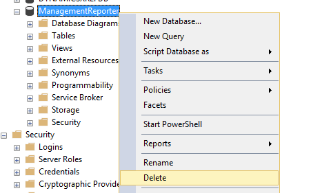
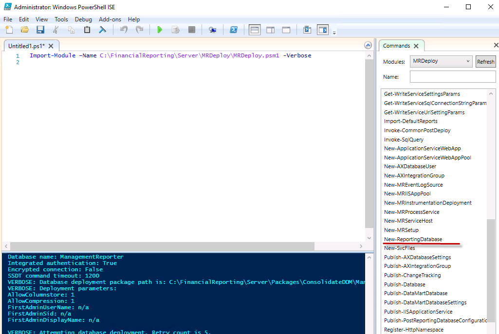

# How to reset Management reporter database on D365FO one box

There is a standard topic about DataBase reset, but it will work only you will have proper connection properties

https://docs.microsoft.com/en-us/dynamics365/unified-operations/dev-itpro/analytics/reset-financial-reporting-datamart-after-restore?toc=/fin-and-ops/toc.json 


If your search the same topic for AX2012 you will find several posts that describe full reset(like this one - Management Reporter: Rebuilding your Data Mart
https://community.dynamics.com/365/financeandoperations/b/dynamicsaxbi/archive/2016/02/01/management-reporter-rebuilding-your-data-mart )

But the problem is that in D365FO we don't have MR Configuration Console, instead power shell should be used

Open PowerShell ISE as administrator

As a first step let's backup our existing ManagementReporter database

```powershell
$FileNameLocal = "C:\backup\ManagementReporter.bak"
$FileDirName = Split-Path $FileNameLocal
New-Item -ItemType Directory -Path $FileDirName -Force
Backup-SqlDatabase -ServerInstance localhost -Database "ManagementReporter" -BackupFile $FileNameLocal -CompressionOption On
```

Then delete this database




Change path to FinancialReporting(I use local VM, so it is on C: drive) folder, import MR management commands and execute create new database command

```powershell
cd C:\FinancialReporting\Server\MRDeploy
Import-Module –Name C:\FinancialReporting\Server\MRDeploy\MRDeploy.psm1 -Verbose
New-ReportingDatabase
```

It also worth to check MRDeploy PS module, as it contains a lot of usefull commands   



We need new da