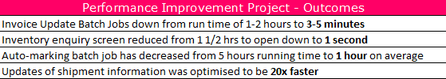
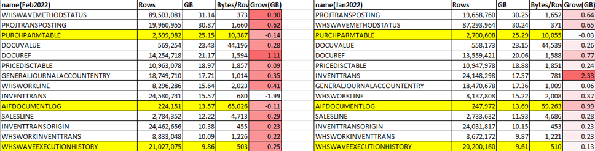
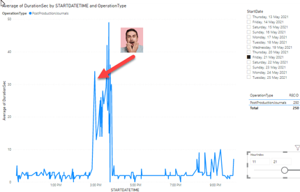
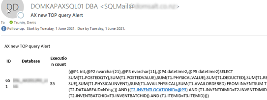
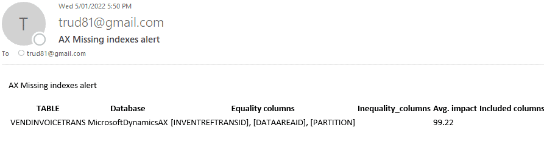
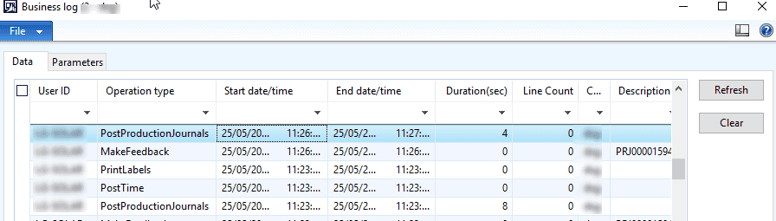
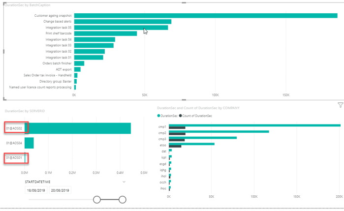
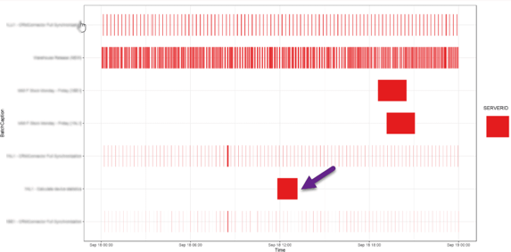
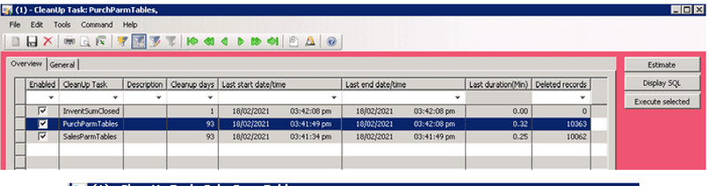
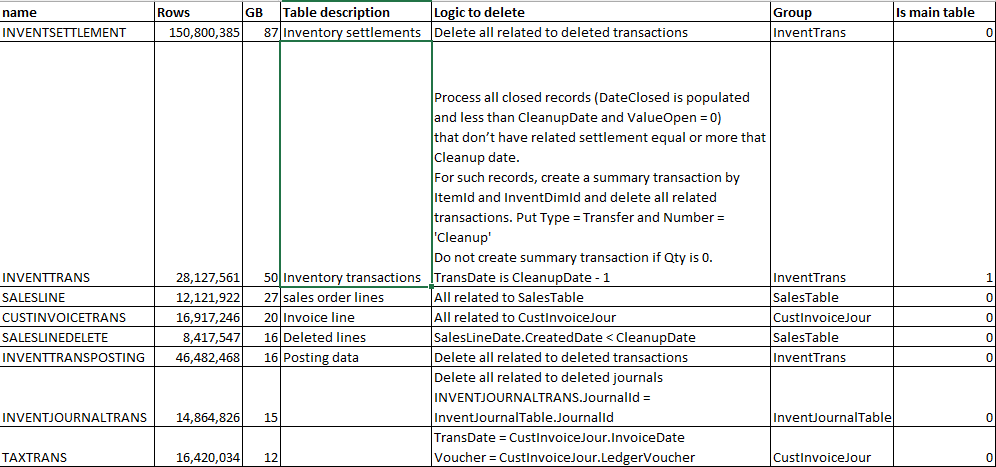

Optimizing Your Legacy Dynamics AX System(AX2012, AX2009, AX40)

If you’re still running Dynamics AX 2012, AX 2009, or AX 4.0, maintaining efficiency is essential, especially if an upgrade isn’t planned. This post compiles proven methods and actionable steps to help you manage your system efficiently.

## Perform a technical audit

The technical audit process includes two primary steps. First, gather user feedback about their main pain points using a [structured format](https://github.com/TrudAX/TRUDScripts/blob/master/Performance/Jobs/PerformanceProblemsTemplate.xlsx) and resolve the issues.

Next, validate the system’s configuration against best practices and make necessary adjustments. These steps are covered in more detail in my articles  [Dynamics AX performance audit](https://denistrunin.com/performance-audit/) regarding what should be checked and  [How to manage a Dynamics AX performance optimization project](https://denistrunin.com/performance-projmanage/) about how to organize this projects. 

It’s important to involve upper management, as changes in legacy systems often come with risks that need approval.

The goal of the technical audit is to achieve a stable and well-configured system that meets best practice standards. This will provide users with a smoother experience and ensure the system operates within acceptable performance parameters.

## Perform periodic system monitoring

After stabilizing your system, it’s vital to conduct regular monitoring to catch and resolve issues early. Windows provides numerous counters for monitoring, but it’s crucial to focus on actionable insights rather than simply tracking metrics.

For example, simply tracking CPU load isn't enough - seeing 90% CPU usage doesn't tell you what to do next. In this section, I’ll outline key parameters that not only indicate system health but also guide corrective actions.

### Database size monitoring

To monitor database size effectively, [export the top 20 tables by size](https://github.com/TrudAX/TRUDScripts/blob/master/Performance/AX Technical Audit.md#database-size) into Excel and use VLOOKUP to track monthly changes.

In Excel it looks like this:

The “Growth” column in Excel sheet will highlight any anomalies. This makes it easy to spot cases like unintended "log" activations, where a table may grow unusually and climb in the rankings.

### Long queries and parameters sniffing monitoring

This type of monitoring helps identify critical performance issues before users report them. Parameters sniffing visually can be illustrated by this picture where operations that typically take 1-2 seconds to execute suddenly take minutes due to a poorly chosen SQL execution plan. 

The monitoring process involves:

- SQL Agent job that runs every hour and detects new TOP SQL queries
- Provides an alert when detects a new query in TOP3 statements
- Provides statistics for CPU usage for the last 30 minutes to help detect false alerts
- Saves a current plan and statement text for the future analysis 

In case a new query detected in the TOP log an alert e-mail is generated with all supporting information

This monitoring takes some time to setup(initially about 200 queries needs to be analyzed) but allows to detect complex AX performance problems. Full descriptions is here: [Monitoring the most problematic performance problem in Dynamics AX - parameters sniffing](https://denistrunin.com/performance-snifmonitor)

### Missing indexes monitoring

This is a daily e-mail alerts for database missing indexes.

It consists of the following components:

- SQL Agent job that runs daily and e-mails TOP30 Missing Indexes recommendations with more than 99% impact
- In most cases, a new index should be created, but the script allows to define exceptions 

Full description is here: [Dynamics AX performance monitoring: missing indexes](https://denistrunin.com/performance-monitormisind/)

### Business operations performance monitoring

This monitoring is used when you have critical business operations, it includes Dynamics AX setup form and a PowerBI dashboard.

The Dynamics AX form:

- Tracks individual operation performance
- Track the operation date, duration, number of lines

Power BI Dashboard allows to detect anomalies and see some trends

More details here: [Implementing of Dynamics AX business operations performance monitoring](https://denistrunin.com/performance-operlog)

### Batch performance monitoring

This is a PowerBI dashboard to monitor duration of Dynamics AX batch jobs 

- Allows analyze of batch tasks performance by Task name, Server name, Duration, Start time, company etc...
- Detects “not enough threads” situations, when the task is waiting for a free slot to run

Additionally tasks can be analysed by time of the day

This analysis may not work for every client, as there may no be stable load patters, but is some cases can give a valuable information about Dynamics AX batch performance. Full description is here: [Analysing Dynamics AX / Dynamics 365FO batch performance using Power BI](https://denistrunin.com/performance-powerbibatch)

## Develop new AX integrations

It may happen that you need to develop a new integration with some systems. Most of the in-build AX modules (like AIF) become obsolete, so I suggest using the  [External integration](https://github.com/TrudAX/XppTools?tab=readme-ov-file#devexternalintegration-submodel) module. I shared code for D365FO, but it is X++ based, so can be with some restrictions reused on lower versions

For inbound flow it will be something like importing files from the shared directory, for outbound: a periodic or event based exports to the files. It may be also combined with some No-Code tools, setup to take files from the directory and send to external services. 

## Maintaining Windows and SQL Server versions

Keeping the legacy Windows may be a challenging task. A common Dynamics AX components includes an AX client and Application server(AOS) that may work only on specific Windows versions(the best way to find this is a google "Dynamics AX xx system requirements"). As a starting point for at least for Dynamics 4.0 a Windows 2012R2 can be used.

For SQL Server situation is much better, you can install latest SQL Server (e.g. SQL2022 or SQL2019) and use a compatibility mode to a maximum supported version, it works quite well with all Dynamics versions. Also recently Vasily Nosov published an article regarding SSRS installation: [How to install AX 2012 R3 SSRS extensions on SQL 2022 if you really want to](https://www.linkedin.com/pulse/how-install-ax-2012-r3-ssrs-extensions-sql-2022-you-really-nosov-dcvzc/).

## Performing data cleanup

Cleanup procedure can be periodic for log type tables and date-based for more complex cleanup that include user data. Both can be implemented using a cleanup framework: [Implementing Dynamics AX 2009/2012 database ](https://denistrunin.com/ax2012-sqldelete)[cleanup](https://denistrunin.com/ax2012-sqldelete)

It can run the standard and special non-blocking logic to perform a periodic cleanup and easy monitoring for the performance of [individual jobs](https://github.com/TrudAX/TRUDScripts/tree/master/Performance/Jobs/DataCleanup).

For periodic cleanup you identify some log types tables and period to keep in the system (e.g. 90 days) and run this job every week.

For "user data" tables it is more complex. In most countries Tax authority can request data for the last 7 years and there are no expiry date for court related cases. So the most logical thing to do is to keep the data for the last 7 years in the active database, take long term yearly backup and perform a yearly cleanup for top user tables. It allows to have a stable DB size with a predictable performance.

The process for this is very customer specific, you need to create a list of top tables and define rules for each table like on the picture below.

The most complex part is InventTrans related deletes where you need to create a summary records and financial related transactions. 

Also a very typical request here is to delete a company that doesn't exists anymore, this can be done using the following script: [deleteCompanyByList](https://github.com/TrudAX/TRUDScripts/blob/master/Performance/Jobs/deleteCompanyByList.txt).

## Summary 

I described key concept and action lists of optimizing and maintaining a legacy Dynamics AX system, hope you may find this useful. Feel free to post any questions or share your support experience.

