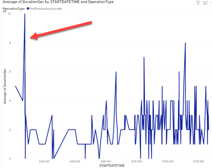

How to support your legacy Dynamics AX system(AX2012, AX2009, AX40)

If you inherit or using a legacy Dynamics AX system and upgrade is not coming you probably need a find a way to maintain this system in efficient way. In this post I will try to provide a detailed step by step instruction how to do this. Most of the topics refer to my previous articles, this is just all-in-one guide.

## Perform technical audit

Technical audit consists of two main parts. First you ask your users their main pain points in a [certain format](https://github.com/TrudAX/TRUDScripts/blob/master/Performance/Jobs/PerformanceProblemsTemplate.xlsx) and try to resolve 

Then there are Best practices how the system should be configured, you validate all this and make adjustments

I wrote many articles about this, the mains are [Dynamics AX performance audit](https://denistrunin.com/performance-audit/) regarding what should be checked and how and  [How to manage a Dynamics AX performance optimization project](https://denistrunin.com/performance-projmanage/) how to organize this projects. The key factor - upper management should be involved, as you need to do changes, and for legacy systems someone should accept the risk of doing that.

As the end result you should have a properly functional system with some acceptable parameters for users that configures according to best practices.

## Perform periodic system monitoring

After system enters a stable state it is quite important to perform a periodic system monitoring to quickly identify and fix potential problems. In Windows there are huge number of counters to monitor, but it is important that monitoring leads to some actions, rather than monitoring itself. Take for example most typical counter - CPU load. Monitoring just this counter doesn't leads to any action, for example you faced that during some period this counter is above 90%. There is no action to do, the only thing you can do is to do additional analysis by analyzing server workload during this time. In this part I try to describe what parameters can be monitored that can leads to some actions

### Database size monitoring

One way to perform a database size monitoring to [copy](https://github.com/TrudAX/TRUDScripts/blob/master/Performance/AX%20Technical%20Audit.md#database-size) the size of TOP20 tables to Excel and then use VLOOKUP function to compare monthly grow. 

In Excel it looks like this

**Grow** column show the difference for the current table between the current and previous month size. It quicky shows anomalies like situations where someone enabled a log and forget to disable it. You will see the table changes it's position in the TOP with a unusual grow.

### Long queries and parameters sniffing monitoring

This monitoring allows detects critical performance problem before users reports them. Parameters sniffing visually can be illustrated by this picture where operation that usually takes 1-2 seconds starts to execute minutes due to wrong plan SQL plan selection. This often slow down users. 

Technically monitoring consists of the following components:

- SQL Agent job that runs every hour and detects new TOP SQL queries
- Provides an alert when detects a new query in TOP3 statements
- Provides statistics for CPU usage for the last 30 minutes to help detect false alerts
- Saves a current plan and statement text for the future analysis 

In case a new query detected in the TOP log an alert e-mail is generated with all supporting information

This monitoring takes some time to setup(initially about 200 queries needs to be analyzed) but allows to detect complex AX performance problems. Full descriptions is here: [Monitoring the most problematic performance problem in Dynamics AX - parameters sniffing](https://denistrunin.com/performance-snifmonitor)

### Missing indexes monitoring

This is a daily e-mail alerts for database missing indexes.

It consists of the following components:

- SQL Agent job that runs daily and e-mails TOP30 Missing Indexes recommendations with more than 99% impact
- In most cases, a new index should be created, but the script allows to define exceptions 

Full description is here: [Dynamics AX performance monitoring: missing indexes](https://denistrunin.com/performance-monitormisind/)

### Business operations performance monitoring

This monitoring includes Dynamics AX setup form and a PowerBI dashboard 

The Dynamics AX form:

- Tracks individual operation performance
- Track the operation date, duration, number of lines

Power BI Dashboard allows to detect anomalies and see some trends

More details here: [Implementing of Dynamics AX business operations performance monitoring](https://denistrunin.com/performance-operlog)

### Batch performance monitoring

This is a PowerBI dashboard to monitor duration of Dynamics AX batch jobs 

- Allows analyze of batch tasks performance by Task name, Server name, Duration, Start time, company etc...
- Detects “not enough threads” situations, when the task is waiting for a free slot to run

Additionally tasks can be analysed by time of the day

This analysis may not work for every client, as there may no be stable load patters, but is some cases can give a valuable information about Dynamics AX batch performance. Full description is here: [Analysing Dynamics AX / Dynamics 365FO batch performance using Power BI](https://denistrunin.com/performance-powerbibatch)

## Developing new integrations

 It may happen that you need to develop a new integration with some systems. Most of the in-build AX modules (like AIF) become obsolete, so I suggest using the  [External integration](https://github.com/TrudAX/XppTools?tab=readme-ov-file#devexternalintegration-submodel) module. I shared code for D365FO, but it is X++ based, so can be with some restrictions reused on lower versions

For inbound flow it will be something like importing files from the shared directory, for outbound: a periodic or event based exports to the files. It may be also combined with some No-Code tools, setup to take files from the directory and send to external services. 

## Maintaining Windows and SQL Server versions

Keeping the legacy Windows may be a challenging task. A common Dynamics AX components includes an AX client and Application server(AOS) that may work only on specific Windows versions(the best way to find this is a google Dynamics AX xx system requirements). As a starting point for at least for Dynamics 4.0 a Windows 2012R2 can be used.

For SQL Server situation is much better, you can install latest SQL Server (e.g. SQL2022 or SQL2019) and use a compatibility mode to a maximum supported version, it works quite well with all Dynamics versions. Also recently Vasily Nosov published an article regarding SSRS installation: [How to install AX 2012 R3 SSRS extensions on SQL 2022 if you really want to](https://www.linkedin.com/pulse/how-install-ax-2012-r3-ssrs-extensions-sql-2022-you-really-nosov-dcvzc/)

## Performing data cleanup

Cleanup procedure can be periodic for log type tables and date-based for more complex cleanup that include user data. Both can be implemented using a cleanup framework: [Implementing Dynamics AX 2009/2012 database ](https://denistrunin.com/ax2012-sqldelete)[cleanup](https://denistrunin.com/ax2012-sqldelete)

It can run the standard and special non-blocking logic to perform a periodic cleanup and easy monitoring for the performance of [individual jobs](https://github.com/TrudAX/TRUDScripts/tree/master/Performance/Jobs/DataCleanup).

For periodic cleanup you identify some log types tables and period to keep in the system (e.g. 90 days) and run this job every week.

For "user data" tables it is more complex. In most countries Tax authority can request data for the last 7 years and there are no expiry date for court related cases. So the most logical thing to do is to keep the data for the last 7 years in the active database, take long term yearly backup and perform a yearly cleanup for top user tables. It allows to have a stable DB size with a predictable performance.

The process for this is very customer specific, you need to create a list of top tables and define rules for each table like on the picture below.

The most complex part is InventTrans related deletes where you need to create a summary records and financial related transactions. 

Also a very typical request here is to delete a company that doesn't exists anymore, this can be done using the following script: [deleteCompanyByList](https://github.com/TrudAX/TRUDScripts/blob/master/Performance/Jobs/deleteCompanyByList.txt).

## Summary 

I described key concept and action lists of optimizing and maintaining a legacy Dynamics AX system, hope you may find this useful. Feel free to post any questions or share your support experience.

