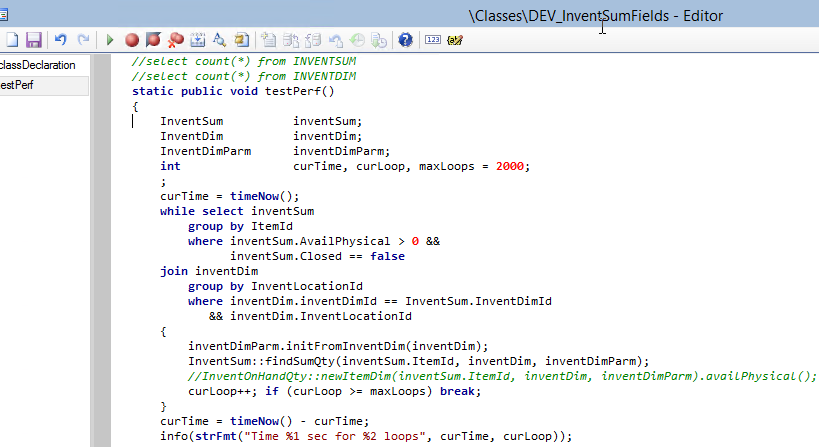
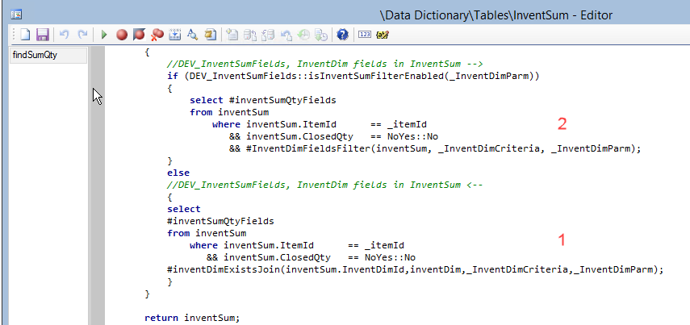
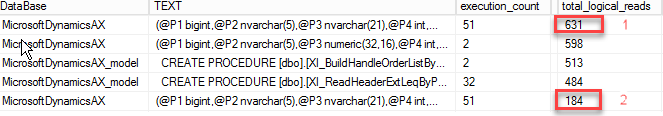

One of the tasks in Dynamics AX 2009/2012 system performance maintenance is performing a periodic database cleanup. In this blog post, I describe a new framework for implementing such tasks and provide some examples.

First, let's discuss why we need a custom code and what are the pitfalls of standard cleanup methods.

## A standard way to delete from a large table

There are a lot of standard cleanup procedures already implemented in the system. A good overview for the latest D365FO version can be found here [Reviewing Large Tables and Database Growth](https://community.dynamics.com/ax/b/axinthefield/posts/f-o-data-management-reviewing-large-tables-and-database-growth) and [Cleanup routines in Dynamics 365 for Finance and Operations](https://docs.microsoft.com/en-us/archive/blogs/axsa/cleanup-routines-in-dynamics-365-for-finance-and-operations)

In these procedures you will usually see the following code to perform a "delete from table" operation:

A "**while select**" loop:

```csharp
while select MyBigTable
   where MyBigTable.CreatedDateTime < cleanupDate
{
    MyBigTable.delete();
}    
//you need to add ttscontrol here, for example, a commit on every 100th record
```

This approach can work for small tables, but if we need to delete a lot of records, it takes a lot of time, producing a load to the SQL server.

Another way to implement a delete is by using a **delete_from** command:

```csharp
delete_from MyBigTable
    where MyBigTable.CreatedDateTime < cleanupDate;
```

This statement is fast, but the command **delete_from** can [block](https://denistrunin.com/understanding-sql-blocking) the table while running, so you need to run it only during a system downtime.

Both these methods work only per one company, so you need to run a separate cleanup job for each company and that creates a setup overhead.

In a lot of performance audit projects, I asked people why they didn't run standard cleanup procedures and the typical answer was: "We tried to run it a year ago, then it hung, users started complaining about system performance, and we cancelled it".

## Improved version of InventSum table

To add new fields to InventSum table you need to change the following objects 

| Object                     | Change description                                           |
| -------------------------- | ------------------------------------------------------------ |
| InventSum table            | Add new fields. Override insert and update methods. Add required indexes |
| InventUpdateOnhand class   | Change updateInventSumSimple and sqlUpdateInventSumStr methods that uses direct SQL to update InventSum records |
| InventSumDelta             | Add new fields, Override insert and update methods           |
| InventSumDeltaAggr ..views | These views used to create InventSumDelta aggregated records |
| job                        | job to fill the initial data                                 |

after that you need to find places where InventSum 


There is no unified framework for this, so I suggest to run a Trace Parser for critical system operations and replace only them.

## Testing the performance change

I tried to test the performance change on the standard AX2012 DEMO VM with the following job that calculates Item quantity per Location



The VM doesn't have much data and in order to compare the difference I measured the number of logical reads to perform the original(with **InventDim** exists join) or improved version(just **InventSum** table) statements 



I got the following results:



On the DEMO VM **InventSum** and **InventDim** tables have similar size, and even then the performance difference is 4x. But if you have any "growing" dimension(like Batch, Pallet, Serial number, LP) and run a  periodic **InventSum** cleanup, **InventDim** table size will be much bigger and the difference will be bigger. Another important advantage that these 2 tables join often causing a parameters sniffing issues, and using just one table may automatically resolve some of them.

From the drawbacks point you need to create several new indexes on **InventSum**. But these indexes will be updated only when a new dimension is created and not a during a regular quantities updates.

So I don't see any major drawbacks, except the one, that this modification not a part of the standard AX2012 application(that could saved thousands of hours spend on various performance tasks)

## Summary

Adding fields to **InventSum** may improve AX2009/AX2012 performance and resolve some parameter sniffing issues. It is not a simple, first-priority modification and probably take a week to implement, but may be considered if you plan to continue use AX2009/AX2012 application. Also quite important that it is used approach from D365FO, so will not caused any problems during the upgrade. 

A sample code for AX2012 used in this post can be found [here](https://github.com/TrudAX/TRUDScripts/tree/master/Performance/Jobs/DataCleanup), it may be used as a initial template for the similar modification.

I hope you find this information useful. As always, if you see any improvements, suggestions or have some questions about this work don't hesitate to contact me.
