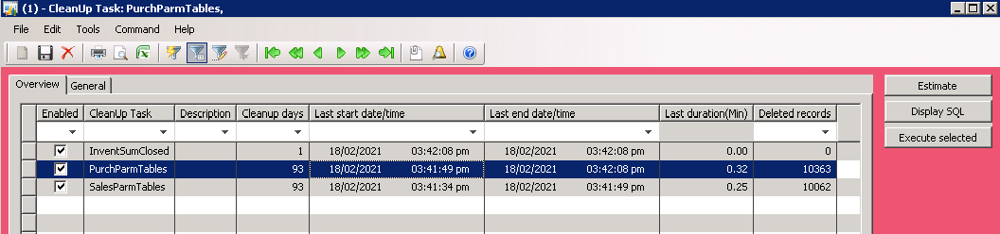
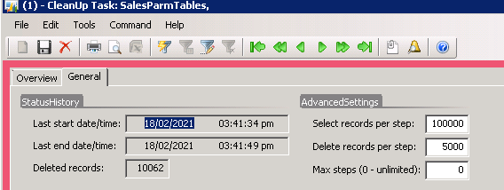

One of the tasks in Dynamics AX 2009/2012 system performance maintenance is performing a periodic database cleanup. In this blog post I describe a new framework for implementing such tasks and provide some examples. 

First let's discuss why do we need some custom code and pitfalls of the standard cleanup methods 

## A standard way to delete from a large table

There are a lot of standard cleanup procedures already build in the system. A good overview for the latest D365FO can be found here [Reviewing Large Tables and Database Growth](https://community.dynamics.com/ax/b/axinthefield/posts/f-o-data-management-reviewing-large-tables-and-database-growth)

Usually you will see the following code to perform a delete from table operation:

A "while select" loop

```csharp
while select MyBigTable
	where MyBigTable.CreatedDateTime < cleanupDate
{
	MyBigTable.delete();
}    
//need to add ttscontrol here, for example commint on every 100th record
```

This approach can work for a small tables, but if we need to delete a lot of records, it takes a lot of time, producing a high load to the SQL server.

Another way to implement a delete is using a **delete_from** command:

```csharp
delete_from MyBigTable
	where MyBigTable.CreatedDateTime < cleanupDate;
```

This statement is fast, but the command **delete_from** can [block](https://denistrunin.com/understanding-sql-blocking) the table while running, so you need to run it only during a system downtime.

Both these methods work only per one company, so you need to run a separate cleanup job for each company, that creates an setup overhead.

In a lot of performance audit projects I asked people why they didn't run standard cleanup procedures and typical answer was - We tried to run it a year ago, then it hangs, users started complained on system performance, and we cancelled it.

### Improved version of delete from a large table

Below you can find an improved version of implementing a delete command

```sql
IF OBJECT_ID('tempdb..#recordsToDelete') IS NOT NULL DROP TABLE #recordsToDelete
IF OBJECT_ID('tempdb..#temp_hash') IS NOT NULL DROP TABLE #temp_hash
CREATE TABLE #temp_hash (RECID   BIGINT)

declare @step int
declare @isLastStep int = 0;

WHILE (@isLastStep = 0)
BEGIN
    select top 100000 RECID into #recordsToDelete
    FROM [dbo].MyBigTable AS hashtbl            --TABLE HERE
    WHERE hashtbl.CREATEDDATETIME <(GETDATE() -30);

    IF (@@ROWCOUNT < 100000) SET @isLastStep = 1
    CREATE NONCLUSTERED INDEX [##_RECID] ON #recordsToDelete (RECID ASC)

    set @step= 0
    WHILE (@step < 100)
    BEGIN
        SET @step = @step + 1
        TRUNCATE TABLE #temp_hash
        INSERT INTO #temp_hash(RECID) SELECT TOP 5000 RECID FROM  #recordsToDelete;
        IF (@@ROWCOUNT = 0) break;
        --------------------------------------------------------------
        delete FROM [dbo].MyBigTable from [dbo].MyBigTable  AS hs  --TABLE HERE
        INNER JOIN #temp_hash AS JN ON hs.RECID = JN.RECID
        ----------------------------
        delete from #recordsToDelete from #recordsToDelete as dt inner join #temp_hash as dl   on dl.RECID =dt.RECID
    END
    DROP TABLE #recordsToDelete
END
DROP TABLE #temp_hash;
```

It performs delete in 2 steps. First it selects a large number of table clustered keys(100K) into a temporary table. Often it is set of RecIds. Then split it into a smaller sets(5K records) and perform a main table delete using a clustered key condition.

Such approach gives a following advantages:

- Delete command is not blocking other processes(as we using clustered key condition and do delete for a small number of records)
- It is much faster than a one by one record delete
- It doesn't require additional indexes (by CreatedDateTime) as the number of "large" selects is low
- You can stop it in any time without loosing the progress
- It works for all companies

In my tests the speed of such approach was only 40% slower than a  standard **DELETE FROM** command and it can be run without blocking users even for a highly used WMS tables in the middle of the day.

The overall performance depends from many factors(number of indexes/hardware/etc..) but on average it may be 30-40 seconds per 100K records. 

## User interface to control a cleanup procedure

Let's discuss the typical requirements for a cleanup procedure. 

Cleanup consist of several tasks, and we need to specify a cleanup period for each task. Also it is nice to have some statistics about the last run duration and the number of deleted records.

To control all this I created a "Cleanup settings" form.  



 

Every cleanup task can register in this form(providing some default values for the settings). 

A cleanup task is a class that extends a base class and needs to implement 3 actions:

- **Estimate** - calculate the number of deleted records
- **Display SQL** - instead of executing SQL, display it into infolog(used for debug and validation)
- **Execute** - execute a delete operation

A cleanup class may implement a "delete from a large table" logic described above for simple delete operations or can just run a standard classes for all companies for a complex operations


To run these tasks a standard batch job is created. A typical usage is run all tasks weekly.