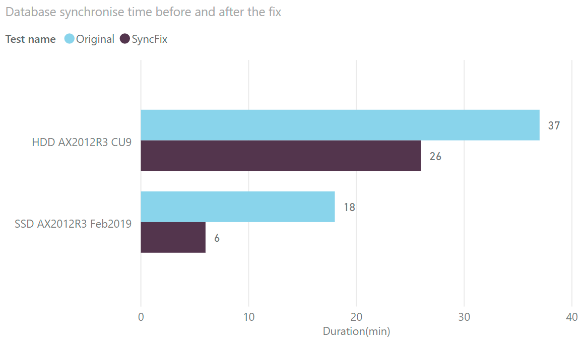

Recently I found an interesting AxForum [topic]( https://translate.google.com/translate?hl=en&tab=TT&sl=ru&tl=en&u=http%3A%2F%2Faxforum.info%2Fforums%2Fshowthread.php%3Fp%3D418755%23post418755) by Masel that probably worth to share.

## Main screen

Add-in can be run from the **Dynamics 365** - **Addins** - **RunBase class builder**

You can specify values for each parameter, preview the changes(using the Refresh button) and if you are fine with it, automatically generate the class and the related menu item.


As a result, the following class will be generated

### -Add file upload

You need to create a new plan guide in the main AX database(not the _model)

```SQL
DECLARE @stmt nvarchar(max);   
DECLARE @params nvarchar(max);   
EXEC sp_get_query_template    
    N'select name, change_tracking_state_desc from sys.columns AS Cols inner join sys.fulltext_index_columns AS FTSCols inner join sys.fulltext_indexes as FTS on FTSCols.object_id = FTS.object_id on Cols.object_id = FTSCols.object_id where Cols.column_id = FTSCols.column_id and Cols.object_id = object_id(''SYSINETCSS'')',   
    @stmt OUTPUT,    
    @params OUTPUT;   
select @stmt; 
EXEC sp_create_plan_guide    
    N'SyncTemplateGuide',    
    @stmt,    
    N'TEMPLATE',    
    NULL,    
    @params,    
    N'OPTION(PARAMETERIZATION FORCED)';  
```

I tested this script on 2 different systems:

- AX2012R3 CU9, Database on HDD disks, CPU: E5-2630 2.3GHz
- AX2012R3 Feb2019, Database on SDD disks, CPU: Core i7-8700 3.5GHz

In both cases it gave considerable synchronise speed boost(about 3 times for the fast system) - see the results below before and after applying this fix



Technique of this optimization is quite unusual, by creating such planguide you disable SQL plan creation based on actual SQL statement parameters, it is in general very similar to X++ code when we use forceplaceholders command. Synchronise AX database operation sends a lot of small requests, and excluding plan creation gives this performance effect.

Enjoy and thanks Masel for sharing this.