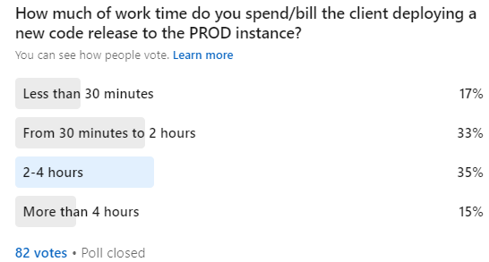
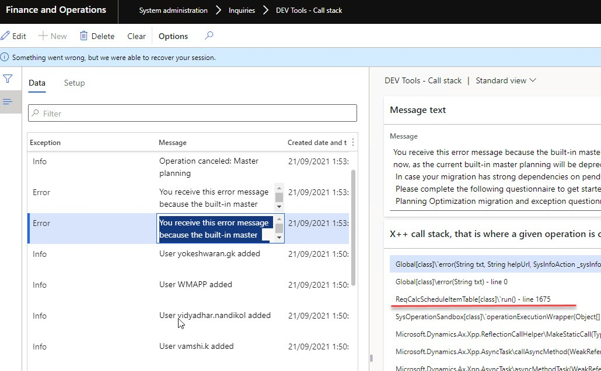
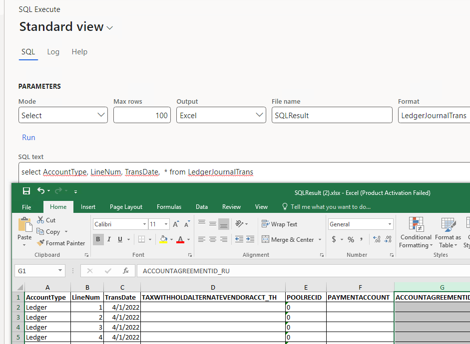
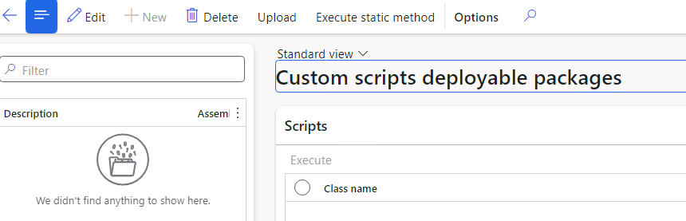

Notes about Go-Live preparation

## Enviroments plannig 

I wrote an article how to do an Enviroments plannig, but here I want to outline some management hints

### Naming convention

Microsoft provides 1 Tier2 enviroment as a part of the standard subscription. The biggest hint here - don't name this enviroment as UAT(User testing). Instead It should be named as PrePROD(PP or PPN).

The problem here if you have some issue that can't be replicated on DEV/TEST enviroment, it is likelly a data-related issue, and you need to create a database copy. **PROD** database can be copied to **PRE-PROD** only. If the enviroment is named as UAT it may create wrong feeling for some users that it is a test playground for their testing and when you try to do a restore they may complain that you deleted their important test cases.  

So I suggest a emphasize the fact that **PRE-PROD** enviroment can be restored from **PROD** anytime and it should not contain any valuable data. Also try to avoid the approval procedure for PRE-PROD refresh, a normal notification should be enough.

### Proactive restore process

For the first several days of GoLive, I suggest doing **PRE-PROD** refresh proactively every day e.g. at the end of the day. So All PRE-PROD data will be overwritten. This may create an issue for integrations and some external access as encrypted data will be not copied during the refresh. Create a document or an automation procedure that allow to restore these settings, the main criteria here - it should not require a lot of human time to run. We used the following actions:

1. Run the refresh from PROD procedure(for small DB It takes ~ 1h, also there are some rumors that it may work faster if you do a restore to a specific time)
2. Run a script that adjusts test settings
3. Run an export job from LCS

### Timings that are knows by the project team

If the issue is happeting in PROD, you do you best to understand it and if it is still unclear you initiate a DEV VM refresh. There should be a clear timings that evetyone in the team understands, e.g. we have an issue, we can start debug it in 4h if doing a normal restore procedure. Issues are usually rises by the functional consultants with key users and knowing the actual project timings may simplify communications and planning.

By default this process takes a lot of manual steps, but I shared some automation scripts that may save some time

If you have multiple developers that require fresh data I suggest the following approach - Perform backpack to SQL conversion on one VM and then load the SQL backup to Azure file share. Then developers can use this script to upload the file to their boxes in one click

## Release management

Proper code release management planning is a key process to smoth go-live experience. Don't believe that first days will be without errors, even on fully tested system they may happen. So the good planning should include the action plan for such errors resolution. 

Sometimes I see the "code freeze" stage planning for a project. From my experience all such projects failed.  

During GoLive you can expect critical and non-critical issues. Critical should be resolved as faster as possible,  non-critical from my point of view should be resolved the same way. 

By ignoring non-critical issues you may loose the connection to end users. Let's consider an example, I am a user of a new system, I see some issue that requires 3 additinal munutes from me to process the order(so it is not critical, but very irritative). I report this issue(again, spending my time), but nothing happens. The next time I see someting is broken I probably just ignore this and after some time complain to my manager that the new system is a real crap. 

So we want the maximum response from users and the minumum time to deliver the improvements. The problem is that every release requires 40 minutes of downtime, from my point of view that is a huge D365FO system drawback, hope Microsoft will fix that in the future, but now we have what we have.

I suggest plan the following approach during the first 2 weeks of Go-Live period:

- A planned release at evening every day
- An emergency release window in the morining and at lunchtime

You may not use these windows if not needed, but planning them in advance may save a lot of time and create a realistic expectations from the users. 

How release happens and some timings:

- Developer fix and test the issue on DEV VM
- The fix is deployed to PreProd for the final validation(this should be done via Pipeline), it takes 1.5h
- Release manager should login to LCS, mark the PrePROD package as a Release candidate, swith to PROD enviroment, shedule the release(40 min of downtime)

Also the poing to consider here that PROD relase can't be fully automated and requires some manual effors. This may vary from project to project

I asked the question on [LinkedIn](https://www.linkedin.com/posts/denis-trunin-3b73a213_question-to-people-who-maintain-d365fo-production-activity-7030514980114362368-sBVy?utm_source=share&utm_medium=member_desktop) and got the following results:

Make sure that you discuss this with the person who will do releases that some overtime work is needed.

### Branch management

During the GoLive phase simplify the brach namagement as simple as possible. I suggest keep just one Main branch or the version of this stragegy as Main-Release where the Release is just a copy of Main for most of the time

## Integration issues

During the initial GoLive phase you may see the full set of error types related to integrations:

For inbound integration:

- External system may send messages in wrong format(like missing XML tags, different dates or numeric formats)
- With the wrong values(reference values that don't exist in D365FO)
- Duplicated messages
- On D365FO side some fields may be incorrectly mapped
- Some D365FO settings may be missed/incorrectly specified during the message processing.

For outbound integration typical problems are the following:

- External system may complain that they didn't receive some documents from you
- Received messages contained wrong values for individual fields

On the top of that there may always be errors in the X++ code that is processing integration messages or you may expect the performance issues. 

I can recomend to consider [XPPInteg(External integration)](https://github.com/TrudAX/XppTools#devexternalintegration-submodel) module that is designed to provide all logging and replay/debug every message to investigate such kind of issues, it worked really well for the latest projects. But if you using some other integration approach make sure that the team has a plan to resolve every type of integration issues.

## Update planning and Feature management

Microsoft releasing 8 updates per year and allow you pause 2 updates. I suggest to do this pause after GoLive.

Feature management contains triggers for gradually onboarding to new features for exising client(it is not a configuration tool). If you a new client the good strategy may be to enable all features before main UAT. In this case you test the current version of the system, not legacy code.

## Tooling

The good tools may really simplify some issues resolutions. I highly recomend to check what is availible in the current [DEV tools](https://github.com/TrudAX/XppTools#devtools-model). Let's see how some of them may be used during the support phase

### Field list

May be used for quickly check data, and compare values from different records. E.g. if you have 2 sales orders that looks similar to you, but some buttons are not visible for the second one, you can easily compare these records

### Call Stack to Infolog

It is a real time saver. Several times it allowed us to resolve the issue in several munutes instead of spending hours on data restore/debugging. Enable them for the key users and for every message it will log an X++ call stack. Some D365FO messages are not clear and when you get something like "Account not specified" this tool allow to see the X++ call stack of the message

**Standard solution**: Restore database, put a breakpoint into info.add();

### SQL Execute

Great tool to data analysis. A lot of people call it unsafe(not considering ER where you can do the similar modifications), so in the last update I added separate roles for Select and Update mode and extended logging. Please note that [Microsoft does not provide assistance for correcting damaged data](https://learn.microsoft.com/en-us/power-platform/admin/support-overview?toc=%2Fdynamics365%2Ffin-ops-core%2Fdev-itpro%2Ftoc.json&bc=%2Fdynamics365%2Fbreadcrumb%2Ftoc.json#does-microsoft-provide-support-for-data-corruption)

Also added a function to export results to Excel with correct Enums and DateTime convertions.

**Standard solution**: Export database to Tier2, connect via SQL Management Studio

### Execute custom code

On every project so far there was a case where we require to change values in Inventory or Ledger transactions. Some data may not be loaded correctly, or parameters missing, or users can press wrong buttons or choose wrong accounts etc... Microsoft did a great job by introducing the [Run custom X++ scripts with zero downtime](https://learn.microsoft.com/en-us/dynamics365/fin-ops-core/dev-itpro/deployment/run-custom-scripts) utility. Howewer the  aproval process they implemented is quite strange, they run the class in the transaction(not allowing dialogs) and require 2 people approval to do a final run.

The actual project scenario is different. You write a custom class that is doing data correction and run it on Pre-PROD then ask key users to confirm. If they approve the changed data, you run the same class on PROD. So there is nothing to confirm from their side when the code reached Production.

The improved Code execution util just removes all standard validations and provide a form to run a custom class without external transaction(so you can use dialogs)

