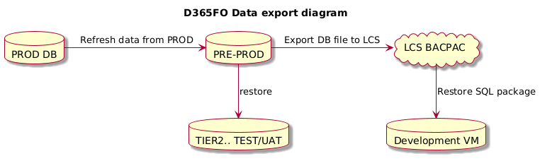
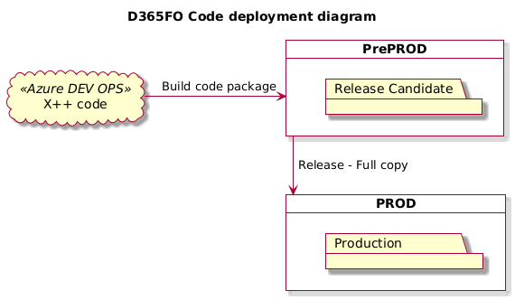
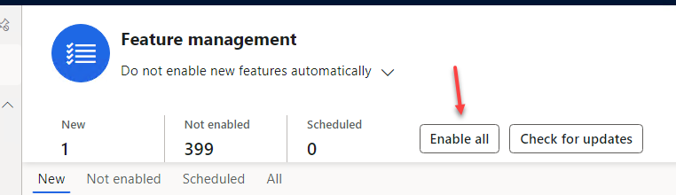

How to organize a successful D365FO project Go-Live as a Technical Lead

Go-live preparation

Now that we have completed all the other phases of the project, testing has been completed, and we all agree that the project is ready for deployment. In this post, I will describe some practical notes from the recent Microsoft Dynamics 365 For Operations projects where I lead as a senior developer

## Environments management

Microsoft provides one Tier2 environment as part of the standard D365FO subscription. The main hint here is to don't name this environment UAT or TEST. Instead, it should be named PRE-PROD(PP or PPN).

Typical project issue here is that this environment become used by business users as TEST/UAT purposes even after GoLive. The problem here if you have some issue that can't be replicated on DEV/TEST environment, it is likelly a data-related issue, and you need to create a database copy to debug. **PROD** database can be copied to **PRE-PROD** only and only after it copied to other environments. 

 

The same with the code deployment, if you want to install a new code package on **PROD**, it should be first installed on PRE-PROD, that caused PRE-PROD downtime for about 1h

If the environment is named as UAT it may create wrong feeling for some users/managers that it is a test playground for their testing and when you try to do a restore they may complain that you deleted their important test cases.  

I suggest a emphasize the fact that data on **PRE-PROD** environment can be restored from **PROD** anytime and it should not contain any valuable data. Also try to avoid the approval procedure for **PROD** to **PRE-PROD** data and code refresh, just a notification should be enough. 

These restrictions actually means that if the project involve some development, the client need to have at least two Tier2 environments(one PRE-PROD and one for User testing).

Two others my posts about D365FO different [Tiers performance](https://denistrunin.com/performanceD365-tierperf/) and [Development VM configuration](https://denistrunin.com/devvm-perfv13/) are worth reading. 

### Proactive data restore process

For the first several days of GoLive, I suggest doing **PRE-PROD** data refresh from PROD proactively every day e.g. at the end of the day. The main challenge here is that some data(e.g related to integrations, encrypted data) will be not copied or should not be copied during the refresh. Create a document or an automation procedure that allow to restore these settings, the main criteria here, it should not require a lot of human time to run. 

We used the following procedure:

1. Run the PRE-PROD data refresh from PROD procedure(for small DB it takes ~ 1h)
2. Run a script that adjust PROD related settings to it's test values (in our case it was SQL script that changes some integration settings, enables users etc..)
3. Run an Database export job for PRE-PROD to LCS (that also takes at least 1h)

This approach give a following advantage: If some issue happens on PROD, there is a very high chance that issue can be replicated on the restored PRE-PROD data. If so, a developer can restore DB from LCS and start debugging in 1-2h after the issue is reported.

There is option to automate this [further](https://www.powerazure365.com/blog-1/lcs-api-database-movement-with-powerautomate), but we never went so far. 

If database is big and restore takes a lot of time first make sure that DB doesn't contains some "log" tables using [this](https://github.com/TrudAX/TRUDScripts/blob/master/Performance/AX%20Technical%20Audit.md#database-size) script and try to implement some hints from the following post: [Improve the speed for BACPAC database restore from Tier2 to Tier1](https://denistrunin.com/performance-restoretier2/).

### Timings that are known by the project team

If the issue happens in PROD, you do your best to understand it and if it is still unclear you initiate a DEV VM data refresh. There should be a clear timings that everyone in the team understands, e.g. we have an issue, we can start debug it in 4h if doing a normal restore procedure. After fix is done on Dev VM, it should be deployed on PRE-PROD(discuss time needed for this) and after validation included into the next PROD release(make sure that every one know the schedule).

Issues are usually rises by the functional consultants with key users and knowing the actual project timings may simplify communications and planning.

## Release management

A proper code release management planning is a key process to a smooth go-live experience. Don't believe that the first days will be without errors; even on a fully tested system, they may happen. So, good planning should include an action plan for resolving such errors, there is better to avoid the "agile" approach. 

#### Issue Triaging

During GoLive you can expect critical and non-critical issues. Critical should be resolved as faster as possible,  non-critical should be analyzed and if they don't involve any risks to implement better to include them in the current queue.

By ignoring non-critical issues, you may lose the connection to end users. Let's consider an example: I am a user of a new system; I see some issue that requires 2 additional minutes from me to process the order(so it is not critical, but very irritative). I report this issue(again, spending my time on reporting that), but nothing happens. The next time I see something is broken, I probably just ignore this and, after some time, complain to the manager that the new system is a real crap. 

To avoid this, we want the maximum response from users and the minimum time to deliver the improvements.

#### PROD Deployments planning

Probably the biggest technical disadvantage of D365FO now is that every PROD release requires 40-50 minutes of whole system downtime, so the planning should be around this time. 

I suggest to plan the following approach during the first 2 weeks of Go-Live period:

- A planned release window every day(e.g. evenings)
- An emergency release window in the morning

You may not use these windows if not needed, but planning them in advance may save a lot of time and energy(to discuss with end-users that the system should be stopped today) and create realistic expectations from the users. 

How release happens and some timings:

- Developer fix and test the issue on DEV VM
- The fix is deployed to PRE-PROD for the final validation(this should be done via Deployment Pipeline), it takes 1.5h
- Release manager should login to LCS, mark the PRE-PROD package as a Release candidate, then opne PROD environment and schedule the release(40 min of downtime)

Also, the point to consider here is that PROD release can't be fully automated and requires some manual effort. This may vary from project to project

I asked the question on [LinkedIn](https://www.linkedin.com/posts/denis-trunin-3b73a213_question-to-people-who-maintain-d365fo-production-activity-7030514980114362368-sBVy?utm_source=share&utm_medium=member_desktop) and got the following results:

Make sure that you discuss this with the person who will do releases that some overtime work is needed.

### Code Branch management

During the Go-Live phase, simplify the code [branch management](https://learn.microsoft.com/en-us/azure/devops/repos/tfvc/branching-strategies-with-tfvc?view=azure-devops) as much as possible. On some projects, we used just one Main branch, and on another, the Main-Release, where the Release most of the time was just a copy of Main. Javier Lopez has a series of [blog posts](https://javi-kata.medium.com/ci-cd-the-journey-of-a-dummy-team-f51a061684bc) regarding this.

It is very easy to make this task complex so you end up with a full time person doing branch/release management, but for a Go-Live period try to use "a simple" mode.

The two key parameters should be considered when planning the branch strategy: 

- How quick the validated fix can be deployed on PROD: For Go-Live period ideally it should be 1 day
- How much of work time does it needs: a good setup should not exceed 1h  

## Integration issues

During the initial Go-Live phase, you may see the full set of error types related to integrations:

For inbound integration:

- External system may send messages in the wrong format(like missing XML tags, different dates or numeric formats)
- Send messages with the wrong values(reference values that don't exist in D365FO)
- Duplicated messages
- On D365FO side, some fields may be incorrectly mapped
- Some D365FO settings may be missed/incorrectly specified during the message processing.

For outbound integration, typical problems are the following:

- External system may complain that they didn't receive some documents from you
- Or Received messages contained wrong values for individual fields

On top of that, there may always be errors in the X++ code that is processing integration messages, or you may expect performance issues. 

For my latest project I used [External integration](https://github.com/TrudAX/XppTools?tab=readme-ov-file#devexternalintegration-submodel) module, which is designed to provide all logging and allows to replay/debug individual messages to investigate typical issues. And It worked really well. 

But if you are using some other integration approach, make sure that the team has a plan to resolve at least issues described above. 

## Update planning and Feature management

Microsoft releases 8 updates per year and allows you to pause 2 updates. I suggest doing this pause during GoLive.

Feature management contains triggers for gradually onboarding new features for existing clients (it is not a configuration tool). If you are a new client, a good strategy may be to enable all features before main User testing. In this case, you test the current version of the system, not the legacy code. So to do this: Press Enable all button and then exclude Features marked as "Preview".

## Tooling

Good tools may really simplify issue resolutions. I highly recommend checking what is available for the [X++ community](https://github.com/anderson-joyle/awesome-msdyn365fo?tab=readme-ov-file#x-tools). Below I describe the most used by our team during the initial Go-Live phase.

### Field list

May be used for quickly check data, and compare values from different records. E.g. if you have 2 sales orders that looks similar to you, but some buttons are not visible for the second one, you can easily compare these records

### Call Stack to Infolog

It is a real [time saver](https://denistrunin.com/xpptools-devinfocallstack/). Several times, it allowed us to resolve the issue in several minutes instead of spending hours on data restore/debugging. Enable it for the key users and for every error/warning  message it will log an X++ call stack. Some D365FO messages are not clear, and when you get something like *"Account not specified"* during complex document posting, this tool allows you to see the X++ call stack of the message.

**Standard solution**: Restore database, put a breakpoint into info.add();

### SQL Execute

Great tool for data analysis. When I initially [wrote](https://denistrunin.com/xpptools-sqlexecute/) about it, a lot of people called it unsafe(not considering ER, where you can do similar modifications), but during real usage, it actually becomes true. Consultants started to write some update queries. And note that [Microsoft does not provide assistance for correcting damaged data](https://learn.microsoft.com/en-us/power-platform/admin/support-overview?toc=%2Fdynamics365%2Ffin-ops-core%2Fdev-itpro%2Ftoc.json&bc=%2Fdynamics365%2Fbreadcrumb%2Ftoc.json#does-microsoft-provide-support-for-data-corruption)

To make it more safe, in the last update, I added separate roles for **Select** and **Update** mode and extended logging. **Update** mode was disabled for everyone except one system administrator who doesn't provide user support. After this, it worked quite well.

Another addition made from the initial release is a function to export results to Excel with correct formatting, including displaying Enums labels and DateTime conversions to the user's Time zone.

**Standard solution**: Export database to Tier2, connect via SQL Management Studio.

### Execute custom code

For every project so far, there has been a case where we were required to change inventory or ledger transactions. Some data may not be loaded correctly, or parameters missing, or users can press wrong buttons or choose wrong accounts etc... 

Microsoft did a great job by introducing the [Run custom X++ scripts with zero downtime](https://learn.microsoft.com/en-us/dynamics365/fin-ops-core/dev-itpro/deployment/run-custom-scripts) utility. However, the approval process they implemented is quite strange; they run the class in the transaction(not allowing dialogs) and require 2 people's approval to do a final run. The actual project scenario is different. You write a custom class that corrects data and runs it on PRE-PROD, then ask key users to confirm. If they approve the changed data, you run the same class on PROD. So, there is nothing to confirm from their side when the code reaches PROD, we don't test here.

The improved [Custom scripts](https://github.com/TrudAX/XppTools/tree/master/DEVTools/DEVCustomScripts) util just removes all standard validations and provide a form to run a custom class without external transaction(so you can use dialogs)

Another option for a similar task is to use [MXT - X++ Interpreter](https://github.com/milnet92/MXTXppInterpreter?tab=readme-ov-file), it contains the risk that the compile has some issues, but for the simple scripts it works quite well. 

## Automation scripts

A very important step in project flow is to automate as more as practically possible. On out project we use the following scripts

- Automated build and deployment pipelines. This will require a service account user without MFA. A sample instruction for pipeline setup is located [here](https://denistrunin.com/d365fo-buildrelease/).
- Script to [prepare the development VM](https://github.com/TrudAX/TRUDScripts/blob/master/D365FO/PrepareNewVMScript.ps1). It guaranties that all tools will be available on every project VM
- Script to [refresh the code](https://github.com/TrudAX/TRUDScripts/blob/master/D365FO/RestoreCode.ps1) on DEV VM. It can compile one or all models with the correct compile sequence
- Various scripts to support [development process](https://github.com/TrudAX/TRUDScripts/blob/master/D365FO/UsefulScripts.ps1). Most important here, restore Tier2 database and share it via a separate storage account.
- SQL script to process database after PROD data restore(enabling users, change integration settings to Test values)

## Summary

In this post, I tried to describe some practical experience for technical preparation for GoLive D365FO projects. In general, it is quite simple: you need to organise an efficient process for the following activities:

- Deliver fixes from Development to Production
- Replicate test cases for PROD issues on the Development VM(data restore)
- Perform system monitoring to troubleshoot typical issues

but the complexity in the details. Hope you find this post useful, don't hesitate to post questions or if you want to add something, it will be interesting to discuss. 
