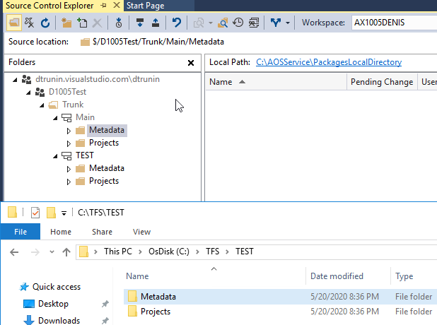

Understanding D365FO Version control system why it is different from AX2012.

If are you developing application in Dynamics 365 Finance and Operations you need to use Team Foundation Version Control(**TFVC**) system. It is not very complex, but it concept is different what we have previously in AX2012. 

In this post I describe some scenarios that may produce unexpected results If you don't fully understand it and use it in a "AX2012 way".

## Initial setup

Here our project setup, I created 2 branches one for our internal development and testing(Trunk - **Main**) and one for user testing - **TEST**. **TEST** is mapped to some temporary folder to allow merging.

## Case 1 - Why my code doesn't compile

let's do our first modification, Add a new EDT **EDT_FieldA** and a new Field based on this type to **CustGroup** table

Commit our changes

Then let's do our second modification - A new field to the same **CustGroup** table based on a new EDT **EDT_FieldB**

and commit it to our **Main** branch as **ProjectB**

These two modifications are logically not linked, so after the testing we can decide to move **ProjectB** only to the user test environment. It is a typical situation in AX2012, where you just export the project to XPO from DEV and load it into TEST(during the import you compare XPO and transfer only relevant changes)

But the trick is you can't use this approach in Dynamics 365 Finance and Operations. 

A typical mistake is to use **Selected changesets** merge to do this. Let see how it works:

You run a Merge command and choose **Selected changesets** 

 

then you select only **ProjectB** assuming that only changes from **ProjectB** will be included

but the result will be not as expected - you will also transfer a new **FieldA** and it refers to EDT that doesn't exists in TEST branch. So you will get a compile error when you try to Build you TEST branch(and that is not a worst scenario)  

## Case 2 - Why my test system doesn't work

Let's consider another example - you are developing some complex modification(**Project1**) and a part of this modification is a new validation on Sales table

Another developer is developed in the same branch a simple modification just to provide some default values for the SalesTable(**Project2**)

**Project2** is simple to test and after testing you decided to move to it user testing - TEST branch. Again this is a typical valid scenario in AX2009 or AX2012, we often don't care about other people modifications, we just transfer XPO and compare the code during the import.

You run "selected changesets" transfer and choose **Project2** only 

As a result you will get a file that contains a part or **Project1**. 

This probably creates a unexpected new validation on TEST branch and your users may even not be able to create Sales orders due to this validation. 

## Case 3 - Why my code is missed after the merge

Lets continue with the example above. Let's consider that it is your lucky day and you noticed that you added unwanted code from **Project1** to the TEST version before it's being deployed to users.

You open the class and delete the code related to **Project1** from it. A typical AX2012 operation. 

Then after some time you decided to finally transfer **Project1** to TEST from Main. You can even run full branch merge for this. 

After a successful merge your code related to **Project1** will not appear in TEST. You lost it!  

## Microsoft recommendations 

All examples above may happen due to incorrect usage of branching strategy.

The basic advice from Microsoft is the following:

> Start with the main only branching strategy, [branch strategically](https://docs.microsoft.com/en-us/azure/devops/repos/tfvc/branch-strategically?view=azure-devops) and adopt other strategies to evolve into more complex strategies as needed.

To achieve this you need to work in sprints(for example 1 release per week). 

It is a high change that sometimes you need an emergency fixes(that can't wait for a week). In this case you restore a new temporary branch from the last build, implement a fix in this temporary branch and merge changes back to Main before the next release(so it will be a **Release isolation strategy**). 

## Conclusion 

Team Foundation Version Control(**TFVC**) is a quite basic system comparing to Git. The main confusion that people have - changeset in **TFVC** are whole objects, not just changes.

If you use old AX approach("Merge selected changesets" in random order) with D365FO Team Foundation Version Control(**TFVC**) system you may face problems. You may get compile errors, transfer unwanted code and lost changes. 

None of the recommended strategies allow "Merge selected changesets", you should always work with a full branch.  https://docs.microsoft.com/en-us/azure/devops/repos/tfvc/branching-strategies-with-tfvc?view=azure-devops

