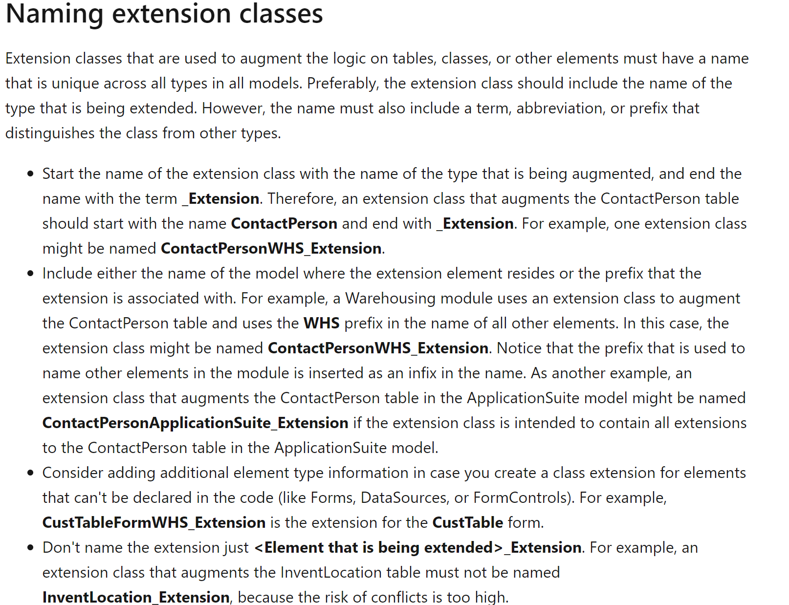

In D365FO Microsoft introduced a new concept of extension classes. This concept is not aligned with the standard AOT elements as you need to create a new AOT classes to put your code related to extension. For example when you write your code for the form, all code is located in the form definition. So you have the form design and all related code in one place. But for form extensions you create form extension design as one AOT object and all code related to individual form extension components is located in separate AOT objects(extension classes). It is still surprised me why they have choose such design, but it creates some new problem for developers - you need to name these classes.

Microsoft created some basic guidelines for this - [Naming guidelines for extensions](https://docs.microsoft.com/en-us/dynamics365/fin-ops-core/dev-itpro/extensibility/naming-guidelines-extensions#naming-extension-classes), but it seems this page is not even used inside Microsoft teams. 

Let's see what they recommend - technically extension classes are not new objects, so suffix should be used instead of prefix, and you need to create a distinction between object with the same names(like form CustTable and table CustTable)



Some objects from the standard code follow these rules, but a lot of don't. Let's check the actual objects in 10.0.5 application

```
[ExtensionOf(tableStr(InventTable))]
public final class AppTroubleshooting_InventTable_Extension
```

Why the name is not InventTableAppTroubleshooting_Extension?

```
[ExtensionOf(formstr(BudgetReservationCreate_PSN))]
public final class BudgetReservationCreatePSN_Extension

[ExtensionOf(formStr(RetailStatementsPart))]
public final class RetailStatementsPart_Extension
```

These two are against the rule - "Don't name the extension just **_Extension**."

```
[ExtensionOf(formStr(SalesEditLines))]
internal final class RevRecSalesEditLines_Extension

[ExtensionOf(formStr(LedgerJournalTable))]
internal final class RevRecLedgerJournalTableForm_Extension
```

Here "RevRec" is used as a prefix instead of suffix, but more interesting that one developer have added a "Form" suffix and another forgot to add it.  

So organizing a naming convention even within MS teams is quite hard task.

## Why this is important? 

Currently there is no combined view in Visual studio to view the final code(that includes all applied extensions), so proper naming convention help you to easily find objects and avoid code duplication(where the same logical function is implemented in two different classes).

It actually doesn't matter what rules you will follow, more important that within one project names should be the same

## Solution to this problem

First you need to define the naming conventions for your project. Currently there are 8 elements that can have extension classes, you need to define naming rules for these 8 elements(I have seem several dev guides where only 2 or 3 types where defined). 


Another problem is you need to define rules where to put your event handlers. Technically event handlers are static methods and can be created in any class, but you should not put these static methods to extension classes(details can be found in this article - https://daxmusings.codecrib.com/2018/06/accidental-code-extensions.html )

So totally you need to define 16 rules. 

Next step is to exclude manual work when creating an extension classes. I extended my "Create extension class" add-in to automatically generate the class names based on these rules

I also created a setup form where you can define these naming rules and added a function to quickly define an initial template(currently there are only 2 - with "_" and without)


## Summary

You can download this create class extension from the following https://github.com/TrudAX/TRUDUtilsD365/releases. If you find that something is missing or can be improved don't hesitate to leave a comment. If you have your own rules you can also send them to me(or create a Pull request) and I will add them as a option for the default settings.