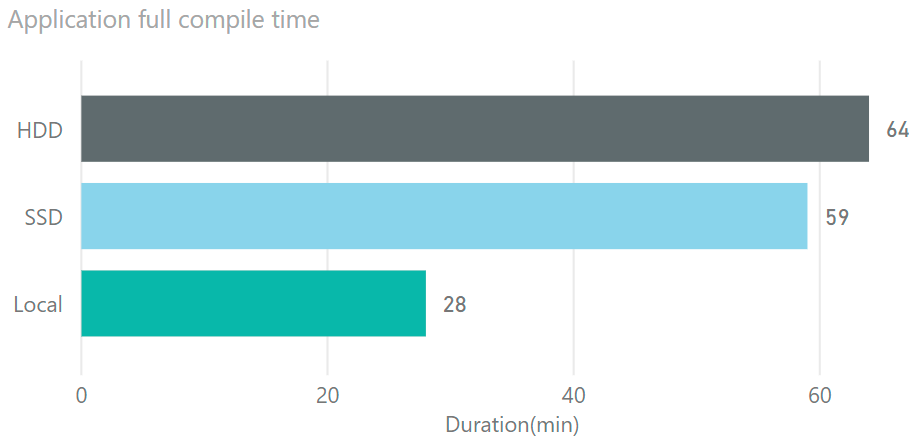
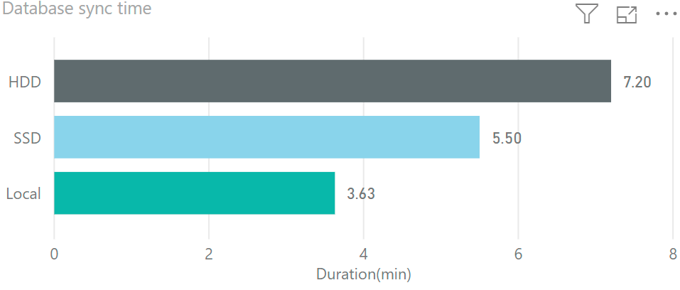

Comparing D365FO development VMs speed

D365FO version required more resources to perform development. In this post I try to compare 3 popular development configurations and describe pros and cons for each

Configuration to compare

| Name         | Local                               | SSD                                        | HDD                                        |
| ------------ | ----------------------------------- | ------------------------------------------ | ------------------------------------------ |
| VM Type      | Local Hyper-V Image                 | Standard D8s v3                            | Standard D12 v2                            |
| CPU          | Core i7-8700 3.2GHz, 6 cores        | E5-2673 v4 2.30GHz, 8 vcpus, 32 GiB memory | E5-2673 v4 2.30GHz, 4 vcpus, 28 GiB memory |
| Storage      | Samsung 970(more than 100k IOPS)    | 5 premium disks                            | 16 HDD disks                               |
| Run cost     | system for run 3 VMs - around 1.5k$ | 0.75$ per hour                             | 0.52$ per hour                             |
| Storage cost | 0                                   | ~4$ per day                                | ~0                                         |
|              |                                     |                                            |                                            |
|              |                                     |                                            |                                            |

Preparation steps - both 3 VMs used the same D365FO version - 10.0 PU24. After installation I disabled the following services:

- Microsoft Dynamics 365 Unified Operations: Batch Management Service

- Microsoft Dynamics 365 Unified Operations: Data Import Export Framework Service

- Management Reporter 2012 Process Service

## Overall system performance tests

First, lets compare overall system performance by running full compile and full DB sync tasks. It is not frequent operation for Dev machine, but they very resource intensive and allow to find out VMs capacity.

For compile I got the following results: 

What is interesting here - SSD VM time is very close to HDD despite of the fact that SSD has 8 cores. The main reason for this - is that Dv3 series has CPUs with Hyperthreading 

And for database synchronize: 

The next test is time to hit breakpoint

To prepare for this I switched off Load symbols for items in the solution. Then Open AOT, Locate SalesTable form and add it into the new project. Mark the form as a startup object. Open the code and add a new breapoint to the init() method 

Created a new project with the SalesTable form, set breakpoint 

Local - 

SSD - First run st - 04.4 end- 0.51.1, Second 01.0.3, 01.18.5

HDD - first 09.4 ; end 03.03.8??

test hello world

Create a new project and add a Runnable class with 

Info("Hello world");  

In this case I measured the time between pressing the start Button to Display "Hello world" in the browser

Local - 

SSD - First run st 5.3  end 41.6, Second 58.6 end 01.08

HDD - 03.5 end 38.6, 50.2 end 01.01.5

