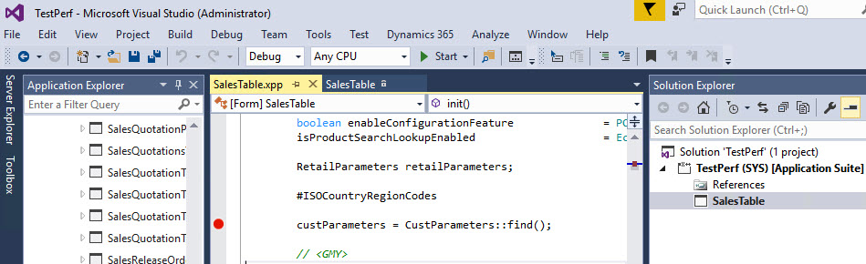
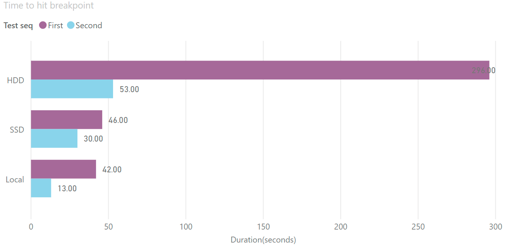
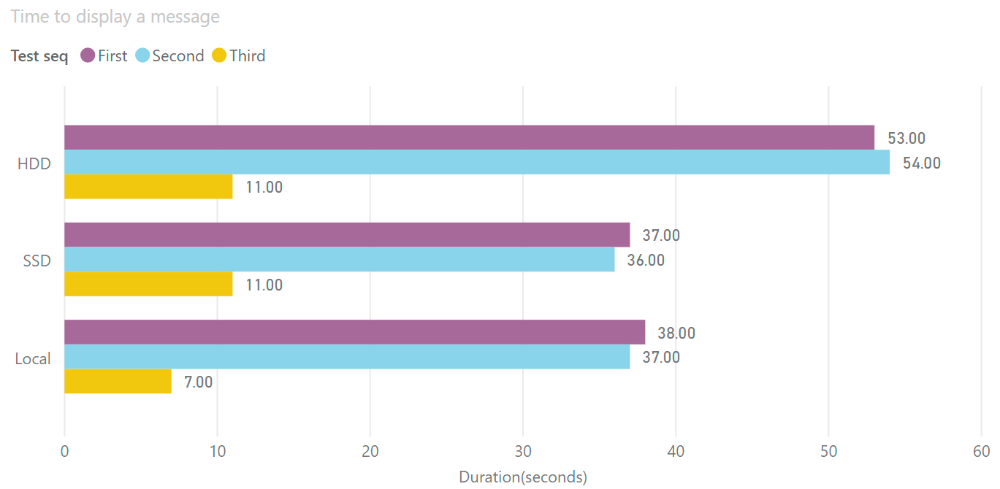

Comparing D365FO development VMs speed

D365FO version required more resources to perform development. In this post I try to compare 3 popular development configurations and describe pros and cons for each

Configuration to compare

| Name         | Local                            | SSD                                        | HDD                                        |
| ------------ | -------------------------------- | ------------------------------------------ | ------------------------------------------ |
| VM Type      | Local Hyper-V Image              | Standard D8s v3                            | Standard D12 v2                            |
| CPU          | Core i7-8700 3.2GHz, 6 cores     | E5-2673 v4 2.30GHz, 8 vcpus, 32 GiB memory | E5-2673 v4 2.30GHz, 4 vcpus, 28 GiB memory |
| Storage      | Samsung 970(more than 100k IOPS) | 5 premium disks                            | 16 HDD disks                               |
| Run cost     | Box for run 3 VMs - around 1.5k$ | 0.75$ per hour                             | 0.52$ per hour                             |
| Storage cost | 0                                | ~4$ per day                                | ~0                                         |
|              |                                  |                                            |                                            |
|              |                                  |                                            |                                            |

Preparation steps - both 3 VMs used the same D365FO version - 10.0 PU24. After installation I disabled the following services:

- Microsoft Dynamics 365 Unified Operations: Batch Management Service

- Microsoft Dynamics 365 Unified Operations: Data Import Export Framework Service

- Management Reporter 2012 Process Service


## Overall system performance tests

First, lets compare overall system performance by running full compile and full DB sync tasks. It is not frequent operation for Dev machine, but they very resource intensive and allow to find out VMs capacity.

For compile I got the following results: 


Compile is a CPU intensive task. 

What is interesting here - SSD VM time is very close to HDD despite of the fact that SSD has 8 cores and HDD 4 cores. The main reason for this - is that Dv3 series has CPUs with Hyperthreading enabled but Dv2 - CPUs with Hyperthreading disabled. Hyperthreading gives only a small boost, that is why very important when you plan you virtual infrastructure keep in mind - when we say for example '8 core VM' - are these real cores or virtual one. 

Local VM has CPU with the higher clock speed and CPU itself has 6 physical cores - that explains more than 2 times difference in performances with the Azure based machines.

Next test is database synchronize: 


Synchronize operation is IO and CPU intensive. Local VM has more powerful IO system, and more powerful CPU, that explains its time. SSD also performed much better in this test due to faster disks. 

## Daily task tests

In order to test performance for the more often developers task I choose 2 tasks - time to hit breakpoint and time to display 'Hello world' from the job. In AX2012 both these task has zero time, you don't need to wait.

### Time to hit breakpoint test

Before the test I executed the AX main screen

To prepare for this test I switched off 'Load symbols for items in the solution'. Then opened AOT, seached for **SalesTable** form and added it into the new project. Marked the form as a startup object. Opened the code and added a new breapoint to the **init()** method. Time in this test - is the time between I pressed **Start** and the time when the breakpoint was hit.



Two tests were performed to see how cache is change this time



HDD VM was very slow in this test. You need to wait almost 5 minutes to see your first breakpoint! SSD and Local first run was the same, but the second run local was faster.

### Hello world test

This test was performed straight after the breakpoint test, but I restarted Visual Studio. In this test I created a new project and added a Runnable class with the following code 

```
info("Hello world");  
```

On the second run I change this test to "Hello world2". On the Third run I didn't change the text, just run the same job. 

I measured the time between press Start and the time when message displayed in the browser. Results are the following:



You need to wait almost a minute for the HDD to see the results of the simple job. For local and SSD it is 70% faster. Local also executed your job faster if you didn't change it - probably due to high single core CPU speed(but still you need to wait 7 second, it is not instant)

## Conclusion 


