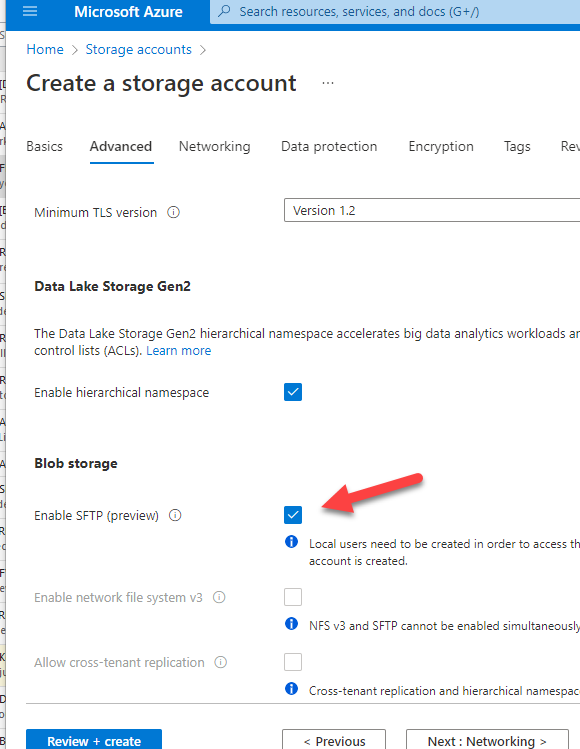

---
title: "XppInteg - Export data from D365FO to SFTP"
date: "2023-02-01T22:12:03.284Z"
tags: ["Integration"]
path: "/integ-outboundsftp"
featuredImage: "./logo.png"
excerpt: "The blog post describes the solution for exporting data from D365FO."
---

**External integration** is a framework that can be used to implement inbound and outbound integrations from D365FO. It supports several chanels: Azure file share, SFTP, Azure service bus and several integration types
Inbound async, Inbound sync, Outbound data, Outbound event basis. The framework designed to provide logging, error handling, troubleshooting for various integration types.

In this blog post I will describe how to export data from D365FO to SFTP server

## SFTP server setup

Several years ago Microsoft didn't provide any support for SFTP hosting, claiming that is obsollete in the cloud world, but it seemsSFTP still quite popular among clients and finally it support was added to Azure storage servive

The option to access Azure storage via SFTP enpoint described in the following topic(https://learn.microsoft.com/en-us/azure/storage/blobs/secure-file-transfer-protocol-support), in brief you need to create a storage account and enable SFTP access to it.



## Client library to connect to SFTP

There are several .NET libraries to work with SFTP, but probably most popular is open source SSH.NET(https://github.com/sshnet/SSH.NET) Renci.SshNet.dll

To work with SFPT from the user interface I will use 

...

## System setup

### Connection types

The first form to setup SFPT connection is External integration – Connection types

It requires the host name and User/Password to access this host

The password can be stored in several formats:

- Manual entry - unencrypted string, that may be used for dev testing

- Encrypted - Encrypted value
- Azure Key Vault - link to the standard D365FO key vault form that stores the password


### Outbound message types

In Outbound message types we setup parameters for our export

Source group
Here we specify link to the connection type and a folder on SFTP server where to export the data

Processing group 

Contains a link to class that performs the export. The class just a standard RunBase class(extended from DEVIntegExportBulkBase) that can define custom parameters and get the services for base class helper functions

File parameters

Very often the export needs to create a file with some date part in it. This settings allows to specify the name template with '%d' symbol. **Date format(%d)** defnes how this symbol is converted to date(e.g. you can include date-time or use just date). The rules for format are defined by the standard .NET DateTime.ToString.format parameter  https://learn.microsoft.com/en-us/dotnet/api/system.datetime.tostring?view=net-7.0#system-datetime-tostring(system-string)

**Delimiter** defines a CSV type delimeter

Advanced group

Advanced group defines used log types and a Company range validation. The export runs in the current company and some exports may be logically only related to certain companies. **Company range** allows to specify a list of companies where the export may be run

## Export scenarious 

Let's describe most typical scenarious that can be used to export the data from D365FO

### Export store onhand data(low code scenario)

**Business scenario**: our company has a store and we want to export daily onhand data from this store to our web site. We need to include ItemId, Stype and AvailiablePhysical value

External integration module contains a class that allows to export the result of the custom SQL string and the basic task like this can be done even without writing any code.

..

### Export customers (low code with data entity)

**Business scenario**: in our D365FO ERP we maintain clients and want to implement daily export to the external system. We want to export Client Id, Name, Primary e-mail

This taks is also simple, we can use a standard data entity to fetch the data

..

### Export store onhand data(full X++ based procedure)

It is very likely that real word tasks will be more complex that just using SELECT statement. In this case you need to write X++ code that generates the export. Let's extend the previous task and check how this can be done

**Business scenario**: our company has a store and we want to export daily onhand data from this store. We want the quantity in sales unit and we also want the current sales price. Our export should be a CSV file that contain the following fields: ItemId, Style, AvailiablePhysical(in sales unit) and Sales Price

In order to do this we need to create a class that extends DEVIntegExportBulkBase. The code for this class is the following

A developer should write only export business logic related to the export

Also in this export we can add some additional monitoring. For exampe for some items we don't have a price. It is not a critical error, but we need to notify a user about this, he may adjust the query to exclude this items or notify pricing department to enter prices


### Export invoices (incremental X++ procedure)

Let's describe other scenario where we need incremental export

**Business scenario**: our company wants to export customer invoices to external system. The export runs daily and should include all invoices for this day. The export file should contain Account number, InvoiceIId, SalesId, Department dimension, Item, Qty,  LineAmount

To start with let's describe the typical mistake that sometimes I saw on projest. We need somehow track incremental changes and sometimes people using CratedDateTime for this. The idea is you export all data up to the current time, save this time and next time process all records starting from this time. The problem with this aproach is that it doen't take into consideration existing transactions. The SQL transaction may start in 1pm, create an invoice at 1.05 and finish at 2pm. If the export runs at 1.30, it will not see 1.05 uncommited transaction and the invoice will not be exported

In the following implementation I propose the following - Add 2 fields IsExported and ExportedDateTime to the invoices and update these fields after the export. It may not sound technically perfect(for example DMF may use SQL change tracking), but  simplifies troubleshooting and provides a full visibility to a user, you can just open invoice and see it's status 


[**SQL BACPAC**](https://learn.microsoft.com/en-us/azure/azure-sql/database/database-export?view=azuresql) is a zip file that contains table data in text format. If you change the .backpac extension to .zip and open it in the archive tool, you will see something like that:


So the BACPAC restore procedure creates all tables in the database and populates the data in these tables.

To load the data, Microsoft released a [SqlPackage](https://learn.microsoft.com/en-us/sql/tools/sqlpackage/sqlpackage?view=sql-server-ver16) tool. You can run it directly or use [d365fo.tools](https://github.com/d365collaborative/d365fo.tools). Both commands are shown below:

```powershell
#USE d365fo.tools
$StartTime = get-date 
Import-D365Bacpac -BacpacFile "J:\LCS\PreProd2022_05_24.bacpac" -ImportModeTier1 -NewDatabaseName PreProd2022_05_24_2
$RunTime = New-TimeSpan -Start $StartTime -End (get-date) 
WRITE-HOST "Execution time was $($RunTime.Hours) hours, $($RunTime.Minutes) minutes, $($RunTime.Seconds) seconds" 

#USE DIRECT SqlPackage CALL 
$StartTime = get-date 
cd C:\temp\
$fileExe = "C:\Temp\d365fo.tools\SqlPackage\SqlPackage.exe"
& $fileExe /a:import /sf:J:\MSSQL_BACKUP\pope_2022_05_16_small.bacpac /tsn:localhost /tdn:pope_2022_05_16_small_sp_ind  /p:RebuildIndexesOfflineForDataPhase=True /MaxParallelism:32 /p:DisableIndexesForDataPhase=FALSE
$RunTime = New-TimeSpan -Start $StartTime -End (get-date) 
WRITE-HOST "Execution time was $($RunTime.Hours) hours, $($RunTime.Minutes) minutes, $($RunTime.Seconds) seconds" 
```

Sometimes this procedure may be slow, so let's discuss what parameters may be used to improve BACPAC restore time:

### Get a fast hardware

Azure VMs are quite limited in terms of disk performance. A standard configuration may have SSDs or HDDs disks, but their speed will be much slower compared to local PCEe drives(e.g. Samsung 870 PRO).

The process is the following: you restore the BACPAC on the local machine, after the restore, create a backup of the SQL database, move it to the Azure file share and copy-restore this SQL backup on the cloud Azure VM. Working with native SQL backup is quite a fast operation compared to BACPAC conversion, and Local PC may provide a great advantage in restoring time. The sample code for this is the following:

```powershell
$StartTime = get-date 
Import-D365Bacpac -BacpacFile "C:\Temp\PreProd2022_05_24.bacpac" -ImportModeTier1 -NewDatabaseName PreProd2022_05_24_2  -DatabaseServer "SDS-WS83" -SqlUser denis -SqlPwd "Pass" 
$RunTime = New-TimeSpan -Start $StartTime -End (get-date) 
WRITE-HOST "Execution time was $($RunTime.Hours) hours, $($RunTime.Minutes) minutes, $($RunTime.Seconds) seconds" 
```

### Use the Delayed durability database option

**Delayed durability** is a database option that speeds up certain database operations, but the database may stay in corrupted mode if the server crashes. D365FO database contains a huge number of objects, and the time for DB structure creation may be improved by using the Delayed durability flag.


The main problem is that it can be enabled only after the database is created, but **SQLPackage** doesn't have the option to automate this. So currently, I use this approach only with manual steps. In ~3-5 min after executing **SQLPackage**.exe, it creates a database, and then I manually run the following command for the newly created database.

```SQL
USE [master]
GO
ALTER DATABASE [PreProd2022_05_24_2] SET RECOVERY SIMPLE WITH NO_WAIT
GO
ALTER DATABASE [PreProd2022_05_24_2] SET DELAYED_DURABILITY = FORCED WITH NO_WAIT
GO
```

### Use RebuildIndexesOfflineForDataPhase switch

**RebuildIndexesOfflineForDataPhase=True** is one of the **SQLPackage** performance flags that rebuilds indexes with offline mode after the data load procedure. On my tests, I noticed some improvements with this flag, and it is something to keep in mind for a larger database.

### Use DisableIndexesForDataPhase switch

By default **SQLPackage** disables table indexes before loading the data and then enables them after the load. For large tables, it should improve the data load performance, but for small tables, you get two additional steps: disable and enable indexes.  **/p:DisableIndexesForDataPhase=FALSE** flag changes this behavior, it loads the data without recreating indexes. For my test files, it provided a significant performance boost.

## Test results

In tests, I used the following BACPAC files:

- **A small file**:  94MB BACPAC size,  2.2 GB SQL Server database size
- **A standard file**: 2.5GB BACPAC size,  24.7 GB SQL Server database size

I compared two different environments:

- A Local PC with a fast CPU and PCE SSD Intel core i9 10900 2.8GHz(up 4.8Gz)
- A Standard development Azure VM D8v3 E5-2673 v4  (2.3Ghz) and 15HDDs

| Test type                                                    | Small file/Azure | Standard file/Azure | Small file/Local | Standard file/Local |
| ------------------------------------------------------------ | ---------------- | ------------------- | ---------------- | ------------------- |
| Default SQLPackage parameters                                | 1 hour, 16:24    | 3 hours, 51:36      | 21:33            | 1 hour, 23:50       |
| Disabled durability                                          | 46:35            | 3 hours, 18:36      | 20:11            | 1 hour, 20:12       |
| Disabled durability, /p:RebuildIndexesOfflineForDataPhase=True |                  | 2 hours, 52:16      |                  | 1 hour, 07:09       |
| /p:DisableIndexesForDataPhase=FALSE                          |                  | 2 hours, 23:19      | 21:01            | 51:15               |

For the small file, the restore times varied from one hour to 20 minutes. What is interesting here is that for fast hardware, the restore time is almost independent of various switches. Delayed durability provided a significant boost for slow disk systems(standard DEV VM). Also, for a small amount of data, it is worth considering/p:DisableIndexesForDataPhase=FALSE flag

**update 06/03/2023**: you can auto clean log tables from the file using the following script

```powershell
Clear-D365TableDataFromBacpac -Path "X:\MSSQL_BACKUP\AxDB.bacpac" -TableName "SECURITYOBJECTHISTORY","*Staging*","BatchHistory","SYSDATABASELOG*","ReqCalcTaskTrace" -ClearFromSource
```

## Summary

I described different options for the BACPAC restore process. Of course, every database size is unique, but this should be a good place to start if you want to optimise the restore time for your project. For example, in my test, a "standard" size file may be restored in 4 hours or just in 1 hour, depending on different configurations.

What is also important is to have a process that covers the needs of your project. For example, you may have a standard automated restore process that takes 4h and have an "emergency" process that requires some interactions(e.g. Delayed durability, manually deleting large log tables from BACPAC before the restore, etc...) that can be done in 1h.

I hope you find this information useful. As always, if you see any improvements, suggestions or have some questions about this work, don't hesitate to contact me.
