---
title: "Implement Periodic Data Export from D365FO to SFTP"
date: "2024-07-12T22:12:03.284Z"
tags: ["Integration", "XppDEVTutorial"]
path: "/integ-outboundsftp"
featuredImage: "./logo.png"
excerpt: "This blog post describes how to implement various scenarios for periodic data export from D365FO to a file and uploading it to SFTP server."
---

**External integration** is a framework designed for inbound and outbound integrations in D365FO. It supports several channels: Azure file share, SFTP, Azure service bus, and provides comprehensive features for logging, error handling, and troubleshooting.

In this blog post, I will describe how to implement periodic data export from D365FO to a file and upload it to an SFTP server.

## SFTP Server Setup

A few years ago, Microsoft did not support SFTP hosting, claiming it was obsolete in the cloud world. However, SFTP remains quite popular among clients and eventually, SFTP support was included in the Azure storage service.

To use Azure storage via an SFTP endpoint, you must first create a storage account and enable SFTP access. More information can be found here: [SSH File Transfer Protocol (SFTP) support for Azure Blob Storage](https://learn.microsoft.com/en-us/azure/storage/blobs/secure-file-transfer-protocol-support).


Then, create an SFTP user:

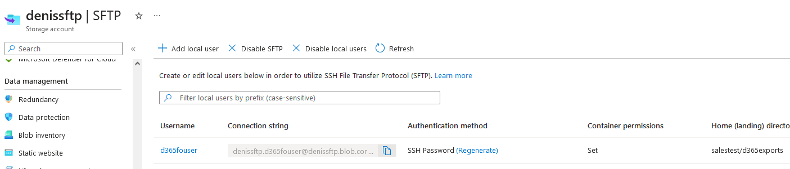

Please note that SFTP access incurs additional charges of about $10 per day compared to Azure file storage. Alternatives such as [files.com](https://files.com) offer additional features, including more granular access control.

## Client Library for SFTP Connection

Several .NET libraries are available for working with SFTP. One of the most popular is the open-source [SSH.NET](https://github.com/sshnet/SSH.NET). It adds a reference **Renci.SshNet.dll** that can be used in X++.

For user interface operations, I recommend using [FileZilla](https://filezilla-project.org/).

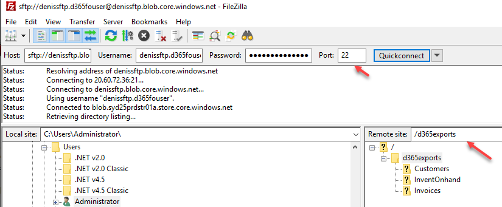

## System Setup

Before exploring different integration scenarios, let's discuss common setup options.

### Connection types

The first form to setup an SFTP connection is **External integration – Connection types**.

It requires the hostname and user/password credentials to access this host.

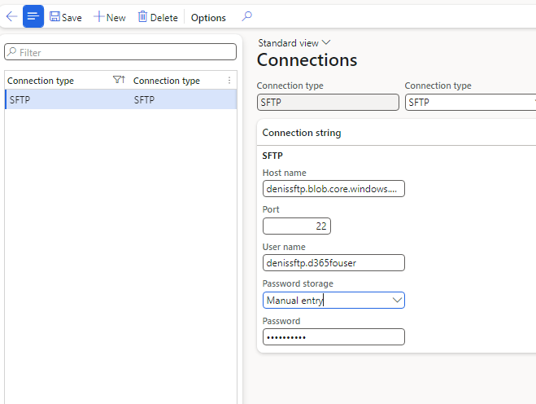

The password can be stored in several ways:

- Manual entry - An unencrypted string suitable for development testing.
- Encrypted - An encrypted value.
- Azure Key Vault - A link to the standard D365FO key vault that stores the password.

### Outbound message types

In Outbound message types, we set parameters for our data export.

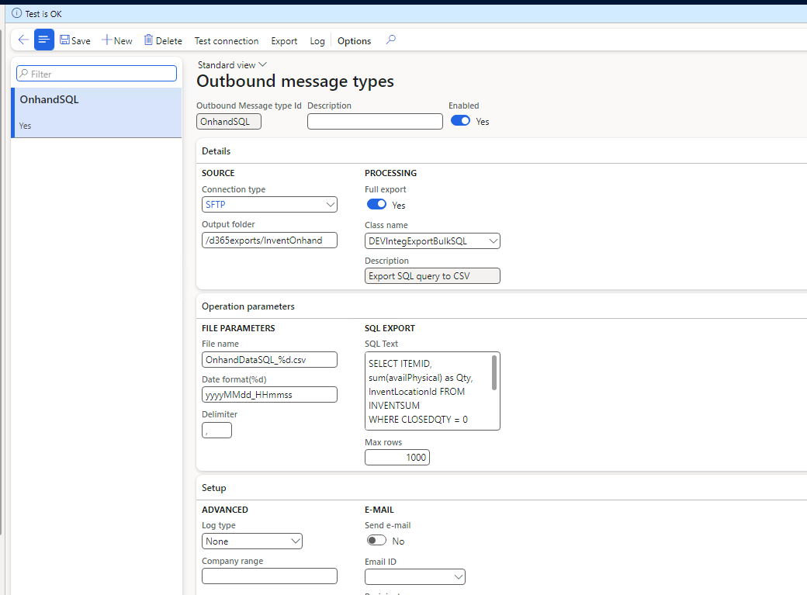

**Source group**
Here, we specify a link to the connection type and a folder on the SFTP server for data export.

**Processing group**
Contains a link to the class that performs the export. The class is a standard RunBase class (extended from **DEVIntegExportBulkBase**) that can define custom parameters and utilizes helper functions from the base class.

**File parameters**
Often, exports require creating a file name that includes a **date** component. This setting enables specifying a name template using the '%d' parameter. **Date format(%d)** defines how this symbol is converted into a date (e.g., you can include date-time or use just date). The format rules are defined by the .NET DateTime.ToString [format parameter](https://learn.microsoft.com/en-us/dotnet/api/system.datetime.tostring?view=net-7.0#system-datetime-tostring(system-string)).

**Delimiter** defines a CSV-type delimiter.

**Advanced Group**
The advanced group defines used log types and a Company range validation. The exports run in the current company, and some exports may be logically related only to certain companies. The **Company range** allows specifying a list of companies eligible for export.

## Export scenarios

Let's describe the most typical scenarios that can be used to export data from D365FO.

### Export Store Onhand Data (no-code scenario)

**Business scenario**: *Our company has a store, and we want to export daily onhand data from this store to our website. We need to include ItemId, Warehourse, and AvailiablePhysical value.*

The External integration module contains a **[DEVIntegExportBulkSQL](https://github.com/TrudAX/XppTools/blob/master/DEVTutorial/DEVExternalIntegration/AxClass/DEVIntegExportBulkSQL.xml)** class that allows exporting the result of a custom SQL string. This basic task can be done without writing any code.

```SQL
SELECT ITEMID, sum(availPhysical) as Qty, InventLocationId FROM INVENTSUM
WHERE CLOSEDQTY = 0 AND DATAAREAID = 'USMF' 
GROUP BY ITEMID, InventLocationId
HAVING sum(availPhysical) > 0
```

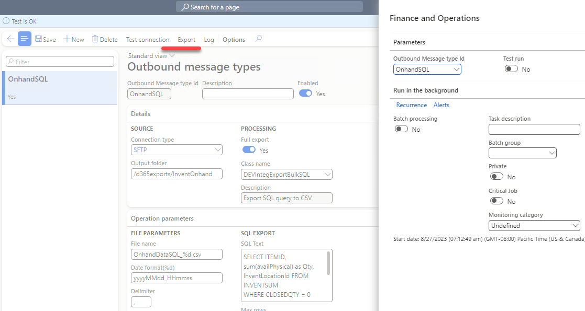

Then we can setup a standard daily batch job that generates a file in our output folder.

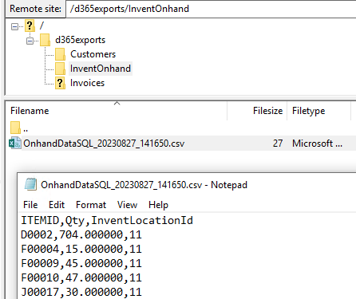

### Export customers (no-code with data entity)

**Business scenario**: *In our D365FO ERP, we maintain clients and want to implement daily export to the external system. We want to export the Client Id, Name, and E-mail.*

This task is similar to the previous one, but we will fetch the data using a standard data entity.

```SQL
SELECT [CUSTOMERACCOUNT], ORGANIZATIONNAME, PRIMARYCONTACTEMAIL FROM [CUSTCUSTOMERV3ENTITY]
WHERE DATAAREAID = 'USMF'
```

Message type setup is the following:

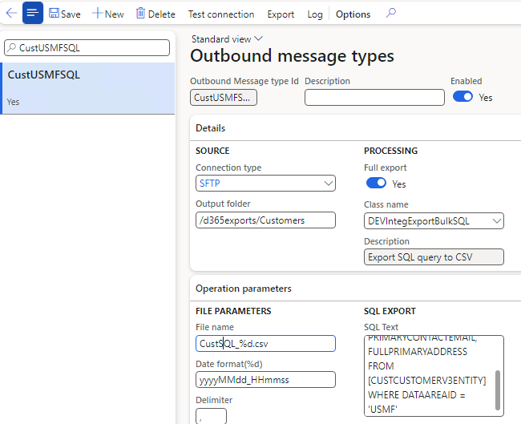

The result will be a file with customers:

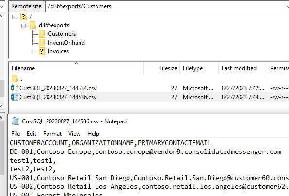

The examples above are great for prototyping, but "real world" export scenarios will likely be more complex than using a single **SELECT** statement, so you may need to write X++ code. *(One possible improvement is integrating the module with Data management and ER engines. If you have some working code that you can share, please ping me.)*

### X++ Export Implementation concept

The External Integration framework provides the following development concept: We can't predict how complex our exports will be. They may export to different sources (like SFTP, Azure storage, Service Bus, Web service), export data to one file or multiple files, require different parameters, etc. To cover all possible scenarios, we can use a standard **RunBaseBatch** class.

However, export classes will have some common methods. So, I created a base **[DEVIntegExportBulkBase](https://github.com/TrudAX/XppTools/blob/master/DEVTutorial/DEVExternalIntegration/AxClass/DEVIntegExportBulkBase.xml)** (that extends RunBaseBatch) to store these common properties and methods (like variables to store the number of export records, methods to create logs, write data to a file, etc.). The Export class should extend it.

### Export onhand data (simple X++ procedure)

Let's start with a simple case where you need to write X++ code that generates the export data.

***Business scenario**: We want to export all companies' inventory onhand data to SFTP. Our export should be a CSV file containing the following fields: 'Company', 'ItemId', 'InventLocationId', 'LastUpdDatePhysical', 'AvailPhysical'.*

The following class solves this task:

```csharp
class DEVIntegTutorialExportBulkInventOnhand extends DEVIntegExportBulkBase
{
    public void exportData()
    {
        container  lineData;
        InventSum  inventSum;

        this.initCSVStream();

        lineData = ['Company', 'ItemId', 'InventLocationId', 'LastUpdDatePhysical', 'AvailPhysical'];
        this.writeHeaderLine(lineData);

        while select crosscompany sum(AvailPhysical), maxof(LastUpdDatePhysical) from inventSum
            group by ItemId, InventLocationId
            where inventSum.AvailPhysical 
        {
            lineData = [inventSum.DataAreaId, inventSum.ItemId, inventSum.InventLocationId, inventSum.LastUpdDatePhysical, inventSum.AvailPhysical];
            this.writeDataLine(lineData);
        }

        this.sendFileToStorage();
    }
    public str getExportDescription()
    {
        return "Tutorial export Onhand to CSV";
    }
}
```

The class is quite simple, but it contains the following key parts:

- A business definition for the export
- An export flow

For example, if you want to create a file per company instead of one file, you can easily modify it. The **External Integration** framework will handle all related processes.

After we setup this class, we get the following file as a result:

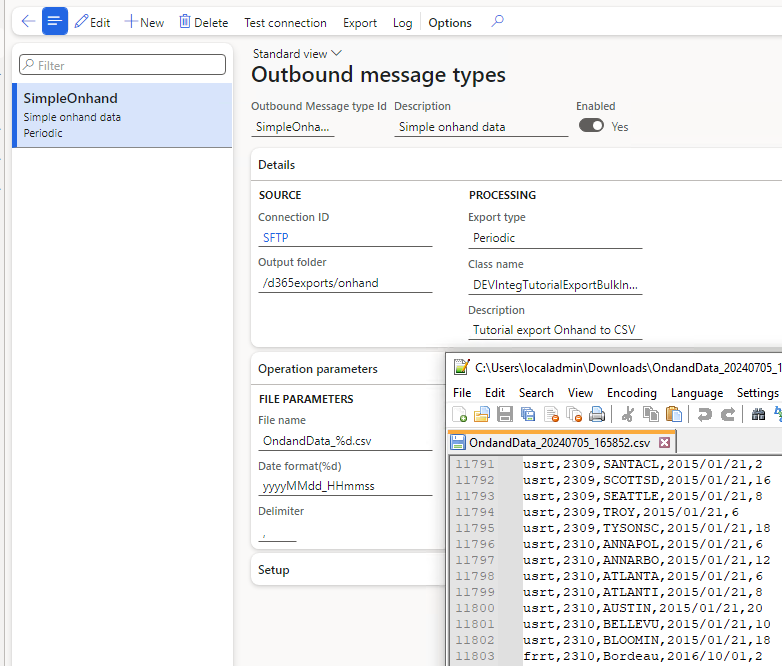

### Export onhand and price data (X++ based on a query)

Let's consider an export scenario with more advanced logic.

***Business scenario**: We want to implement a periodic export to SFTP of onhand data for one of our customers from their main Warehouse for a set of Items (the default should be the 'Audio' Item group, but it should be configurable). The export should be a CSV file that contains the following fields: 'ItemId', 'InventLocationId', 'AvailPhysical', 'Price'*

To do this, we need to create a [class](https://github.com/TrudAX/XppTools/blob/master/DEVTutorial/DEVExternalIntegrationSamples/AxClass/DEVIntegTutorialExportBulkOnhandPricesQuery.xml) that extends **DEVIntegExportBulkBase**. The code for this class contains the following blocks:

A method that defines the initial query and settings, providing default values that can be overridden by the user:

```csharp
class DEVIntegTutorialExportBulkOnhandPricesQuery extends DEVIntegExportBulkBase
{
    CustTable           custTable;
    public Query exportQueryInit()
    {
        Query                 query;
        QueryBuildDataSource  qBDS;

        query   = new Query();

        qBDS = query.addDataSource(tablenum(InventTable));

        qBDS = qBDS.addDataSource(tablenum(InventItemGroupItem));
        qBDS.relations(true);
        qBDS.addRange(FieldNum(InventItemGroupItem, ItemGroupId)).value('Audio');

        return query;
    }
    public DEVIntegMessageTypeTableOutbound initDefaultParameters(DEVIntegMessageTypeTableOutbound    _messageTypeTableOutbound)
    {
        DEVIntegMessageTypeTableOutbound  tableOutbound = super(_messageTypeTableOutbound);
        tableOutbound.FileNameParameterD   = 'yyyyMMdd_HHmm';
        tableOutbound.FileName             = 'OnhandPrices_%d.csv';
        tableOutbound.FileColumnDelimiter  = '|';

        return tableOutbound;
    }
```

A main export logic that initialises the file and uses the stored query to process export records:

```csharp
public void exportData()
{
    container               lineData;
    InventTable             inventTable;
    Query                   query;
    QueryRun                qr;

    //init parameters
    DEVIntegParametersPerCompany integParametersPerCompany = DEVIntegParametersPerCompany::find();
    DEV::validateCursorField(integParametersPerCompany, fieldNum(DEVIntegParametersPerCompany, ProductExportCustomer), true);

    custTable = CustTable::find(integParametersPerCompany.ProductExportCustomer);

    this.initCSVStream();
    lineData = ['ItemId', 'InventLocationId', 'AvailPhysical', 'Price'];
    this.writeHeaderLine(lineData);

    query   = this.exportQueryGet();
    qr = new QueryRun(query);

    while (qr.next())
    {
        inventTable = qr.get(TableNum(InventTable));
        this.itemRecord(inventTable);
    }

    this.sendFileToStorage();
}
```

And a method that calculates the exported values:

```csharp
void itemRecord(InventTable _inventTable)
{
    InventDim       inventDimFind;
    Price           price;
    InventSum       inventSum;

    inventDimFind = null;
    inventDimFind.InventLocationId  =   custTable.InventLocation;
    inventDimFind.InventSiteId      =   custTable.InventSiteId;
    inventDimFind   =   inventDim::findOrCreate(inventDimFind);

    PriceDiscParameters parameters = PriceDiscParameters::construct();
    parameters.parmModuleType(ModuleInventPurchSales::Sales);
    parameters.parmItemId(_inventtable.ItemId);
    parameters.parmInventDim(inventDimFind);
    parameters.parmUnitID(_inventtable.inventTableModuleSales().UnitId);
    parameters.parmPriceDiscDate(DEV::systemdateget());
    parameters.parmQty(1);
    parameters.parmAccountNum(custTable.AccountNum);
    parameters.parmCurrencyCode(custTable.Currency);
    PriceDisc       priceDisc = PriceDisc::newFromPriceDiscParameters(parameters);

    if (priceDisc.findPrice(custTable.PriceGroup))
    {
        price       = CurrencyExchangeHelper::amount(priceDisc.price());
    }
    else
    {
        if (exportBulkStatus != DEVIntegExportBulkStatus::Warning)
        {
            warning(strFmt("Price is not found for %1 Item", _inventtable.ItemId));
            this.setExportStatus(DEVIntegExportBulkStatus::Warning);
        }
    }
    select sum(AvailPhysical) from inventSum
        where inventSum.ItemId           == _inventTable.ItemId &&
        inventSum.Closed           == false &&
        inventSum.InventSiteId     == custTable.InventSiteId &&
        inventSum.InventLocationId == custTable.InventLocation;

    this.writeDataLine([
        _inventTable.ItemId,
        custTable.InventLocation,
        inventSum.AvailPhysical,
        price ]);
```

The settings for this class will be the following:

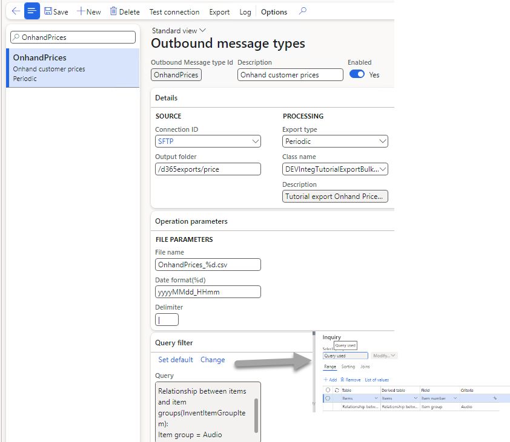

The resulting file will look like this:

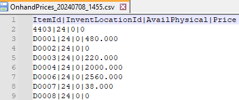

As in the previous example, a developer writes only export business logic related to the export.

#### Warning message status

This class also contains a concept called a **Warning** status. An export may finish successfully or may have an exception during file generation (Error state). But sometimes, you need to log an event where the exported data has issues but still wants to perform the export. For example, in our case, we can't find a price for some exported items. It is not a critical error, but we need to notify a user about this; they may adjust the query to exclude these items or notify another department to enter prices. To cover this scenario, the export class may mark the status as **Warning,** and the user may set a standard alert for it.

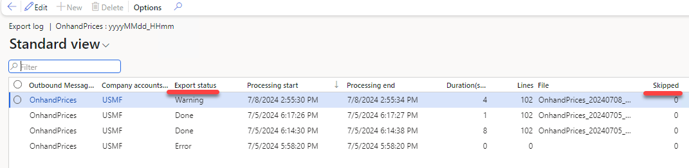

The **Skipped** lines counter serves the same purpose. If we need to skip some lines and notify a user about this, we can increase the **Skipped** counter and see it in the log.

### Export invoices to the EDI provider (incremental X++ procedure)

Let's describe a scenario where we need an incremental export.

***Business scenario**: Our company wants to export customer invoices to an external EDI system. The export runs daily and should include all invoices for this day. The export file should contain information about customer invoices, lines, and charges.*

To start this task, you will receive an EDI specification document and need to determine how it will be mapped to D365FO data.

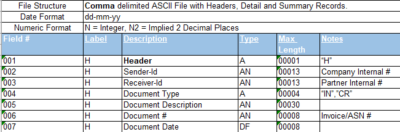

From practical experience, the first question to ask is how the EDI line data is defined. In the best scenario, it may match what you have in invoice lines, but in more complex cases, they can be defined on a more granular level (like related inventory transactions) or on a more summary level (e.g., lines grouped by Item number). Such requirements may even create quite complex system modifications to support such line splits.

The next decision is how to track incremental updates. A typical mistake that I sometimes see on projects is using the **CreatedDateTime** field for this. The idea is to export all data up to the current time, save this time, and next time process all records starting from this time. The problem with this approach is that it doesn't consider existing transactions. The SQL transaction may start at 1 pm, create an invoice at 1:05, and finish at 2 pm. If the export runs at 1:30, it will not see a 1:05 uncommitted transaction, and the invoice will not be exported. So, it is better to avoid such architecture.

To implement incremental tracking, I propose the following: Add 2 fields, **IsExported** and **ExportedDateTime**, to the invoices and update these fields after the export. It may not sound technically perfect (for example, [DMF](https://www.linkedin.com/pulse/d365-fscm-recurring-integrations-francisco-zanon/) may use SQL change tracking, so you don't need to add any fields), but it is very simple to troubleshoot, and it provides full visibility to a user. They can just open an invoice and see its status and when it was exported.

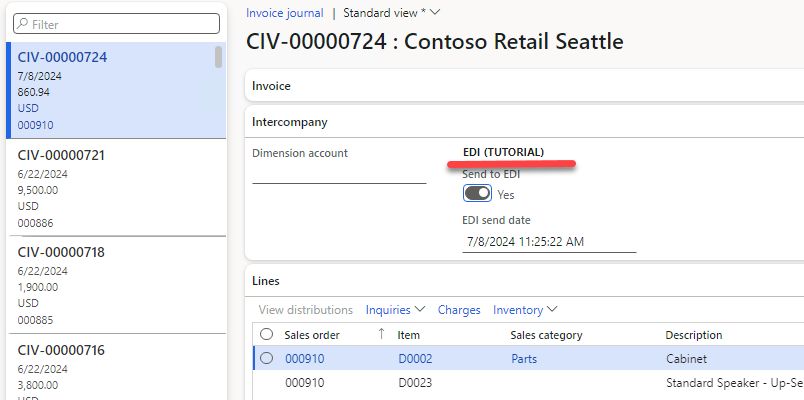

So when the export runs in the Incremental mode, it just takes all records that are not exported. Another advantage of this approach is there can be a situation when we need to reexport some data (for example, the export may contain errors, or we need to add additional information to the export). With these status fields, it is quite easy to implement.

The main **[exportData](https://github.com/TrudAX/XppTools/blob/master/DEVTutorial/DEVExternalIntegrationSamples/AxClass/DEVIntegTutorialExportBulkCustInvEDIInc.xml)** method:

```csharp
if (exportType == DEVIntegExportBulkIncrementalType::Incremental)
{
    qbds.addRange(FieldNum(CustInvoiceJour, DEVTutorialIntegEDIIsSend)).value(queryValue(NoYes::No));
}
qr = new QueryRun(query);

while (qr.next())
{
    custinvoicejour = qr.get(TableNum(CustInvoiceJour));

    this.exportRecord(custInvoiceJour);

    tmpExportRecordsMark.RefRecId = custInvoiceJour.RecId;
    tmpExportRecordsMark.insert();
}
this.sendFileToStorageNotEmpty();

if (! isTestRun)
{
    ttsbegin;                  
    custInvoiceJour = null;
    update_recordset custInvoiceJour
        setting DEVTutorialIntegEDISendDateTime = exportStartDateTime,
                DEVTutorialIntegEDIIsSend = true
    exists join tmpExportRecordsMark
        where tmpExportRecordsMark.RefRecId == custInvoiceJour.RecId;
    ttscommit;
}
```

And method that translates invoice to EDI format:

```csharp
......
while select custinvoicetrans
    order by LineNum, itemid   
    where custinvoicetrans.InvoiceId == _custinvoicejour.InvoiceId &&
          custinvoicetrans.SalesId   == _custinvoicejour.SalesId
{
    linecounter++;
    totalQty +=  custinvoicetrans.Qty;

    InventDim       inventDim = custinvoicetrans.inventDim();

    if (custInvoiceTrans.SumLineDiscMST && custInvoiceTrans.Qty)
    {
        realPrice       =   decRound(custInvoiceTrans.SalesPrice - (custInvoiceTrans.SumLineDiscMST/custInvoiceTrans.Qty),4);
        realPriceStr    =   num2str(realPrice,1,2,1,0);
    }
    else
    {
        realPriceStr   =   num2Str(custinvoicetrans.SalesPrice,1,2,1,0);
    }
    InventItemBarcode inventItemBarcode = inventItemBarcode::findItemId(custInvoiceTrans.ItemId, false, false, 'EAN-13');
    barCodeStr = inventItemBarcode.ItemBarCode;
    if(! barCodeStr)
    {
        barCodeStr  =  custinvoicetrans.ItemId + '-' + inventDim.InventColorId + '-' + inventDim.InventSizeId;
    }

    lastlinenum = custinvoicetrans.LineNum;

    this.writeDataLine(["D",
        num2str(custinvoicetrans.LineNum,1,0,0,0),
        salesTable.PurchOrderFormNum,
        barCodeStr,
        custinvoicetrans.itemName(),
        num2str(custinvoicetrans.Qty,1,2,1,0),
        custinvoicetrans.SalesUnit,
        num2str(custInvoiceTrans.SalesPrice,1,2,1,0),
        num2str(custInvoiceTrans.DiscPercent,1,2,1,0),
        realPriceStr,
        _custInvoiceJour.InclTax ? "Y" : "",
.......        
```

As a result, you will get a file similar to this one:

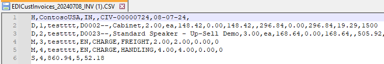

Below are the dialog and parameters set up for this export. By default, we export invoices from US-005 customers incrementally, but the user can export All invoices for a period or an individual invoice if needed.

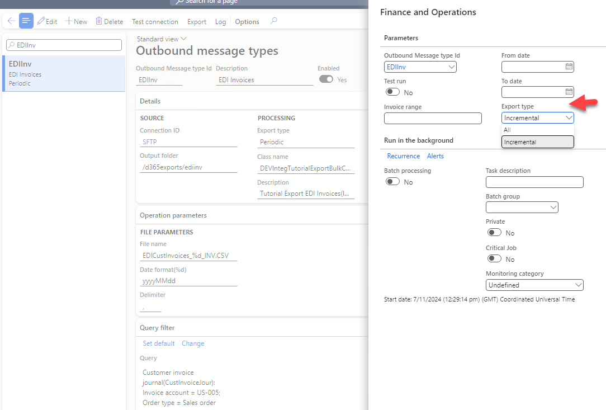

## Troubleshooting and monitoring

Let's discuss how we can support our periodic exports.

### Test run parameter

One of the parameters of the base export class is a **Test run** checkbox. When running with this parameter, the export sends a file to a user's browser instead of SFTP. For incremental export, it also will not update the "Last exported date" field, so it will not break the export sequence. This is very handy when checking what will be exported without putting anything on SFTP. Also, developers may develop exports without needing to have a connection to SFTP.

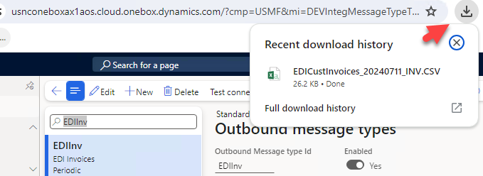

### Export Log

The export log allows one to view how many lines were exported and the time it took to perform the export. For failed jobs, we can setup a standard D365FO alert.

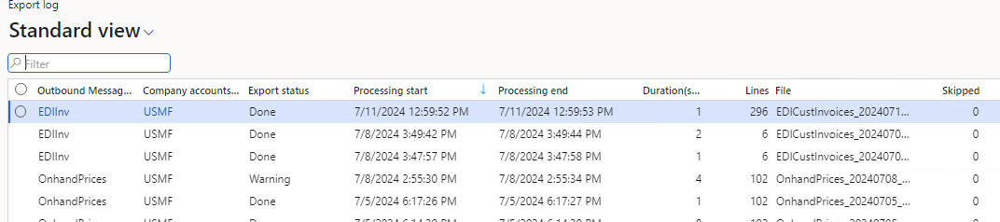

### Test connection

The **Test connection** button tries to connect to the specified SFTP folder and list files in it. So you can check the connection before running the export.

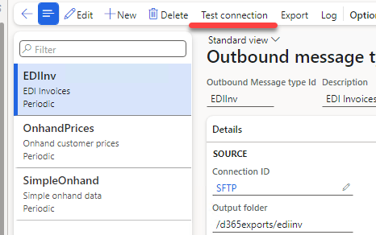

## Summary

In this post, I have described different types of periodic exports to file from Dynamics 365 Finance and Operations based on the **External Integration** framework. We discussed the following exports:

- Simple SQL query export
- Export based on custom X++ code and query settings
- Incremental X++ export

All used classes can be found on [GitHub](https://github.com/TrudAX/XppTools/tree/master/DEVTutorial/DEVExternalIntegrationSamples) and can be used as a starting point for your own integrations.

I hope you find this information useful. As always, if you see any improvements, suggestions, or have questions about this work, don't hesitate to contact me.
