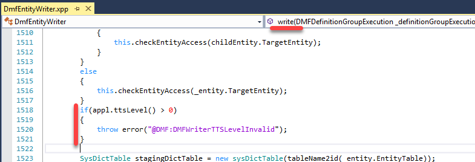

There are many ways to implement integration between D365FO and external system. To choose the correct approach you need clearly understand integration requirements before doing actual programming/setup. In this document, I propose the actual checklist of what you need to know to successfully design integration solution. The checklist is based on Oracle guidelines and contains questions that you need to ask while designing integration and before choosing between different integration methods(https://github.com/TrudAX/TRUDScripts/blob/master/Documents/Integration/Integration%20Data%20Flow%20Requirements.md):

- Defining the Integration Solution Topology
- Defining Data Flow Requirements
- Analysing the Data Flow properties
- Defining the Quality of Service
- Performance
- Availability and Reliability
- Security
- Scalability
- Logging and Nonrepudiation

Every question in this document is important and can dramatically change the actual integration approach. For example, if you have an external system that needs to query D365FO for some information(like item prices) and it requires 24x7 availability you can't use any direct calls(like OData, Webservices) to D365FO as it obviously will not be available 24x7(during new releases, hotfix installations..)

## Keys to the successful integration

Integration has never been easy. Here I try to describe the most problematic moments.

### Performance

You need to clearly define and test the amount of data that needs to be processed and the time interval when processing should be done. 

Even simple solutions can cause problems. For example, the client can ask you to develop a webservice that returns a list of vendors. It can be easily developed and tested without asking additional questions, but on production system you may see hundreds per minute calls of this webservice that completely stops the whole system and make your client unhappy. By asking a simple question from this checklist - "Why do you need this webservice and how often do you plan to call it? and getting the answer - "One call per document line" you can fix the proposed design before it's actually be implemented.

### Transaction support

When working with business documents transaction support is often required. For example, you import 10 lines sales order from the external system, and 1 sales line can't be created due to some validation. In most cases you don't want to create a sales order with only 9 lines, the whole document should be rejected and often this behavior implemented via SQL transaction support. Such requirement may limit possible solutions as standard D365FO Data management module doesn't support transactions, you can't write several records in transactions

   

In this case, you either need to implement your own transaction system(via additional flags) or write more custom code that was initially planned

### Logging and traceability

Logging and traceability should be a base requirement. For export scenarios, it should be easy to identify what and when this particular record was exported, for import scenarios - what was the original incoming request, it's processing status and created documents.

### Errors handling

Errors often divided by 2 categories - that can and that can' be resolved by subsequent executions. For example, when you are reading data from the file, and its structure is not what you expect to see - you can mark this file with error flag and move it to the Errors folder. If the file contains vendor code that doesn't exist in the system, probably you can just show an error and then try to process this file again(the vendor may be created later). You should also think if there will not be any reaction from the system administrator to these errors. Growing numbers of old errors can stop new messages from processing, so some logic to mark such messages as skipped after some time(or number of processing attempts) should be implemented.   

### Async and sync 

From my experience better try to avoid synchronous calls, especially when you don't control the external system. It's is not always possible, but if you can do this, better to implement some middleware storage where you can read/write messages.

### Reproduction and testing support    

It should be easy to reproduce/test single message processing. If your integration works with physical devices, you should think about device emulator; if you are processing files from the specified folder(or processing data from the messages table), your solution should allow select individual file/message to process. This allows quickly debug, test and solve potentials problems.

## Summary

I uploaded this checklist to [GitHub](https://github.com/TrudAX/TRUDScripts/blob/master/Documents/Integration/Integration%20Data%20Flow%20Requirements.md). If you see that some missing questions, fill free to post a comment.
