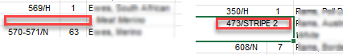
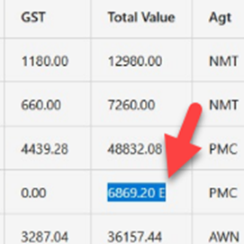
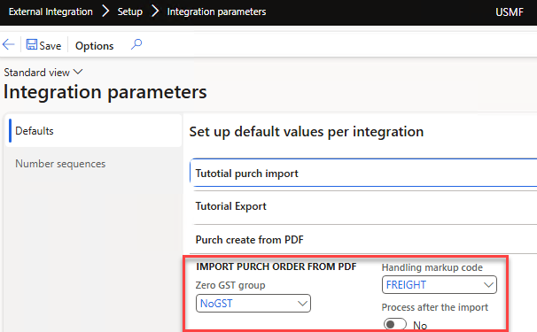
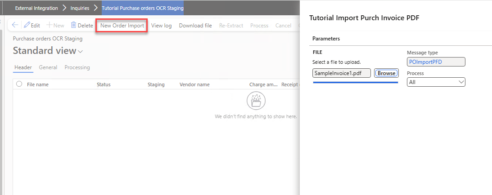
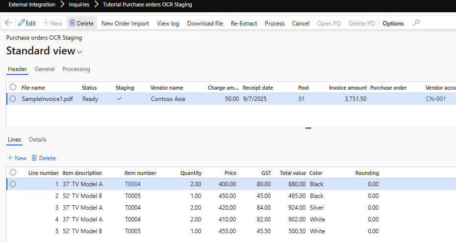
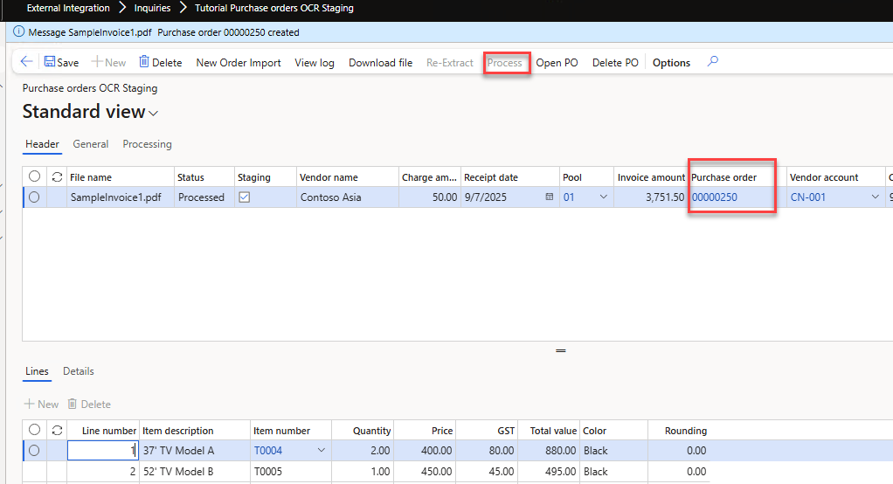
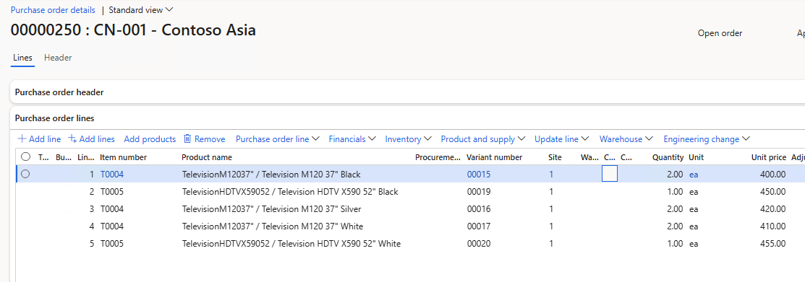

---
title: "D365FO Integration: Import Purchase Orders from PDF using Gemini AI"
date: "2025-09-10T22:12:03.284Z"
tags: ["Integration", "XppDEVTutorial"]
path: "/integration-importpurchpdf"
featuredImage: "./logo.png"
excerpt: "Learn how to use AI to import purchase orders into Dynamics 365 Finance from complex PDF files. This post covers integration design, sample prompts and practical code examples."
---

In this blog post, I'll guide you through the process of using AI to import purchase orders into Dynamics 365 Finance from complex PDF files.

Although the example provided here is simplified to illustrate core integration concepts, the approach and code samples are based on real-world scenarios. This makes them highly adaptable for similar integration tasks you might encounter. We'll utilize the free and open-source External Integration [Framework](https://github.com/TrudAX/XppTools?tab=readme-ov-file#devexternalintegration-submodel), which provides reusable components explicitly designed for building robust integrations in X++.

## Integration Scenario Overview

Let's start by defining our integration scenario:

**Goal: The customer receives complex invoice documents from external vendors as PDF files. We want to create Purchase orders in D365FO based on these documents. **

## Current solution on the market

Before approaching this task, I did some research on the various options.

### PDF to Excel converters

There are numerous online services, such as https://studio.convertapi.com/pdf-to-excel and https://www.ilovepdf.com/pdf_to_excel, that claim to extract tables from invoice documents. The idea was that the user converts the PFD to Excel template and then uploads it to D365FO.

However, after initial testing, they all generate many errors for line sections, e.g. empty cells if a description has two lines or some combined cells, where the columns should be different etc.



### Invoice capture solution

The invoice [capture solution](https://learn.microsoft.com/en-us/dynamics365/finance/accounts-payable/invoice-capture-overview) is a standard option for Microsoft Dynamics 365 for Finance and Operations (D365FO). It is based on the Power Platform and utilises Optical Character Recognition (OCR) technology to parse invoices. I tried to research it and  found the following:

- The installation document is 65 pages long, and you need to be an administrator of "everything" even to try it.
- Based on the Power Platform, a limited extension story
- The Yammer group is full of questions, such as why something is incorrectly parsed on page 2 without clear responses.

As this invoice capture is probably based on some Azure services, I tried Microsoft AI Foundry [Document intelligence](https://azure.microsoft.com/en-us/products/ai-services/ai-document-intelligence/#Pricing-5) directly in Azure, and the result was not perfect even on first sample (e.g. see below)



The advantage of OCR is that it provides a direct link between the image and the parsed data and it is pretty fast. However, after initial research, I decided not to spend time on this.

### Use AI models

We currently live in an AI world, and many current models may work with files. The idea was to use model to read the document and output it as a JSON structure. Then, use the External Integration Framework (which can work with [JSON data](https://denistrunin.com/xpptools-integservbussalesjson/)) to create the required D365FO documents. 

I tried a couple of models and got the best results with Gemini [Flash](https://deepmind.google/models/gemini/flash/) 2.5. Flash is probably one of the fastest currently on the market, and performance is really important, e.g., an Invoice with 200 lines(4-5 pages) takes around 2 minutes to read. 

After some "vibe coding" with Claude code for a prototype, I decided to extend the External Integration Framework with "Get data from AI" option. Below will be a description of how to set up and use it.

*Note: This is a recent Power App [Sales Order Agent](https://github.com/microsoft/Dynamics-365-FastTrack-Implementation-Assets/tree/master/AI%20ERP%20Agents/Sales%20Order%20Agent#configuration-wizard) from Microsoft that implements a similar concept of processing documents by defining custom prompts and then utilising virtual data entities. However, the customisation option is not clear(probably not even possible)*.

## External integration AI solution setup

In this section, we discuss how to set up AI for PDF import.

### AI Providers

We may have multiple providers that provide an API for AI. To define a provider, an "AI Providers" form may be used.

Provider is a class that extends a [DEVIntegAIProviderBase](https://github.com/TrudAX/XppTools/blob/master/DEVTutorial/DEVExternalIntegration/AxClass/DEVIntegAIProviderBase.xml) class and defines the following:

- A set of parameters with default values that the user may override
- Free text description of how to setup this provider
- Connection reference that defines an endpoint and API key value
- A method that implements a call to this AI provider


In the current implementation, we can use only one [Gemini](https://github.com/TrudAX/XppTools/blob/master/DEVTutorial/DEVExternalIntegration/AxClass/DEVIntegAIProviderGemini.xml) class, but it may be extended later.

### Connection type

To store an API key, we need to create a connection type. Google Gemini endpoint is the following: https://generativelanguage.googleapis.com/v1beta/models/.

To obtain the key, log in to https://aistudio.google.com and click the "Get API Key" button. The price will be a fraction of a cent per 1 page.


Enter these values in the Connection form. 


Also, we need to create a Manual connection for our inbound message.

### AI Prompt Definition

After setting up the connection, we need to define a prompt. "AI Prompt Definition" form allows defining and validating the used prompt.

Initially, let's validate that the connection is working by providing a sample "Hi" prompt. "Call API" button runs this prompt, displays a response and some related statistics.


Then we need to define a prompt for our invoice parsing and test it on sample invoices.


A sample prompt used here 

```json
You are an expert at extracting structured data from multi-page PDF invoices. Your task is to process the entire document and produce a single, valid JSON object.
The JSON object must have two top-level keys: HEADER and LINES.
    HEADER: A single JSON object containing summary information from the invoice.
    LINES: A JSON array of objects, where each object represents a single purchased item.
Extraction Rules for HEADER:
    VendorName: This is printed on the first page header before or after the "Tax Invoice" label after "Vendor:" label. 
    ReceiptDate: Find the "Delivery date" date on the first page. Convert this to a "yyyy-MM-DD" format.
    PurchPoolId: Extract the value located directly below the "Delivery date" date on the first page. 
    ChargeValue: At the end of the document, there is a line that states "Handling fee". Get the value from it, the data type should be real, if not found 0.
    InvoiceTotalAmount: On the final page, find the line "Grand Total". Extract the final numeric total. The data type must be a number.
    InvoiceTotalQty: On the final page, find the line "Total Quantity". The data type must be a number.

Extraction Rules for LINES:
Each object in the LINES array represents a single invoice item and must contain the following fields. IMPORTANT: Do not include summary or Total by lines as items in this array.
    InvoiceItem: Take from the "Description" column.
    ItemId: Check the "Description" column. If this is 37' TV, then use "T0004", if 52'TV, use "T0005"
    Quantity: Take the numeric value from the "Qty" column.
    Price: Take the numeric value from the "Unit Price" column.
    GST: Take the numeric value from the "Tax Amount" column.
    TotalValue: Take the numeric value from the "Amount" column.
    Color: This value is determined by grouping. The invoice items are separated into sections by summary lines like "Total by color Black", "Total by color Silver".
        First, identify these summary lines throughout the document.
        All regular item lines that appear before a specific summary line (e.g., "Total by color Black") belong to that group.
        The Color for all items in that group should be the code from the description (e.g., for "Total by color Black", the Color is "Black"; for "Total by color Silver", the Color is "Silver"). Apply this logic consistently across all pages.

Output ONLY the raw JSON. DO NOT INCLUDE any other text, explanations, or markdown formatting.
```

If you notice that the abilities are quite powerful, we can utilise AI to implement a simple mapping, e.g. in this case, to convert from "InvoiceItem" to "ItemId" I defined a couple of rules. Also, to define a "Color" value for each line, we used quite a complex logic to get it from the Total group. 

However, if the mapping requires comparing numbers(e.g. greater, lower), Flash 2.5 fails; in this case, you need to add all required data to the output and implement logic in X++.   


Output for the invoice above will be the following:

```json
{
  "HEADER": {
    "VendorName": "Contoso Asia",
    "ReceiptDate": "2025-09-07",
    "PurchPoolId": "01",
    "ChargeValue": 50.00,
    "InvoiceTotalAmount": 3751.50,
    "InvoiceTotalQty": 8
  },
  "LINES": [
    {
      "InvoiceItem": "37' TV Model A",
      "ItemId": "T0004",
      "Quantity": 2,
      "Price": 400.00,
      "GST": 80.00,
      "TotalValue": 880.00,
      "Color": "Black"
    },
    {
      "InvoiceItem": "52' TV Model B",
      "ItemId": "T0005",
      "Quantity": 1,
      "Price": 450.00,
      "GST": 45.00,
      "TotalValue": 495.00,
      "Color": "Black"
    },
    {
      "InvoiceItem": "37' TV Model A",
      "ItemId": "T0004",
      "Quantity": 2,
      "Price": 420.00,
      "GST": 84.00,
      "TotalValue": 924.00,
      "Color": "Silver"
    },
```

This output will be used as an initial data for the processing class 

### Inbound message type 

To setup processing we need to create a new Inbound message type with a processing class  [DEVIntegTutorialPurchOrderOCRProcess](https://github.com/TrudAX/XppTools/blob/master/DEVTutorial/DEVExternalIntegrationSamples/AxClass/DEVIntegTutorialPurchOrderOCRProcess.xml) that reads the JSON from the AI call and creates a "Purch order" based on it.


As a custom parameter, this class require a link to the previously defined prompt.

### Operation parameters

We also need some custom parameters. If you import documents, you probably need to define rules for Tax calculation. There are usually two options: either take the value from the document (and then use the line 'Tax adjustment') or calculate it directly in D365FO. This requires defining a Zero Tax group. 



## Main modification usage

After specifying all settings, we can finally test the import. Open "Tutorial Purchase orders OCR Staging" and press "New order import"



System analyse the provided PDF and creates staging data



The next step should be a validation. AI models may hallucinate, and it is crucial to establish proper validation.

In our case, we have three validation points: 

- The total quantity of all lines should match the Total quantity from the invoice
- The total amount of all lines plus "Charge amount" should match the "Total amount" from the Invoice.
- For each line, Quantity*Price+GST should match the line value (Rounding field should be 0)


We can also edit every field from the staging tables if needed. After validation, press Process to create a purchase order. It will be created, and the staging data reference will be updated (so you can always trace an individual order to the original PDF file).



From this form we can also view the created order using "Open PO" button.



## Resources for This Blog Post

All resources mentioned in this blog post are available on [GitHub](https://github.com/TrudAX/XppTools/tree/master/DEVTutorial/DEVExternalIntegrationSamples). Let's briefly review what's included and how you can use these resources as a starting point for your integration projects.


The main components are:

1. Tables and a form to manage staging data.
2. A **Processing class**, [DEVIntegTutorialPurchOrderOCRProcess](https://github.com/TrudAX/XppTools/blob/master/DEVTutorial/DEVExternalIntegrationSamples/AxClass/DEVIntegTutorialPurchOrderOCRProcess.xml), which contains the logic for parsing JSON data from AI, saving it to staging tables and creating a purchase order based on it.
3. A class for a "**New order import**" dialog, [DEVIntegTutorialPurchOrderOCRManualImport](https://github.com/TrudAX/XppTools/blob/master/DEVTutorial/DEVExternalIntegrationSamples/AxClass/DEVIntegTutorialPurchOrderOCRManualImport.xml). In the current case, it is empty, but it may be extended to handle parameters in addition to the provided file.

Once these components are set up, the [External Integration](https://github.com/TrudAX/XppTools/tree/master?tab=readme-ov-file#devexternalintegration-submodel) framework will automatically handle the remaining integration process. The solution uses only X++ code, without any external DLLs.

## Summary

In this post, I've explained how to use the power of AI to implement a complex PDF document import into Dynamics 365 Finance and Operations using the **External Integration** framework. We covered these key topics:

- How to setup an AI prompt and test it.
- Examples of processing data from AI and creating purchase orders in Dynamics 365 Finance and Operations.
- How to validate the results and create a document.

I hope you found this information helpful. If you have any questions, suggestions, or improvements, please feel free to reach out.
