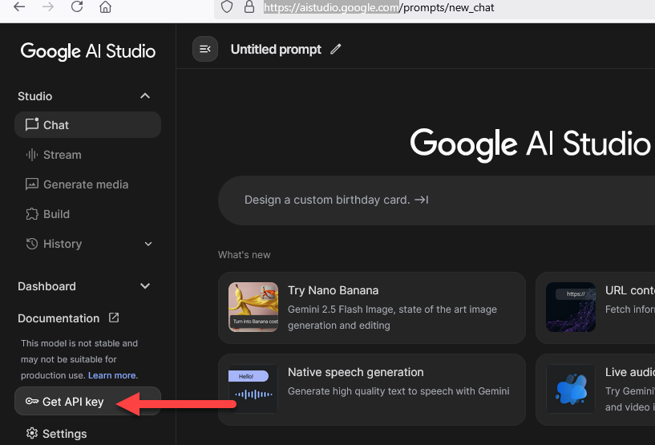
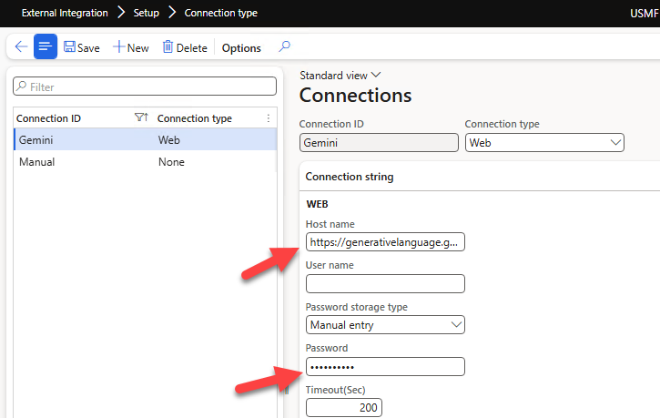
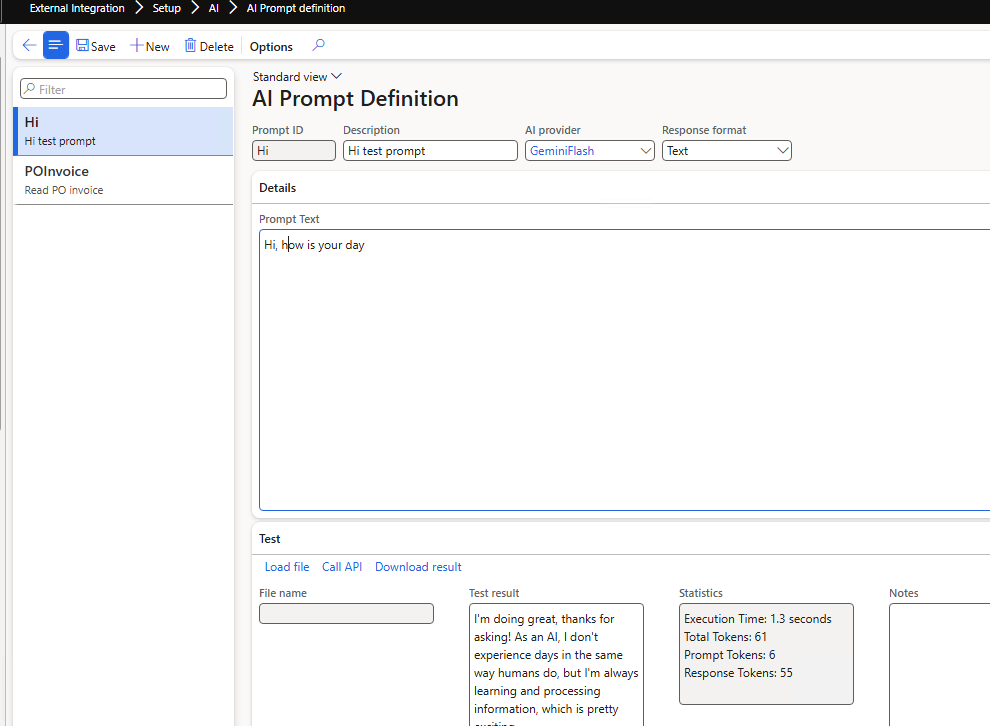
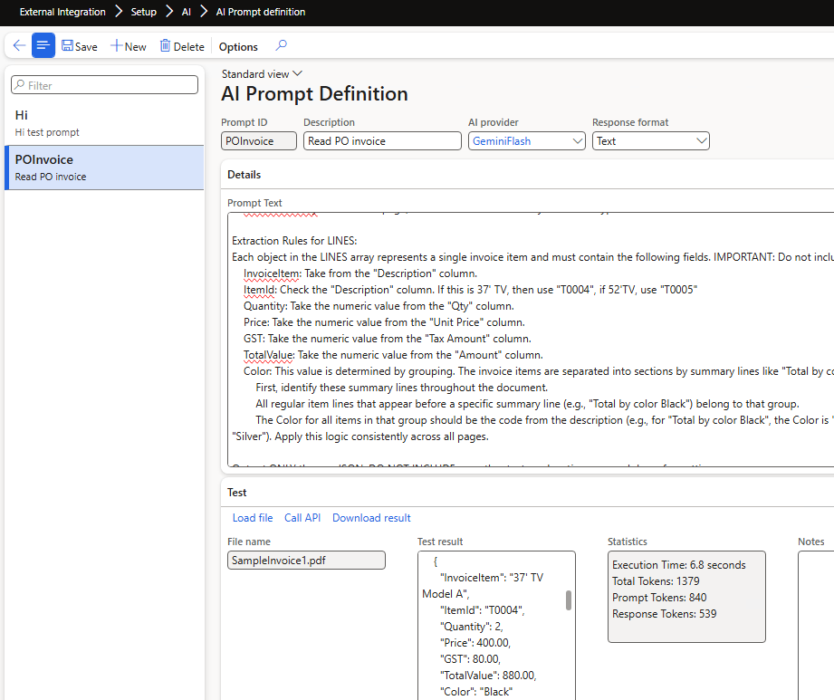
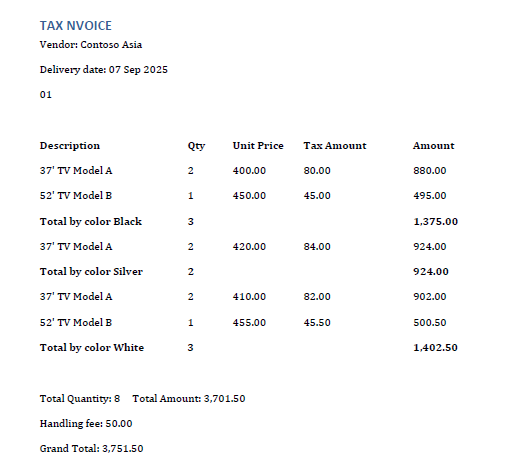
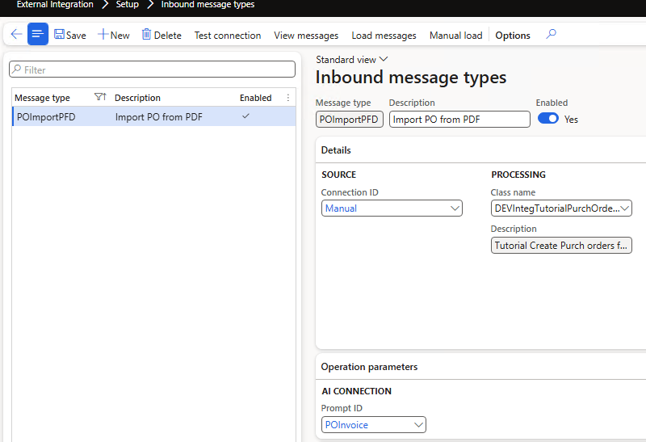
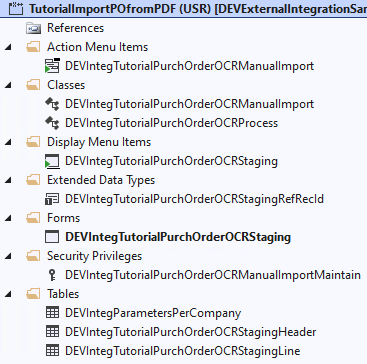

---
title: "D365FO Integration: Import Purch orders from PDF using Gemini AI"
date: "2025-03-12T22:12:03.284Z"
tags: ["Integration", "XppDEVTutorial"]
path: "/integration-inboundwebsales"
featuredImage: "./logo.png"
excerpt: "Learn how to implement robust and efficient process to import complex documents into Dynamics 365 Finance and Operations from external Web services. This post covers integration design, practical code examples and troubleshooting strategies."
---

In this blog post, I'll walk you through the process of importing sales orders into Dynamics 365 Finance from an external web service using REST API calls.

Although the example provided here is simplified to illustrate core integration concepts, the approach and code samples are based on real-world scenarios. This makes them highly adaptable for similar integration tasks you might encounter. We'll utilize the free and open-source External Integration [Framework](https://github.com/TrudAX/XppTools?tab=readme-ov-file#devexternalintegration-submodel), which provides reusable components explicitly designed for building robust integrations in X++.

## Integration Scenario Overview

Let's start by defining our integration scenario:

**Goal: Design and implement an integration solution that imports sales orders into Dynamics 365 Finance from a partner's website via a REST API endpoint.**


### Sales Order Agent

This is a recent Power App [solution](https://github.com/microsoft/Dynamics-365-FastTrack-Implementation-Assets/tree/master/AI%20ERP%20Agents/Sales%20Order%20Agent#configuration-wizard) from Microsoft that implements similar concept of processing documents by defining custom prompts and then using virtual data entities to . Howewer the customization option is not clear 


## Solution setup

### AI Providers

We may have multiple providers that provide an API for AI. To define a provider, an "AI Providers" form may be used.

Provider is a class that extends a [DEVIntegAIProviderBase](https://github.com/TrudAX/XppTools/blob/master/DEVTutorial/DEVExternalIntegration/AxClass/DEVIntegAIProviderBase.xml) class and defines the following:

- Set of parameters with default values that the user may override
- Free text description of how to setup this provider
- Connection reference that defines an endpoint and API key value
- A method that implements a call to this AI provider


In the current implementation, we can use only one [Gemini](https://github.com/TrudAX/XppTools/blob/master/DEVTutorial/DEVExternalIntegration/AxClass/DEVIntegAIProviderGemini.xml) class, but it may be extended later.

### Connection type

To store an API key we need to create a connection type

Google Gemini endpoint: https://generativelanguage.googleapis.com/v1beta/models/

To get the key, login to https://aistudio.google.com and press "Get API Key" button. The price will be a fraction of a cent per 1 page.



Enter these values in the Connection form. 



Also we need to create a Manual connection for our inbound message.

### AI Prompt Definition

After setting up the connection, we need to define a prompt. "AI Prompt Definition" allows defining and validating the used prompt.

Initially, let's validate that connection is working by providing a sample "Hi" prompt. "Call API" button runs this prompt, display a response and some related statistics.



Then we need to define a prompt for our invoice parsing and test it on sample invoices.



A sample prompt used here 

```json
You are an expert at extracting structured data from multi-page PDF invoices. Your task is to process the entire document and produce a single, valid JSON object.
The JSON object must have two top-level keys: HEADER and LINES.
    HEADER: A single JSON object containing summary information from the invoice.
    LINES: A JSON array of objects, where each object represents a single purchased item.
Extraction Rules for HEADER:
    VendorName: This is printed on the first page header before or after the "Tax Invoice" label after "Vendor:" label. 
    ReceiptDate: Find the "Delivery date" date on the first page. Convert this to a "yyyy-MM-DD" format.
    PurchPoolId: Extract the value located directly below the "Delivery date" date on the first page. 
    ChargeValue: At the end of the document, there is a line that states "Handling fee". Get the value from it, the data type should be real, if not found 0.
    InvoiceTotalAmount: On the final page, find the line "Grand Total". Extract the final numeric total. The data type must be a number.
    InvoiceTotalQty: On the final page, find the line "Total Quantity". The data type must be a number.

Extraction Rules for LINES:
Each object in the LINES array represents a single invoice item and must contain the following fields. IMPORTANT: Do not include summary or Total by lines as items in this array.
    InvoiceItem: Take from the "Description" column.
    ItemId: Check the "Description" column. If this is 37' TV, then use "T0004", if 52'TV, use "T0005"
    Quantity: Take the numeric value from the "Qty" column.
    Price: Take the numeric value from the "Unit Price" column.
    GST: Take the numeric value from the "Tax Amount" column.
    TotalValue: Take the numeric value from the "Amount" column.
    Color: This value is determined by grouping. The invoice items are separated into sections by summary lines like "Total by color Black", "Total by color Silver".
        First, identify these summary lines throughout the document.
        All regular item lines that appear before a specific summary line (e.g., "Total by color Black") belong to that group.
        The Color for all items in that group should be the code from the description (e.g., for "Total by color Black", the Color is "Black"; for "Total by color Silver", the Color is "Silver"). Apply this logic consistently across all pages.

Output ONLY the raw JSON. DO NOT INCLUDE any other text, explanations, or markdown formatting.
```

If you notice that the abilities are quite powerful, we can utilise AI to implement a simple mapping, in this case, to convert from "InvoiceItem" to "ItemId" I defined a couple of rules. Also, to define a "Color" value for each line, we used quite a complex logic to get it from the Total group. 

However, if the mapping requires comparing numbers(e.g. greater, lower), Flash 2.5 fails; in this case, you need to add all required data to the output and implement logic in X++.   



Output for the invoice above will be the following:

```json
{
  "HEADER": {
    "VendorName": "Contoso Asia",
    "ReceiptDate": "2025-09-07",
    "PurchPoolId": "01",
    "ChargeValue": 50.00,
    "InvoiceTotalAmount": 3751.50,
    "InvoiceTotalQty": 8
  },
  "LINES": [
    {
      "InvoiceItem": "37' TV Model A",
      "ItemId": "T0004",
      "Quantity": 2,
      "Price": 400.00,
      "GST": 80.00,
      "TotalValue": 880.00,
      "Color": "Black"
    },
    {
      "InvoiceItem": "52' TV Model B",
      "ItemId": "T0005",
      "Quantity": 1,
      "Price": 450.00,
      "GST": 45.00,
      "TotalValue": 495.00,
      "Color": "Black"
    },
    {
      "InvoiceItem": "37' TV Model A",
      "ItemId": "T0004",
      "Quantity": 2,
      "Price": 420.00,
      "GST": 84.00,
      "TotalValue": 924.00,
      "Color": "Silver"
    },
```

This output will be used as an initial data for the processing class 

Inbound message type 

To setup processing we need to create a new Inbound message type with a processing class  [DEVIntegTutorialPurchOrderOCRProcess](https://github.com/TrudAX/XppTools/blob/master/DEVTutorial/DEVExternalIntegrationSamples/AxClass/DEVIntegTutorialPurchOrderOCRProcess.xml) that reads the JSON from the AI call and creates Purch order based on it.



As a custom parameter, this class require a link to the previously defined prompt.


## Resources for This Blog Post

All resources mentioned in this blog post are available on [GitHub](https://github.com/TrudAX/XppTools/tree/master/DEVTutorial/DEVExternalIntegrationSamples). Let's briefly review what's included and how you can use these resources as a starting point for your integration projects.



The main components are:

1. A **Load class**, similar to [DEVIntegTutorialWebSalesLoad](https://github.com/TrudAX/XppTools/blob/master/DEVTutorial/DEVExternalIntegrationSamples/AxClass/DEVIntegTutorialWebSalesLoad.xml), which connects to a custom API.
2. A **Processing class**, [DEVIntegTutorialWebSalesProcess](https://github.com/TrudAX/XppTools/blob/master/DEVTutorial/DEVExternalIntegrationSamples/AxClass/DEVIntegTutorialWebSalesProcess.xml), which contains the logic for processing incoming data.
3. Tables and forms to manage staging data.
4. A mapping extension to implement mapping between Web application and Dynamics 365 Finance and Operations.

Once these components are set up, the External Integration framework will automatically handle the rest of the integration process.


## Summary

In this post, I've explained how to implement a complex document integration from a REST API web service into Dynamics 365 Finance and Operations using the **External Integration** framework. We covered these key topics:

- Designing an integration solution.
- Examples of querying a Web application and creating sales orders in Dynamics 365 Finance and Operations.
- Monitoring and troubleshooting common integration issues.

I hope you found this information helpful. If you have any questions, suggestions, or improvements, please feel free to reach out.
