---
title: "D365FO Integration: Import Sales orders from External Web Application"
date: "2025-03-07T22:12:03.284Z"
tags: ["Integration", "XppDEVTutorial"]
path: "/integration-inboundwebsales"
featuredImage: "./logo.png"
excerpt: "How to implement robust, efficient integrations between Dynamics 365 Finance and Operations and external Web Services. This post covers design, code samples, troubleshooting and performance testing techniques for seamless event-based data synchronization."
---

In this blog post, I will describe how to import sales orders to Dynamics 365 Finance from the Web service using a REST API call. 

While a simplified example illustrates the core concepts, the approach and code samples are rooted in real-world integration scenarios, making them easily adaptable for similar tasks. We'll leverage a free and open-source the External integration [framework](https://github.com/TrudAX/XppTools?tab=readme-ov-file#devexternalintegration-submodel), offering reusable components for building robust X++ integrations. 

## Modification description

Let's begin with our task sample definition:

**Goal: Design and develop a Dynamics 365 Finance integration solution that imports sales orders into D365FO from a partner website via REST API endpoint.**

To illustrate this process, I will use the Purchase Order Management application created in the previous [post](https://denistrunin.com/integration-outboundweb/), which provides an API to retrieve the created orders. The example is simplified, but you can find a similar API in other systems(e.g. [Shopify](https://shopify.dev/docs/api/admin-rest/2025-01/resources/order#get-orders?status=any))

The source code is available on [GitHub](https://github.com/TrudAX/TestWebService_PurchaseOrderApp). The application comprises two main components:

1. A frontend for displaying orders:

2. A backend that includes an API for getting created orders:

API requires the **UpdatedAt** date parameter and returns all orders that were created/updated after the specified date. Our task is load these orders into D365FO.

## Planning and Scoping Integration Project

To initiate an integration project like this, I recommend organizing a kickoff meeting with key stakeholders from both the D365FO team and the Web Application provider (third-party team). During this meeting, address the following aspects:

### Define Web endpoint and parameters

Usually Web Applications has well defined endpoint that may accept several parameters and return some data.

In our case it will be an API that returns modified orders after the specified date (**updatedAt** parameter)

https://purchaseorderapp20240916.azurewebsites.net/api/PurchaseOrder?updatedAt=2025-02-07T16:00:00Z

Discuss what authentication should be used, a typical scenario here a token based approach.

### Confirm what documents are returned

At this stage, it is crucial to obtain written confirmation that the API will return only documents relevant to D365FO based on the specified parameters. In some projects, the integration point returned internal documents(e.g. some orders to locations not in D365FO, some internal transfers etc..), making it difficult to determine their relevance to D365FO. Addressing this issue early on can prevent significant challenges later.

### Define Rules for Handling Updated Documents

It's common for documents to be modified after they've been initially retrieved via the API. When this occurs, the **updatedAt** timestamp will change, but the document **ID** remains the same. It's important to clearly define the business scenarios under which these updates happen and understand their frequency. Ideally, such updates should be rare or avoided altogether, but practical considerations may necessitate handling them.

To manage this effectively, consider requesting the Web Application team to implement a clear status indicator that shows when a document has already been exposed via the API. This ensures that any subsequent modifications are intentional and controlled. For example, users might initially create an order, add necessary lines, and then explicitly mark it as "Confirmed" or "Completed." Only after this action the order become available through the API.

On the Dynamics 365 Finance side, you must establish clear rules for processing updated documents. For sales orders, common approaches include reversing or deleting the original order and creating a new one. Keep in mind that reversing transactions can introduce complexities, e.g. the ledger period for the original order be closed. In such cases, you might need to use the nearest available open date or implement alternative business logic to handle these scenarios gracefully.

In this post, I just delete an open order and generate an error if the status is not open.

### Discuss TEST endpoint

Ask about do they have test application and what data it contains. Usually TEST application exists, but it may contain fake data, not relevant to real values. That will become a problem as for D365FO projects we try to use more or less closed to original data, so you will not be able to import these values. In this case some testing should be done using production endpoint.

### Ask for a guide how to create a document from UI

You need to have someone from D365FO team who can generate a document using a User Interface in the external Web Application that later appear in integration(for example create a Sales order that should be passed to D365FO). This is an important step for testing, ask for a training how to do this

### Procedure to resolve mapping error

It is very likely that codes for some entities will require mapping. On what side this mapping will occurs and what is procedure to add new values to this mapping.

In our case I will store the mapping for order account in a separate table

### Create a Data Mapping document

Mapping documents is a key integration document that defines how fields from the Web site API will be mapped to D365FO fields. 

In our case it will look like [this](https://github.com/TrudAX/TRUDScripts/blob/master/Documents/Integration/Field%20Mapping%20Sample.xlsx):

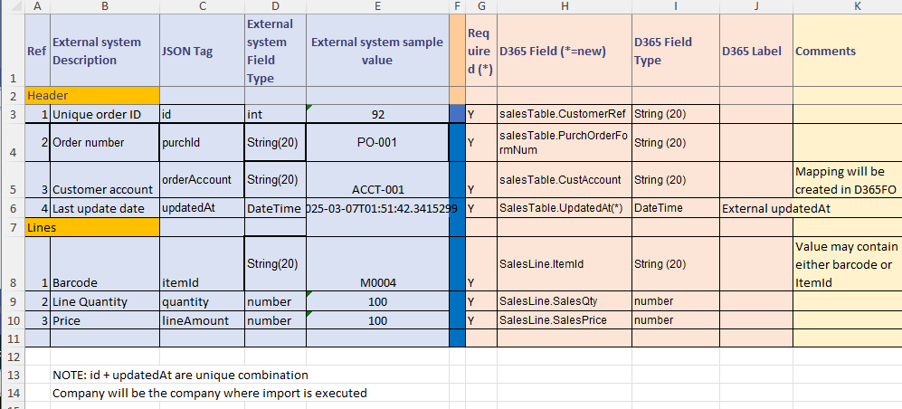

## High level design description

Implementing web call processing is slightly different from other integration methods, as one web service call may return multiple not linked orders, but our aim is still to have full traceability from individual orders to the original web request. To handle this the concept of parent message was introduced on the message field. The following processing logic was implemented:

- Load class make a request to a webservice with the current message **UpdatedAt** date

- The result of the call creates a Parent message at attach JSON to this message and runs a processing of this message

- To process a parent message we need to parse the attached JSON and create multiple child messages with attached parsed data(one message per order, as stading table data). Also perform some basic actions based on unique fields, for example delete previously messages with Error status with the same ID. This is done as one transaction and in a single thread.
- If parent message processing is successful, we update a message **UpdatedAt** date to a new value(or if paging is used, update to a next page)

- Then for all child messages a separate batch task created that may work in multithreaded mode that based on the staging data create final D365FO documents. Errors on this stage do not influence on the parent document

## Setting Up Integration

Let's walk through the process of setting up and validating our integration solution.

### Configuring Connection Types

First, we need to set up the connection to our web service. Navigate to the **External integration – Connection types**.

To setup integration we need to define Connection to our web application 

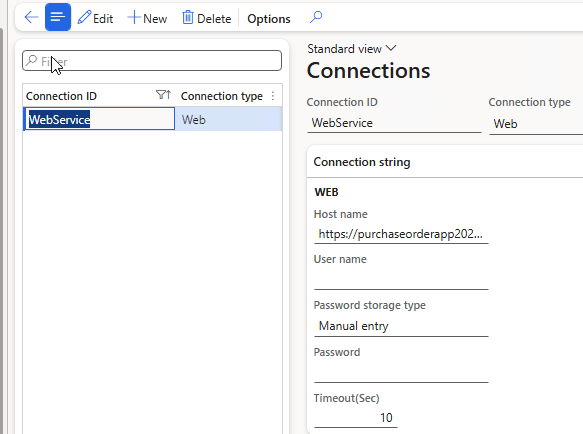

We specify a link to our application(https://purchaseorderapp20240916.azurewebsites.net/), timeout and credentials details. The system offers several options for storing passwords:

1. **Manual entry**: An unencrypted string, suitable for development. It will persist even after database restores.
2. **Encrypted**: A secure option that encrypts the password value.
3. **Azure Key Vault**: Links to the standard D365FO key vault for the most secure password storage.

### Defining Inbound Message Types

Next, we'll configure the parameters for our import in the **Inbound message types** form.

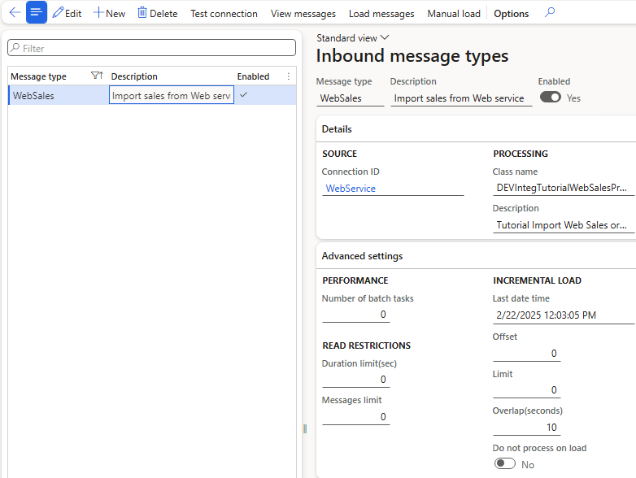

This form defines the following key components: 

**CONNECTION DETAILS** 

Link to a previously created Connection and to the processing class **DEVIntegTutorialWebSalesProcess**

**INCREMENTAL LOAD**

- **Last date time**: Indicates the date-time to perform the next load. This value(adjusted with Overlap) will be used in the next call  for  **UpdatedAt** parameter. After the load this value will be updated to the current time.
- **Overlap(seconds)**: This is the number of seconds that will be subtracted from the Last date time when doing a request. The purpose of this field is that we are doing a query to some database data, and there will always be a delay between data being written and the transaction being committed. So to cover this, we fetch some existing data
- **Offset**: A current page indication(if paging is used), it will be updated during the load
- **Limit**: A page size, maximum number of returned records (if paging is used).If during a load we get this number of records, the system change Offset parameter to +1 and do not update Last date time
- **Do not process on load**: Set to `No`, meaning messages will be processed upon import/load.

### Mapping setup 

For the real-life integration scenario, you probably need to create a mapping for some fields. The **External Integration** module provides a form and a table to create a mapping for simple cases, and I will show how to use it in this example.

We will map the **Order account** from the Web service to a D365FO **Customer account** for Sales order creation. The setting can be made in External integration—Setup—Mapping setup.  

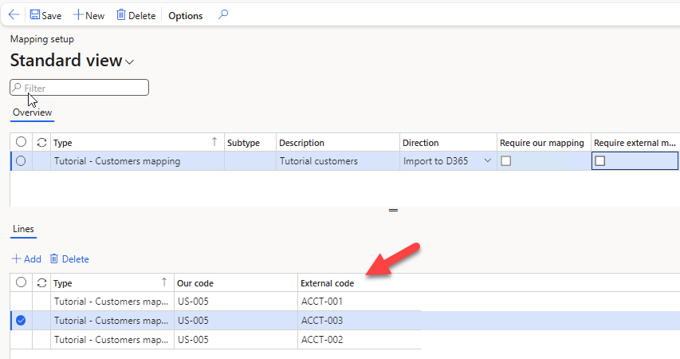

### Generating test data 

We also need to generate some test data, to do this, you can enter 3 or more items(M0001;M0004;M0007) and press "Load initial data". 

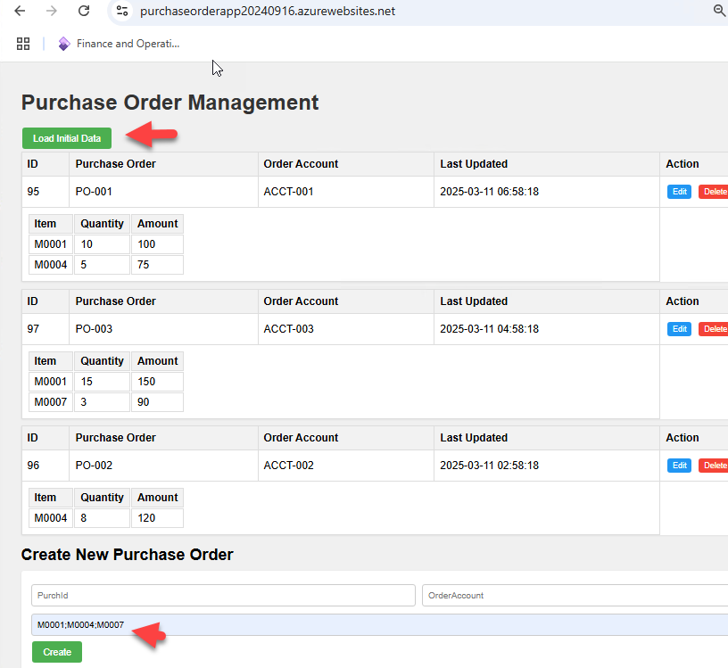

The Web application generates 3 orders that will be available in API

## Run the Integration

After all settings are done we can run a Load messages batch job 

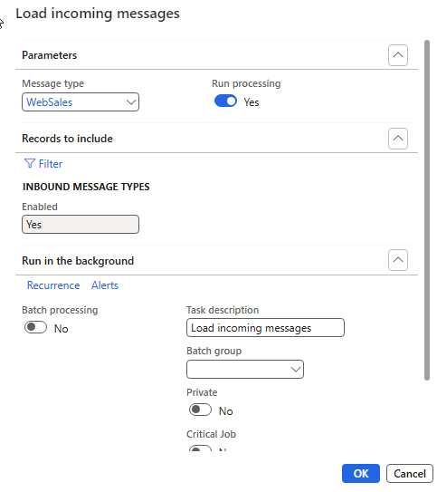

It will execute a processing class linked to the specified message, as the result 4 initial message will be created and processed. The first message will be the main message with the linked API data. 3 other will be a result of processing these data to from a staging data.

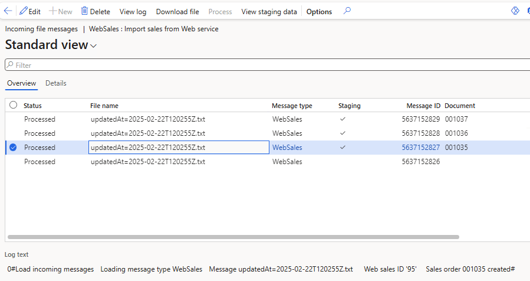

From this form we can view an original data by pressing Download file button, it will return the initial data from the Web application

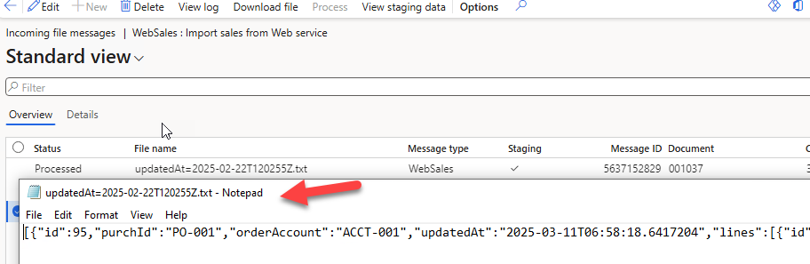

Also we can view the Staging data linked to an individual message

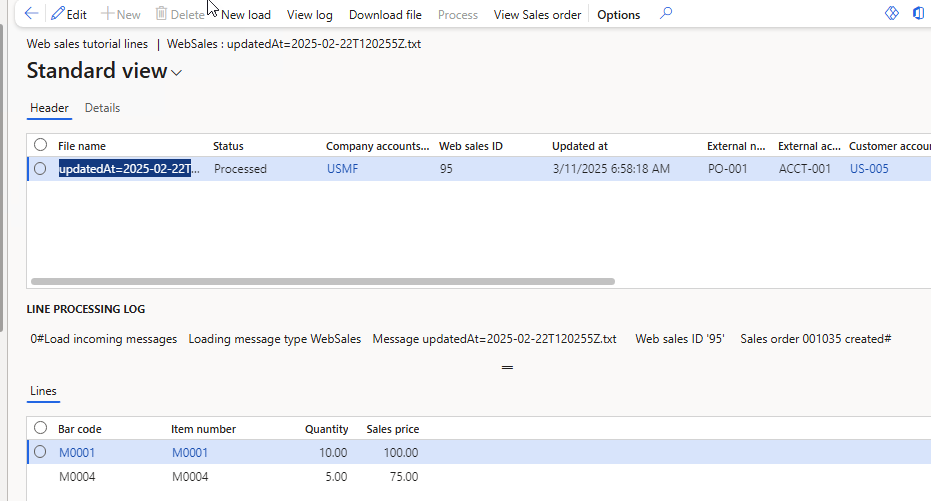

From this form, we can also view infolog for a selected record, reprocess the message or Open a created Sales order.

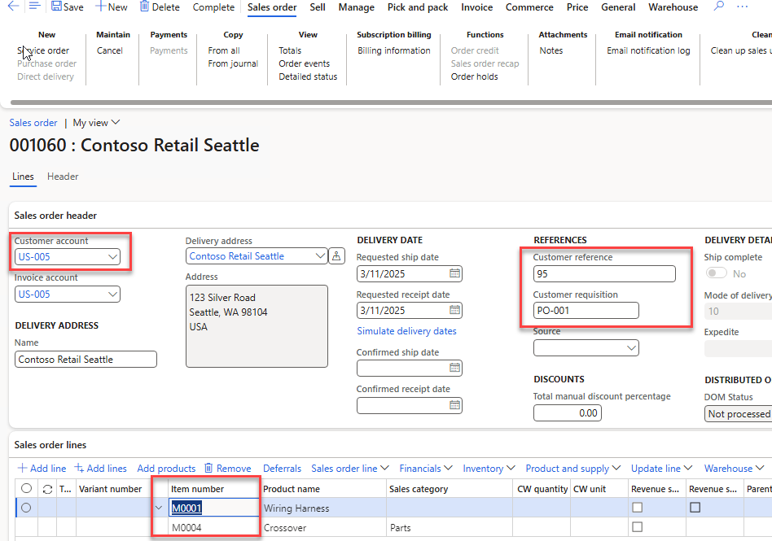

### Run an incremental run 

To test how incremental run works, I will create a new Order in my Web Application(I will use a new account  ACCT-004 that doesn't exists) and edit the previous order 95.

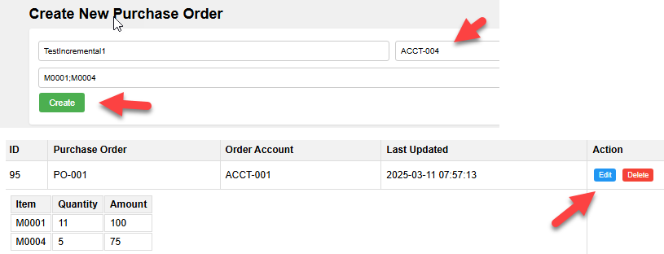

After running **Load messages** again, we see 2 new records in Web staging data, one will be an in Error state (as we don't have mapping setup for this account) and a new record for order 95. System also deletes the previous order 001035 that was linked to the original message

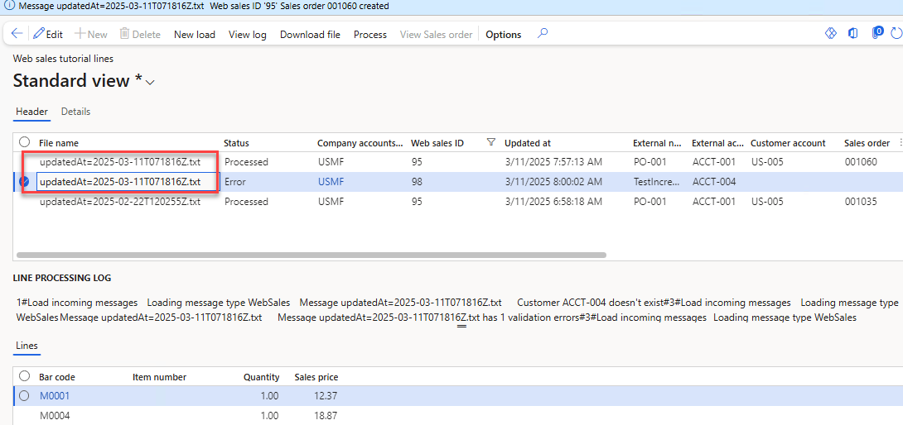

## Monitoring and error processing 

## Resources for This Blog Post

All resources used in this blog are available on [GitHub](https://github.com/TrudAX/XppTools/tree/master/DEVTutorial/DEVExternalIntegrationSamples). Let's take a look at what's included and how you can use these resources for your own integration projects.

To implement your own D365FO integration with a webservice, you'll need to create two main classes:

1. A class similar to [DEVIntegTutorialExportPurchLoad](https://github.com/TrudAX/XppTools/blob/master/DEVTutorial/DEVExternalIntegrationSamples/AxClass/DEVIntegTutorialExportPurchLoad.xml)
   - This class handles the interaction with the custom Webservice(if we use Azure service bus or File share, it is not needed)

2. A class similar to [DEVIntegTutorialExportPurchOrder](https://github.com/TrudAX/XppTools/blob/master/DEVTutorial/DEVExternalIntegrationSamples/AxClass/DEVIntegTutorialExportPurchOrder.xml)
   - This class defines the export document structure.

Additionally, you should create a form for manual testing of these classes, similar to [DEVIntegTutorialTestWebCall](https://github.com/TrudAX/XppTools/blob/master/DEVTutorial/DEVExternalIntegrationSamples/AxForm/DEVIntegTutorialTestWebCall.xml).

Once these components are in place, the External integration framework will handle all other aspects of the integration process.

### Sample Web App

For testing purposes, I've set up a sample web app. At the time of publishing this post, it is deployed at the following address: [https://purchaseorderapp20240916.azurewebsites.net/](https://purchaseorderapp20240916.azurewebsites.net/)

The source code for this test web service is also available on [GitHub] (https://github.com/TrudAX/TestWebService_PurchaseOrderApp)

## Summary

In this post, I have described how to implement event-based exports from Dynamics 365 Finance and Operations to Web Service using the **External Integration** framework. We discussed the following key topics:

- How to design such integration 
- Sample implementations of how to call a web service and how to create a document class
- How to monitor typical issues with such integration 
- How to perform performance testing

I hope you find this information useful. As always, if you see any improvements or suggestions or have questions about this work, don't hesitate to contact me.
