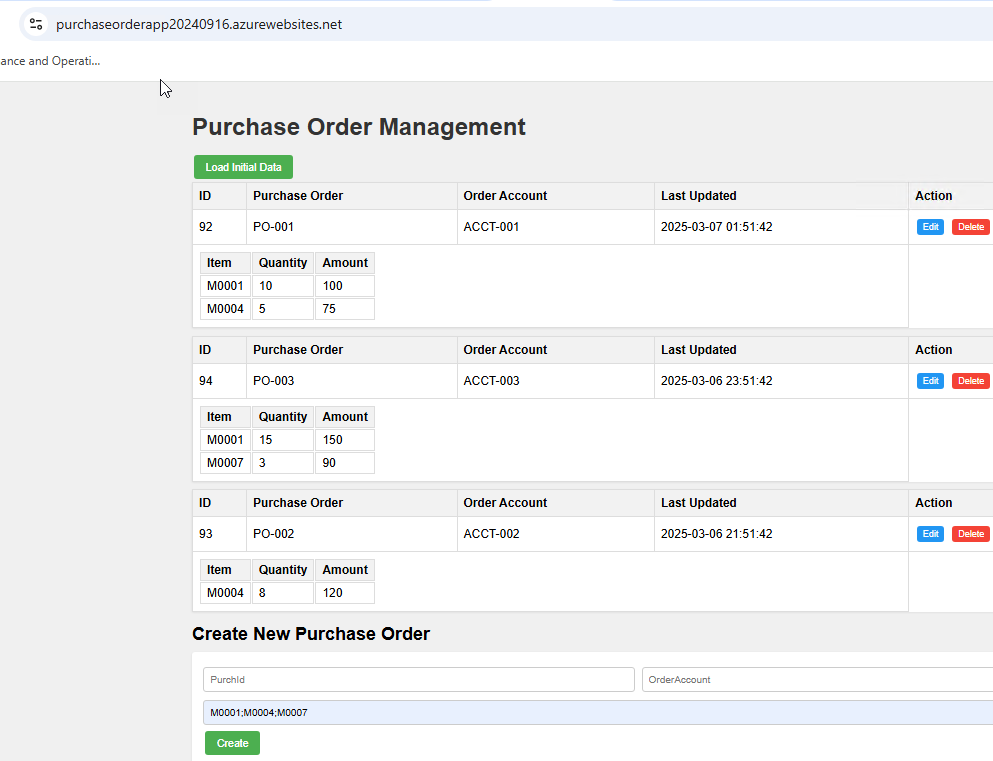
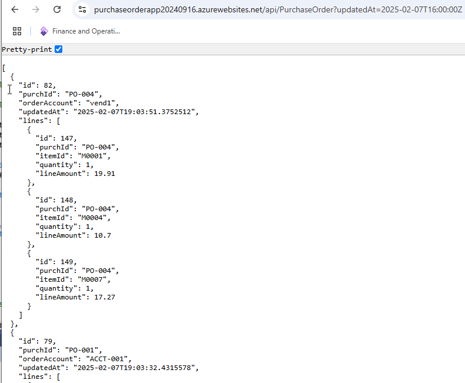
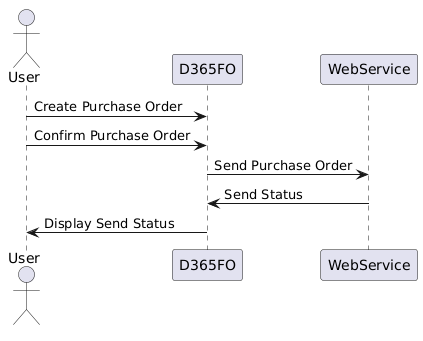
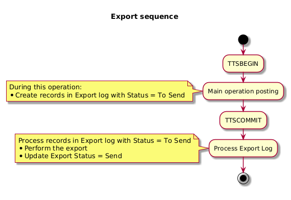
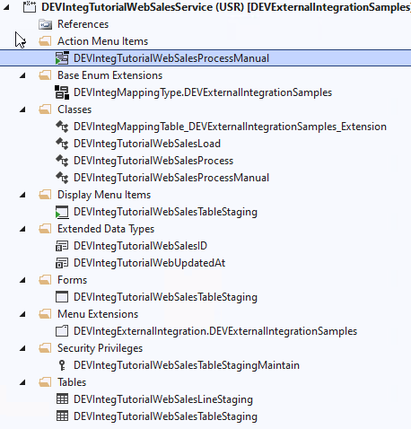

---
title: "D365FO Integration: Import Sales orders from External Web Application"
date: "2025-03-07T22:12:03.284Z"
tags: ["Integration", "XppDEVTutorial"]
path: "/integration-inboundwebsales"
featuredImage: "./logo.png"
excerpt: "How to implement robust, efficient integrations between Dynamics 365 Finance and Operations and external Web Services. This post covers design, code samples, troubleshooting and performance testing techniques for seamless event-based data synchronization."
---

In this blog post, I will describe how to implement event-based data export from Dynamics 365 Finance to the Web service using REST API call. 

While a simplified example illustrates the core concepts, the approach and code samples are rooted in real-world integration scenarios, making them easily adaptable for similar tasks. We'll leverage a free and open-source External integration [framework](https://github.com/TrudAX/XppTools?tab=readme-ov-file#devexternalintegration-submodel), offering reusable components for building robust integrations. 

## Modification description

Let's begin with our task sample definition:

**Goal: Design and develop a Dynamics 365 Finance integration solution that automatically sends confirmed purchase orders from D365FO to a partner website via REST API endpoint.**

To illustrate this process, I utilized Claude Sonnet 3.5 to generate a simple Purchase Order Management application and deploy it to Azure.

The source code is available on [GitHub](https://github.com/TrudAX/TestWebService_PurchaseOrderApp). The application comprises two main components:

1. A frontend for displaying orders:



2. A backend that includes an API for accepting these orders:



In our scenario, we will send confirmed Purchase Orders (POs) from D365FO to this API. The UML diagram below illustrates our test process:



## Planning and Scoping Integration Project

To initiate an integration project like this, I recommend organizing a kickoff meeting with key stakeholders from both the D365FO team and the Web Application provider (third-party team). During this meeting, address the following aspects:

1.Define endpoint and parameters

Usually Web Applications has well defined endpoint that may accept several parameters and return some data.

In our case it will be an API that returns modified orders after the specified date (updatedAt parameter) 

https://purchaseorderapp20240916.azurewebsites.net/api/PurchaseOrder?updatedAt=2025-02-07T16:00:00Z

Discuss what authentication should be used, a typical scenario here a token based approach. 

2.Confirm what documents are returned

On that stage I recommend to get a written confirmation that based on the specified parameters it will return only documents relevant to D365FO. That was the issue on some projects, where integration point returned internal documents and identifying was it related to D365FO or not was quite challenging task, so better to avoid this problem from the start. 

3.Discuss condition for new document version

Documents may be adjusted after they returned via API. In this case updatedAt value will be updated for the same ID. You need to discuss business cases for that and how often it happens. In ideal case this should not happen at all, but this may not be always possible.

Usually Web Application need to implement a status that gives a user clear indication that document have been passed to the API, so Web applicaton user should intentionally modify it. On D365FO side you need to define how to process modified document. For Sales order it may be reversing(or delete) the original order and creating the new one. Reversing also may be tricky as a ledger period for the original order may be closed, in this case a closest open date may be used etc..

In this post I just delete an open order and generate an error if the status is not open.

4.Discuss TEST endpoint 

Ask about do they have test application and what data it contains. Usually TEST application exists, but it may contain fake data, not relevant to real values. That will become a problem as for D365FO projects we try to use more or less closed to original data, so you will not be able to import these values. In this case some testing should be done using production endpoint.

5.Ask for a guide how to create a document from UI

You need to have someone from D365FO team who can generate a document using a User Interface in the external Web Application that later appear in integration(for example create a Sales order that should be passed to D365FO). This is an important step for testing, ask for a training how to do this

6.Procedure to resolve mapping error 

Where to store

In our case I will store the mapping for order account 

it is very 

#### 1. Create a Data Mapping document

Discuss and document what data needs to be sent and how it should be mapped to the third-party system's accepted format. This is a fundamental question for the entire integration and often requires significant time and attention.

A template for this document can be found [here](https://github.com/TrudAX/TRUDScripts/blob/master/Documents/Integration/Field%20Mapping%20Sample.xlsx).

In our example, to simplify the process, we're sending all confirmed purchase orders for vendors from a specified Vendor group without any complex mapping.

#### 2. Reference Data Management

Data exchange often involves 'reference data' such as Item codes or Vendor IDs. Aligning how both systems manage this data is crucial. Let's explore some common scenarios:

- a) Limited data acceptance: The Web service may accept only a predefined set of data. In this case, you might need to create additional tables in D365FO to maintain possible options.

- b) Stable, manually loaded data: When reference data is relatively static, manual updates might suffice. For instance, a user could periodically(e.g. monthly) upload an updated item list to the external system

- c) Frequently changing data: If reference data changes often, you may need to develop a separate integration process to keep it synchronized.

- d) Automatic reference data creation: Some web services can automatically create reference data entries based on the incoming message. In this scenario, ensure all required fields (e.g., Item name, Vendor name) are included in the transmission.

####  3. Error Handling Rules

Establish clear protocols for error handling. Consider these common approaches:

a) Real-time validation: All business logic validations occur during the API call. A successful call indicates the document has been accepted. This is generally the preferred method.

b) Format-only validation: The Web service only checks the message format during the call. If the format is correct, the message is accepted for further processing.

Option (a) requires designating a D365FO team member to respond to integration errors. Ensure this person has a documented support channel with the Web Service support team. For example, how will the returned message "Item AAA can't be purchased" be processed?

Option (b) is more straightforward from the D365FO side, but it creates some challenges. You need to know the document's current status. This may be implemented as another integration(inbound to D365FO).

#### 4. Data Structure and Cardinality

Address potential differences in data structure between systems. For example:

- D365FO might allow multiple lines with the same ItemID in a Purchase Order, while the receiving system may not support this.

Identify these discrepancies early to plan appropriate handling mechanisms.

#### 5. Handling Document Updates

Define how modified documents should be handled. For instance:

- In our case, multiple confirmations can be made for one purchase order. The Web service should be capable of accepting and processing updated versions of previously sent documents.

####  6. API Flexibility

Understand the web service provider's constraints regarding API modifications. Possible scenarios include:

a) Fixed public API: The API is used by multiple clients and cannot be modified.
b) Flexible API: The third-party team can allocate resources to adjust the API for this integration.

If option (b) is possible, establish clear communication channels, developer availability, and bug tracking procedures.

####  7. Batch vs. Real-time Integration

Decide whether document export should occur:

a) Via a batch job (introducing a delay of at least a few minutes), or
b) Immediately after a triggering action (real-time).

This blog post will focus on implementing the more complex real-time integration scenario.

## Implementing the Export Functionality

#### 6. Post-Operation Export Methods

These methods run after the main operation (e.g., purchase order confirmation) to initiate the actual export process. They:
- Execute outside the main transaction, so any failure in export should not block the document posting
- Check for records marked for export
- Trigger the export process for those records

The export sequence is presented on the following diagram:



In our case, we want to check at the end of Purch confirmation whether any export records have been created and, if so, run an export operation for these records. 

```csharp
[PostHandlerFor(classStr(FormletterService), methodStr(FormletterService, postPurchaseOrderConfirmation))]
public static void FormletterService_Post_postPurchaseOrderConfirmation(XppPrePostArgs args)
{
    if (DEVIntegParametersPerCompany::find().POExportOnConfirm != DEVIntegTutorialExportOnConfirm::OnConfirm)
    {
        return;
    }

    PurchFormLetterPurchOrderContract contract = args.getArg('_contract') as PurchFormLetterPurchOrderContract;
    if (contract)
    {
        PurchParmUpdate purchParmUpdate = contract.parmParmUpdate();
        PurchParmTable  purchParmTable;
        PurchTable      purchTable;
        DEVIntegExportDocumentLog  integExportDocumentLog;
        ClassName       exportClass = classStr(DEVIntegTutorialExportPurchOrder);
        DEVIntegExportRecordList  exportRecordList;

        //or if one record - DEVIntegExportRecordList::constructFromRecord()
        while select ParmId from purchParmTable
            where purchParmTable.ParmId == purchParmUpdate.ParmId
        join PurchId from purchTable
            where purchTable.PurchId        == purchParmTable.PurchId 
        join integExportDocumentLog
            where integExportDocumentLog.RefTableId == purchTable.TableId
                && integExportDocumentLog.RefRecId == purchTable.RecId
                && integExportDocumentLog.ClassName == exportClass
        {
            if (! exportRecordList)
            {
                exportRecordList = new DEVIntegExportRecordList();
            }    
            exportRecordList.addExportLog(integExportDocumentLog.recId);
        }
        if (exportRecordList)
        {
            DEVIntegExportDocumentsLog::exportRecordList(exportRecordList);
        }
    }

}
```


## Setting Up and Validating Integration

Let's walk through the process of setting up and validating our integration solution.

### Configuring Connection Types

First, we need to set up the connection to our web service. Navigate to the **External integration – Connection types**.

It requires the hostname(will be https://purchaseorderapp20240916.azurewebsites.net/api/purchaseorder) and allows to set a user/password credentials to access this host(in our example, we're leaving these empty)


The system offers several options for storing passwords:
1. Manual entry: An unencrypted string, suitable for development. It will persist even after database restores.
2. Encrypted: A secure option that encrypts the password value.
3. Azure Key Vault: Links to the standard D365FO key vault for the most secure password storage.

### Defining Outbound Message Types

Next, we'll configure the parameters for our data export in the **Outbound message types** form.


## Resources for This Blog Post

All resources used in this blog are available on [GitHub](https://github.com/TrudAX/XppTools/tree/master/DEVTutorial/DEVExternalIntegrationSamples). Let's take a look at what's included and how you can use these resources for your own integration projects.



To implement your own D365FO integration with a webservice, you'll need to create two main classes:

1. A class similar to [DEVIntegTutorialExportPurchLoad](https://github.com/TrudAX/XppTools/blob/master/DEVTutorial/DEVExternalIntegrationSamples/AxClass/DEVIntegTutorialExportPurchLoad.xml)
   - This class handles the interaction with the custom Webservice(if we use Azure service bus or File share, it is not needed)

2. A class similar to [DEVIntegTutorialExportPurchOrder](https://github.com/TrudAX/XppTools/blob/master/DEVTutorial/DEVExternalIntegrationSamples/AxClass/DEVIntegTutorialExportPurchOrder.xml)
   - This class defines the export document structure.

Additionally, you should create a form for manual testing of these classes, similar to [DEVIntegTutorialTestWebCall](https://github.com/TrudAX/XppTools/blob/master/DEVTutorial/DEVExternalIntegrationSamples/AxForm/DEVIntegTutorialTestWebCall.xml).

Once these components are in place, the External integration framework will handle all other aspects of the integration process.

### Sample Web App

For testing purposes, I've set up a sample web app. At the time of publishing this post, it is deployed at the following address: [https://purchaseorderapp20240916.azurewebsites.net/](https://purchaseorderapp20240916.azurewebsites.net/)

The source code for this test web service is also available on [GitHub] (https://github.com/TrudAX/TestWebService_PurchaseOrderApp)

## Summary

In this post, I have described how to implement event-based exports from Dynamics 365 Finance and Operations to Web Service using the **External Integration** framework. We discussed the following key topics:

- How to design such integration 
- Sample implementations of how to call a web service and how to create a document class
- How to monitor typical issues with such integration 
- How to perform performance testing

I hope you find this information useful. As always, if you see any improvements or suggestions or have questions about this work, don't hesitate to contact me.
