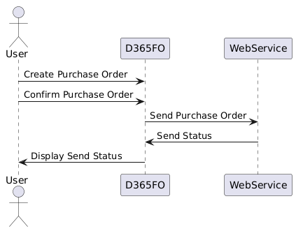

In this blog post, I will describe how to implement event-based data export from Dynamics 365 Finance to the Web service using REST API call. 

I will show it using a simple example, but the used approach is based on real-life integrations, and the provided implementation contains common elements that contain some reusable code for similar tasks.   **External integration** a free and open source [framework](https://github.com/TrudAX/XppTools?tab=readme-ov-file#devexternalintegration-submodel) will be used. 

## Modification description

Let's start with our task definition:

**We want to implement a Dynamics 365 Finance integration by sending confirmed purchase orders from D365FO to our partner website via the Rest API endpoint.**

To create a demo for this post, I asked Claude Sonnet 3.5 to generate a simple Purchase Order Management application and deploy it to Azure.

The source code is on [GitHub](https://github.com/TrudAX/TestWebService_PurchaseOrderApp), and the application consists of a frontend displaying orders.


And the backend, which contains API for accepting these orders.


In our scenario we will send confirmed PO from D365FO to this API. UML diagram for our test process is the following:



## How to manage such integration task

To start doing integration like this, I suggest an initial meeting with business users from D365FO and WebService site(3-party team) where you should discuss the following questions:

#### -Discuss and create a mapping document

What data do we want to send, and how to map these data to what 3-party can accept? This is a main question for the whole integration and it often consumes quite a lot of time.

A template for such document can be found here.

In our example, we want to send all confirmed purchase orders for vendors from the specified Vendor group without any mapping to simplify the example.

#### -Define how reference data are managed 

The message may contain some reference data (for example, Item or Vendor code), how this will be managed. Typical scenarios here :

1. Web service accepts only a limited set of data. In this case, we probably need to create some tables in D365FO to maintain possible options.
2. Reference data are stable and will be loaded manually. For example, every month, a user loads a list of items to an external website
3. Reference data changes quite often, and we need to develop a separate integration for this.
4. Web service can automatically create reference data from the message. In this case we need include all required fields for this (for example Item name, Vendor name, etc..)

#### -Agree on error processing rules

How errors will be processed. Typical options here:

1. All Web service business logic validations happen during a call. If the call is successful, that means that the document is accepted. (that is a preferred way)
2. During the call, the Web service checks only the message format, if it is good, the message is accepted.

Option 1 actually means that there should be someone from the D365FO team who will react to integration errors. Ensure this person has a documented support channel with the Web Service support team. For example, how the returned message "Item AAA can't be purchased" will be processed.

Option 2 is more straightforward from the D365FO side, but it creates some challenges. You need to know the document's current status somehow. This may be implemented as another integration(inbound to D365FO).

#### -Data cardinality

The data structure may be different, and what is possible in D365FO may not be possible in other systems. For example, in D365FO, a Purchase order may contain multiple lines with the same itemID; some other systems may not allow this.  

#### -Update rules

What happens if the user modifies the same document and sends the updated version? For example, in our case, multiple confirmations can be made for one purchase order, Web service should accepts the updated version.

#### -Can 3-party modify their API for this integration 

Systems may have different rules for data validations, and sometimes they don't match. How flexible is the 3-party team to modify their rules? Usually, there can be the following situations: 

- API is public, used by several clients, and they can't modify it, or 
- They may be flexible and allocate a developer to work on integration from their side. In this case, discuss the communication channel, developer availability, and how to track bugs.

#### -Batch or real-time call

Do we want to export the document via a batch job (at least a few minutes delay) or immediately after the action? 

The more complex case is a real-time call that will be implemented in this blog post. 

## Export Class Implementation detail 

External integration framework provides a base class to implement an event-based integration, a developer needs to extend this class. To provide an example, I created [DEVIntegTutorialExportPurchOrder]( https://github.com/TrudAX/XppTools/blob/master/DEVTutorial/DEVExternalIntegrationSamples/AxClass/DEVIntegTutorialExportPurchOrder.xml), let's consider methods in this class

**isNeedToCreateLog** - methods define validation rules on whether the record should be exported or not. In our case, the purchase order should be Confirmed and the Vendor group should match the parameters

```csharp
boolean isNeedToCreateLog(PurchTable  _purchTable)
{
    boolean                             res;
    DEVIntegParametersPerCompany        integParametersPerCompany = DEVIntegParametersPerCompany::find();
    ;
    if (this.isMessageTypeEnabled() &&
        _purchTable.DocumentState == VersioningDocumentState::Confirmed  &&
        _purchTable.PurchaseType == PurchaseType::Purch &&
        integParametersPerCompany.POExportOnConfirm != DEVIntegTutorialExportOnConfirm::None &&
        _purchTable.vendTable_OrderAccount().VendGroup == integParametersPerCompany.VendGroupId
        )
    {
        res = true;
        if (DEVIntegExportDocumentLog::sentRecordExists(_purchTable, messageTypeTableOutbound.ClassName))  //already marked to send
        {
            res = false;
        }
    }
    return res;
}
```

**exportAllData** - Method used to reexport of selected records. It should contain the query dialogue and allow the user to specify which records to re-export. This is needed in 2 cases: when we just started this integration, to mark already existing records or when something changes(for example we added more fields) and we want to reexport existing records. 

```csharp
public void exportAllData()
{
    Query                   query = new Query();
    QueryBuildDataSource    qBDS;
    PurchTable              purchTable;
    int                     processedCounter, insertCounter;

    qBDS = query.addDataSource(tableNum(PurchTable));
    qBDS.addRange(fieldNum(PurchTable, DocumentState)).value(SysQuery::value(VersioningDocumentState::Confirmed));
    qBDS = qBDS.addDataSource(tableNum(VendTable));
    qBDS.joinMode(JoinMode::InnerJoin);
    qBDS.relations(false);
    qBDS.addLink(fieldnum(PurchTable, OrderAccount), fieldNum(VendTable, AccountNum));
    qBDS.addRange(fieldNum(VendTable, VendGroup)).value(SysQuery::value(DEVIntegParametersPerCompany::find().VendGroupId));
  
    QueryRun     queryRun;
    queryRun = new QueryRun(query);
    if (queryRun.prompt())
    {
        while (queryRun.next())
        {
            purchTable = queryRun.get(tableNum(PurchTable));
            if (this.insertFromPurchTable(purchTable))
            {
                insertCounter++;
            }
            processedCounter++;
        }
        info(strfmt("%1 record(s) processed, %2 marked to export", processedCounter, insertCounter));
    }
}
public boolean insertFromPurchTable(PurchTable  _purchTable)
{
    boolean  res;
    ;
    if(this.isNeedToCreateLog(_purchTable))
    {
        this.createLogFromCommon(_purchTable, _purchTable.PurchId);
        res = true;
    }
    return res;
}
```

**exportWebMessage**: used actually to implement the export call. As we used a custom service, we also need to define a load class [DEVIntegTutorialExportPurchLoad](https://github.com/TrudAX/XppTools/blob/master/DEVTutorial/DEVExternalIntegrationSamples/AxClass/DEVIntegTutorialExportPurchLoad.xml) that implements communication with the service using a **HttpClient** call(In case we integrate using Azure file share or Azure service bus, the External integration framework already has base classes for this). This method is also responsible for processing results, in our case, getting the number from an external Order and linking it to our order.   

```csharp
public void exportWebMessage(DEVIntegExportDocumentLog    _exportDocumentLog, DEVIntegMessagesLoadBaseType     _loadFileStorageCache)
{
    PurchTable purchTable = PurchTable::findRecId(_exportDocumentLog.RefRecId);
    DEVIntegTutorialExportPurchLoad  exportPurchLoad = _loadFileStorageCache as DEVIntegTutorialExportPurchLoad;
    exportPurchLoad.initConnection();
    DEVIntegTutorialExportPurchContractHeader  contractData = new DEVIntegTutorialExportPurchContractHeader();
    contractData.initFromPurchOrder(purchTable);

    str sJSON = FormJSONSerializer::serializeClass(contractData);
    Num  externalId = exportPurchLoad.postContract(sJSON, _exportDocumentLog.DocumentId);

    ttsbegin;
    purchTable = PurchTable::findRecId(_exportDocumentLog.RefRecId, true);
    purchTable.VendorRef   = externalId;
    purchTable.update();
    ttscommit;
}
```

This method uses data contract classes(in our case, a [header](https://github.com/TrudAX/XppTools/blob/master/DEVTutorial/DEVExternalIntegrationSamples/AxClass/DEVIntegTutorialExportPurchContractHeader.xml) and [lines](https://github.com/TrudAX/XppTools/blob/master/DEVTutorial/DEVExternalIntegrationSamples/AxClass/DEVIntegTutorialExportPurchContractLine.xml)). What I found is that the "**X++ Dev Helper for Dynamics 365 F&O**" custom [GPT](https://chatgpt.com/g/g-F7D3IGTqo-x-dev-helper-for-dynamics-365-f-o) for ChatGPT is quite good at creating these classes based on just the sample JSON. 


**Methods to mark the record to export**: Usually it is some event handlers to the standard insert/update calls. It can be multiple such methods, if there are several ways the document is modified. These methods should be executed in the posting transaction and just update or insert a reference in **DEVIntegExportDocumentLog**, with a status = "To send", they don't do the export. In our case it is just one method

```csharp
[DataEventHandler(tableStr(PurchTable), DataEventType::Updated)]
public static void PurchTable_onUpdated(Common sender, DataEventArgs e)
{
    PurchTable purchTable = sender as PurchTable;
    if (purchTable.DocumentState == VersioningDocumentState::Confirmed  &&               
        purchTable.orig().DocumentState != purchTable.DocumentState )
    {
        DEVIntegTutorialExportPurchOrder  exportMessage = DEVIntegTutorialExportPurchOrder::construct();
        exportMessage.insertFromPurchTable(purchTable);
    }
}
```

**Methods to export the data after the operation:** These methods should be executed after the main operation, outside transactions, so any failure in export should not block the document posting, or export itself do not increase the posting transaction time. The export sequence is presented on the following diagram:


In our case, we want to check at the end of purch confirmation whether any export records have been created and, if so, run an export operation for these records. 

```csharp
[PostHandlerFor(classStr(FormletterService), methodStr(FormletterService, postPurchaseOrderConfirmation))]
public static void FormletterService_Post_postPurchaseOrderConfirmation(XppPrePostArgs args)
{
    if (DEVIntegParametersPerCompany::find().POExportOnConfirm != DEVIntegTutorialExportOnConfirm::OnConfirm)
    {
        return;
    }

    PurchFormLetterPurchOrderContract contract = args.getArg('_contract') as PurchFormLetterPurchOrderContract;
    if (contract)
    {
        PurchParmUpdate purchParmUpdate = contract.parmParmUpdate();
        PurchParmTable  purchParmTable;
        PurchTable      purchTable;
        DEVIntegExportDocumentLog  integExportDocumentLog;
        ClassName       exportClass = classStr(DEVIntegTutorialExportPurchOrder);
        DEVIntegExportRecordList  exportRecordList;

        //or if one record - DEVIntegExportRecordList::constructFromRecord()
        while select ParmId from purchParmTable
            where purchParmTable.ParmId == purchParmUpdate.ParmId
        join PurchId from purchTable
            where purchTable.PurchId        == purchParmTable.PurchId 
        join integExportDocumentLog
            where integExportDocumentLog.RefTableId == purchTable.TableId
                && integExportDocumentLog.RefRecId == purchTable.RecId
                && integExportDocumentLog.ClassName == exportClass
        {
            if (! exportRecordList)
            {
                exportRecordList = new DEVIntegExportRecordList();
            }    
            exportRecordList.addExportLog(integExportDocumentLog.recId);
        }
        if (exportRecordList)
        {
            DEVIntegExportDocumentsLog::exportRecordList(exportRecordList);
        }
    }

}
```

### Comparing export class with standard Business events 

On the first sign, Microsoft provides a very similar concept to External Integration with [Business events](https://learn.microsoft.com/en-us/dynamics365/fin-ops-core/dev-itpro/business-events/home-page), although there are conceptual differences related to integration tasks:

- A Business event is created and gets all data at the time of the event. In External Integration, the message data is created during the export. This is quite important when you use mapping. For example, an export may fail due to incorrect or missing mapping. For External integration, you just need to fix this mapping; it will be automatically applied at the time of the next export.
- A business event is created per event. You get two business events if you do two confirmations for the same purchase order. And the sequence of delivering these events is not guaranteed. For documents that can't be modified after the export(e.g. Invoices), this difference is probably not critical, but in case exporting some documents that can be modified, you need to make sure that the consuming side [can handle](https://learn.microsoft.com/en-us/dynamics365/fin-ops-core/dev-itpro/business-events/home-page#idempotency) the message sequence correctly in case a business event usage, that may add some complexity. In External integration, the Export log is unique per document, so only one record will be created/updated. And the consumer can just take the last message. 
- The Business event export procedure is universal and not linked to the document. The External Integration export class should implement the export method. This can be useful when processing the response, e.g. in our case we can to link our PO with the external PO.

## Integration setup and validation

In this section I describe how to setup this integration scenario 

### Connection types

The first form to set up a Web service connection is **External integration – Connection types**.

It requires the hostname(will be https://purchaseorderapp20240916.azurewebsites.net/api/purchaseorder) and allows to set a user/password credentials to access this host(in our case they will be empty)


The password can be stored in several ways:

- Manual entry - An unencrypted string suitable for development testing. It will remain after DB restores.
- Encrypted - An encrypted value.
- Azure Key Vault - A link to the standard D365FO key vault that stores the password.

### Outbound message types

In Outbound message types, we set parameters for our data export.


The "Export type" should be "Document on event" and we should select our export class and specify a connection ID.

### Parameters setup

For our integration, we also created the following parameters


**Vendor Group**: defines a filter for exported PO.

**Export on confirmation** option: Specify whether we want to run the actual export(do web service call) in the user session after the confirmation or if the export should be performed via periodic batch.

## Export scenarios

Initial export of the data 

Some POs already exist in the database; let's just export them using the "Export all" button on the "Outbound message types" form. You will get the standard query dialog 


After that, all Purch orders from this query will be processed and the record with order reference will be added to the Export document log table with **To send** status


After that, they will be processed by "**Export messages from log**" periodic operation, that processes all records with "**To send**" status or can be manually exported by selecting records and using Export records button 


As a result we can see the exported orders on our site


And the **Reference** field will be populated for exported orders.


If full logging is enabled, we can also check what message was send in the Export document log form


After successful export, the **Export Status** field for the **Export document log** table will be changed to **Sent**


### Export from the user session

When a user run a Purch order confirmation if any export Document log records were created during this the system runs the export after the main operation. The status will be displayed to the user. 


If an error occurs during the export, it will be displayed to the user, but the Confirmation process will not be affected.

## How to handle export errors 

If an exception occurs during the export, the Export document log record will remain in the To send status, and an additional log will be generated with the workload details and exception text.


In the example below, the Purchase order contains a service Item(without ItemId), but our test web service doesn't accept such data.

Please note that the Export document log has only two statuses(To send and Sent); there is no Error status. From the business perspective, it doesn't matter whether the record was not exported or the export has failed. So the proper setup for the alerting system should be that the record stays in the To send status more than allowed.

## Troubleshooting and monitoring

Integration may be complex and proper tracing that allows identifying the issues is vital for the whole process. Let's see the different options that the External integration framework provides

### Tracing the call 

The most common issue with the service call is that Web service may not process the call properly, but it returns the success code. E.g. when we send an update to the existing PO, the update fails for some reason, but no error code is returned. In this case, you get mismatched data in both systems. To trace this error, we need to use Full logging, use the external PO ID to find an export record using Document ID and see the full history of exports. 


Using such information, we can find out on what side the error happened and fix it.

### Manual Test form

Another very useful option is a Manual test form. This form has several options:

**"Init from document"** button: Allows select a Purch order number, and see how this document will be represented in the data. This ignores any existing validations and allow to display the workload without sending it.


**"Call Create"** button: Takes the input data(it can be previously generated by Init from document button and then modified by user) and to a call with this data and display the results. This allows to avoid any external tool usage(e.g Postman) to test the webservice, which is quite useful in troubleshooting scenarios. 

### Monitoring 

Monitoring can be done using External Integration workspace that displays statistics for a given period and number of not exported records


## Performance testing

To test how fast our integration may work, External integration provides a simple performance test operation

How it works:

Initially, you need to create a set of documents ready to export 

Then run the Performance test operation where you can specify a standard query filter to the Document log table(so you can create a multiple clients) and run processing of these records in a loop for a sertain period(Duration parameter). There can be two test modes, when we reuse the same connections to export documents or when on every export line a new connection(instance of HttpClient class) is created  

 

For our webservice, I got the following results when I ran it for 60 seconds:

- 350 exports/minute when, for every line, a new connection is created
- 700 exports/minute when the connection is cached

So, creating a new connection is quite a complex operation, that may be even more complex if an authentication is used

## Resources for this blog post 

All resources used in this blog are available at [GitHub](https://github.com/TrudAX/XppTools/tree/master/DEVTutorial/DEVExternalIntegrationSamples), the project structure is below


To implement your own D365FO integration with a webservice, you need to create two classes similar to [DEVIntegTutorialExportPurchLoad](https://github.com/TrudAX/XppTools/blob/master/DEVTutorial/DEVExternalIntegrationSamples/AxClass/DEVIntegTutorialExportPurchLoad.xml) (that interacts with a webservice) and [DEVIntegTutorialExportPurchOrder](https://github.com/TrudAX/XppTools/blob/master/DEVTutorial/DEVExternalIntegrationSamples/AxClass/DEVIntegTutorialExportPurchOrder.xml) (that defines the export document structure) and create a form for manual testing of these classes similar to [DEVIntegTutorialTestWebCall](https://github.com/TrudAX/XppTools/blob/master/DEVTutorial/DEVExternalIntegrationSamples/AxForm/DEVIntegTutorialTestWebCall.xml). All other actions will be handled by the External integration framework

The test webservice is located [here](https://github.com/TrudAX/TestWebService_PurchaseOrderApp). At the time of publishing this post, it will be deployed to the following address https://purchaseorderapp20240916.azurewebsites.net/ 


## Summary

In this post, I have described how to implement event-based exports from Dynamics 365 Finance and Operations to Web Service using the **External Integration** framework. We discussed the following topics:

- How to design such integration 
- Provide sample implementations of how to call a web service and how to describe a document class
- How do we monitor typical issues with such integration 
- How to do performance testing

I hope you find this information useful. As always, if you see any improvements or suggestions or have questions about this work, don't hesitate to contact me.
