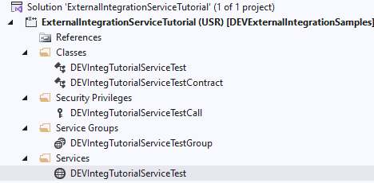
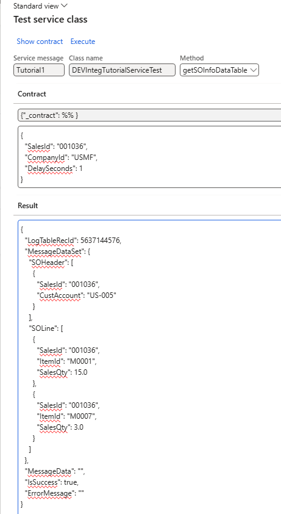
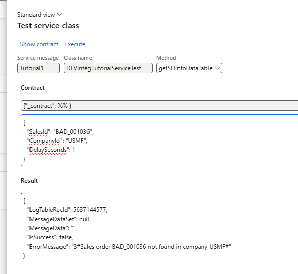

---
title: "Implement Service-based integration in D365FO"
date: "2026-03-02T22:12:03.284Z"
tags: ["Integration", "XppDEVTutorial"]
path: "/integration-services"
featuredImage: "./logo.png"
excerpt: "This blog post describes how to implement a synchronous integration with D365FO by creating a Service inside D365FO using External integration framework"
---

**External integration** is an open-source [framework](https://github.com/TrudAX/XppTools?tab=readme-ov-file#devexternalintegration-submodel) designed for inbound and outbound integrations in D365FO. It supports several channels: Azure file share, SFTP, Azure service bus, and provides comprehensive features for logging, error handling, and troubleshooting.

In this blog post, I will describe how to implement a service endpoint using the External Integration framework.   

## Key Design Principles  

X++ services are created using a standard service class in X++ and the [Service and Service group objects](https://learn.microsoft.com/en-us/dynamics365/fin-ops-core/dev-itpro/data-entities/custom-services#json-based-custom-services). 

Please note that service is a synchronous integration pattern that increases system coupling; it should be used only when async is not an option.

Before the development, I analysed several projects and how they were implemented by different developers. Key observations were:

- The input parameters vary by integration; they can't be universal.
- The output parameters look very similar; it is a data set containing one or more tables and some error flags. Also, most implementations contained some kind of logging table, usually different per implementation 

 Based on these observations, the following concept was implemented: 

1. The service input contract will be a new class for each integration, which gives maximum flexibility
2. Output contract will be a unified class that contains the following data: A .NET dataset containing 0..n tables, Output string, Error flag, Error message
3. A common logging option will be provided.

4. It should be possible to test the class inside D365FO


## Implementation details: X++ code 

I provide a sample code in the following [class](https://github.com/TrudAX/XppTools/blob/master/DEVTutorial/DEVExternalIntegrationSamples/AxClass/DEVIntegTutorialServiceTest.xml)   



To create a new service in the External integration framework

1. Create a new class that extends the **DEVIntegServiceExportBase**
2. Create an entry point that is always 1 line, just a call with a reference to the main method 
3. Implement a main method. It contains only the service business logic. 

A sample code looks like this:

```c#
public class DEVIntegTutorialServiceTest extends DEVIntegServiceExportBase
{
/// DEMO #1 (DataTables / DataSet):
	public DEVIntegServiceExportResponseContract getSOInfoDataTable(DEVIntegTutorialServiceTestContract _contract)
    {
        return this.serviceCallProcess(methodStr(DEVIntegTutorialServiceTest, calculateGetSOInfoDataTable), _contract);
    }

    public void calculateGetSOInfoDataTable(DEVIntegTutorialServiceTestContract _contract, DEVIntegServiceExportResponseContract _response)
    {
        this.validateAndDelay(_contract);

        changecompany(_contract.parmCompanyId())
        {
            SalesTable salesTable = SalesTable::find(_contract.parmSalesId(), true);
            if (!salesTable.RecId)
            {
                throw error(strFmt("Sales order %1 not found in company %2", _contract.parmSalesId(), _contract.parmCompanyId()));
            }

            this.initDataTableHelper();

            dataTableHelper.addDataTable('SOHeader');
            dataTableHelper.addRowItem('SalesId',     salesTable.SalesId);
            dataTableHelper.addRowItem('CustAccount', salesTable.CustAccount);
            dataTableHelper.addRow();

            // Lines table: multiple rows with sales lines
            dataTableHelper.addDataTable('SOLine');

            SalesLine salesLine;
            while select salesLine
                where salesLine.SalesId == salesTable.SalesId
            {
                dataTableHelper.addRowItem('SalesId',  salesLine.SalesId);
                dataTableHelper.addRowItem('ItemId',   salesLine.ItemId);
                dataTableHelper.addRowItem('SalesQty', salesLine.SalesQty);
                dataTableHelper.addRow();
            }

            this.addDataTableHelperToResponse(_response);
        }
    }

    /// DEMO #2 (Temp table / DataSet):
    public DEVIntegServiceExportResponseContract getSOInfoTempTable(DEVIntegTutorialServiceTestContract _contract)
    {
        return this.serviceCallProcess(methodStr(DEVIntegTutorialServiceTest, calculateGetSOInfoTempTable), _contract);
    }

    public void calculateGetSOInfoTempTable(DEVIntegTutorialServiceTestContract _contract, DEVIntegServiceExportResponseContract _response)
    {
        this.validateAndDelay(_contract);

        changecompany(_contract.parmCompanyId())
        {
            SalesTable salesTable = SalesTable::find(_contract.parmSalesId(), true);
            if (!salesTable.RecId)
            {
                throw error(strFmt("Sales order %1 not found in company %2", _contract.parmSalesId(), _contract.parmCompanyId()));
            }

            SalesTable tmpSalesTable;
            tmpSalesTable.setTmp();
            tmpSalesTable.SalesId     = salesTable.SalesId;
            tmpSalesTable.CustAccount = salesTable.CustAccount;
            tmpSalesTable.doinsert();

            this.initDataTableHelper();

            // Return temp table as a dataset DataTable (SOHeaderTmp)
            dataTableHelper.addTmpTable('SOHeaderTmp', tmpSalesTable,
                [
                    fieldNum(SalesTable, SalesId),
                    fieldNum(SalesTable, CustAccount)
                ]);

            this.addDataTableHelperToResponse(_response);
        }
    }
```

In case of errors, you just generate an exception, and the framework handles all this automatically. There are also a couple of helper methods that return either a temp table or a DataSet.

On the call side, if the calling system is .NET-based, they need to analyse the result: 

1. Check the status, **IsSuccess** flag, with error details in **ErrorMessage**  
2. If successful, deserialise the **MessageDataSet** parameter as a class **System.Data.DataSet** and read the required data

## Implementation details: User configuration

After creating a service class, it should be added to the form **External Integration - Setup -Service message type**.


From this form we can also test service class by using **Test** button


The system automatically create an empty contract, we just need to specify values and press the **Execute** button 



In case the call was not successful error message will be generated 



## Logging

Framework provides a different logging options that may be used in various business cases.


The following log options are available:

- **None** – no logging 
- **Statistics & Errors** – there will be one record per day for successful calls, which will show the number of calls and number of lines, PLUS all calls that cause errors while executing
- **Errors only** – only errors will be logged. 
- **Request** – The system logs each request with parameters, its status and statistics(Start-End date, number of lines)
- **Full** – the same as **Request**, but also the Response will be logged (may consume some space)

Recommended values for the production usage: “**Request**” or “**Statistics & Errors**”.

## Notes on consuming services 

Services may be consumed using AppId and connecting directly to the D365FO instance, but for the latest projects, we used the **Azure API management** service. Adrià wrote a [good article](https://ariste.info/2022/02/azure-api-management-dynamics-365-fo/) about this.

In 2 words, you need to create an HTTP endpoint: 

```xml
https://testsystemlink.sandbox.operations.dynamics.com/api/services/

With a new operation: 
Display name: getSOInfoDataTable
Name: getsoinfodatatable
URL:  /DEVIntegTutorialServiceTestGroup/DEVIntegTutorialServiceTest/getsoinfodatatable
```

and apply the following policy

```xml
<policies>
    <inbound>
        <send-request mode="new" response-variable-name="bearerToken" timeout="20" ignore-error="false">
            <set-url>https://login.microsoftonline.com/{{TenantId}}/oauth2/token</set-url>
            <set-method>POST</set-method>
            <set-header name="Content-Type" exists-action="override">
                <value>application/x-www-form-urlencoded</value>
            </set-header>
            <set-body>@{return "client_ID=4989d73b-1e25&client_secret=jSv8Q~m~jmO0QtZFmi_h4di&resource=https://testsystemlink.sandbox.operations.dynamics.com/&grant_type=client_credentials";}</set-body>
        </send-request>
        <set-backend-service base-url="https://testsystemlink.sandbox.operations.dynamics.com/api/services/DEVIntegTutorialServiceTestGroup" />
        <set-header name="Authorization" exists-action="override">
            <value>@("Bearer " + (String)((IResponse)context.Variables["bearerToken"]).Body.As<JObject>()["access_token"])</value>
        </set-header>
        <base />
    </inbound>
    <backend>
        <base />
    </backend>
    <outbound>
        <base />
    </outbound>
    <on-error>
        <base />
    </on-error>
</policies>

```

and then test the API with the following parameters

```json
{"_contract": {"CompanyId":"USMF","DelaySeconds":1,"SalesId":"001036"}}
```

Or in case of Postman usage: 

```json
https://d365apiserv.azure-api.net/mytest/DEVIntegTutorialServiceTest/getSOInfoDataTable

POST
subscription-key 
991874b1c..

Body raw
{
    _contract : {"CompanyId":"USMF","DelaySeconds":1,"SalesId":"001036"}
}

```

## Summary

External integration framework provides the following benefits for service development:

- Standard output contact with workload and errors flag 
- Automatic exceptions handling 
- Several logging options

All used classes can be found on [GitHub](https://github.com/TrudAX/XppTools/tree/master/DEVTutorial/DEVExternalIntegrationSamples) and can be used as a starting point for your own integrations.

I hope you find this information useful. As always, if you see any improvements, suggestions, or have questions about this work, don't hesitate to contact me.

