## Introduction

Are your Dynamics AX users complaining about slow system performance? You started the research, found many tips what to do and still don’t know where to start. 
In this post I discuss how to perform Dynamics AX performance audit to resolve performance problems.
I will covere the following areas:

- Current hardware analysis

- SQL Server settings and monitoring
  Blocking

- AOS settings

- X++ code optimization

I will also outline common performance myths and mistakes based on real-life scenarios.

The main principle of the performance  audit is to start from the highest level(that allow to identify the performance problem with the minimum effort) and continue by going more deeper in analysis. Described techniques was used for more than 10 customers with number of users between 50 to 500 and database size from 100GB to 1TB. For all these customers basics steps were the same and helped to identify and solve the problems.

## Current hardware analysis

The initial task to start is to compare the actual used hardware with the specified in a project technical design document. It will be not good if you see servers design specification like "8-core CPU". Such phases in technical design means that you don't have technical design. "8 cores CPU" can means any performance level. Try to filter "8 core CPU" on the Amazon, you will see a huge price variation

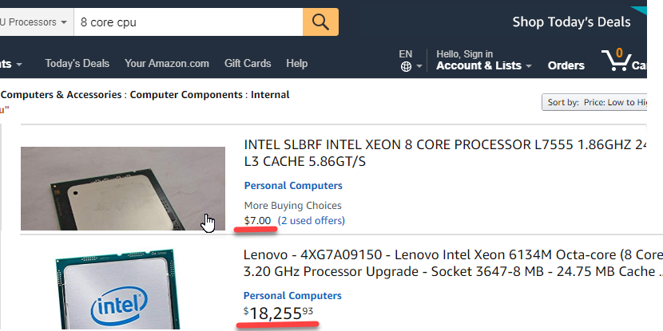

And for a CPU price defines the performance level, there will be noticeable differences of system working on 10$ CPU compared to 10K$ CPU. 

> One of the clients complained about slow overall system performance. While comparing recommended with the actual hardware I have found that instead of 4 core 3.5GHz CPUs they had used 20 cores 2.0GHz CPU. Actual client's intention was good, they thought that more cores means more performance, but in that case 4 cores was more than enough, but these should be the fast cores.

### Hardware recommendations

For Ax2012 use the following guidance as a baseline 

#### AOS and Terminal servers

For AOS and Terminal server - CPU with the single thread performance compared to Azure Dv3 series. Memory - about 300-500MB per user

These are the average values. The current Intel CPU [models](https://www.cpubenchmark.net/singleThread.html) give you about 30-50% more speed than these Azure Dv3 level. 

If you current CPU below these D3 values upgrade your servers can give you some noticeable performance boost. <https://www.cpubenchmark.net/> is a web site where you can check the CPU performance level(you need to check single thread performance and total performance). If you don't like to comparing these numbers just search on Amazon or Ebay your current CPU price.

#### SQL Server 

The same principles apply to SQL Server CPU, but they are not so simple. SQL Server is licensed by cores. For the wrong selected CPU model your SQL Server licenses can cost more than the actual hardware. Check this [blog post](https://sqlperformance.com/2014/01/system-configuration/selecting-a-processor-for-sql-server-2014-1) that explains the process in details. It is old, but the idea in general is that in every model line Intel has 4-core CPU with the maximum performance per core value, the more cores you get, the less performance per core will be, so you should not use CPUs with more cores than your system needed.

As AX is an OLTP system current CPU power for a SQL Server should allow to process data from the certain amount of memory. The amount of this memory is whether the maximum amount supported by the SQL Server standard edition(64GB - pre 2016 and 128GB - for SQL 2016) or the maximum "active data" in the database. 

From the practical experience modern 2 * 4 cores CPU can easily handle 128GB memory. 2 * 8 cores can work with 512GB, if you need more memory probably it's time to think about 4 socket servers

#### Storage system

Nowadays we have HDD, SSD, and NVMe storage. The main difference is the number IOPS they can handle(very simple 1K+, 20k+ 200k+). So if you have some storage problem you can just upgrade to the next level

## AOS settings

There are number of blog posts that cover optimal settings for the AOS. 

<https://community.dynamics.com/365/financeandoperations/b/axsupport/archive/2014/09/05/ax-performance-troubleshooting-checklist-part-1b-application-and-aos-configuration> 

<https://blogs.msdn.microsoft.com/axinthefield/dynamics-ax-performance-step/> 

## SQL Server analysis 

First thing to check is the current AX database size per table. 

### Analyzing database size

You don't need exact size(that takes time to perform), but can get the size using the saved statistics by using sp_space_used(execution time is very fast). This [script](https://github.com/TrudAX/TRUDScripts/blob/master/Performance/AX%20Technical%20Audit.md#database-size) provides you size per table. Copy the result to Excel and sort by size. Sometimes you see the picture like this

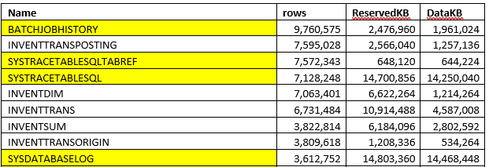

in this case a lot of space consumed by some temporary/tracing data and can be deleted

Check the number of closed records in InventSum. If most of the records are closed, removing them can considerable increase the performance

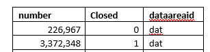

For example if you get the following results, you can drop closed records(the only problem here is that some reports, for example "Onhand by date" can use closed records to displays historic data, check this before delete)

Also check some tables [statistic](https://github.com/TrudAX/TRUDScripts/blob/master/Performance/AX%20Technical%20Audit.md#table-statistics) Often you need to know the following: 

- Transactions per day(for logistics companies it will be number of sales lines or invent trans per day) and the difference between peek and normal days)
- Active users per day, per hour 
- Batch jobs and their timings 

Compare these numbers with the numbers from the technical design, very often clients exceed them but "forget" to upgrade the hardware.

### SQL server settings 

To check the current SQL server settings you need just one script - [sp_Blitz](https://github.com/TrudAX/TRUDScripts/blob/master/Performance/AX%20Technical%20Audit.md#sp_blitz), it performs thousand of checks and displays summarized recommendations with the explanation links.

### Missing indexes

Missing indexes [script](https://github.com/TrudAX/TRUDScripts/blob/master/Performance/AX%20Technical%20Audit.md#missing-indexes) provides overview of indexes that consider missed by the plan guide engine

You have the following columns here 

- Table name
- Equality columns: ''='' condition in the WHERE clause
- Unequality columns: some logical condition(<", "!=") in the WHERE clause 

Don't just follow these recommendations, every recommendation should be analyzed from the logical point of view and only indexes that really limit the actual search should be created. You don't need analyze the whole output, often 30-50 top recommendations is enough 

Sometimes you can see recommendations that were caused by wrong conditions(mandatory fields missed in the SQL statement). In this case better to find and correct the statement, rather than trying to create an index(in the example below RefCompanyId field is missing for DocuRef selection) 

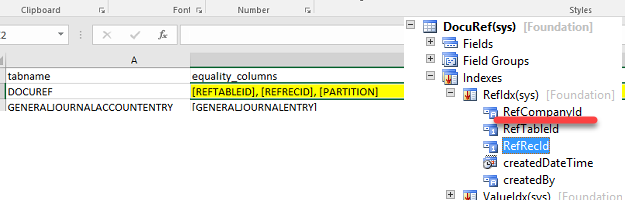

### Unused indexes 

[Script](https://github.com/TrudAX/TRUDScripts/blob/master/Performance/AX%20Technical%20Audit.md#unused-indexes) provides some unused indexes statistics for the large tables. 

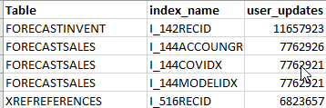

Remove the indexes only if they are related to not used functionality or different country. In some special cases for the large tables you can also consider disabling Partition and DataArea fields.

### Wait statistics

[Script](https://github.com/TrudAX/TRUDScripts/blob/master/Performance/AX%20Technical%20Audit.md#wait-statistics) gives you the overview of current wait events. You you see some IO related events here, [analyze](https://github.com/TrudAX/TRUDScripts/blob/master/Performance/AX%20Technical%20Audit.md#disk-i--o) disk activity by disk and by file

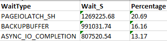

### Top SQL analysis

Script provides the active top SQL commands, their statistics and the plan from the SQL server statistics(to clear the list use DBCC FREEPROCCACHE command). 

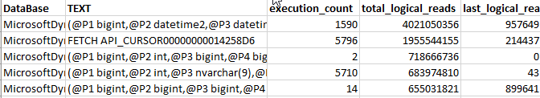

Ideally you should know the 5-10 statements from this list and analyze the following:

- They logically make sense for the current implementation - the number of executions and the statement itself relates to the current system functions. Very often I saw some statement here caused by incorrect system setup or not used functionality, or not related to AX at all.
- They use optimal plans and indexes

FETCH_API_CURSOR here means some query from the AX form. To find the original query use [Cursors for the session](https://github.com/TrudAX/TRUDScripts/blob/master/Performance/AX%20Technical%20Audit.md#cursors-for-the-session) script

### AX long SQL statements tracing 

You can enable tracing of the long SQL statements in the user options. Use this [job](https://github.com/TrudAX/TRUDScripts/blob/master/Performance/AX%20Technical%20Audit.md#enabling-tracing) to enable it for the all users. Often you need analyze statements with the executions time more than 2-5 seconds. 

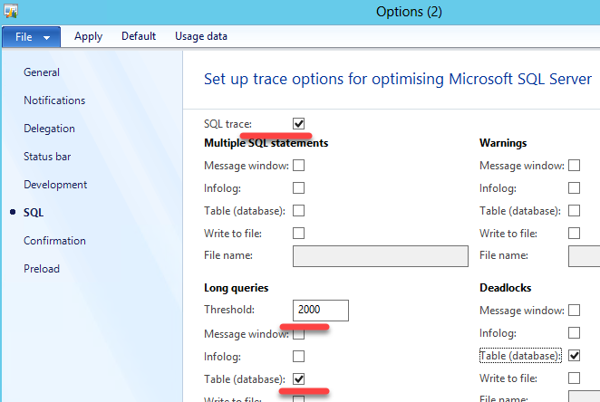

The great advantage of this in AX is that you see the stack trace of the statement. Also keep in mind that long time to execute can be caused by 2 reasons 

- Statement is heavy and takes long to execute 
- Statement is blocked by other session

## Blocking analysis 

Unwanted blocking can be caused by the following reasons:

- Group update operation(like *update_recordset*) in X++. Check this [article](https://denistrunin.com/understanding-sql-blocking/) that explains the problem in detail. To resolve this you need either replace "update_recordset" with "while select forupdate" or adjust indexes 

- Blocking escalation - if you modify more than 5000 record in one transactions sometimes SQL Server decides to escalate the blocking level. If you have a lot of memory, you can disable this behavior, but first check that you really need to update all records in one transaction.

Great instrument to deal with the blocking is to enable AX long SQL statements tracing(see above) - in this case you will see the statement, user and actual operation(by using X++ stack trace). 

It is also useful to enable [context_info](https://github.com/TrudAX/TRUDScripts/blob/master/Performance/AX%20Technical%20Audit.md#show-sql-query-for-the-ax-user) for the SQL session, this allows you to link AX session with the SQL Server SPID and find a blocked user.

The most challenging part of resolving blocking problems is to find operation that cause blocking. Great technique is to try search blocking on the test version. In this case you run the client, execute the operation(for example post the sales order) and put breakpoint to the last ttscommit statement for this operation. Then run another client and start executing  operations(like another sales order or journal posting). If you catch the blocking you can easily implement and test a fix for it.

###  Parameters sniffing

Parameters sniffing quite often becomes a reason for performance problems. For example, you have a warehouse where most of the items have one batch ID, but there are some Items and Batches with general names (like “No batch”, “Empty”). In this situation, when you query item by batch your actual plan depends on the first query values. If your query contains “general” batch values, SQL Server creates a plan that starts execution with the ItemId, as a “general batch value” is not selective in this case. But for most of your items, it will be wrong and gives huge overhead, as in most cases Batch is a unique value.

There is no universal way to resolve Parameters sniffing issue(refer to the excellent BrentOzar post that describes this https://www.brentozar.com/archive/2013/06/the-elephant-and-the-mouse-or-parameter-sniffing-in-sql-server/ ), but there are several ways to deal with it in AX:

- Create new indexes – you can create new indexes, to help SQL server always choose the best plan. This often works only if you have conditions to one table only
- Use the **sp_create_plan_guide** [command](https://github.com/TrudAX/TRUDScripts/blob/master/Performance/AX%20Technical%20Audit.md#create-a-plan-guide) to force the actual plan – using this option creates a big admin overhead as you need to maintain these created plans. If you add a new field to the AX table you will need to change all the plan guides in which this table is used. Often you need to provide just a OPTIMIZE FOR UNKNOWN hint to disable sniffing for the  SQL statement, better do not specify specific indexes 
- **forceLiterals** X++ hint –you send actual values to the SQL Server and it chooses the best plan for these values. The overhead is that the plan will need to be compiled every time
- Use index hint (new feature D365FO only) – it is the same as sp_create_plan_guide but with no admin overhead

Created plan guides can be found in Programmability section

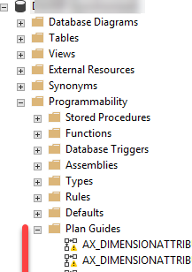

As a basic rule add **forceliterals** hint(or **query.literals(true)**) for the single SQL statements and add create a plan guide(with the OPTIMIZE FOR UNKNOWN hint) for the small SQL statements. **Forceliterals** usage can slow down your server. Check this [article](https://denistrunin.com/forceliterals-forcePlaceholders/) for the details.

Determining which statements are affected by parameters sniffing also can be tricky. Often you analyze statements from the Top SQL output(see above), then compare actual plan with the estimated plan and if they are different, check the xml representation of the actual plan. At the end of this xml you can find initial(sniffed) parameter values and based on them decide is that an issue and how it should be fixed 

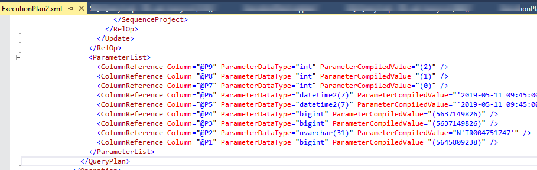

## Index rebuild and statistics update

Rebuild index and statistics update jobs can cause a lot of problem.

The main myth is that these operations can speed up the system, but the reality is their can't. The side effect of this operations is that they clear the plan cache(the same can be done just with DBCC FREEPROCCACHE command) and due to parameters sniffing this is often considering as an improvement.

The typical scenario of going into this trap(Brent call it Index Maintenance Madness, but in my experience it's often related to statistics update):

1. System suddenly becomes very slow(due to parameters sniffing issue)

2. Someone decides to run index rebuild or/and statistics update job

3. This magically helps and these operations started to execute on daily basis(but you can't resolve parameters sniffing issue with this)

4. Then system slowness happens during the day and statistics update also helps.

5. Update statistics change to 2 times a day, then 3 times a day and so on...

At the end of these events customer come to decision that index rebuild or/and statistics update job should run constantly and the server load they produce can even exceed the AX business logic load, cause blocking and slow down the system.

Check this article([Index Maintenance Madness](https://www.brentozar.com/archive/2017/12/index-maintenance-madness/) and great [video](https://www.youtube.com/watch?v=iEa6_QnCFMU) from Brent Ozar that explain the theory and psychology in details.

Recommendations here is that you should not execute these operations in any way they can affect system performance. If you have free maintenance window run them once a week using Ola Hallengren‘s [IndexOptimize](https://ola.hallengren.com/sql-server-index-and-statistics-maintenance.html) procedure. It is more efficient than the standard SQL agent tasks as they allow you to execute UPDATE STATISTISCS command without "WITH PERCENTAGE" clause and for the index rebuild you can specify fragmentation limits.

Don't use rebuild index and statistics update jobs to resolve any performance problems.

## Code optimization

Before individual operations optimization(x++ code) you need to know the following: 

- Detailed problem description

- Reproduction steps. That is the most complex part, sometimes reproducing the problem can take more time than the optimization

- What is the current and what is the required execution time

- How you can test the optimization

Testing is quite easy for reports or operations than don't modify the data, but can be complex for posting operations. Try to minimize number of manual testing steps, ideally the testing should be possible by one click(in this case you can try different ideas during the optimization process). For posting often you write a job that opens a transactions at the beginning and then generate a ttsabort at the end.

Trace parser is a great tool for analyzing operations execution. It will trace all sessions in the AOS and provides detailed output. For production tracing better to have a dedicated AOS as trace file can grow very rapidly when you have a lot of user sessions.

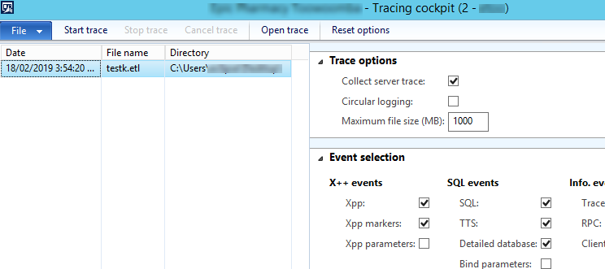

The advice here is to install and setup it before the actual problem happens. In this case you can easily run the trace when needed.

## Summary

Using these basic steps you can resolve your Dynamics AX performance problems and make your users happy. All scripts related to this post available on my [GitHub](https://github.com/TrudAX/TRUDScripts/blob/master/Performance/AX%20Technical%20Audit.md). If you see that some useful staff is missing, feel free to post a comment.