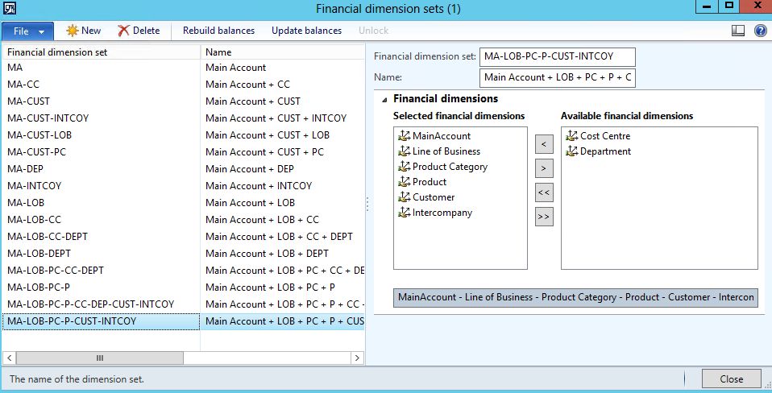

## Introduction

The end of the year was quite a busy time from the performance problems, in this post I try to describe an examples that I saw on clients. This post will just a collection of the examples for my previous one [Dynamics AX performance audit](https://denistrunin.com/performance-audit/). Overall the concept described there always worked, analysis should be performed from the highest level and to continue by going deeper in the analysis

## Current hardware analysis

There were a set of problems

### Shared hardware usage for AX SQL server 

This was quite new for me. The whole AX implementation was located on VM cluster where every CPU core was shared between several VMs. The number of VM that are using one single core called *CPU allocation ratio*, and it was about 1 to 5. You probably can save on server and electricity costs using such configuration, but as the result overall system performance was very low, especially during the day. [Microsoft Dynamics AX 2012 System Requirements](https://www.microsoft.com/en-au/download/details.aspx?id=11094) documents clearly says that dedicated hardware should be used.

How to detect: I don't this is is possible on Windows level, the best option just to ask IT support. Main cloud providers always provide you dedicated hardware

SQL Server issues

Batch deadlocks

Implement history logs cleanup

Missing indexes

That was a common problem. After fixing some 

### Parameters sniffing

### AOS and Terminal servers

Waiting time for batch tasks

Printing delay

Application issues

Unused Financial dimension sets

Each dimension set is a different ledger transaction view. The current setup means when we create a one ledger transaction – 16 different transactions will be created(they are used in Trial balance report) 

 

The problem that most of the dimensions set are not used by users(see the number of unprocessed records per dimension set)

 

select count(*) as NumberOfRecords, DimensionHierarchy.NAME from DIMENSIONFOCUSUNPROCESSEDTRANSACTIONS

join DimensionHierarchy on DIMENSIONFOCUSUNPROCESSEDTRANSACTIONS.FOCUSDIMENSIONHIERARCHY = DimensionHierarchy.RECID

group by DIMENSIONFOCUSUNPROCESSEDTRANSACTIONS.FOCUSDIMENSIONHIERARCHY, DimensionHierarchy.NAME

Probable dimension sets where the number of unprocessed records is more than 10k can be deleted

**Recommendation:**

Need to delete not used Dimension sets and clean DIMENSIONFOCUSUNPROCESSEDTRANSACTIONS table 

## Summary

Using these basic steps you can resolve your Dynamics AX performance problems and make your users happy. All scripts related to this post are available on my [GitHub](https://github.com/TrudAX/TRUDScripts/blob/master/Performance/AX%20Technical%20Audit.md). If you see that some useful staff is missing, feel free to post a comment.

There are some Microsoft blog posts about performance: [Managing general performance issues in Microsoft Dynamics AX](https://cloudblogs.microsoft.com/dynamics365/no-audience/2014/09/11/managing-general-performance-issues-in-microsoft-dynamics-ax/?source=axsupport), [Analysis scripts for Performance Analyzer v2.0](https://cloudblogs.microsoft.com/dynamics365/no-audience/2016/09/08/analysis-scripts-for-performance-analyzer-v2-0/?source=axsupport).

Also worth to check this great SQL Server resources collection - [SQL Server KIT](https://github.com/ktaranov/sqlserver-kit).
