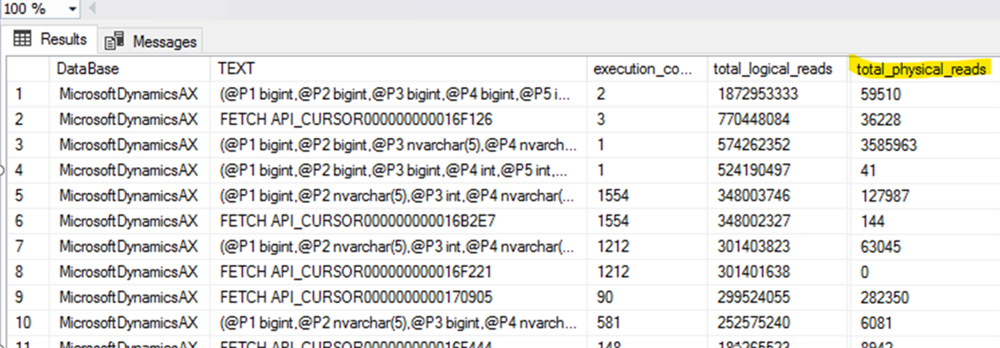
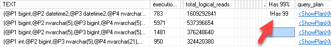
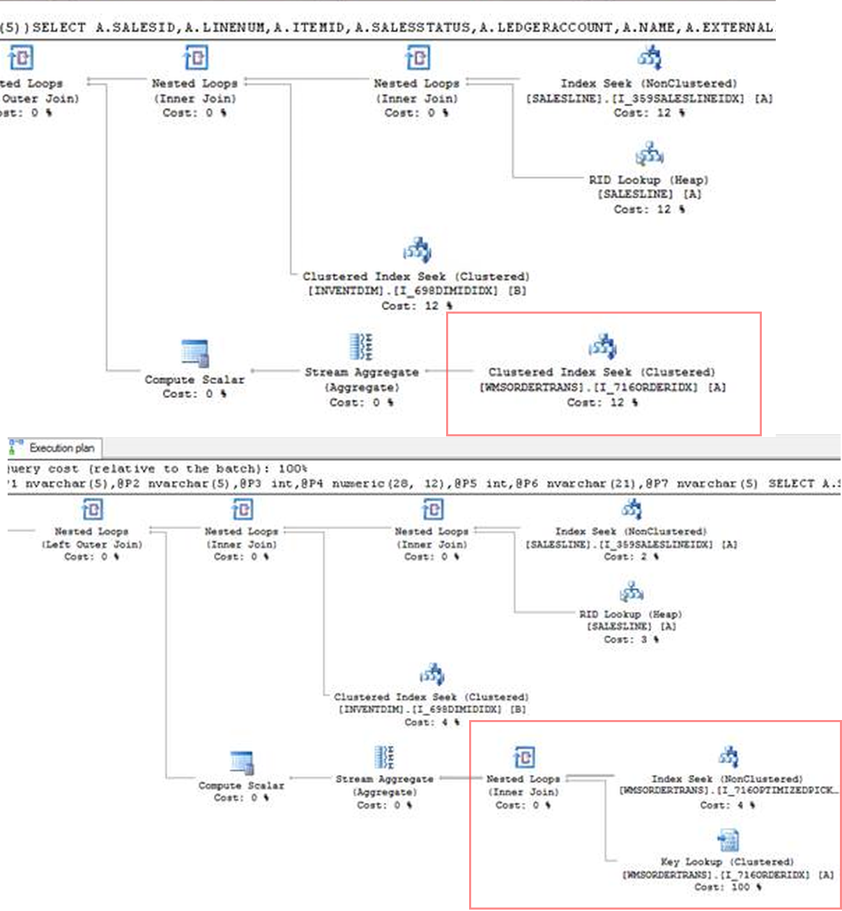
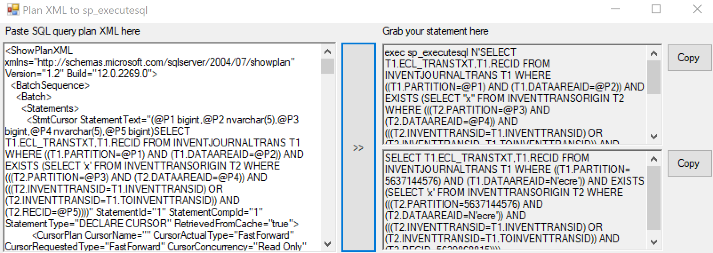
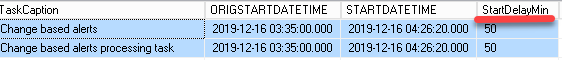
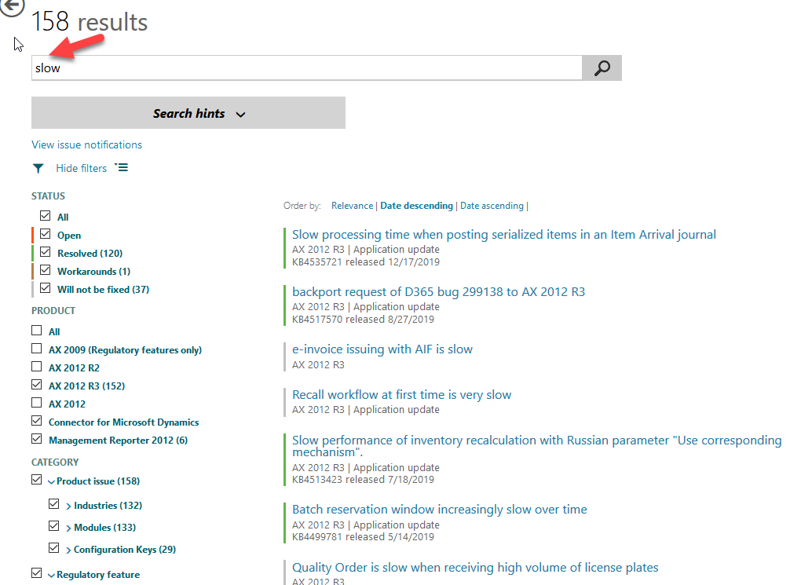

## Introduction

In this post, I try to describe some performance-related issues that I saw on clients(on AX2009 and  AX2012R3) and how they were resolved. 

It is more like a collection of the examples for my previous post [Dynamics AX performance audit](https://denistrunin.com/performance-audit/). Overall the concept described there worked, an analysis should be performed from the highest level and to continue by going deeper in the analysis.

## Server related issues

There were a set of problems where users complain about "slow system" in general

### Shared hardware usage for AX SQL server 

This was quite an unusual issue. The whole AX implementation was installed on VM cluster where every CPU core was shared between several VMs. The number of VMs allocated to the same CPU core called *CPU allocation ratio*, and it was 1 to 5. You probably can save on server and electricity costs using such configuration, but as a result, overall system performance was very slow, especially during the day. [Microsoft Dynamics AX 2012 System Requirements](https://www.microsoft.com/en-au/download/details.aspx?id=11094) document clearly says that dedicated hardware should be used.

**How to detect:** I don't this is possible on Windows level, the best option just to ask IT support. Main cloud providers always provide you with dedicated hardware

### Database mirroring setup

One client set up a database mirroring using “High safety without automatic failover” mode. In this mode, a process waits for transactions commit on both servers. This caused huge IO delays(like one record inserts for several seconds), not [supported](https://docs.microsoft.com/en-us/dynamicsax-2012/appuser-itpro/sql-server-topology-recommendations-for-availability-and-performance) by Microsoft and solution was to change mirroring to High-performance mode.

**How to detect:** Such issue is quite easy to detect using [Wait statistics](https://github.com/TrudAX/TRUDScripts/blob/master/Performance/AX%20Technical%20Audit.md#wait-statistics) script. If you see that more that 80% waits are disk related it is a time to check what is a reason for this.

### Slow performance due to low SQL Server memory

AX is an OLTP system; it should not read any data from the disk during the normal daily operations and SQL Server should have enough memory to hold the active data. If you don't have it - the available memory should be increased

**How to detect:** Check TOP SQL queries during the day – if you have a lot physical disk reads, it is time to increase SQL Server memory(queries of cause should have proper indexes)




## SQL Server issues

### Missing indexes

That was a common problem. Usually, you use a missing index [query](https://github.com/TrudAX/TRUDScripts/blob/master/Performance/AX%20Technical%20Audit.md#missing-indexes) to find such indexes, but I also added a new column to TOP SQL [query](https://github.com/TrudAX/TRUDScripts/blob/master/Performance/AX%20Technical%20Audit.md#get-top-sql) - "Has 99%" that allows to quickly see your TOP SQL queries that have 99% missing index impact recommendation



### Parameters sniffing

Parameter sniffing can be a huge problem, especially if you have separate teams responsible for SQL Server and AX. We had a case where a client complained about periodic slow ledger journal posting that stopped the work of a whole accounting department.

In that case there was just one custom query executed during a posting affected by parameters sniffing(non optimal plan was initially selected and cached). Before the performance audit client spent about a month with tons of e-mails between AX team, SQL team and Microsoft support trying to implement typical recommendations like statistics refresh, re-indexes with a different fill-factor and so on..

The issue has been quickly resolved by creating a new plan guide with [OPTIMIZE FOR UNKNOWN](https://github.com/TrudAX/TRUDScripts/blob/master/Performance/AX%20Technical%20Audit.md#create-a-plan-guide) hint.

**How to detect:** To start with you need to analyze "Get Top SQL" output and check queries from the top. Often the first action is to compare the actual plan with the Unknown parameters plan. To do this: 

- Copy a query to a new SQL window and replace “(“ with “declare” and remove the last “)”
- Press “Display estimated execution plan” button  

Compare it with the plan from the "Get Top SQL" output, if they are different, you need to analyze why.



You need to know what is a logical reason for this query, how data is distributed in your tables, how unique(or how selective) each condition in the select query, why SQL generates 2 different plans and which plan is the correct one. 
       

To view actual parameters for the plan in cache you need to press "Show Execution Plan XML.." on plan itself and scroll to the bottom. You can use a handy tool [MSSQLPlanToSpExecuteSql](https://github.com/denissukhotin/MSSQLPlanToSpExecuteSql) by Denis Sukhotin to convert this XLM to a normal SQL with the actual values instead of @P1. This allows you to execute this query from SSMS with different parameter values. 



Some queries can be fixed only by changing X++ code. For example consider the following code, that  gets total quantity for the specified **Item** on a **License plate**.

```csharp
select sum(AvailPhysical) from inventSum
	where inventSum.ItemId == @P1
join inventDim 
	where inventDim.inventDimId == inventSum.InventDimId &&
          inventDim.LicensePlateId == @P2;
```

"License plate" is a very selective field, so for the normal parameters **InventDim(LicensePlateIdIdx)** index will be used. But what happens if we try to execute this statement with **@P2=""**. If we had this plan in cache, system will scan all **InventDim** records with empty **LicensePlateId**(and this will be a huge number of records) or if it will be the first run, starts processing this select with **ItemId** field, that is not so selective. Both options are incorrect and will lead to problems. But from the logical point of view **LicensePlateId=""** doesn't make any sense, so instead trying to fix this statement we need to fix it's parameters. In this case developer just forgot to add a check for the empty value, solution was to add this check and do not run this statement if **@P2** is empty.  

The main advice here is never use statistics update or re-indexing to solve such issues, in the origin blog post I have some links what the approach should be(like additional indexes, hints in AX, convert to **forceliterals**, create custom plan..)

### AOS and Terminal servers issues

### Waiting time for batch tasks

A client complain was that integration is very slow. During the analysis I found that for integration they used a batch job that should be executed every minute, and sometimes it didn't.

There is some old recommendation on the Internet that when you setup an AX batch server you should allocate only several threads per CPU core. In this case batch server was setup with 32 threads and such low setting caused batch execution delays(as there were no free threads available). To identify such problems, I created a SQL [query](https://github.com/TrudAX/TRUDScripts/blob/master/Performance/Jobs/DelayedBatchTasks.txt ) that compares batch job "Planned execution start time" with the "Actual start time". It is not good if you see some differences between these numbers. 



The advice here is to increase this "Maximum batch threads" parameter for AOS until you have CPU and Memory resources(modern server can handle hundreds of threads). What is interesting that in the new D365FO version Microsoft has added **Batch priority-based scheduling**(PU31), but this feature probably just hides the problem.

#### Huge delays during sales orders posing and printing

That was quite interesting and complex case. Client complained about periodic delays(1-2 minutes) during sales orders posting. The issue couldn't be replicated(initially it looked like typical parameters sniffing or blocking issue). The problem was that they also had a lot of other performance issues(a lot of missing indexes, old SQL version, High CPU load on SQL server and so on...). Client used AX2009 and they outsource 3 different companies to support Infrastructure, SQL and AX side.

When all issues were fixed, system load become low they still sometimes complained about the original issue and we still can't replicate it(in all our tests small orders posted within several seconds). Setting up a SQL blocking alert and analyzing TOP SQL also didn't show any problem. We ended up with a monitoring modification that logged different stages of sales invoice posing. First finding was that duration didn't depends on number of SO lines, next iterations showed that delay actually caused by "print" method. Finally we found the reason for this delay - for users whey used Windows2016 Citrix clients(that is not supported by AX2009) and we in our tests used Windows2008R2 RDP to run AX client.  Printer driver reconfiguration solved this issue.

### Slow standard operations

A lot of clients experienced issues with operations already fixed by Microsoft.

Top 2 problems here that were almost on every client: 

- **Batch tables deadlocks** - was fixed in CU13 *KB3209851Continuous deadlocks in batch tables* - Microsoft switched locks processing to application locks
- **Locks and deadlocks on InventSumDeltaDim** - was fixed in *KB4019571 Deadlocking on InventSumDeltaDim causes Sales order release batch to fail*. The solution is quite simple - delete RecId index and replace it with TTSItemCheckDimIdx

The best way to start any performance investigation if users are complaining to individual operations is to search for the solution on LCS "Issue search"(you can search by description or by AOT element name). For example for AX2012R3, there are 120 resolved performance-related fixes to different parts of the system(you can view the full list searching by "slow")



Also is it helpful to install on your project the latest standard version on AX2012 and use it as a reference(if you have such application, hotfixes is much easy to install by extracting them as)

With the latest version definition there is a trick - if you google "latest AX version" you probably find this page - [Overview of Microsoft Dynamics AX build numbers](https://cloudblogs.microsoft.com/dynamics365/no-audience/2012/03/29/overview-of-microsoft-dynamics-ax-build-numbers/). The problem with this site that it is no more updated. Current AX2012R3 latest version(both for the Binary and application) is called "August 2019 release". It can be downloaded from *LCS - AX2012 project - Updates -  UPDATE INSTALLER FOR MICROSOFT DYNAMICS AX 2012 R3*

### Application issues

I saw these settings that affected performance:

#### Unused Financial dimension sets

Some customers initially created a lot of “Financial dimension sets” but used only several from this list. For example, the setup below means that when the system creates a one ledger transaction – 16 different dimension set transactions will be created(they are used in Trial balance report)  


To get what is used, I created the following query(it displays the number of unprocessed records per dimension set):

```sql
select count(*) as NumberOfRecords, DimensionHierarchy.NAME from DIMENSIONFOCUSUNPROCESSEDTRANSACTIONS join DimensionHierarchy on DIMENSIONFOCUSUNPROCESSEDTRANSACTIONS.FOCUSDIMENSIONHIERARCHY = DimensionHierarchy.RECID
group by DIMENSIONFOCUSUNPROCESSEDTRANSACTIONS.FOCUSDIMENSIONHIERARCHY, DimensionHierarchy.NAME
```

Solution was to delete unused sets

#### Pending workflow tasks 

If you use workflow, you need to check that the number of tasks in a Pending status will not grow. You can check for such tasks in Workflow history form and if there are some Pending tasks that more than 1 year old - delete such tasks  

## Summary

In this post, I tried to provide some examples of what can be found during the performance review. The original post is [here](https://denistrunin.com/performance-audit/), all scripts related to this post are available on my [GitHub](https://github.com/TrudAX/TRUDScripts/blob/master/Performance/AX%20Technical%20Audit.md). If you see that something is missing or what to share some performance-related story, feel free to post a comment.
