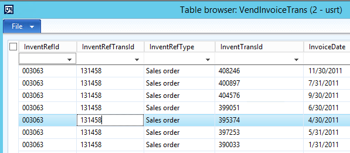
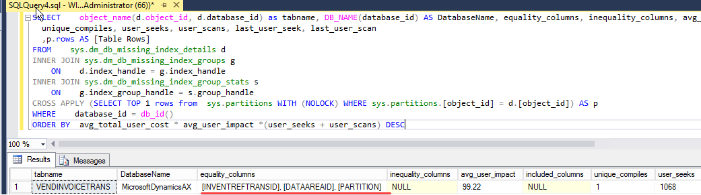
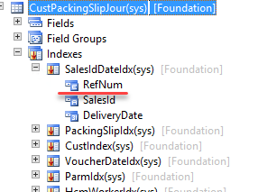
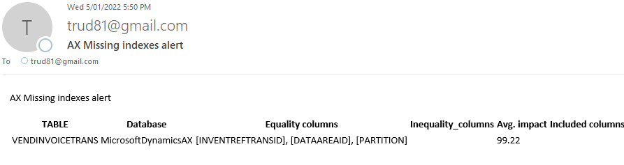

---
title: "Dynamics AX performance monitoring - missing indexes "
date: "2022-01-05T22:12:03.284Z"
tags: ["Performance", "SQL", "Performance audit"]
path: "/performance-monitormisind"
featuredImage: "./logo.png"

excerpt: "The blog post describes a monitoring solution for SQL Server missing indexes"
---

One of the complex and probably most common problems in Dynamics AX performance tuning is SQL parameters sniffing. I recently wrote how to [fix it](https://denistrunin.com/performance-sniffing), but in this post, I want to focus on a sample approach of how to implement a monitoring solution for such types of problems.

## Missing indexes example 

Let's simulate missing indexes issue. I am using a standard AX2012 Demo VM for this. For example we need to find all vendor invoice lines related to a sales order. 



In order to do this a developer may write the following code:

```csharp
    VendInvoiceTrans        vendInvoiceTrans;
    ;
    while select vendInvoiceTrans
        where vendInvoiceTrans.InventRefTransId == "002862"
    ...    
```

The problem is that **InventRefTransId** field is not indexed, so in order to get result SQL Server need to scan all rows in **VendInvoiceTrans** table. Depending on where this code is used it may affect users performance or increase load to a SQL Server. Also **InventRefTransId** is a highly selective field, so it is a perfect candidate for an index.

SQL Server query optimizer can automatically detects such cases and generate recommendations for index creation. These recommendations can be displayed by querying [missing index](https://github.com/TrudAX/TRUDScripts/blob/master/Performance/AX%20Technical%20Audit.md#missing-indexes) view 



From some real life experience for Dynamics AX performance optimization usually enough to analyse 50 first rows from this view with impact more than 99%. Most(but not all) of such recommendations will be valid and new indexes should be created.

Some exceptions where you don't need to create an index even if impact is 99%:

1. A select is an external query with missing DATAAREAID/PARTITION field and a filed already presented in index: In this case it is better to add DATAAREAID/PARTITION to such external query. 

2. A field is already presented in the index, but not on the first place. A perfect example for this is **CustPackingSlipJour** table. In order to get a packing slip for a sales order a Module(**RefNum**) should be specified, but usually it always contain just one value(Sales order type) and developers often forget to specify it. 

   

another variation of this case may be my example with **VendInvoiceTrans** above. In this case a code contains a condition for  **InventRefTransId** field but is missed a condition for **InventRefType**. This is an development error and both fields should be specified in the code and in the index.

Let's discuss how we can monitor such issues

## Missing indexes monitoring solution implementation

Such problems are quite easy to fix, the main complexity is that they can hit your system unexpectedly. But the pattern is always very similar: a new TOP SQL statement that uses a non-optimal execution plan. Also, you can't monitor it using standard performance counters(for example CPU load) on SQL Server, as in most cases they may not hit critical levels(for example it may change from 20% to 50%). 

I tried to google a monitoring open-source solution that could handle such situations but could not find anything. So to be notified on such events I created the following Dynamics AX query performance monitoring [procedure](https://github.com/TrudAX/TRUDScripts/blob/master/Performance/Jobs/SQLTopQueryMonitor/dbo.AXMissingIndexesMonitor.StoredProcedure.sql):

```sql
msdb.dbo.[AXMissingIndexesMonitor] @DBName = 'MicrosoftDynamicsAX',
@SendEmailOperator = 'axoperator', @DisplayOnlyNewRecommendation = 0, @Debug = 0
```

The idea is very simple. Every 30 minutes this procedure obtains 3(**@MaxRowToSave**) TOP records from the current SQL Server TOP SQL view and if they exist in this log for more than 30 minutes(**@MinPlanTimeMin**) saves them to a table. If any of these 3 statements is new, it sends an e-mail about this to a specified operator(**@SendEmailOperator**). To prevent this log from growing it deletes records older than 62 days(**@DaysKeepHistory**)

To compare with previous statements both SQL plan and SQL text are used, so if one query is executed with different plans it appears twice in this log. 

As the result, if you have a new TOP statement that you have not seen before, Dynamics AX Administrators should get an email like this 




## Some thoughts about D365FO

If you have an on-premise version the monitoring will be the same. For the Cloud version, you don't have a direct access to a Production SQL Server. But the production database has a **Query store** enabled and information like "TOP queries for the given time" can be obtained using the SAT restore with a read-only flag. The process is described in the following post [Using Query Store for Performance Tuning with D365 F&O](https://community.dynamics.com/ax/b/axinthefield/posts/using-query-store-for-performance-tuning-with-d365-f-o), but it looks quite complex from a practical point of view(SAT often is used for some other tasks and this restore will take some time)

Probably another option is to implement the same monitoring logic in X++ and run it as a periodic batch job. 

## Conclusion

Using the described solution you can monitor your Dynamics AX SQL performance and get a notification when some new workload appears in a TOP SQL list. This is extremely useful for the cases when you have random performance problems that can't be replicated on a Test version. You can find and fix exact queries that causing problems instead of wasting time by running reindexing/statistics update. 

The code for this can be found in the following [folder](https://github.com/TrudAX/TRUDScripts/tree/master/Performance/Jobs/SQLTopQueryMonitor).

I hope you find this information useful. Don't hesitate to contact me in case of any questions or if you want to share your Dynamics AX/D365FO SQL monitoring approach. 

