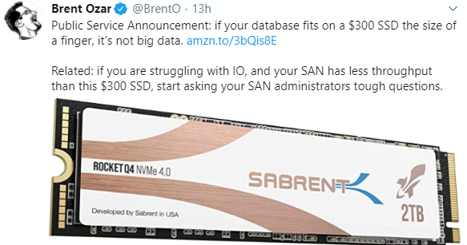
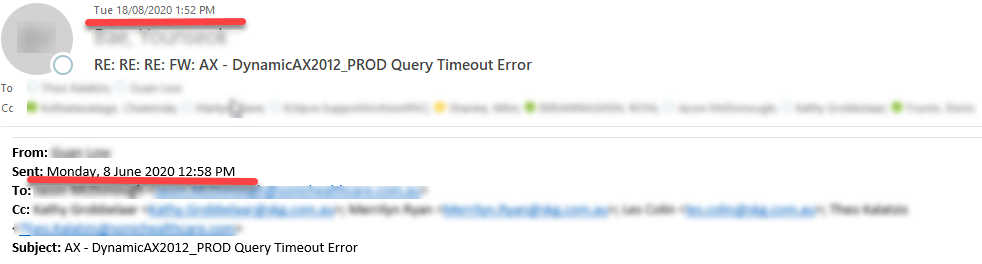
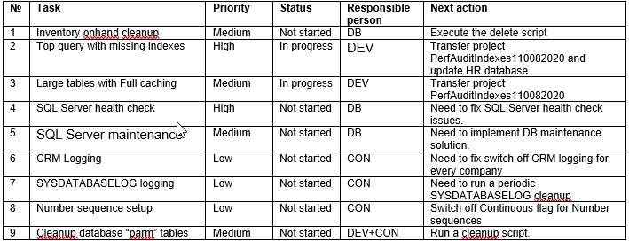

performance-projmanage

You Dynamics AX installation is slow, users complaining about performance and it is not clear what to do to fix that. The solution is to start a performance optimization project. How to organize this project, who should be involved, and how the process should be organized is explained in this blog post.

We recently finished a quite successful performance optimization project and I will use it as an example for this post. The similar approach described here was used on dozens different projects so it is something  

## Project overview 

The client was a big retail company running AX2009 for  about 10 years with 80 users and 1TB database size. With the COVID situation they saw increase in their sales and the performance of AX2019 that was average before this became critical.

As a final result they saw a great improvements 

System stability was greatly improved, some measurable results:

In total we did 43 different performance tasks and the project length was 3 months. So these results were quite amazing 

From my side as a technical consultant the project flow and organization was great and contains all typical interaction types that exists in similar projects. The size due  to system complexity was above average(for example TechCon time was 45 days, that is more than probably 10-20 days on average) 

I want to describe the pieces of successful factors and common mistakes that I saw on other projects like this

## Performance project team

The typical project team should have the following people:

- IT manager
- Functional consultant
- Infrastructure manager
- SQL administrator
- Project manager 
- AX Technical consultant

One person can combine several roles but **all these roles** should be a part of the project.

### The typical mistakes of organizing a team

Let's discuss what can happen if we don't configure a team as recommended

#### - No project manager allocated

Initially that seems reasonable, system is critically slow, you need just technical people who tell you what to do and not managers. But this become an important factor after that. 

A lot of performance tasks are complex, have no direct impact on users and in order to resolve require efforts from different people. 

> Probably the most typical example here is a recurring batch job that tries to reserve quantity for open orders and some orders are old, never be reserved and the processing happens again and again. Or some integration task that tries to process wrong messages every time it runs and do not mark them with the error flag. 

Such tasks can produce a huge constant load on AOSes and SQL Server and quite complex to resolve. You need to contact with business users, understand the reason for such multiple processing, find a solution, develop and text a fix(this can be complex for a procedure that was developed 5 years ago and nobody want to touch it). So a good project manager should allocate resources for tasks like this and control the execution.

#### - Only SQL DBA/Infrastructure team is involved

This is a typical situation in the beginning. Users complaining about performance, you ask you DBA check servers find the reason. And often this also doesn't work and ends up with more statistics or indexes updates. A lot of performance problems are related to parameter sniffing issues or Dynamics AX settings/code, and it is hard for SQL DBA to fix that, without knowing what is the logical purpose of these tables and what should be the correct plans for this.

#### - SQL DBA/Infrastructure team is not involved

This is an opposite situation to the previous case. Very often these problems are related to SQL Server or hardware configuration. If you don't include SQL/Infrastructure team into the project team, there is a high chance they just push back any recommendations. 

Even for the most obvious performance counters it is quite easy to reject recommendations, lets take a CPU load as an example. Is the load on AOS is 80% and the recommendation is to add more CPU cores - can be argued that almost 20% not used and everything is OK, or if CPU is 100% for 10 minutes and then 10minutes 20% - the average will be 60%. Such discussions are very time consuming and not productive, and may be simplified if all participants are within one team.

This twit probably represents quite common problem. A lot of hardware used for multimillion ERP implementation are less powerful than a typical gaming laptop.

#### - Only AX technical consultant involved

Your Dynamics AX slow and you ask AX technical consultants to check why and give recommendations. Typical example of this - that a company hires a Microsoft Services consultant, they do a 3 days analysis with [DynamicsPerf](https://github.com/PFEDynamics/DynamicsPerf) tool and at the end give you very nice looking report. 

This is better than nothing, but may not work in a lot of cases. 

> For example, for the described project one problem was related to slow shipment processing. When we started analysis we have found that a shipment module used cross-companies queries, but the actual company was always defined in the business process, so these cross-companies queries may be removed and it gave quite considerable performance boost. 

Issues like this involve a lot of communications and may not be resolved just a single person sitting and running some queries.

## The Project flow and tasks

The team should meet on a very regular basis(like once a week) to discuss what **changes** and tasks should be done in the system to make it faster and our progress with that. 

Quite important point here - each task should be testable, tracked and have a status. Don't allow e-mail chains like on these screenshot, where one problem discussed for 2 months with more and more people involved.

The starting point with initial set of tasks usually comes from a Performance audit, here is a "typical" example  

Other tasks come from 2 sources:

- Users complains (e.g.. Some operation works slowly)
- Periodic servers monitoring(Top SQL queries, Blocking, missing indexes, etc..)

For users complains the first question that should be asked - "Can we replicate this issue on Test environment?". If we can do this - the task is quite simple,  we allocate it to a developer for the tracing and investigating. If the answer is No - the team should discuss the plan to proceed. Probably the first thing to do in this case - implement some tracing solution that will allow us to operate some numbers - how often the issue happens, at what time, what are the delays and so on.. 

## Ready to change and forward only approach 

That is what I discuss with a customer in the beginning of the project. The only way to fix performance problems - is to change something. There is no a magic flag in Dynamics AX or SQL Server - "Runs faster". 

These changes can be done in multiple areas, but as with any change, there is always a chance that it can affect the system in negative way. We trying out best to avoid this, but such issues are happening almost on every project. Even a positive change - like you created a new index or cleanup some tables can produce a negative effect due to parameters sniffing.

The only correct way to deal with such issues - is to continue the system monitoring and quickly identify and fix them. Not a correct way - perform a rollback.

Also I developed some rules: 

- Never apply any changes on Production by myself. There was a lot of situations - you create an index and the next day some users can't print documents(totally unlinked events). Then there were usually a lot of e-mails with trying to find the reason and blame someone and the person who did the last change is a perfect candidate for this. Then 
- Allocate a day to monitor the system after the changes are applied. This is needed to catch and fix a parameters sniffing issues. 
- For the first round of changes - include as many as possible. The strategy "one change in a time" doesn't work well in the beginning. Often first positive changes create a lot of trust, that makes project flow simpler later

## Prepare a separate LAB version for the project 

Often the most complex problem in performance optimization - is to replicate an issue. There are a lot of cases where the operation(for example Sales orders posting or some batch job) is working without any issues during the day, but becomes slow during a certain hour. The reason may be in other parallel processes that caused blocking or the high system load, but very often this depends on the particular data used in this process. 

> The typical example for this is warehouse operations where for some period you can have zero lines ready for shipment, but an hour later - 10k lines.  

To quickly trace such issues a database point-in-time backup(like restore the Database at 11.32am) can provide a valuable information. So organizing a separate environment where such backup can be restored and traced can save a lot of time allowing quickly replicate an issue and test the fix later. 

In this project it was a separate one-box environment(that included AOS, SQL and all others components) with 8 CPUs cores, 48GB of memory and 3TB drive(to keep 2 copies of database backup). Also an important tip is to run this environment under a user that doesn't have any production access to avoid situations of sending e-mails to the real customers or to the production integration folders.

## Deployment and communication channel

This process of Dynamics AX performance optimization is iterative - we fix first top current issues, then continue to monitoring, provide a new set of actions and so on.. It is quite important to minimize the time that is needed to deploy the changes to Production. For some customers it is not a problem, but may be challenging for others. 

Before the project I suggest to review the deployment process and try to simplify it if possible. Ideally we should be able to do deployments every day if needed. 

Also a great role in the project plays a good communication channel(other than e-mail). Separate group in  Teams probably the best solution for this, however sometimes is tricky to create due to different users domain.

## Deal with external integrations 

Some integration types can often cause performance problems. In AX2009/AX2012 such "dangerous" types are:

- SQL access to Dynamics AX database for the 3-party application.
- AIF or service endpoint to query some information

The common problem that these 3-party applications can easily stop the whole system by calling these services or SQL in an uncontrolled manner. The main problem here – that you can’t control or change these 3party applications, they often belong to a different team and don’t care about ERP problems. 

In cloud D365FO Microsoft expected exactly the same problems(OData replaces SQL for the cloud) and the solution they proposed is a [Priority based throttling](https://docs.microsoft.com/en-us/dynamics365/fin-ops-core/dev-itpro/data-entities/priority-based-throttling). That means when the system is highly loaded such queries will get an exception. There were some negative comment about this feature on Yammer, but when you see that the whole Dynamics AX performance affected by the incorrect written query, your opinion may be changed.

> Examples that we had – SQL query to get customer  information(Address, Contact info) with some missing DataAreaId field in joins – that leads to full table scan for each call, or frequently calling AX service that returns OnHand data for the whole store. 
>

So throttling can help in this case(at least start the dialogue about optimization)

## Conclusion

I hope you find this information useful and will use it in case any AX2009, AX2012 performance troubleshooting. As always, any problem, suggestion or  improvement, do not hesitate to contact me, I will be happy to discuss it.

Any comments are welcome
