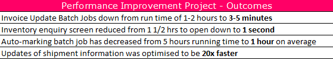

performance-projmanage

You Dynamics AX installation is slow, users complaining about performance and it is not clear what to do to fix that. The solution is to start a performance optimization project. How to organize this project, who should be involved, and how the process should be organized is explained in this blog post.

We recently finished a quite successful performance optimization project and I will use it as an example for this post. The similar approach described here was used on dozens different projects so it is something  

Project overview 

The client was a big retail company running AX2009 for  about 10 years with 80 users and 1TB database size. With the COVID situation they saw increase in their sales and the performance of AX2019 that was average before this became critical.

As a final result they saw a great improvements 

System stability was greatly improved, some measurable results:

In total we did 43 different performance tasks and the project length was 3 months. So these results were quite amazing 

From my side as a technical consultant the project flow and organization was great and contains all typical interaction types that exists in similar projects. The size due  to system complexity was above average(for example TechCon time was 45 days, that is more than probably 10-20 days on average) 

I want to describe the pieces of successful factors and common mistakes that I saw on other projects like this

## Performance project team

The typical project team should have the following people:

- IT manager
- Functional consultant
- Infrastructure manager
- SQL administrator
- Project manager 
- AX Technical consultant

One person can combine several roles but **all these roles** should be a part of the project.

### The typical mistakes of organizing a team

Let's discuss what 

#### - No project manager allocated

Initially that seems reasonable, system is critically slow, you need just technical people who tell you what to do and not managers. But this become an important factor after that. 

A lot of performance tasks are complex, have no direct impact on users and in order to resolve require efforts from different people. Probably the most typical example here is a recurring batch job that tries to reserve quantity for open orders and some orders are old, never be reserved and the processing happens again and again. Or some integration task that tries to process wrong messages every time it runs and do not mark them with the error flag. 

Such tasks can produce a huge constant load on AOSes and SQL Server and quite complex to resolve. So you need to contact with business users, understand the reason for such multiple processing, find a solution, develop and text a fix(this can be complex for job that was developed 5 years ago and nobody want to touch it). So good project manager should allocate resources for tasks like this and control the execution 

#### - Only SQL DBA/Infrastructure team is involved

This is a typical situation in the beginning. Users complaining about performance, you ask you DBA check servers find the reason. And often this also doesn't work and ends up with more statistics or indexes updates. A lot of performance problems related to parameter sniffing issues, and it is hard for SQL DBA to fix that, without knowing what is the logical purpose of these tables and what should be the correct plans for this

#### - SQL DBA/Infrastructure team is not involved

This is an opposite situation to the previous case.  Very often these problems are related to SQL Server or hardware configuration. If you don't include SQL/Infrastructure team into the project team, there is a high chance they just push back these recommendations. 

Even for the most obvious performance counters it is quite easy to do, lets take CPU load as an example. Is the load on AOS is 80% and the recommendation is to add more core - can be argued that almost 20% not used and everything is OK, or if CPU is 100% for 10 minutes and then 10minutes 20% - the average will be 60%. Such discussions are very time consuming and not productive, and may be simplified if all participants are within one team.

#### - Only AX technical consultant involved

Your Dynamics AX slow and you ask AX technical consultants to check why and give recommendations. This is better than nothing, but may not work in a lot of cases. Examples 

## Conclusion

If you use the on-premise system(AX2009, AX2012) and have access to SQL Server, make sure that your administrators know how to diagnose and solve parameters sniffing issues. It may happen even for an old system, for example, a case from this blog happened to a seven year old system.

If you are in the cloud - vote for the [idea](https://experience.dynamics.com/ideas/idea/?ideaid=2a4ab902-5690-ea11-99e5-0003ff68aebe) to fix LCS Insights response time

Any comments are welcome
