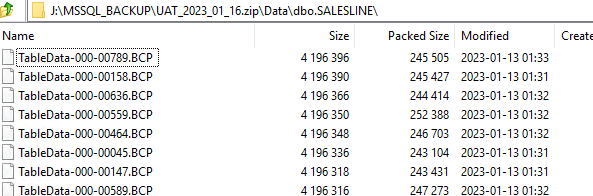
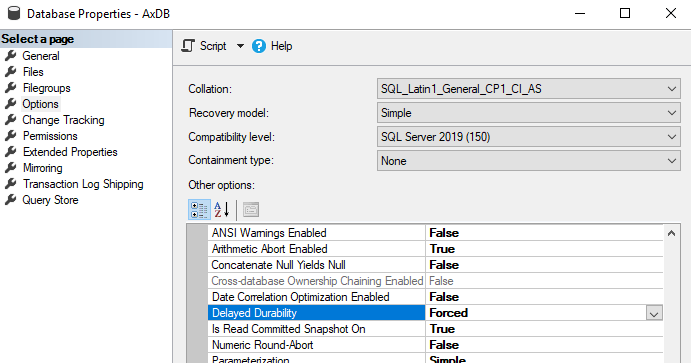

---
title: "Improve the speed for BACPAC database restore from Tier2 to Tier1"
date: "2023-02-01T22:12:03.284Z"
tags: ["ALM"]
path: "/performance-restoretier2"
featuredImage: "./logo.png"
excerpt: "The blog post tests various options for restoring BACPAC files on local SQL Server."
---

Accurate data on D365FO DEV VMs can be vital for development, especially during the Go-Live and Support phases. One of the issues is the different database formats on development VMs, that are using **SQL Server** and UAT/PROD environments that are using **SQL Azure** as database, so to get a copy of the data, you need to convert **SQL Azure** BACPAC file to a standard **SQL server** format(you can use [debugger on Tier2](https://learn.microsoft.com/en-us/dynamics365/fin-ops-core/dev-itpro/database/dbmovement-scenario-debugdiag), but it may be not convenient in some situations).

[**SQL BACPAC**](https://learn.microsoft.com/en-us/azure/azure-sql/database/database-export?view=azuresql) format is a zip file that contains tables data in text format. If you change the .backpac extension to .zip and open it in the archive tool, you will see something like that:



So the BACPAC restore procedure creates all tables in the database and populates the data in these tables.

To load the data, Microsoft released a [SqlPackage](https://learn.microsoft.com/en-us/sql/tools/sqlpackage/sqlpackage?view=sql-server-ver16) tool. You can run it directly or use [d365fo.tools](https://github.com/d365collaborative/d365fo.tools). Both commands are shown below:

```powershell
#USE d365fo.tools
$StartTime = get-date 
Import-D365Bacpac -BacpacFile "J:\LCS\PreProd2022_05_24.bacpac" -ImportModeTier1 -NewDatabaseName PreProd2022_05_24_2
$RunTime = New-TimeSpan -Start $StartTime -End (get-date) 
WRITE-HOST "Execution time was $($RunTime.Hours) hours, $($RunTime.Minutes) minutes, $($RunTime.Seconds) seconds" 

#USE DIRECT SqlPackage CALL 
$StartTime = get-date 
cd C:\temp\
$fileExe = "C:\Temp\d365fo.tools\SqlPackage\SqlPackage.exe"
& $fileExe /a:import /sf:J:\MSSQL_BACKUP\pope_2022_05_16_small.bacpac /tsn:localhost /tdn:pope_2022_05_16_small_sp_ind  /p:RebuildIndexesOfflineForDataPhase=True /MaxParallelism:32 /p:DisableIndexesForDataPhase=FALSE
$RunTime = New-TimeSpan -Start $StartTime -End (get-date) 
WRITE-HOST "Execution time was $($RunTime.Hours) hours, $($RunTime.Minutes) minutes, $($RunTime.Seconds) seconds" 
```

Let's discuss what parameters may be used to change BACPAC restore execution time:

### Get the fast hardware

Azure VMs are quite limited in terms of disk performance. A standard configuration may have SSDs or HDDs disks, but its speed will be much slower compared to local PCEe drives(e.g. Samsung 870 PRO) 

The process is the following: you restore the BACPAC on the local machine, after the restore, create a backup of the SQL database, move it to the Azure file share and copy-restore this SQL backup on the cloud Azure VM. Working with native SQL backup is quite a fast operation compared to BACPAC conversion, and Local PC may provide a great advantage in restoring time. The sample code for this is the following:

```powershell 
$StartTime = get-date 
Import-D365Bacpac -BacpacFile "C:\Temp\PreProd2022_05_24.bacpac" -ImportModeTier1 -NewDatabaseName PreProd2022_05_24_2  -DatabaseServer "SDS-WS83" -SqlUser denis -SqlPwd "Pass" 
$RunTime = New-TimeSpan -Start $StartTime -End (get-date) 
WRITE-HOST "Execution time was $($RunTime.Hours) hours, $($RunTime.Minutes) minutes, $($RunTime.Seconds) seconds" 
```

### Use the Delayed durability database option

Delayed durability is a database option that speeds up certain database operations, but the database may stay in corrupted mode if the server crashes. D365FO database contains a huge number of objects and the time for DB structure creation may be improved by using the Delayed durability flag. 



The main problem is that it can be enabled only after the database is created, but **SQLPackage** doesn't have the option to automate this. So currently, I use this approach only with manual steps. In ~3-5 min after executing **SQLPackage**.exe it creates a database, and then I manually run the following command for the newly created database.

```SQL
USE [master]
GO
ALTER DATABASE [PreProd2022_05_24_2] SET RECOVERY SIMPLE WITH NO_WAIT
GO
ALTER DATABASE [PreProd2022_05_24_2] SET DELAYED_DURABILITY = FORCED WITH NO_WAIT
GO
```

### Use RebuildIndexesOfflineForDataPhase switch

**RebuildIndexesOfflineForDataPhase=True** is one of the **SQLPackage** performance flags that rebuild indexes with offline mode after the data load procedure. On my tests, I noticed some improvements with this flag, and it is something to keep in mind for a larger database.

### Use DisableIndexesForDataPhase switch

By default **SQLPackage** disables table indexes before loading the data and then enables them after the load. For large tables, it should improve the data load performance, but for small tables, you get two additional steps: disable and enable indexes.  **/p:DisableIndexesForDataPhase=FALSE** flag changes this behaviour, it just loads the data. For my test files, it provided a significant performance boost

## Test results

In test, I used the following BACPAC files

- **A small file**:  94MB BACPAC size,  2.2 GB SQL Server database size
- **A standard file**: 2.5GB BACPAC size,  24.7 GB SQL Server database size

I compared two different environments:

- A Local PC with a fast CPU and PCE SSD Intel core i9 10900 2.8GHz(up 4.8Gz)
- A Standard development Azure VM D8v3 E5-2673 v4  (2.3Ghz) and 15HDDs

| Test type                                                    | Small file/Azure | Standard file/Azure | Small file/Local | Standard file/Local |
| ------------------------------------------------------------ | ---------------- | ------------------- | ---------------- | ------------------- |
| Default SQLPackage parameters                                | 1 hour, 16:24    | 3 hours, 51:36      | 21:33            | 1 hour, 23:50       |
| Disabled durability                                          | 46:35            | 3 hours, 18:36      | 20:11            | 1 hour, 20:12       |
| Disabled durability, /p:RebuildIndexesOfflineForDataPhase=True |                  | 2 hours, 52:16      |                  | 1 hour, 07:09       |
| /p:DisableIndexesForDataPhase=FALSE                          |                  | 2 hours, 23:19      | 21:01            | 51:15               |

For the small file, the restore times varied from one hour to 20 minutes. What is interesting here for fast hardware, the restore time is almost independent of various switches. Delayed durability provides a significant boost for slow disk systems(standard DEV VM). Also, for considetable small amount of data, it is worth considering/p:DisableIndexesForDataPhase=FALSE flag

## Summary

I described different options for the BACPAC restore process. Of course, every database size is unique, but this should be a good place to start if you want to optimise the restore time for your project. For example, in my test, a "standard" size file may be restored in 4 hours or just in 1 hour, depending on the different config. 

What is also important is to have a process that covers the need of your project. For example, you may have a standard automated restore process that takes 4h and have an "emergency" process that requires some interactions(e.g. Delayed durability, manually deleting large log tables from BACPAC before the restore, etc...) that can be done in 1h.

I hope you find this information useful. As always, if you see any improvements, suggestions or have some questions about this work, don't hesitate to contact me.
