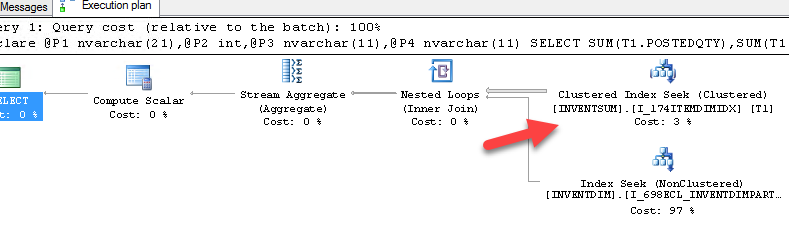
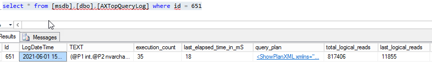

One of the complex and probably most common problem in Dynamics AX performance tuning is a SQL parametest sniffing. I recently posted about how to [fix it](https://denistrunin.com/performance-sniffing), but in this
blog post I want to focus on a sample approach of how to implement a monitoring solution for such types of problems.

## Parameters sniffing example 

Let's consider the example from the recent project. One the critical system processes was a Production journal time posting. After the optimization it worked within acceptable levels(around 5 seconds) but then on Friday 3pm it suddenly started considerable slower (like 30-50 seconds to post the journal, that was affected a lot of users)


[TOP SQL](https://github.com/TrudAX/TRUDScripts/blob/master/Performance/AX%20Technical%20Audit.md#get-top-sql) for the server looked like this(one TOP1 statement with a considerable large logical reads)


When I checked the plan for this TOP1 statement is was the following


This is a "classic" example of wrong InventSum-InventDim join, where InventDim is used as leading table.

The solution was quite simple, a custom plan was created with the OPTIMIZE FOR UNKNOWN, that ensures that SQL Server will not use first passed location/site  

```SQL
EXEC sp_create_plan_guide @name = N'[AX_InventSumLoc]', @stmt = N'SELECT SUM(T1.POSTEDQTY),SUM(T1.POSTEDVALUE),SUM(T1.PHYSICALVALUE),SUM(T1.DEDUCTED),SUM(T1.RECEIVED),SUM(T1.RESERVPHYSICAL),SUM(T1.RESERVORDERED),SUM(T1.REGISTERED),SUM(T1.PICKED),SUM(T1.ONORDER),SUM(T1.ORDERED),SUM(T1.ARRIVED),SUM(T1.QUOTATIONRECEIPT),SUM(T1.QUOTATIONISSUE),SUM(T1.AVAILPHYSICAL),SUM(T1.AVAILORDERED),SUM(T1.PHYSICALINVENT),SUM(T1.POSTEDVALUESECCUR_RU),SUM(T1.PHYSICALVALUESECCUR_RU) FROM INVENTSUM T1 WHERE (((T1.PARTITION=5637144576) AND (T1.DATAAREAID=N''dsg'')) AND ((T1.ITEMID=@P1) AND (T1.CLOSED=@P2))) AND EXISTS (SELECT ''x'' FROM INVENTDIM T2 WHERE (((T2.PARTITION=5637144576) AND (T2.DATAAREAID=N''dsg'')) AND (((T2.INVENTDIMID=T1.INVENTDIMID) AND (T2.INVENTSITEID=@P3)) AND (T2.INVENTLOCATIONID=@P4))))',
@type = N'SQL',
@module_or_batch = null,
@params = N'@P1 nvarchar(21),@P2 int,@P3 nvarchar(11),@P4 nvarchar(11)',
@hints = N'OPTION (OPTIMIZE FOR UNKNOWN)'

```

The correct plan after this become the following:



After the hint creation the posting time returned to normal. 

As I wrote in my [previous](https://denistrunin.com/performance-sniffing) post the insidiousness of such cases is that sometimes people start using reindexing or statistics updates to resolve them, that slow down the whole system without actually fixing the root of this problem. Such maintenance tasks can leads to [Index Maintenance Madness]( https://www.brentozar.com/archive/2017/12/index-maintenance-madness/) and even Microsoft recently published some notes [about this](
https://docs.microsoft.com/en-us/sql/relational-databases/indexes/reorganize-and-rebuild-indexes?view=sql-server-ver15#index-maintenance-strategy )

Let's discuss of how we can monitor such issues

## TOP Queries monitoring solution implementation

Such problems are quite easy to fix, the main complexity is that it can hit your system unexpectedly. But the pattern is always very similar: some new TOP SQL statement that uses non optimal plan. Also you can't monitor it using for example CPU load on SQL Server, in most cases it may not hit critical levels. 

I tried to google some monitoring open source solution that can handle such situations, but found nothing. So in order to be notified on such events I created the following Dynamics AX query performance monitoring procedure:

```sql
msdb.dbo.[AXTopQueryLogMonitor] @MinPlanTimeMin = 30, @MaxRowToSave = 3, @SendEmailOperator = 'axoperator', @DaysKeepHistory = 62
```

The idea is very simple. This procedure every 30 minutes obtains 3(**@MaxRowToSave**) TOP records from the current SQL Server TOP SQL view and if they exist in this log for more than 30 minutes(**@MinPlanTimeMin**) saves them to a table. If any of these 3 statements are new, it send e-mail about this to a specified operator(**@SendEmailOperator**). To prevent this log grows it deletes records older than 62 days(**@DaysKeepHistory**)

To compare with previous statements both SQL plan and SQL text is used, so if one query executed with different plans it appears twice. 

As the result if you have a new TOP statement that you have not seen before, Dynamics AX DBA should get an e-mail like this 


Then after you get this e-mail you can connect to SQL Server and try to analyse/optimize this statement



If the statement can not be optimized, for example **Execution count** is aligned with used business logic and **Execution plan** is optimal you can mark this query as approved   

```sql
Exec [AXTopQueryMarkAsApproved]  111, 'Query is good, used in planning process'
```

## Usage statistics from real-life projects

I run this monitoring on several project where all Dynamics AX performance tuning was made during the previous [audit](https://denistrunin.com/performance-audit) and got the following results:

- **Number of quires need to be analysed** was within 100-200 queries. Basically if you ready to support Dynamics AX performance you need to be ready to analyse your system most heaviest 200 queries.
- **Duration of initial analysis** - it was about 2-3 calendar weeks, more than I expected. In this period I got several new e-mails per day
- **Number of fixed queries** - for one project it was 8. 4 queries had incorrect plan and 4 required new indexes creation. These numbers may not seem high, but keep in mind than previously this project was fixed by the performance audit

What is really great about this solution that it gives a certan level of confidence during the Dynamics AX performance optimization project, if a new SQL query appears in the top you will be notified about this.  

## Some thoughts about D365FO

If you have an on-premise version the monitoring will be the same. For the Cloud version you don't have a direct access to a Production SQL Server. But production database has a Query store enabled and information like "TOP queries for the given time" can be obtained using the SAT restore with a readonly flag. The process is described in the following post [Using Query Store for Performance Tuning with D365 F&O](https://community.dynamics.com/ax/b/axinthefield/posts/using-query-store-for-performance-tuning-with-d365-f-o), but it looks quite complex from a practical point of view(SAT often used to some other tasks and this restore will take some time)

Probably another option is to implement the monitoring logic in X++ and run it as a periodic batch job. 

## Conclusion

Using the described solution you can monitor your Dynamics AX SQL performance and get a notification when some new workload appear in a TOP SQL list. Used code can be found in the following [folder](https://github.com/TrudAX/TRUDScripts/tree/master/Performance/Jobs/SQLTopQueryMonitor).

I hope you find this information useful. Don't hesitate to contact me in case of any questions or if you want to share your Dynamics AX/D365FO SQL monitoring approach. 

