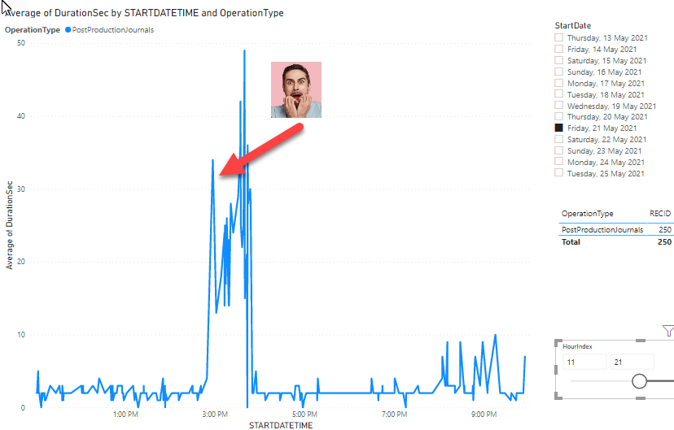
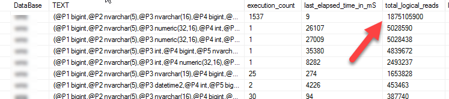
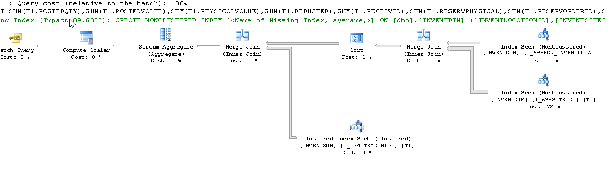
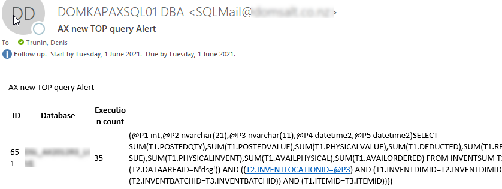

Business operations monitoring is used when you have some important processes in your Dynamics AX system and you want to control/measure the performance of them. It is an activity that may be done after the main Dynamics AX [performance optimization project](https://denistrunin.com/performance-audit) and usually it happens when some processes show unstable behaviour. Usually, the reasons for this are the following:

- Parameters sniffing 
- Some external processes that overload hardware


## Performance log implementation detail

Let's consider the example from the recent project. One the critical system processes was a Production journal time posting. After optimization it worked within acceptable levels(around 5 seconds) but then on Friday 3pm suddenly started considerable slower (like 30-50 seconds to post the journal, that was affected a lot of users)



TOP SQL for the server looked like this(one TOP1 statement with a considerable large logical reads)



When I checked the plan for this TOP1 statement is was the following



This is a "classic" example of wrong InventSum-InventDim join, where InventDim is used as leading table.

The solution was quite simple, a custom plan was created with the OPTIMIZE FOR UNKNOWN, that ensures that SQL Server will not use first passed location/site  

```SQL
EXEC sp_create_plan_guide @name = N'[AX_InventSumLoc]', @stmt = N'SELECT SUM(T1.POSTEDQTY),SUM(T1.POSTEDVALUE),SUM(T1.PHYSICALVALUE),SUM(T1.DEDUCTED),SUM(T1.RECEIVED),SUM(T1.RESERVPHYSICAL),SUM(T1.RESERVORDERED),SUM(T1.REGISTERED),SUM(T1.PICKED),SUM(T1.ONORDER),SUM(T1.ORDERED),SUM(T1.ARRIVED),SUM(T1.QUOTATIONRECEIPT),SUM(T1.QUOTATIONISSUE),SUM(T1.AVAILPHYSICAL),SUM(T1.AVAILORDERED),SUM(T1.PHYSICALINVENT),SUM(T1.POSTEDVALUESECCUR_RU),SUM(T1.PHYSICALVALUESECCUR_RU) FROM INVENTSUM T1 WHERE (((T1.PARTITION=5637144576) AND (T1.DATAAREAID=N''dsg'')) AND ((T1.ITEMID=@P1) AND (T1.CLOSED=@P2))) AND EXISTS (SELECT ''x'' FROM INVENTDIM T2 WHERE (((T2.PARTITION=5637144576) AND (T2.DATAAREAID=N''dsg'')) AND (((T2.INVENTDIMID=T1.INVENTDIMID) AND (T2.INVENTSITEID=@P3)) AND (T2.INVENTLOCATIONID=@P4))))',
@type = N'SQL',
@module_or_batch = null,
@params = N'@P1 nvarchar(21),@P2 int,@P3 nvarchar(11),@P4 nvarchar(11)',
@hints = N'OPTION (OPTIMIZE FOR UNKNOWN)'

```

The correct plan after this this become the following:


After the hint creation the posting time returned to normal. And as I wrote in the index post sometimes such issues can leads to Index maintenance madness or continuous statistics update, that 

## Monitoring solution implementation

Such problems are quite easy to fix, the main complexity is that it can hit your system unexpectedly. But the pattern is always very similar: some new TOP statement that uses non optimal plan. Also you can't monitor it using for example CPU load on SQL Server, in most cases it may not hit critical levels. 

I tried to google some monitoring open source solution that can handle such situations, but found nothing. So in order to be notified on such events I created the following Dynamics AX query performance monitoring procedure:

```sql
msdb.dbo.[AXTopQueryLogMonitor] @MinPlanTimeMin = 30, @MaxRowToSave = 3, @SendEmailOperator = 'axoperator', @DaysKeepHistory = 62
```

The idea is very simple. This procedure every 30 minutes obtains 3(@MaxRowToSave) TOP records from the current SQL Server TOP SQL view and if they exists in this log for more than 30 minutes(@MinPlanTimeMin) saves them to a table. If any of these 3 statements are new, it send e-mail about this to a specified operator(@SendEmailOperator). To prevent this log grows it deletes records older than 62 days(@DaysKeepHistory)

To compare with previous statements both SQL plan and SQL text is used, so if one query executed with different plans it appears twice. 

As the result if you have a new TOP statement that you have not seen before AX DBA should get an e-mail like this 



If you get this, you need to connect to SQL Server and try to analyse 

--PIC


Some numbers

How many quires need to be analysed: I used it for several projects and it was within 100-200 queries. Basically if you ready to support Dynamics AX performance you need to be ready to analyse your system most heaviest 200 queries.

Duration of initial analysis - it was about 2 calendar weeks, more than I expected

Number of fixed queries - for one project it was 8. 4 queries had incorrect plan and 4 required new indexes creation. 

But keep in mind that previously this project was fixed by the performance audit


## Some thoughts about D365FO

If you have an on-premise version the monitoring will be the same. For the cloud version you don't have an access to a Production SQL. Production database has a Query store enabled and basically this information(TOP queries for the given time )


The official way is using SAT restore with readonly flag, but it looks quite unusable from a practical point of view(SAT often used to some other tasks)

[Using Query Store for Performance Tuning with D365 F&O](https://community.dynamics.com/ax/b/axinthefield/posts/using-query-store-for-performance-tuning-with-d365-f-o)


## Conclusion

In this blog post I provided some samples on how to implement performance monitoring in Dynamics AX and analyse performance of Dynamics AX operations with Power BI. Sample files(xpo that contains log table, form and a helper class) can be found in the following [folder](https://github.com/TrudAX/TRUDScripts/tree/master/Performance/Jobs/TimeLogTable).

I hope you find this information useful. Don't hesitate to contact me in case of any questions or if you want to share your Dynamics AX/D365FO operations monitoring approach. 

