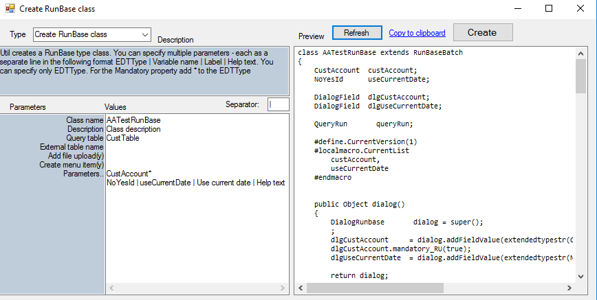
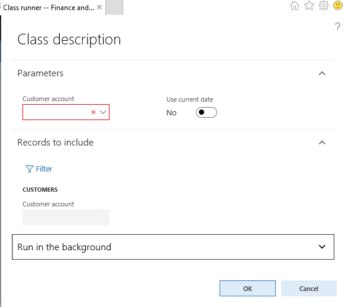
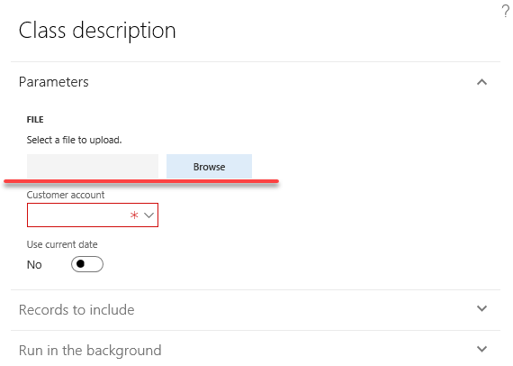

## RunBase template class builder

This topic describes "RunBase class builder" Add-in, it's parameters and usage. The purpose of this Add-in is to generate template code for class that extends RunBaseBatch based on typical usage scenarios. 

## Main screen

Add-in can be run from the **Dynamics 365** - **Addins** - **RunBase class builder**

You can specify values for each parameter, preview the changes(using the Refresh button) and if you are fine with it, automatically generate the class and the related menu item. 



As a result the following class will be generated




Let's describe the Add-in parameters

### -Class name

Class name of the resulting class

### -Description

Value that will be returned from the static description() method

### -Parameters..

You can specify several parameters that will be displayed in the user dialog. One line per parameter. To describe the parameter the following information should be provided(values are separated by | delimiter):

- **EDT** - Extended data type name. If you want this field be mandatory in the dialog, add * at the end
- **Variable name** - variable that will be generated. Can be empty, in this case it is generated from EDT
- **Label** - you can override EDT label for the field on the dialog form, can be empty, in this case EDT label will be used
- **Help text**- you can override EDT help text for the field on the dialog form, can be empty, in this case EDT help text will be used   

The following code is generated for each parameter

```csharp
//ClassDeclaration
CustAccount  custAccount;
DialogField  dlgCustAccount;
#localmacro.CurrentList
    custAccount
#endmacro
//dialog
dlgCustAccount     = dialog.addFieldValue(extendedtypestr(CustAccount), custAccount);
//getFromDialog
custAccount      = dlgCustAccount.value();
//parm method
public CustAccount parmCustAccount(CustAccount _custAccount = custAccount)...
```

### -Query table

If you want to display a query in the dialog, you need to specify main table for this query here. In this case the following code will be added:

```csharp
//ClassDeclaration
QueryRun       queryRun;
//initQuery() sample code for query init
Query                   query = new Query();
QueryBuildDataSource    qbds = query.addDataSource(tablenum(CustTable));
QueryBuildRange         qBR;
;
qBR = SysQuery::findOrCreateRange(qbds, fieldnum(CustTable, RecId));
qBR.status(RangeStatus::HIDDEN);
queryRun = new QueryRun(query);
//pack() unpack() support for this queryRun
//run() - sample code
qBDS = queryRun.query().dataSourceTable(tableNum(CustTable));
        SysQuery::findOrCreateRange(qBDS, fieldnum(CustTable, RecId)).value(queryValue(""));
        
this.progressInit(RunBase::getDescription(classIdGet(this)),
                  SysQuery::countTotal(queryRun),
                  #AviSearch);
while (queryRun.next())
{
    custTable = queryRun.get(tablenum(CustTable));

    processedCounter++;
    progress.incCount();
}
```

### -External table name

Table type of caller record should be specified. This covers a scenario, when class is calling from a Menu item button on form. Often in this case we need to save caller record, check for the caller record or update existing query based on the caller record. 

The following code will be generated (**External table name** = CustTable)

```csharp
//ClassDeclaration
CustTable    callerCustTable;
//main
if (_args.dataset() != tablenum(CustTable))
{
    throw error(Error::missingRecord(funcname()));
}
runObject.parmCallerCustTable(_args.record());
if (_args && _args.record().TableId == tablenum(CustTable))
{
    qbds = runObject.queryRun().query().dataSourceTable(tablenum(CustTable));
    qbds.clearRanges();
    qbds.addRange(fieldnum(CustTable, RecId)).value(queryValue(runObject.parmCallerCustTable().RecId));
    //runObject.parmIsDisableUnpackQuery(true);
}

```

### -Add file upload

Need to specify 'y' symbol to generate code that allows user to select a file from the local PC. It will add fileUploadResult variable, all necessary code to handle this file and a sample code that displays uploaded text file content.

 

```csharp
//run()
memoryStreamFile = fileUploadResult.openResult();
AsciiStreamIo asciiIo = AsciiStreamIo::constructForRead(memoryStreamFile);
asciiIo.inRecordDelimiter('\n');
while (asciiIo.status() == IO_Status::Ok)
{
    container c = asciiIo.read();
    if (conLen(c) > 0)
    {
        info(strFmt("File data:%1", conPeek(c, 1)));
    }
}
```
Comparing to AX2012(where you can simple define variable with the FileNameOpen type) adding file upload button requires more code in D365FO, as Dialog doesn't support file control. I even created an idea to improve this https://experience.dynamics.com/ideas/idea/?ideaid=ac0834aa-216c-e711-80c0-00155d7cd0b4, but the status is still New.

### -Create menu item

Specify 'y' symbol to create an Action menu item linked to the created class.

## Conclusion 

This utility covers some common pattern of RunBase usage, so you can focus on business logic developing rather than typing standard code. If you find that something is missing or can be improved don't hesitate to leave a comment.