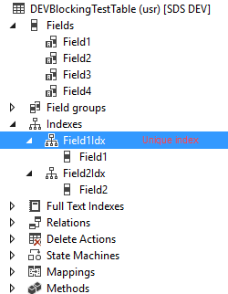
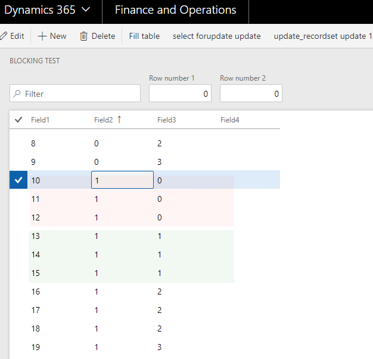
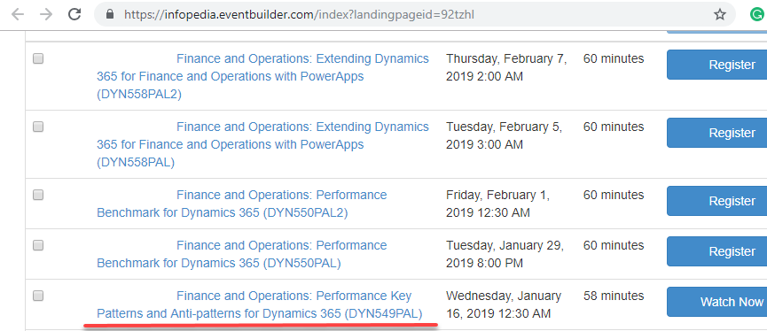
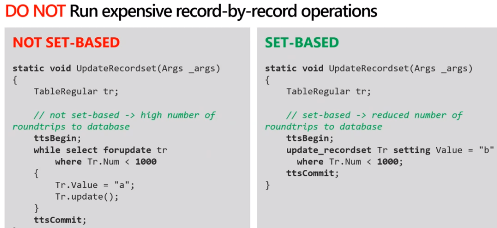
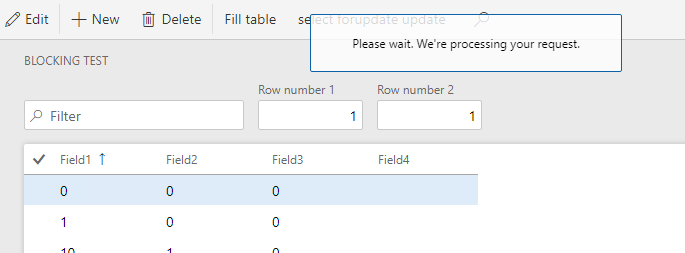

Understanding blocking is a key component of resolving performance issues. You can have fast CPU, a lot of memory, but if you face SQL blocking problem all these will not be used. Moreover, some advises from the Performance sessions  can actually leads to the blocking. In this post I describe the most common reasons for blocking and how to avoid this

## History	

SQL Server engine doesn't support "true" row level blocking, and this was a big problem in the days of Axapta 3.0. But starting with AX 4.0 and SQL Server 2005 situation had changed. SQL Server 2005 introduced  *Read Committed Snapshot Isolation* feature, and AX 4.0 "Occ enabled" table property

https://blogs.msdn.microsoft.com/emeadaxsupport/2009/07/08/about-locking-and-blocking-in-dynamics-ax-and-how-to-prevent-it/

## Test form 

We will test using the following table

 DEVBlockingTestTable table, that has 4 fields, Field1 is a unique Alternate Key, Field2 has a non unique index



We create a form DEVBlockingTest with an different action on it. Initial data will be the following 



### Test 1 - select forupdate

First test is using select forupdate statement 

```csharp
ttsbegin;
while select forupdate blockingTableLocal
	where blockingTableLocal.Field2 == updateRow1 &&
		  blockingTableLocal.Field3 == updateRow2
{   
	blockingTableLocal.Field4 += "u1";
    blockingTableLocal.update();
}
Box::okCancel("Select forupdate has been done", DialogButton::Ok);
ttsabort;
```

We need to run 2 sessions(for OneBox VMs using the following link

https://usnconeboxax1aos.cloud.onebox.dynamics.com/?f=DEVBlockingTest ) 

For the first session enter Row number 1 = "1" and Row number 2 = "0" and press "select forupdate" button. For the second session enter "1" and "1"

Result: both sessions will shown OK message. Actually it doesn't matter what fields or conditions we are using in forupdate statement, sessions will not block each other in any case. Even in a worst case scenario, when 2 sessions will update the same row, blocking doesn't happens, instead UpdateConflict exception will be generated(this is the drawback of "Occ enabled" property, it doesn't fit tables where concurrent updates are normal, like InventSum)


https://infopedia.eventbuilder.com/index?landingpageid=92tzhl 





slide



let's test this. the same example, but using the update_recordset command

```
ttsbegin;

update_recordset blockingTableLocal
    setting Field4 = "u1"
    where blockingTableLocal.Field2 == updateRow1
     &&   blockingTableLocal.Field3 == updateRow2;

Box::okCancel(strFmt("update_recordset has been done. Rows: %1", blockingTableLocal.RowCount()), DialogButton::Ok);

ttsabort;
```

run second session




## Summary

Following some performance advices(even they are given by ) can really slow down your system. 

Try to avoid any update_recordset and delete_from usage by default(especially in documents posting operations). Use it only when you 100% sure that it will not leads to blocking and you actually need to reduce operation time

If you still want to use update_recordset, check that i

I put the test objects to GitHub. It's a form DEVBlockingTest and a DEVBlockingTestTable. Fill free to experiment with it