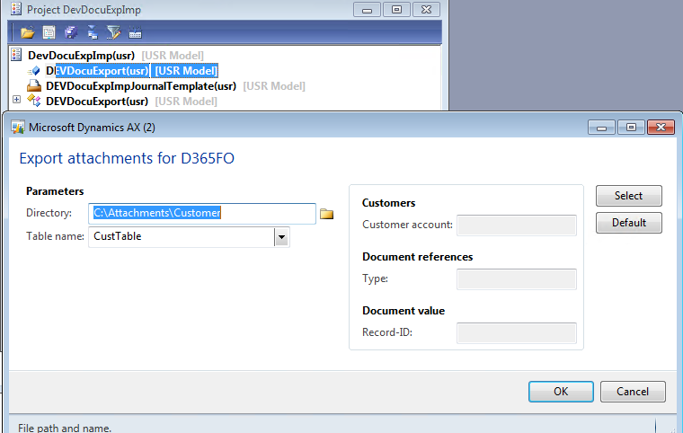
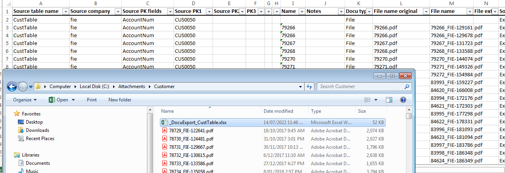
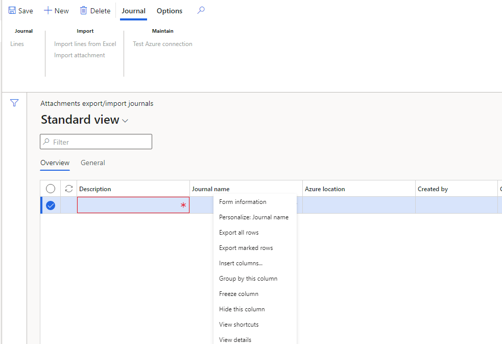
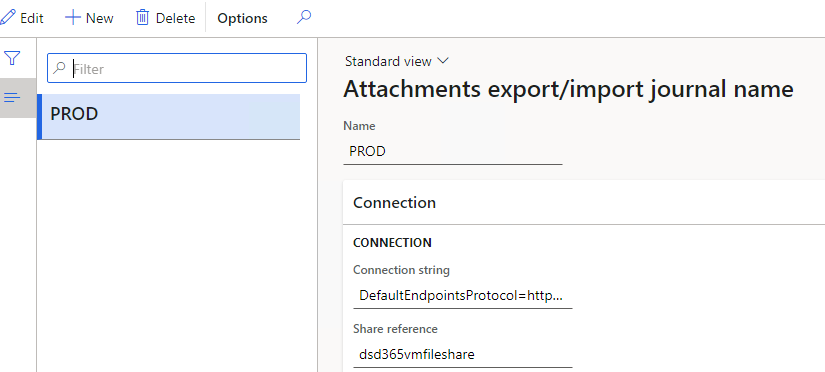
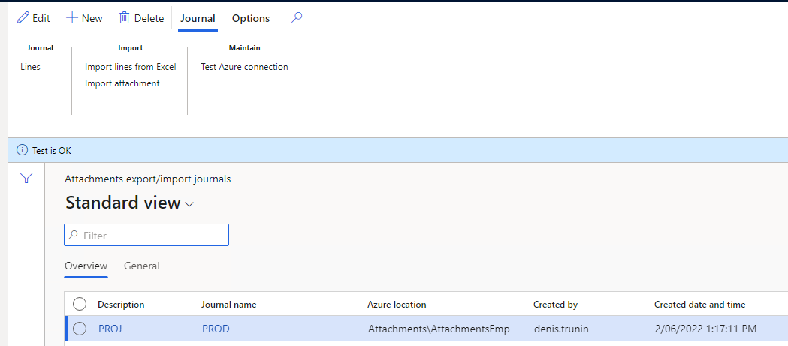
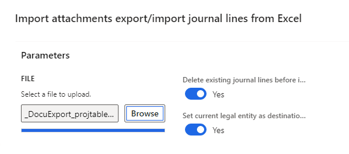
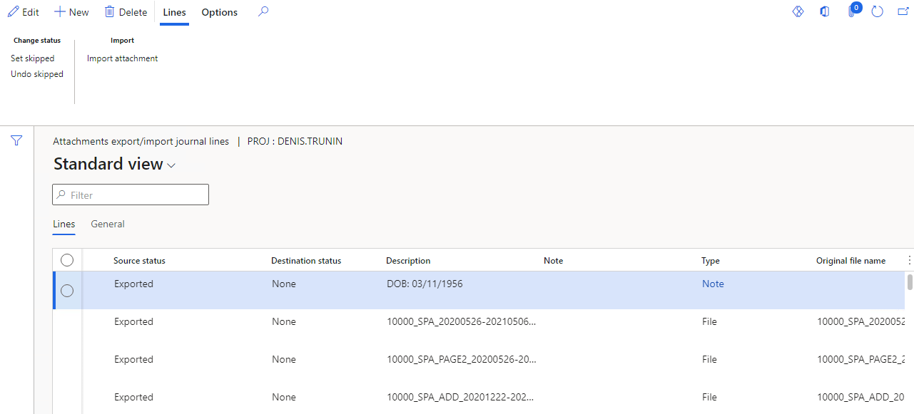
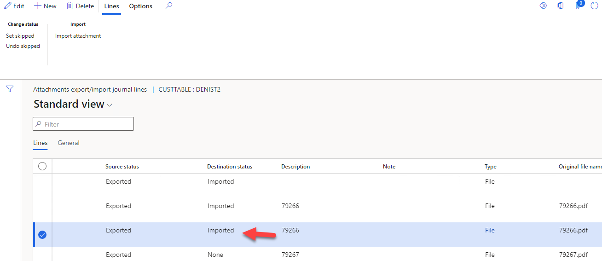
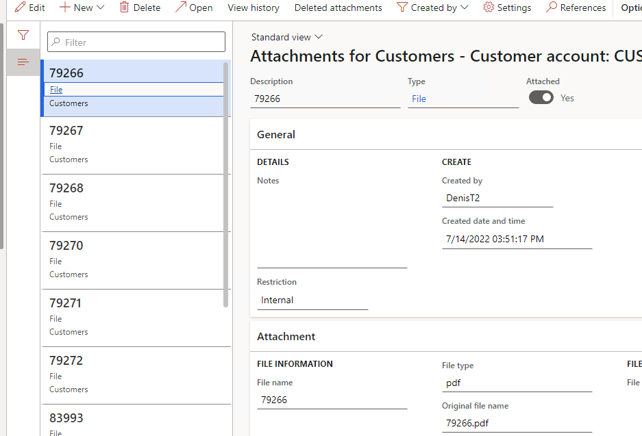

---
title: "D65FO upgrade. Transfer attachments from AX2012"
date: "2022-05-17T22:12:03.284Z"
tags: ["XppDEVTutorial", "Integration"]
path: "/upgradeD365-attachments"
featuredImage: "./logo.png"
excerpt: "The blog post describes a sample approach to implement recurring file-based integration in D365FO using X++"
---

Attachments export/import journal name

## Module description 

There are already several ways of transferring attachments while doing a migration project from AX2012 to D365FO, so this post can add additional method, and probable can be called "yet another way to transfer attachments from AX2012"

The reason for development was to provide more flexibility and control over AX2012 attachment transfer.
Lets check how it works

Module consists of AX2012 and D365FO part

you need to import AX2012 project to your application and run DEVDocuExport menu

It will display the following window:



This dialog allows you to specify a related to attachments table and setup some filters for this table(e.g. export attachments only for not blocked customer)

As the result of this run you will get a directory with all attachments and a description file that links the primary table key to a attachment file



Using this file give you a huge flexibility, you can rename table keys or change document types mapping

The next step is to copy the directory from AX2012 attachments to azure storage. It can be done by using the following power shell command

```powershell
cmd.exe /C "cmdkey /add:`"aaavmstorage.file.core.windows.net`" /user:`"localhost\aaavmstorage`" /pass:`"BQubgv1NlZE+LtbbL8jKLrkVSwBlLHGuygbu9fy6gDv+UiRTiw63cpmVlAEVhSLCup1XRbbVajt6ww==`"" 
# Mount the drive 
New-PSDrive -Name Z -PSProvider FileSystem -Root \\aaavmstorage.file.core.windows.net\aaavmfileshare 

Copy-Item "C:\Attachments" -Destination "Z:\Attachments" -Recurse
```

# D365FO part

You have your attachments in the cloud, it is time to import them into D365FO

In order to do this open the following link

```html
https://fletcher.operations.dynamics.com/?cmp=FIE&mi=DEVDocuExpImpJournalTable

```

It will open the empty import attachment form



First step is go to journal name and create a new journal type. A journal type defines a reference to Azure file share, you need to specify a connection string and a share reference



Then you need to specify Azure location for our import and press Test connection button to validate settings



Journal created, you need to import lines from the Excel definition files created duting the export 



It will create journal lines(one line per file)



The final step is to load the attachments, you can do this only for one line(e.g. to test the process) or for the whole journal



And as the result you get a record with attachments 



## Summary


Another important question when you implement a solution like this: is how fast will be your integration. I wrote about sample steps for performance testing in the following post: [https://github.com/TrudAX/XppTools/tree/master/DEVTutorial/DEVDocuExpImp](https://github.com/TrudAX/XppTools/tree/master/DEVTutorial/DEVDocuExpImp) 

I hope you find this information useful. As always, if you see any improvements, suggestions or have some questions about this work don't hesitate to contact me.