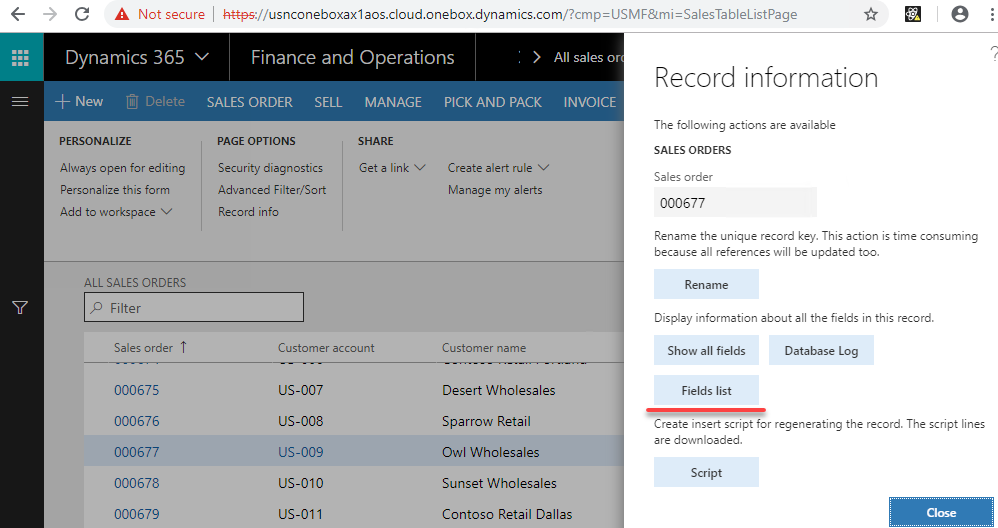
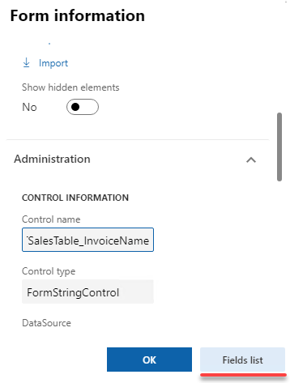

intro

Standard tools

Currently you have the following tools to work with the data that are not visible in the user interface

- SQL via **SQL Management Studio**
- **Table browser** form
- Record info - **Show all fields** form

Typical problems when using these tools

- Table fields that have *Visible = false* are not shown in D365 forms
- If table has many columns it is hard to find the requited column 
- D365 doesn't allow change values for the column that have *AllowEdit=false*

Show Fields list form provides a convenient way to view current record data with the following options:

- Data is shown in list view with Name and Label for each field(even with Visible = false) that allows you to quickly find the requited field value
- Additional filed information(like EDT name, Enum value, Enum name..) is displayed
- You can view data for the current record even the record is not saved into database
- You can compare records
- You can update or delete current record with or without validation(it is not that you should use on test data, but sometimes it can be useful during the development or debugging process)

Tool usage 

Open All sales orders form and go to the Options-Record info and then press Fields list button

Fields list will run and shown the current data for the selected sales order

Another way to run this form - Right click on the form field, press Form information and then Field list button. This doesn't not saves the current form cursor, so you can view uncommitted data  

### Edit feature

You can edit a field value or delete the current record. To change the field value press the Change value button.

In this dialog you can check Ignore update parameter. In this case update will be performed with doUpdate() method call. Delete provides the same option. Do not use editing feature on test/prod data, you can easily corrupt the data.

Compare feature

## Show Fields list tool

Download Source code from GitHub

Copy DEVTools folder to your package folder (C:\AOSService\PackagesLocalDirectory )

Start Visual Studio and Run compile for the DEVTools folder (Dynamics 365 –Build models.. – Select DEVTools)

## Summary

Fields list tool in some can simplify and speed up development speed. Fell free to post any comment(better as GitHub Issues) or ideas, what else can be improved. 