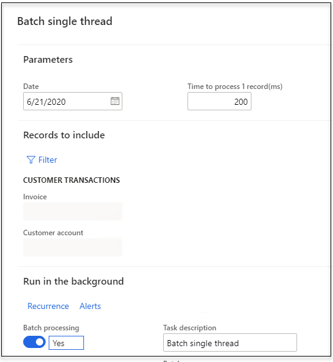
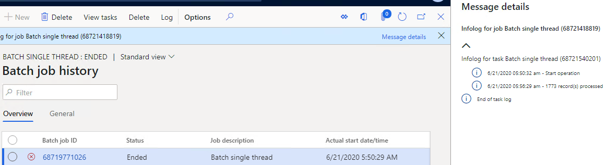
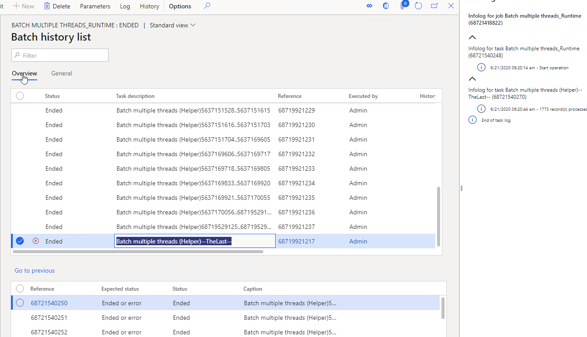

One of the powerful feature of Dynamics 365 Finance and Operations is a Batch framework. In this post I explain how you can work with tasks to optimize the performance of batch task

## Initial example 

Les's consider the following operation - a user dialog that process a customer transactions and performs some operation at the end. 




Logic is very simple - loop thought all specified customer transactions and call process function. In our case it will sleep for the specified number of milliseconds

```csharp
public void run()
{
    //1. data preparation
    info(strFmt("%1 - Start operation", AifUtil::applyUserPreferredTimeZoneOffset(DateTimeUtil::utcNow())));

    //2. Query Processing
    this.runQueryProcessing();

    //3.final task
    info(strfmt("%2 - %1 record(s) processed", SysQuery::countTotal(queryRun),
 AifUtil::applyUserPreferredTimeZoneOffset(DateTimeUtil::utcNow())));
}
public void runQueryProcessing()
{
    while (queryRun.next())
    {
        CustTrans   custTrans = queryRun.get(tablenum(CustTrans));
        this.processRecord(custTrans);
    }
}
public void processRecord(CustTrans  _custTrans)
{
    //do some job using _custTrans and transDate
    sleep(taskSleepTimeMs);
}
```

The standard USMF demo company there are 1700 customer transactions, so if we run this job in a user interface or in a batch it will take 340 seconds




https://usnconeboxax1aos.cloud.onebox.dynamics.com/?mi=SysClassRunner&cls=DEVTutorialBatchSingleThread&cmp=USMF


the following results




## Summary

You can download this "**DataContract class builder**" from the following link https://github.com/TrudAX/TRUDUtilsD365/releases. If you find that something is missing or can be improved, don't hesitate to leave a comment.
