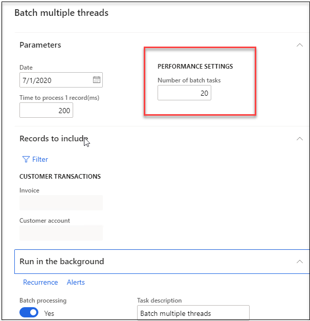

One of the powerful feature of Dynamics 365 Finance and Operations is a Batch framework. In this post I explain how you can convert your existing batch job to multithreaded in order to increase a performance.

## Initial example 

Let's consider the following operation - a user dialog that process customer transactions and performs some operation at the end. 


Logic is very simple - loop thought all specified customer transactions and call **process()** function. In our case it will sleep for the specified number of milliseconds. After the transactions processing it runs a final function - in our case it is just an Infolog message.

```csharp
public void run()
{
    //1. data preparation
    info(strFmt("%1 - Start operation", AifUtil::applyUserPreferredTimeZoneOffset(DateTimeUtil::utcNow())));

    //2. Query Processing
    this.runQueryProcessing();

    //3.final task
    info(strfmt("%2 - %1 record(s) processed", SysQuery::countTotal(queryRun),
 AifUtil::applyUserPreferredTimeZoneOffset(DateTimeUtil::utcNow())));
}
public void runQueryProcessing()
{
    while (queryRun.next())
    {
        CustTrans   custTrans = queryRun.get(tablenum(CustTrans));
        this.processRecord(custTrans);
    }
}
public void processRecord(CustTrans  _custTrans)
{
    //do some job using _custTrans and transDate
    sleep(taskSleepTimeMs);
}
```

Standard USMF demo company has 1700 customer transactions, so if we run this job with no filters in a user interface or in a batch and specify a time 200ms to process one transaction it will take 340 seconds for the whole job.


https://usnconeboxax1aos.cloud.onebox.dynamics.com/?mi=SysClassRunner&cls=DEVTutorialBatchSingleThread&cmp=USMF

## Solution design principles

It is quite obvious that we can optimize this by running the code in parallel threads. The possible options of how this work described in Ax perf blog - [Batch Parallelism in AX](https://docs.microsoft.com/en-us/archive/blogs/axperf/batch-parallelism-in-ax-part-iv), but every approach from that article has it's pros and cons. 

What should be considering while designing a simplified solution for this:

- A change should be simple and require minimum changes to the original class. We don't what to create new classes or new tables to support a parallel execution. 
- We can't run a single batch thread per one transaction - it will create a lot of overhead for batch framework, so solution should allow to specify a maximum batch threads.
- Execution flow in batch mode or in user interface should be exactly the same, better to avoid operations that can be run only in batch. 
- We should support the final task and it should be executed only once after transactions processing

In most cases we(as a developers) should know how to split the load. In the example above we can just split selected customer transaction by equal intervals, but the split function can be more complex(for example we may want to avoid running parallel tasks for the same customer in order to avoid blocking)

The main idea is to introduce a new class parameter **batchIdentifier** - identification for the split interval and then run our logic only for this interval.

I created a base class **DEVTutorialBatchMultipleThreadBase** to incorporate this logic. If we have **batchIdentifier** specified - that means it is child class that needs to perform a calculation for this **batchIdentifier**. If the class executed with an empty batch identifiers - that means it is a main task that should split the load and create all tasks for each split key and the final task at the end

```csharp
class DEVTutorialBatchMultipleThreadBase extends RunBaseBatch
{
    public void run()
    {
        container               batchIdentifierCon;
        int                     i;
        ;
        if (batchIdentifier) //child task
        {
            if (batchIdentifier == this.finalTaskIdentifier())
            {
                this.runFinalTask();
            }
            else
            {
                this.runThreadTask();
            }        
        }
        else
        {
            this.runStartTask();

            batchIdentifier = this.finalTaskIdentifier();
            this.processThreadItem(true); //create the final task, we need a dependency, so create it in the beggining.
        
            batchIdentifierCon = this.getBatchIdentifiersRangeCon();
                
            for (i = 1; i <= conLen(batchIdentifierCon); i++)
            {
                batchIdentifier = conPeek(batchIdentifierCon, i);
        
                this.processThreadItem(false);        
            }

            if (finalTask)
            {
                if (this.isInBatch())
                {
                    batchHeader.save();
                }
                else
                {
                    finalTask.run();
                }
            }
        
        }        
    }
```

Method **processThreadItem** creates the same instance of our class and calls a **pack** function. If the process is executed in a batch mode it create a new **runtime batch task**, without batch mode it just run this task.

## Multiple threads batch example

Let's change our class to multithread 

we need to implement 3 function - **runStartTask()**, **runThreadTask()**, **runFinalTask()** to execute our tasks and **getBatchIdentifiersRangeCon()** to create a list of intervals - in our case it will be ranges **FromRecId..ToRecId** for the selected transactions. Method **getBatchIdentifiersRangeCon()** is the most complex and new in this example, all others just a copy of original methods. 

```csharp
public class DEVTutorialBatchMultipleThread extends DEVTutorialBatchMultipleThreadBase
{
public void runStartTask()
{
    //1. data preparation
    info(strFmt("%1 - Start operation", AifUtil::applyUserPreferredTimeZoneOffset(DateTimeUtil::utcNow())));
}
public void runThreadTask()
{
	//2. Query Processing
	QueryBuildDataSource  qBDS = queryRun.query().dataSourceTable(tablenum(CustTrans));
    qBDS.addRange(fieldnum(CustTrans, RecId)).value(batchIdentifier); // highlight-line
    while (queryRun.next())
    {
        CustTrans   custTrans = queryRun.get(tablenum(CustTrans));
        this.processRecord(custTrans);
    }
}
public void runFinalTask()
{
    //3.final task
    info(strfmt("%2 - %1 record(s) processed", SysQuery::countTotal(queryRun),
                AifUtil::applyUserPreferredTimeZoneOffset(DateTimeUtil::utcNow())));
}
public container  getBatchIdentifiersRangeCon()
{
    container  res;
    QueryRun   queryRunLocal = new QueryRun(queryRun.query());

    QueryBuildDataSource   qBDS = queryRunLocal.query().dataSourceTable(tablenum(CustTrans));
    int                    totalRecords, curRecord, recordsPerBatch;
    RecId                  fromRecId, toRecId;

    qBDS.sortClear();
    qBDS.addSortField(fieldnum(CustTrans, RecId));
    !!!qBDS.addRange(fieldnum(CustTrans, RecId)).value(batchIdentifier);

    totalRecords = SysQuery::countTotal(queryRunLocal);
    recordsPerBatch = maxTaskCount > 0 ? totalRecords div maxTaskCount : totalRecords;       if (! recordsPerBatch)
    {
        recordsPerBatch = 1;
    }
    while (queryRunLocal.next())
    {
        CustTrans   custTrans = queryRunLocal.get(tablenum(CustTrans));
        if (! fromRecId) fromRecId = custTrans.RecId;

        curRecord++;
        toRecId = custTrans.RecId;
        if ((curRecord mod recordsPerBatch) == 0)
        {
            res += SysQuery::range(fromRecId, toRecId);
            fromRecId = 0;
            curRecord = 0;
        }            
    }        
    if (curRecord && fromRecId && toRecId) res += SysQuery::range(fromRecId, toRecId);
    return res;
}
    
```

In user interface we added a new field **"Number for batch tasks"** to allow user to specify how many tasks to create. 



if we run our function in batch mode we will see the following result


In this case we got the total execution time 30 sec, but values less than a minute are more related to batch processing.

## Summary

I described how easily you can implement a multithreading in **RunBase** framework and convert the existing single threaded task to the multithreaded one. One note for this - use this approach only after you perform all possible optimizations for the original code, running non optimal code in multiple threads can create problems. Also the described solution if compatible with Ax2009 and AX2012, so you can use exactly the same approach. 

You can download all classes used in this post from the following link [DEVTutorialBatchSingleThread](https://github.com/TrudAX/XppTools/blob/master/DEVTutorial/DEVTutorial/AxClass/DEVTutorialBatchSingleThread.xml), [DEVTutorialBatchMultipleThreadBase](https://github.com/TrudAX/XppTools/blob/master/DEVTutorial/DEVTutorial/AxClass/DEVTutorialBatchMultipleThreadBase.xml),  [DEVTutorialBatchMultipleThread](https://github.com/TrudAX/XppTools/blob/master/DEVTutorial/DEVTutorial/AxClass/DEVTutorialBatchMultipleThread.xml) . If you find that something is missing or can be improved, don't hesitate to leave a comment.