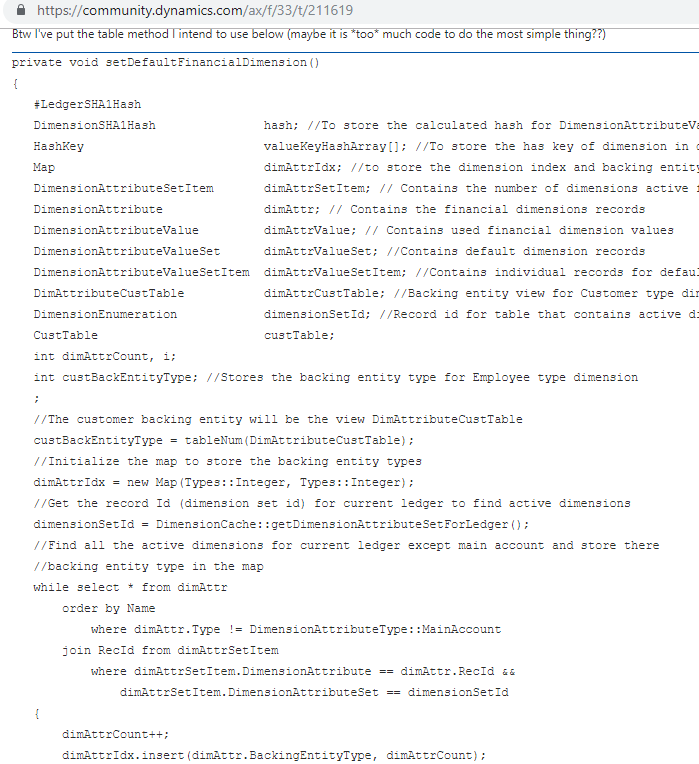
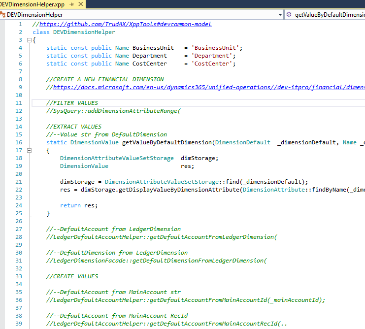

Working with the financial dimensions framework has become much more difficult starting with the AX2012. This post describes the most common problems and how to resolve them.

## The current problems

The current challenges that I saw on the projects while working with the financial dimensions framework were the following:

### Misunderstanding of the concept

There is no starting point if you want to learn Financial dimensions framework. The best I found is the original [Implementing the Account and Financial Dimensions Framework for Microsoft Dynamics AX 2012 Applications](http://download.microsoft.com/download/4/e/3/4e36b655-568e-4d4a-b161-152b28baaf30/implementing_the_account_and_financial_dimensions_framework_ax2012.pdf) whitepaper that explains the concept, but its content is quite outdated for D365FO. GitHub [request](https://github.com/MicrosoftDocs/dynamics-365-unified-operations-public/issues/236) to update this document was closed, standard D365FO [Financials development home page](https://docs.microsoft.com/en-us/dynamics365/unified-operations//dev-itpro/financial/financial-dev-home-page) contains some really specific information and no basic overview.

### Reference to the dimension

Sometimes you need to reference just one dimension value(for example get or set "Cost center" value). You don't see many examples of this in the standard application, as in most cases dimension merging is using. In AX2009 it was quite easy - you had an enum and could use it to get or set the value. In the current version, you need somehow reference a record in the *DimensionAttribute* table and there is no "recommended" way of doing this. So I have seen different implementations:

- Add *DimensionAttribute* to parameters(as String or as RecId)

- Create a new table with enum and reference to *DimensionAttribute*

- Search *DimensionAttribute* by backing table ID

- Search *DimensionAttribute* by name defined as a Macro

- ... sometimes combinations of these options to access the same dimensions

All this can create a real mess, some of these options require a setup, some don't compatible with cross-references.

### Methods for working with Dimensions

There are a lot of classes to manipulate dimensions, so it is often difficult to find the right one. Moreover, classes related to dimension were renamed in D365FO(comparing to AX2012). As a result, developers sometimes create a duplicate of the existing methods. 

For example, if you google "assign a value to default dimension" the first link will point to the 2-pages method



 Probably it can work but can cause difficulties with the support, performance and upgrades.

## Proposed solution - DEVDimensionHelper class

To resolve the described issues I have created [DEVDimensionHelper](https://github.com/TrudAX/XppTools/blob/master/DEVCommon/DEVCommon/AxClass/DEVDimensionHelper.xml) class(you can rename it with your project prefix or use the default DEV). The idea is to collect all the necessary stuff in one place.

In order to reference a dimension, you create a static constant in this class 

```csharp
static const public Name BusinessUnit   = 'BusinessUnit';
```

In this case, you don't need to perform any setup and can use "Find All References".

Currently this class contains the following references:

- Create a new dimension
- Query filter by dimension
- Get Dim value as string from the **DefaultDimension**
- Get a **DefaultAccount** from the **LedgerDimension**
- Get a **DefaultDimension** from the **LedgerDimension**
- Create a **DefaultAccount** from the **MainAccount**(String)
- Create a **DefaultAccount** from the **MainAccount**(RecId)
- Create a **LedgerDimension** from the **DefaultAccount** and **DefaultDimension**
- Create a **DefaultDimension** from the Dim value(String)
- Merge **DefaultDimension** with the **DefaultDimension**
- SQL statement to get dimension(used for debug purposes)



As you see, no new code exists, all these just references(or small wrappers) to the standard classes. These methods will cover typical project requirements, if you need more, you can add them to this class. The idea is to use this class as a starting point for any dimension related question on the project(even before google something). You get some dimension related question, you check this class, if there is no answer in it, research how to do this task and update the class with the solution(either in form of new methods or just references to existing objects).

## Summary

You can download this class using the following link https://github.com/TrudAX/XppTools/blob/master/DEVCommon/DEVCommon/AxClass/DEVDimensionHelper.xml

If you know some other methods that can be added into this class feel free to create a GitHub pull request or leave a comment.
