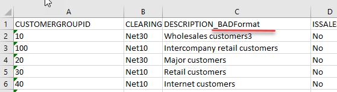
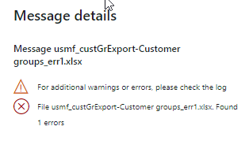
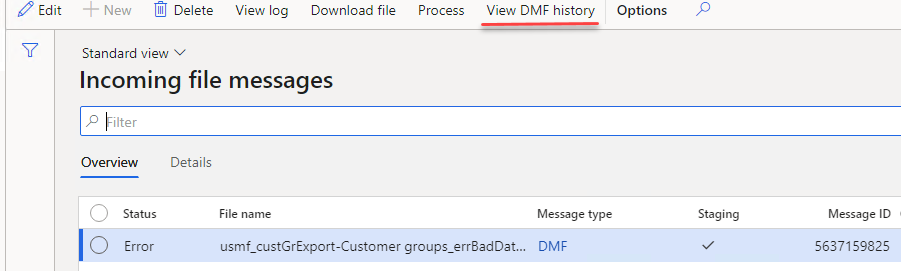
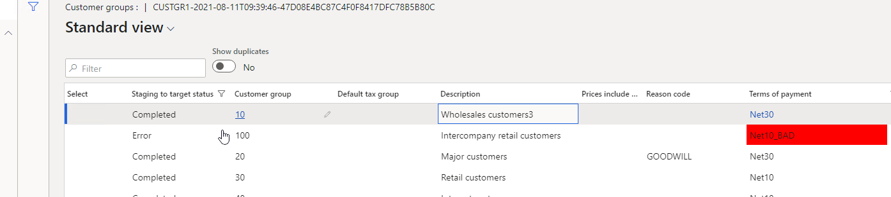

---
title: "Multicompany DMF integration in Dynamics 365 FinOps using X++"
date: "2020-12-17T22:12:03.284Z"
tags: ["XppDEVTutorial", "Integration"]
path: "/xpptools-fileintegdmf"
featuredImage: "./logo.png"
excerpt: "The blog post describes a sample approach to implement recurring file-based integration in D365FO using X++"
---

On one of my latest post I described a sample aproach for a periodic file-based integration using pure X++. So the external system created files on the Azure file share, then D365FO pulls these files, parse and processes them. One of the comments was why DMF is not used for such task

That is a perfectly valid comment, given to the fact that if you want to develop import from the scratch you need to do a lot of programming, like cate staging tables and forms, implement a file parsing and create the final document via X++ code. 

In this blog post I will show how DMF can be used in the same framework in order to implement periodic files import

## Solution description

We have an incoming folder in **Azure file share** that contains a set of files and we need to import them via DMF. In this example I will use Customer group entity in CSV format. Also let's implement a multi-company import, a company code will be specified for a file as a first characters before "_"  

We need to import these files and view the import status per file 


## Proposed solution

In the following section, I provide some code samples that can be used as a starting point to implement a periodic file import and processing.

### File share connections form

This form is used to define a connection to a cloud file share. In this example we will use a Azure file share link

### Inbound message types form

In this form we need to create a new class that processes our files. The logic for this will be quite simple: load a file, change the company, pass the file to a DMF framework. The DMF call will be a **synchronous**, so we can get the status from DMF after the processing and update our message table.

On this form we can also specify for which entity we need to run our import. Basically it links the Incoming directory with a DFM project/entity

Also, this form contains two servicing operations:

- **Check connection** button that tries to connect to the specified directory
- **Import file** button that can be used in testing scenarios to manually import a file from a user computer without connecting to network file share

### Incoming messages form

This table will store the details on each inbound file.


In this form it is also possible to do the following operations:

- View incoming file context
- Filter by different statuses
- View a detailed error message
- Change the status to process the message again
- View file processing statistics (processing duration, time, number of lines)

### Load and process incoming files

It is a periodic batch job that we can run for one or multiple message types.


It connects to the shared folder, reads files, creates a record in **Incoming messages** table with **Ready** status, attaches a file content to this message and moves the file to an Archive directory. If **Run processing** is selected, after the load system will execute processing of the loaded messages.

Internally the processing takes our file and run the same function that the user may run for a manual import

```c#
abstract void  processMessage(DEVIntegMessageTable  _messageTable, DEVIntegMessageProcessResult _messageProcessResult)
{
...
}
```

 As the process is synchronous, we can check the status of the import and implement some logic for the file processing. In the current example in case of any error

## Error types and how to handle them

Let's discuss typical errors and how users can deal with them, also I can compare them with a custom made import 

### File share connection errors

If our batch job can't connect to a File share or read and move files, a batch job exception will be generated. It is a configuration error and it requires system administrator attention. Notification will be done using a batch job status. After troubleshooting the error system administrator can use the **"Test connection"** button to validate that the system can now connect to the file share.


### File format errors

The next error type is a wrong file format, so we can't even read the file content.

To test this case I renamed one of the columns



After the import users will see this file with the Error status. Notification can be done using standard filtering by the **Status** column.



Users can view the error log, then download the file and check the reason for this error. There may be two reasons:

- Our code that reads the file is wrong. In this case, we can send this file example to a developer to fix the logic. After fixing the problem we can run the Processing again.
- External system sent a file in the wrong format. In this case, the user can send this file back to the external party, then change the message status to **Hold**.

### Data errors

The file has a correct structure but contains a wrong data(e.g.. values that don't exist)


In this case, a Status of our Message will be **Error** and an Error log will be generated.



Users can view this error, display a Staging data to check the values from the File and take some actions(e.g. create missing values in the related tables if they are valid). After that, they can Process this message again.



In some implementations(EDI), we can even allow staging data editing.

### Posting documents

We don't have a posting code in this example, but it can be implemented my the modifying the processing class after the succesfull file load 

This archicture used on a lot of projects in some way, DMF is used to load the data in staging tables, that don't contain any business logic and the chance of error is minimum.

Then in order to process these staging records(create business documents) some custom code is executed. In this case you rely on DMF only for reading the file. In some cases it may be a valid choice, but as we saw file parcing is not a big advantage of DMF and in some cases implementing your own reader can produce better results.

### Wrong result errors

That is probably the worst scenario. The file was processed successfully, but the resulting journal contains some wrong transactions.

To analyse the result, users can view the staging data and check that they are correct


Another useful option to troubleshoot this scenario is a parameter in the **Message types table** for our operation: **Post journal(No/Yes)**. We can switch it off, manually load a test file and check the created journal without posting it. And that may give an idea of what is wrong.

## Summary

I provided a sample implementation for a File-based integration for D365FO. The main concept of it is to create a basic framework to simplify troubleshooting(most typical errors and all related data can be viewed in one form - Incoming messages) and provide some additional logging.

This may or may not be appropriate in your case(there are different options how to implement this). Anyway I recommend to use the following checklist while designing the integration: [Integration solution specification](https://github.com/TrudAX/TRUDScripts/blob/master/Documents/Integration/Integration%20Data%20Flow%20Requirements.md)

I uploaded files used for this post to the following [folder](https://github.com/TrudAX/XppTools#devtutorialintegration-submodel)

Another important question when you implement a solution like this: is how fast will be your integration. I wrote about sample steps for performance testing in the following post: [D365FO Performance. Periodic import of one million ledger journal lines](https://denistrunin.com/xpptools-fileintegledgerperf/) 

I hope you find this information useful. As always, if you see any improvements, suggestions or have some questions about this work don't hesitate to contact me.