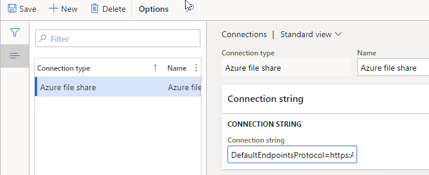
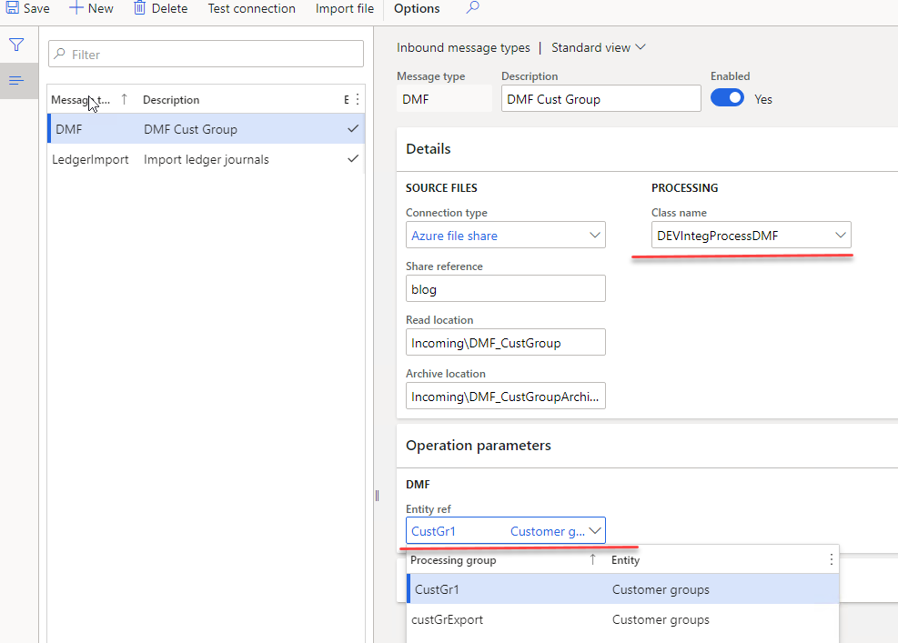
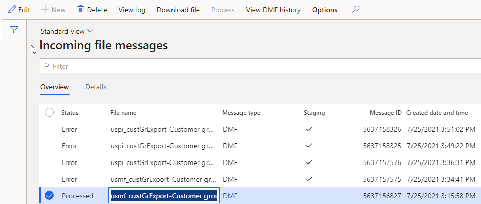
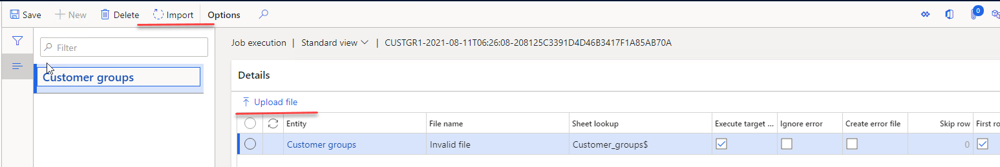
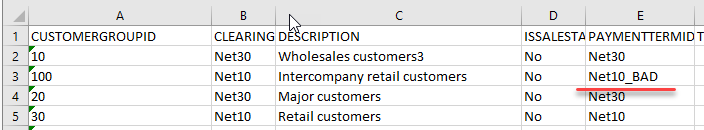
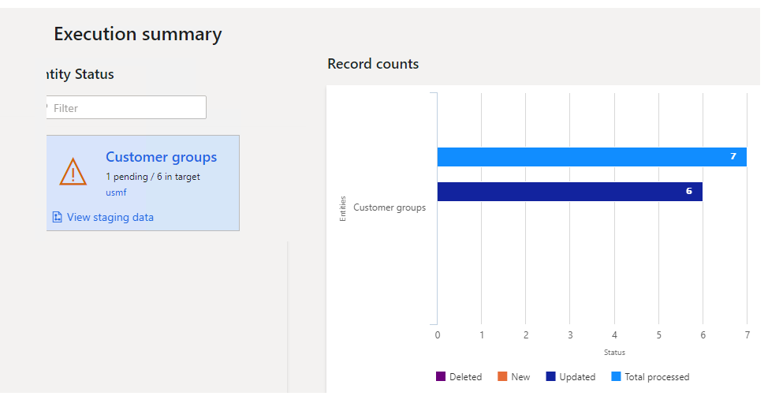

In one of my last posts I described a sample approach for a [periodic file-based integration using X++](https://denistrunin.com/xpptools-fileintegledger) custom code. The external system creates files on the Azure file share, then D365FO pulls these files, parses and processes them. One of the comments on this post was why DMF is not used for such tasks.

That is a perfectly valid comment, given that if you want to develop a custom import you need to do a lot of programming, like create staging tables and forms, implement a file parsing and create the final document via X++ code.

In this blog post I will show how DMF can be used in the same framework in order to implement a periodic files import.

## Task description

We have an incoming folder in the **Azure file share** that contains a set of files and we need to import them via DMF. In this example I will use a “Customer group” entity in Excel format. Also let's implement a multi-company import. A company code will be specified for a file as a first characters before "_".

We need to import these files in D365FO and view the import status per file.

## Proposed solution

In the following section, I provide some code samples that can be used as a starting point to implement a periodic file import and processing.

### File share connections form

This form is used to define a connection to a cloud file share. In this example we will use a **Azure file share** link.



### Inbound message types form

In this form we need to create a new class that processes our files. The logic for this will be quite simple: load a file, change the company, pass the file to a DMF framework. The DMF call will be **synchronous**, so we can get the status from DMF after the processing and update our message table.

On this form we can also specify for which entity we need to run our import. Basically it links the Incoming directory with a DMF project/entity. The same processing class can be used for different entities.



Also, this form contains two servicing operations:

- **Check connection** button that tries to connect to the specified directory
- **Import file** button that can be used in testing scenarios to manually import a file from a user computer without connecting to a network

### Incoming messages form

This table will store the details for each inbound file. It displays the original incoming file name and its status.



In this form it is also possible to do the following operations:

- View incoming file context
- Filter by different statuses
- View a detailed error message
- Change the status to process the message again
- View file processing statistics (processing duration, time, number of lines)

### Load and process incoming files

It is a periodic batch job that we can run for one or multiple message types.


It connects to the shared folder, reads files, creates a record in the **Incoming messages** table with **Ready** status, attaches a file content to this message and moves the file to an Archive directory. If **Run processing** is selected, after the load, the file will be processed.

Internally the processing takes a file and run the same function that the user may run for a manual import in the Data management module



The sample code for this is below. You can find the same samples in several places in the system

```c#
//read a file..
//change the company from the file name...
//find a linked DMF definition import and path the file into it..
    
DMFExecutionId executionId = DMFUtil::setupNewExecution(definitionGroupEntity.DefinitionGroup);
//...
    DMFStagingWriter::execute(
        executionId, //_executionId
        0, //_batchId
        true, //_runOnService
        false, //_calledFrom
        DateTimeUtil::getUserPreferredTimeZone(), //_timeZone
        false //_compareData
    );
//...
}
```

As the process is synchronous, we can check the status after the import and update the Message table with results.

## Error types and how to handle them

Let's discuss typical errors and how users can deal with them. Also I will compare them with a custom made import.

### File share connection errors

If our batch job can't connect to a File share or read and move files, a batch job exception will be generated. It is a configuration error and it requires system administrator attention. Notification will be done using a batch job status. After troubleshooting the error system administrator can use the **"Test connection"** button to validate that the system can now connect to the file share.


### File format errors

The next error type is a wrong file format, so we can't even read the file content.

To test this case I renamed one of the columns


This file caused a 1 minute delay for DMF and then an internal error


DMF uses a data integration component that connects to an Excel file and that is probably why the error is not verbose.

This message is stored in the Messages table, users can view the error log, then download the file and check the reason for this error.

### Data errors

The file has a correct structure but contains a wrong data(e.g.. values that don't exist)



In this case, a Status of our Message will be **Error** and an Error log will be generated.


Users can view the error detail using the standard DMF Execute history form, that displays invalid lines


The main difference from the custom import is that you can't implement "all or nothing" principle as DMF doesn't support transactions, lines from this file that passed validation were processed successfully.



### Posting documents

We don't have a posting code in this example, but it can be implemented by modifying the processing class after the successful file load.

We can see this architecture in a lot of projects, where DMF is used only to load the data in staging tables that don't contain any business logic and the chance of error is minimal.

Then in order to process these staging records(create business documents) a custom code is executed. In this case you rely on DMF only for reading the file and implementing posting via a custom code(with a proper transaction handling).

In some cases it may be a valid choice, but as we saw file parsing is not a big advantage of DMF and in some cases implementing your own reader can produce better results.

## Summary

In this post I provided a sample implementation for a File-based integration for D365FO via DMF. In some ways it is very similar to "Recurring integrations scheduler" but based on X++. It is not complex: the main [class](https://github.com/TrudAX/XppTools/blob/master/DEVTutorial/DEVTutorialIntegration/AxClass/DEVIntegProcessDMF.xml) that takes a file and passes it to DMF contains about 100 lines of code. Also an advantage of this solution that it can be used as a starting point(for example for prototyping) and then can be easily converted to a custom X++ import when the requirements become more complex

I uploaded files used for this post to the following [folder](https://github.com/TrudAX/XppTools#devtutorialintegration-submodel)

I hope you find this information useful. As always, if you see any improvements, suggestions or have some questions about this work don't hesitate to contact me.
