---
title: "D365FO Performance. Periodic import of one million ledger journal lines"
date: "2020-12-17T22:12:03.284Z"
tags: ["XppDEVTutorial", "Integration", "Performance"]
path: "/xpptools-fileintegledgerperf"
featuredImage: "./logo.png"
excerpt: "The blog post describes sample steps to perform performance testing for file-based integration in D365FO using X++"
---

Sometimes you may see the following question on D365FO performance related forums Often people ask about D365FO performance - our customer has 100k transactions per day, can D365FO handle this. The problem is currently Microsoft doesn't publish any D365FO performance tests. The current advice - you need to test it with your specific setup. In this post I try to provide a sample steps to perform for such test.


## Test description

In my test I try to import 1000 files with 1000 lines each. 

To generate such files I created a new form in Tutorial integration module 

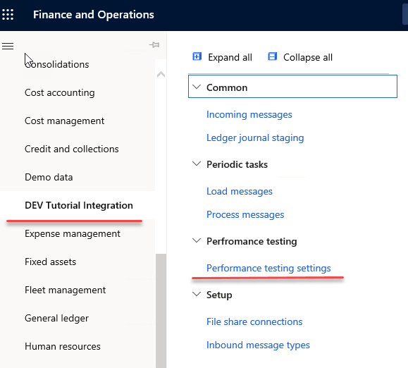


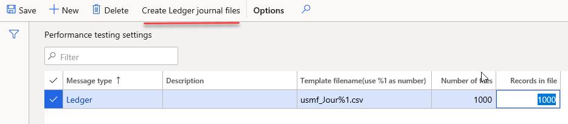

It allows to specify a link to the Azure file share, template for a file name, number of files and number of records in each file.

When you press **Create ledger journal files** it creates the specified number of files in the **Incoming** Azure file share folder.

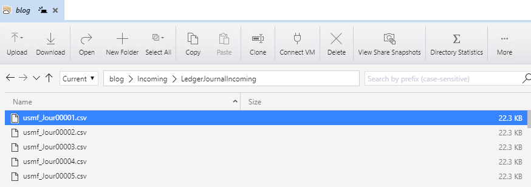

Every single file contains all possible values combinations for BusinessUnit, Department, CostCenter and 60* Main accounts for Credit, 50* Main account for Debit. 

Even in the Demo database there are more than 1 million different combinations, so all files have different values for a resulting ledger dimensions.

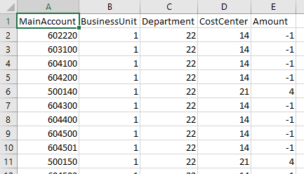

Then I run **Load messages** task as a batch job and measured the time for this batch job execution. During the execution 1000 ledger journals were created and posted

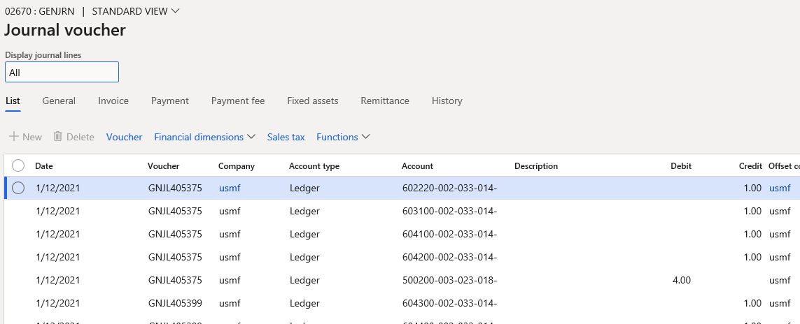


## Test setup and preparation 

In order to run the test I used a standard cloud DEV VM with 16HDD and the Demo database.

I did the following preparation

1. Install DEVCommon and DEVTutorial models from  https://github.com/TrudAX/XppTools repository

2. Created a new Azure file share and created a ledger journal message linked to it

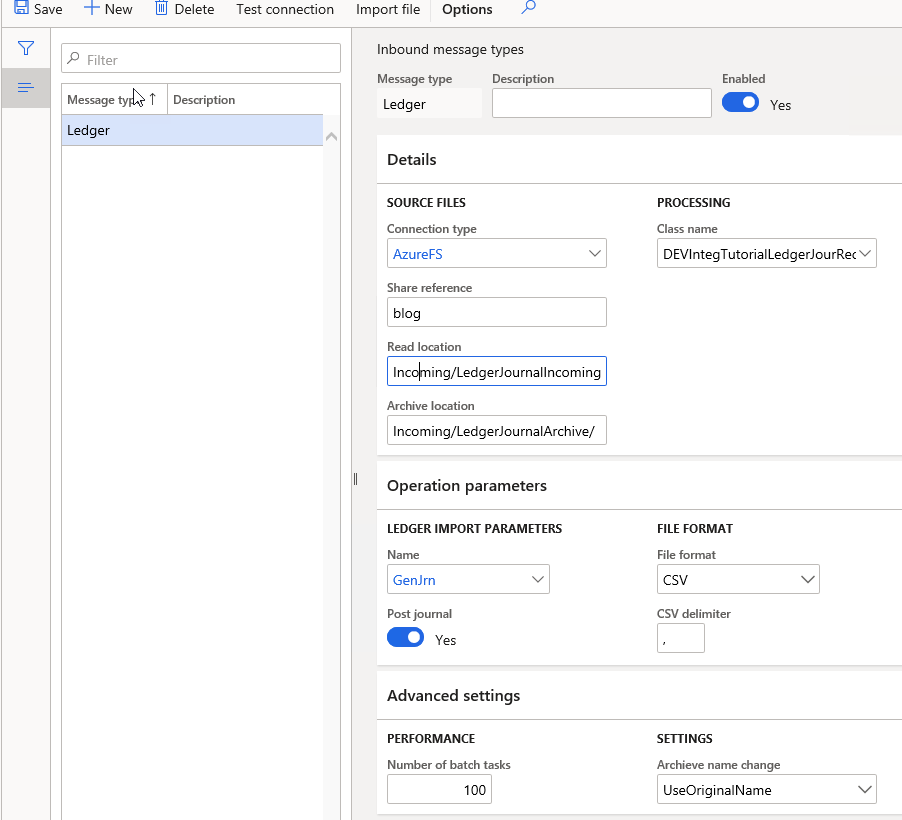

3. Switched off DEV VM monitoring. It creates a lot of loading to a file system, that was not quite fast for my VM

```powershell
K:\Monitoring\MonitoringInstall-Uninstall.ps1
```

4. Switched off budget control. You probably will not use it for such large data loading.

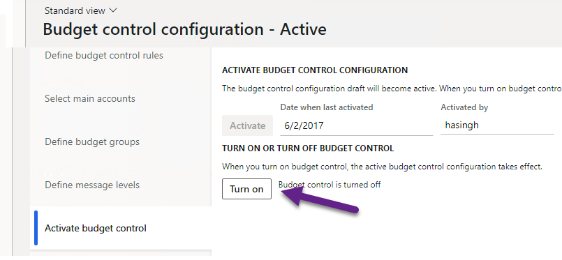

*Budgeting - Setup - Budget control configuration*

5. Adjusted Ledger account structure setup to allow any Business Unit, Department, Cost Center values for used Main accounts

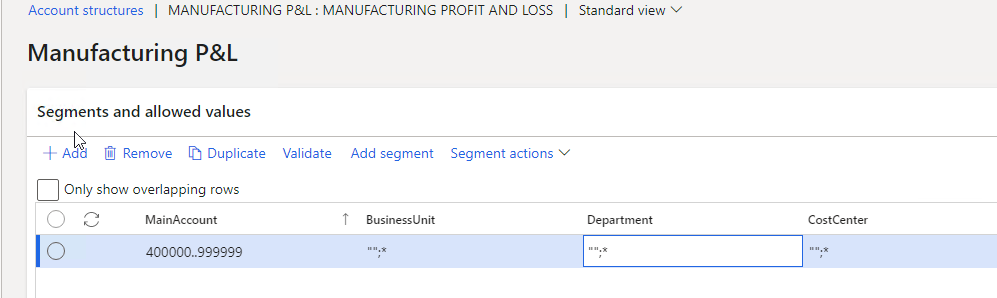

6. Set **Maximum batch threads** to 60. This allows fully utilize my VM.

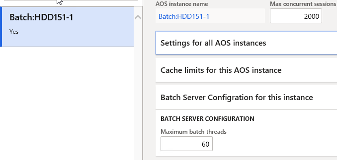


After that generated 1000 files and run the test.

## Test results

I used a standard cloud DEV VM with 16HDD and the Demo database. I tested on 2 VM sizes:

- Standard D8 v3 (8 vcpus, 32 GiB memory)
- Standard D16s v3 (16 vcpus, 64 GiB memory)

For each VM size I decided to perform 2 tests: 

Start with a fresh Demo database. Load and post 1 million records, then generate the same set of files and load it again for a different date. So totally it is will be plus 2 million journal lines. The first test generates a new ledger dimension combination for every line, so it was like initial data load. The second test used the same dimensions combinations, so it was like a periodic load.

The load operation consists of 2 batch jobs. The first one reads files from Azure and put them into D365FO tables. It is a single threaded job and for both tests the time was around 1.5 minute for 1000 files. Then the processing job(which is multithreaded) reads files content from D365FO tables, generates and posts ledger journals.

I got the following times for load and post 1m ledger journal lines:

| VM type          | First load time | Second load time |
| ---------------- | --------------- | ---------------- |
| Standard D8 v3   | 4h 40 min       | 3h 40 min        |
| Standard D16s v3 | 3h 6 min        | 2h 29 min        |

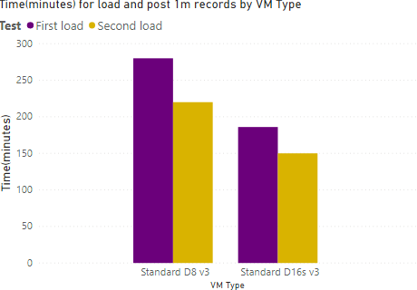

During both tests CPU was used for 100%(about 25% for SQL Server and 75% for Batch service). Ledger journal classes contain a lot of caching and probably they are not optimized for different values for every line as in my test.

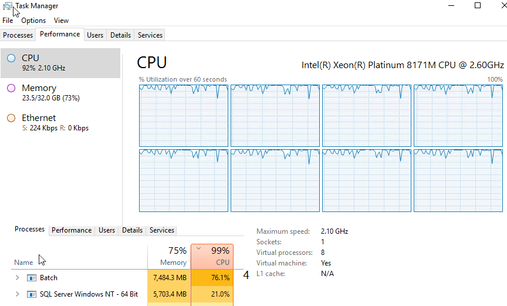

Of course this test is very simplified, you should not use times from Tier-1 machines for Production planning, as Tier-2 VMs have a different architecture(SQL Azure instead of SQL Server), but I think the behaviour for Tier-2 will be the same: the more expensive service you use, the faster system will work.

I don't have access to Tier-2 VM now, also it is not clear what level of resources Microsoft gives you for Tier-5(Performance) and Production and how these resources operate comparing to local DEV boxes. If you have any information regarding this, please share some comments 

## Summary

The cloud has some amazing capabilities. Even in this test by just one click(changing a VM size) I increased the load performance on almost 50%. But everything has a price. The current [Dynamics 365 Licensing Guide](https://go.microsoft.com/fwlink/?LinkId=866544&clcid=0xc09) has more than 50 pages, so the price structure is quite complex. And probably in the cloud word instead of asking "Can the system loads 1m of journal lines?" you should ask "What will be the cost of loading 1m lines in 2 hours?". 

You can use the provided example for performance testing of File-based integration for D365FO.  I uploaded files used for this post to the following [folder](https://github.com/TrudAX/XppTools#devtutorialintegration-submodel).

I hope you find this information useful. As always, if you see any improvements, suggestions or have some questions about this work don't hesitate to contact me.
