---
title: "XppInteg - Import purch orders from XML files"
date: "2022-04-20T22:12:04.284Z"
tags: ["XppDEVTutorial", "Integration"]
path: "/xpptools-integfilesharexmlpurch"
featuredImage: "./logo.png"    

excerpt: "The blog post describes a sample approach to implement XML files intergation by importing purch orders from Azure File Share in D365FO using X++"
---

This post extends my several previous posts:

 [How to implement file-based integration in Dynamics 365 FinOps using X++](https://denistrunin.com/xpptools-fileintegledger) 

but with another way messages format. In this case we we consider a XML format and try to process files in X++ and create purchase orders.

In this post I use a very simplified example of intergration with INFOR system. This system has an integration component that can export the data in XML format and we will process(import) these files in D365FO. What is good about this example that a format generated from INFOR is probably the most complex format that you ever see in such integration scenarious

### File format specification

The file format is below. it has data in a different parts of XML. 

Custom namespace, data in tags, in a tags data, in the similar elements. Here is the sample format


we will read the following information from the header and lines section 

integStagingPurchHeader.CompanyId

integStagingPurchHeader.OrderAccount

integStagingPurchHeader.PurchId

integStagingPurchHeader.RequestorName

integStagingPurchHeader.InventLocationId

integStagingPurchHeader.DeliveryDate

integStagingPurchHeader.CurrencyCode - remove


lines 

integStagingPurchLine.POLineNumber

integStagingPurchLine.ItemId

integStagingPurchLine.PurchQty;
integStagingPurchLine.PurchUnit;
integStagingPurchLine.PurchPrice;
integStagingPurchLine.LineAmount - remove

In order to deal with such complex format I created a helper class **DEVIntegXMLReadHelper**

It doesn't replace the standard System.Xml* methods but provide several helper methods that simplify the code structure

```csharp
//set up namespace alias
readHelper.initNamespace(xmlDoc, 'infor', @'http://schema.infor.com/InforOAGIS/2');

//read a typed data from the specified tag
readHelper.xmlGetValueNodeStr(nodePOHeader, 'DocumentID/ID');
readHelper.xmlGetValueNodeDate(nodePOHeader, 'DocumentDateTime');

//search node inside the specified node by path
readHelper.xmlGetNodeByPath(nodePOHeader, 'SupplierParty/PartyIDs/ID');

//search node inside the specified node by search path
readHelper.xmlSelectSingleNode(nodePOHeader, 'infor:UserArea//infor:Property//infor:NameValue[@name=\'eam.UDFCHAR01\']');
        
```


## Solution description

In this blog post, I try to describe a solution(with "Consuming external web services" [type](https://devblog.sertanyaman.com/2020/08/21/how-to-integrate-with-d365-for-finance-and-operations/#Consuming_external_web_services)) for a D365FO Custom Service that will talk to the Integration Platform. It will do the following:

1. Process purch orders for different companies.
2. Avoid issues like OData or DMF like throttling, monitoring of failed batch imports and rollback of partial failures.
3. Read a custom data format from Azure File share as messages (sourced from an external program).
5. Provide a solution to log and monitor the failures easily.
6. Perform custom transformations within D365FO as part of the import.

Our integration should read messages from the Azure file share and create purch orders in D365FO.

The diagram that describes the process is below:

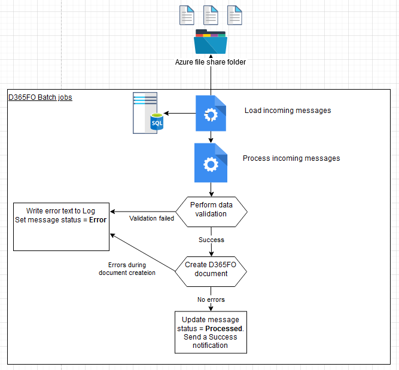

## Proposed solution

In the following section, I provide a solution that can be used as a starting point to import and to process messages from Azure Service Bus.

### Connection types form

**Connection types** form allows specifying the Connection type resource(currently two resources are supported: Azure file share and Azure Service Bus) and connection details for the selected resource.

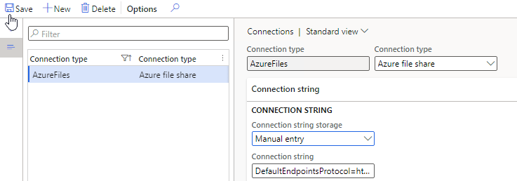

For storing connection string, there can be two options:

- Enter the value in this form
- Store the connection string value as a Secret in the **Azure Key Vault**. In this case, the user needs to provide a reference to the standard Key Vault name (steps to set up it are described in the following post: [Azure Key Vault & MSDyn365FO: Setup Certificates and Passwords](https://jatomas.com/en/2020/06/02/azure-key-vault-msdyn365fo-setup-certificates-passwords/)).

### Inbound message types form

The next form to describe our integration will be the **Inbound message types** form

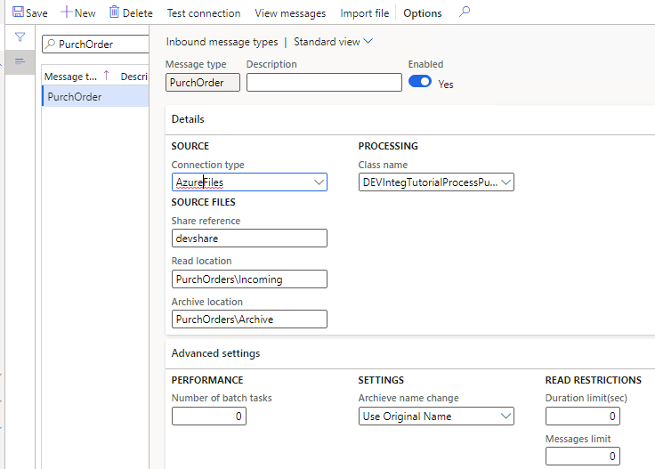

This form contains 3 main sections:

**1 - Details tab**

- Defines Service Bus connection and a Queue name from which to import messages.

- Contains a link to the custom Class that will do processing from the queue. The class should extend the base class **DEVIntegProcessMessageBase** and implement the following method:

```c#
abstract void  processMessage(DEVIntegMessageTable  _messageTable, DEVIntegMessageProcessResult _messageProcessResult)
{
...
}
```

This method will be called by the integration engine outside of a transaction, so all transaction control can be implemented per Message type. There can be different options here: one transaction per message, multiple transactions(for example, if a file contains several independent journals) or a single transaction per line. The result of processing and the current stage should be written to **_messageProcessResult** variable, so in case of an unhandled exception, this information can be saved for reviewing. Also, this class will be created one time per entire import session, so it can implement different caching options.

**2 - Operation parameters tab**

Contains parameters that are individual for the current operation. In our case, we don't have any parameters.

**3 - Advanced settings tab**

Contains some common parameters:

- The number of parallel threads to process incoming messages.

- Reading limits from the queue(e.g. to read only the first three messages, this is for testing purposes)

Also, this form contains two service operations:

- **Check connection** button that tries to connect to the specified queue and read(with Peak only) the first three messages.
- **Import message** button that can be used in testing scenarios to manually import a message from a user computer without connecting to Service Bus.

### Incoming messages form

This table will store the details of each incoming message.

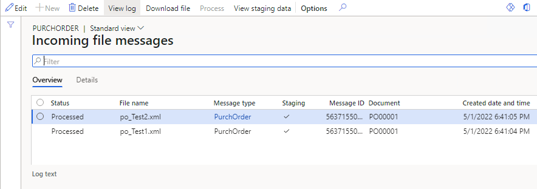

Every message has a status field that can contain the following values:

- **Ready** – a message was read to D365FO
- **Hold** – The user has decided not to process the message. This is an alternative to a delete option
- **In process** – system-generated status, a message is processing now.
- **Error** – failed validation or errors during the processing
- **Processed** – completed successfully

In this form, it is also possible to do the following operations:

- View incoming message context
- Filter by different statuses
- View a detailed error message
- Change the status to process the message again
- View file processing statistics (processing duration, time, number of lines)
- View the processing attempt counter. This allows implementing scenarios like trying to process messages with “Error” status several times.

### Load incoming messages operation

It is a periodic batch job that we can run for one or multiple message types.

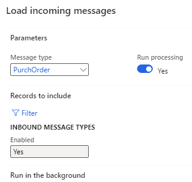

It connects to the Service Bus, reads messages(with Peek&Delete type), creates a record in the **Incoming messages** table with **Ready** status and attaches a message content to this record. If **Run processing** is selected, the load system will execute the processing of the loaded messages.

### Process incoming messages

Message processing may be executed as a separate operation - **Process incoming messages** that selects all not processed messages and calls the processing class for them.

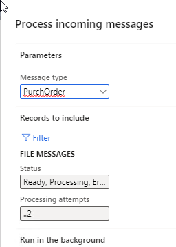

The logic of how to process the file is different per message type/class. For a simple scenario, the class can just read the message content and create some data in one transaction. For this blog post, I implemented two-step processing. See the sample diagram below:

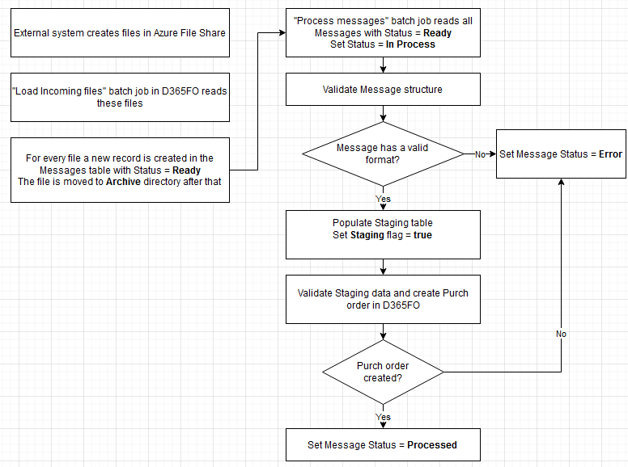

 During the first step, the class reads the message data and writes data into a staging table. A sample code for this:

```c#
tutorialSOHeaderContract = FormJsonSerializer::deserializeObject(classNum(DEVIntegTutorialSOHeaderContract), serializedJSONstr);
 
```

Then based on the staging data values, a new sales order is created. It can be done using data entities or just directly writing to tables.

```c#
salesLine.initValue();
salesLine.ItemId = salesLineStaging.ItemId;
salesLine.initFromSalesTable(salesTable);
salesLine.initFromInventTable(InventTable::find(salesLine.ItemId));
salesLine.SalesQty              = salesLineStaging.SalesQty;
salesLine.QtyOrdered            = SalesLine.calcQtyOrdered();
salesLine.SalesDeliverNow       = salesLine.SalesQty;
salesLine.setInventDeliverNow();
...
salesLine.createLine(true,false,false,true);
```

## Error types and how to handle them

It is not a big task to create a sales order based on some data. The complexity of integration is often related to exception processing and error monitoring. Let's discuss typical errors and how users can deal with them.

### Connection errors

A batch job exception will be generated if our batch job can't connect to a Service Bus or read messages. It is a configuration error, and it requires a system administrator's attention. Notification may be done using a batch job status. After troubleshooting, the system administrator can use the **"Test connection"** button to validate that the system can now read messages from the Service Bus.

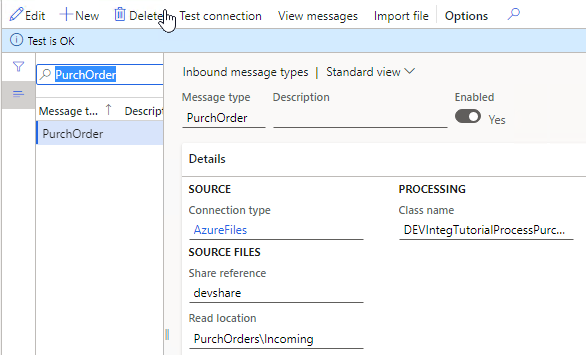

### File format errors

The next error type is a wrong file format, so we can't even read the data from a message.

To test this case, I renamed several columns. After the import, users will see this message with the Error status. Notification may be done using standard filtering by the **Status** column.

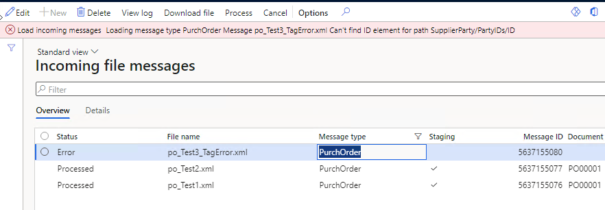

Users can view an error log, then download the message and check the reason for this error. There may be two reasons:

- Our code that processes messages contains some mistakes. In this case, we can download and send this message to a developer to fix the logic. The main advantage of this solution is that users can run processing without Service Bus by using the **Import message** button.  After fixing the problem, we can run the Processing again.
- External system sent a message in the wrong format. In this case, the user can send this file back to the external party, then change the message status to **Hold**.

### Data errors

The message has a correct structure but contains incorrect data(e.g. values that don't exist). In this case, a Status of our Message will be **Error**, and an Error log will be generated.

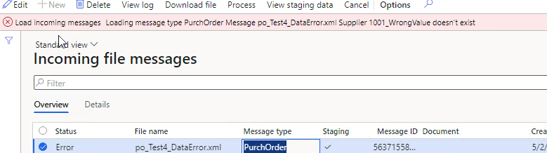

Users can view this error, display a **Staging data** to check the values from the message and take some actions(e.g. create missing values in the related tables if they are valid). After that, they can Process this message again.

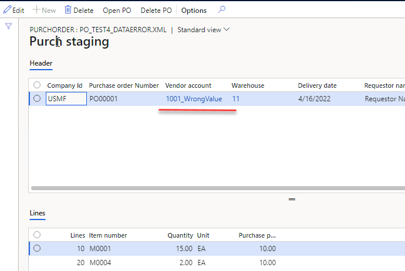

In some implementations(EDI), we can even allow staging data editing. A similar type of error is a posting error.

### Wrong result errors

That is probably the worst scenario. The message was processed successfully, but the resulting document contains some wrong data.

To analyse the result, users can view the staging data and check that they are correct. Also, a message content can be sent to a developer, and they may trace the document processing using the manual Import message button

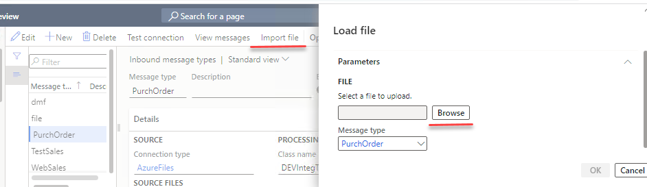

## DMF integration

The text above was for the custom-written integration, but the same engine may be used for importing data with the standard Data Management module.
The idea is the same as for the file integration - [Multicompany DMF integration in Dynamics 365 FinOps using X++](https://denistrunin.com/xpptools-fileintegdmf), in the message parameters, we can specify a DMF processing class and the entity from the  Data management import project.

This class connects to Service Bus, saves the message to a temporary file and executes Data management project import for this file. This allows you to use a full set of Data entities, settings and transformations that Data management can provide. Let's consider the simple scenario: Customer group import

First you need to create an import project based on the sample XML

```xml
<?xml version="1.0" encoding="utf-8"?>
<Document>
 <CUSTCUSTOMERGROUPENTITY>
  <CUSTOMERGROUPID>MyTestGroup</CUSTOMERGROUPID>
  <DESCRIPTION>MyTestGroup Description</DESCRIPTION>
 </CUSTCUSTOMERGROUPENTITY>
</Document>
```


Setup a new Inbound connection type(based on DMF class) and specify the link to the import project.


Then load a message to our Service Bus queue and run the import


As the result a new message will be created and after processing a new Customer group record will be created


You can even implement a more complex scenarios, for example, import sales orders by using Composite data entities - [Dynamics 365 Operations | Composite data entity – Sales order import (Only works with XML)](http://mukesh-ax.blogspot.com/2018/07/dynamics-365-operations-composite-data.html). However, this is not something that is recommended by Microsoft:  "Composite entities are not recommended" from [5 Tips to improve the performance in a DMF import project](https://community.dynamics.com/ax/b/axinthefield/posts/5-tips-to-improve-the-performance-in-a-dmf-import-project).

## Summary

I provided a sample implementation for an Azure Service Bus integration for D365FO. The main concept of it is to create a basic framework to simplify troubleshooting(most typical errors and all related data can be viewed in one form - Incoming messages) and provide some additional logging.

This may or may not be appropriate in your case(there are different options how to implement this). Anyway, I recommend using the following checklist while designing the integration: [Integration solution specification](https://github.com/TrudAX/TRUDScripts/blob/master/Documents/Integration/Integration%20Data%20Flow%20Requirements.md).

Files used for this post can be found in the following [folder](https://github.com/TrudAX/XppTools#devexternalintegration-submodel)

I hope you find this information useful. As always, if you see any improvements, suggestions or have some questions about this work, don't hesitate to contact me.
