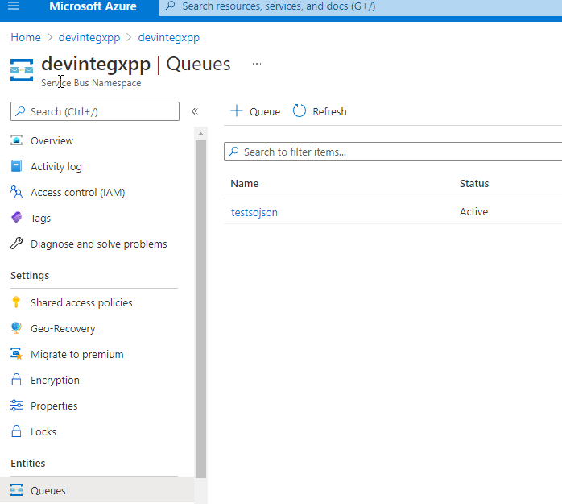
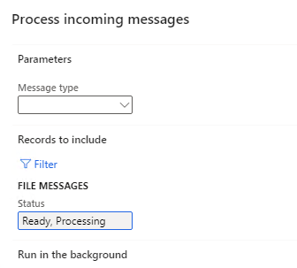

---
title: "How to implement Azure Service Bus integration in Dynamics 365 FinOps using X++"
date: "2021-10-27T22:12:03.284Z"
tags: ["XppDEVTutorial", "Integration"]
path: "/xpptools-integservbussalesjson"
featuredImage: "./logo.png"

excerpt: "The blog post describes a sample approach to implement Azure Service Bus integration in D365FO using X++"
---

This post is an extension of my previous post [How to implement file-based integration in Dynamics 365 FinOps using X++](https://denistrunin.com/xpptools-fileintegledger) but with another media to transfer messages. As file-based aproach still may work for a lot of cases, in a cloud world we have a lot of others, more fancy ways to transfer messages. In this post I will describe how to use **Azure Service Bus** to do a custom X++ based intergation.

Azure Service Bus is a cloud-based messaging service providing queues with publish/subscribe semantics and rich features. This is a fully managed service with no servers to manage or licenses to buy.

Common Service Bus usage scenarious:

- Build reliable and elastic cloud apps with messaging.
- Protect your application from temporary peaks.
- Distribute messages to multiple independent backend systems.
- Decouple your applications from each other.

The pricing for Service Bus starts from 10USD per month for 12M operations.


### Setting up Azure service bus

In order to setup a new service bus we need to create a new **Service Bus** resource is Azure portal and setup a new Queue for incoming messages.



Then go to the Shared access policies menu and create a new access key for the service bus. Copy Primary Connection String for this key.

Then you may install and run  **ServiceBusExplorer**, a very usefull utility to manage Service Bus from a local computer
 https://github.com/paolosalvatori/ServiceBusExplorer/releases


## Solution description

In this blog post, I try to describe a sample solution(with "Consuming external web services" [type](https://devblog.sertanyaman.com/2020/08/21/how-to-integrate-with-d365-for-finance-and-operations/#Consuming_external_web_services)) for a D365FO Custom Service that will talk to the Integration Platform:
1.	Process sales orders for different companies
2.	Avoid issues that OData has with bulk sales orders import like throttling .
3.	Avoid issues that DMF has with monitoring of failed batch imports and rollback of partial failures.
4.	Read a custom data format that will be in the Azure Service Bus queue as messages (sourced from external program).
5.	Provide a solution to easily log and monitor the failures.
6.	Perform custom transformations within D365FO as part of the import

The first step for building such integration is to create a mapping document. I put a sample template here - [Field Mapping sample](https://github.com/TrudAX/TRUDScripts/tree/master/Documents/Integration). For the purpose of this blog the format for Sales order will be a simple custom JSON document that describes sales order header and lines

```
{    "CompanyId": "USMF",
    "customerId": "US-002",
    "externalOrderNumber": "ABCDEFG",
    "lines": [
        {
            "lineQuantity": 1,
            "linePrice": 11,
            "lineItemBarcode": "M0001"
        },
        {
            "lineQuantity": 2,
            "linePrice": 22,
            "lineItemBarcode": "M0004"
        },
        {
            "lineQuantity": 3,
            "linePrice": 33,
            "lineItemBarcode": "M0007"
        }
    ] }
```

Our integration should read messages from the Service Bus and create Sales orders in D365FO

## Proposed solution

In the following section, I provide some code samples that can be used as a starting point to implement import and processing for messages from Azure Service Bus.

### Connection types form

**Connection types** form allow to specify Connection type resource(currently 2 resources are supported - Azure file share and Azure service bus) and connection details for the selected resource


For storing connection string there can be 2 options:

- Enter the value in this form
- Store the connection string value as a Secret in the **Azure Key Vault**. In this case user need to provide a reference to the standard Key Vault name (steps to setup it described in [this](https://jatomas.com/en/2020/06/02/azure-key-vault-msdyn365fo-setup-certificates-passwords/) post).

### Inbound message types form

Next form to describe our integration will be **Inbound message types** form


This form contains 3 main sections:

**1 - Details tab**

- Defines Service Bus connection and Queue name from whitch to import messages .

- Contains link to the Class that will do processing from the queue. The class should extend a base class **DEVIntegProcessMessageBase** and implement the following method:

```c#
abstract void  processMessage(DEVIntegMessageTable  _messageTable, DEVIntegMessageProcessResult _messageProcessResult)
{
...
}
```

This method will be called by the integration engine outside of a transaction, so all transaction control can be implemented per Message type. There can be different options here: one transaction per message, multiple transactions(for example if a file contains several independent journals) or a single transaction per line. The result of processing and the current stage should be written to **_messageProcessResult** variable, so in case of an unhandled exception, this information can be saved for review. Also, this class will be created one time per full import session, so it can implement different caching options.

**2 - Operation parameters tab**

Contains parameters that are individual for the current operation. In our case we don't have any parameters 

**3 - Advanced settings tab**

Contains some common parameters: 

- If we should use Parallel processing for processing incoming messages. 

- Read limits from the queue(e.g. read only first 3 messages, this is for testing purposes)

Also, this form contains two service operations:

- **Check connection** button that tries to connect to the specified queue and read(with Peak only) first 3 messages.
- **Import message** button that can be used in testing scenarios to manually import a message from a user computer without connecting to Service Bus.

### Incoming messages form

This table will store the details on each incoming message.


Every message has a status field that can contain the following values:

- **Ready** – a message was read to D365FO.
- **Hold** – The user has decided not to process the message. This is an alternative to a delete option
- **In process** – system-generated status, a message is processing now.
- **Error** – failed validation or errors during the processing
- **Processed** – completed successfully

In this form it is also possible to do the following operations:

- View incoming message context
- Filter by different statuses
- View a detailed error message
- Change the status to process the message again
- View file processing statistics (processing duration, time, number of lines)
- View the processing attemps counter. This allows to implement scenarious like try to process messages with Error status several times.

### Load incoming messages operation

It is a periodic batch job that we can run for one or multiple message types.


It connects to the Service Bus, reads messages(with Peek&Delete type), creates a record in **Incoming messages** table with **Ready** status and attaches a message content to this record. If **Run processing** is selected, after the load system will execute processing of the loaded messages.

### Process incoming messages

Message processing may be executed as a separate operation - **Process incoming messages** that selects all not processed messages and calls the processing class for them.



The logic of how to process the file is different per message type/class. For the simple scenario, the class can just read the messagecontent and create some data in one transaction. For this blog post, I implemented two step processing. See the sample diagram below:


During the first step, the class reads the file and writes data into a staging table. A sample code for this:

```c#
tutorialSOHeaderContract = FormJsonSerializer::deserializeObject(classNum(DEVIntegTutorialSOHeaderContract), serializedJSONstr);

```

Then based on this staging data values, a new sales order is created. This creating can be done using data entities or just directly writing to tables using 

```c#
salesLine.initValue();
salesLine.ItemId = salesLineStaging.ItemId;
salesLine.initFromSalesTable(salesTable);
salesLine.initFromInventTable(InventTable::find(salesLine.ItemId));
salesLine.SalesQty              = salesLineStaging.SalesQty;
salesLine.QtyOrdered            = SalesLine.calcQtyOrdered();
salesLine.SalesDeliverNow       = salesLine.SalesQty;
salesLine.setInventDeliverNow();
...
salesLine.createLine(true,false,false,true);
```

After the journal creation, this class runs journal posting.

## Error types and how to handle them

It is not a big task to create a sales order based on a file. The complexity of integration is often related to exception processing and error monitoring. Let's discuss typical errors and how users can deal with them.

### Connection errors

If our batch job can't connect to a Service Bus or read messages, a batch job exception will be generated. It is a configuration error and it requires system administrator attention. Notification will be done using a batch job status. After troubleshooting the error system administrator can use the **"Test connection"** button to validate that the system can now read messages from the Service Bus.


### File format errors

The next error type is a wrong file format, so we can't even read the key data from the message 

To test this case I renamed several columns. After the import users will see this message with the Error status. Notification can be done using standard filtering by the **Status** column.


Users can view the error log, then download the message and check the reason for this error. There may be two reasons:

- Our code that reads the message is wrong. In this case, we can send this message example to a developer to fix the logic. The main advantage of this solution is that developer can run processing without Service Bus by using the **Import message** button .  After fixing the problem we can run the Processing again.
- External system sent a message in the wrong format. In this case, the user can send this file back to the external party, then change the message status to **Hold**.

### Data errors

The message has a correct structure but contains a wrong data(e.g.. values that don't exist). In this case, a Status of our Message will be **Error** and an Error log will be generated.


Users can view this error, display a **Staging data** to check the values from the message and take some actions(e.g. create missing values in the related tables if they are valid). After that, they can Process this message again.


In some implementations(EDI), we can even allow staging data editing. A similar type of error is a posting error. 

### Wrong result errors

That is probably the worst scenario. The file was processed successfully, but the resulting journal contains some wrong transactions.

To analyse the result, users can view the staging data and check that they are correct


Another useful option to troubleshoot this scenario is a parameter in the **Message types table** for our operation: **Post journal(No/Yes)**. We can switch it off, manually load a test file and check the created journal without posting it. And that may give an idea of what is wrong.


http://mukesh-ax.blogspot.com/2018/07/dynamics-365-operations-composite-data.html 

## Summary

I provided a sample implementation for a File-based integration for D365FO. The main concept of it is to create a basic framework to simplify troubleshooting(most typical errors and all related data can be viewed in one form - Incoming messages) and provide some additional logging.

This may or may not be appropriate in your case(there are different options how to implement this). Anyway I recommend to use the following checklist while designing the integration: [Integration solution specification](https://github.com/TrudAX/TRUDScripts/blob/master/Documents/Integration/Integration%20Data%20Flow%20Requirements.md)

I uploaded files used for this post to the following [folder](https://github.com/TrudAX/XppTools#devtutorialintegration-submodel)

I hope you find this information useful. As always, if you see any improvements, suggestions or have some questions about this work don't hesitate to contact me.