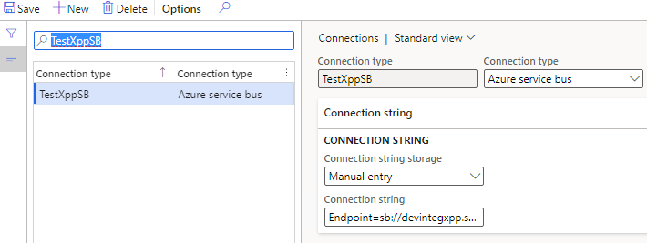

Azure Service Bus is a cloud-based messaging service providing queues with publish/subscribe semantics and rich features. This fully managed service with no servers to manage or licenses to buy.

Use Service Bus to:

- Build reliable and elastic cloud apps with messaging.
- Protect your application from temporary peaks.
- Distribute messages to multiple independent backend systems.
- Decouple your applications from each other.

The pricing for Service Bus starts from 10USD per month for 12M operations.


Setting up Azure service bus

In order to setup a new service bus create a new Service Bus resource is Azure portal and setup a new Queue for incoming messages.


Then go to the Shared access policies menu and create a new access key for the service bus. Copy Primary Connection String for this key.

---
Then you may install and run  ServiceBusExplorer, a very usefull utility to manage Service Bus from a local computer
 https://github.com/paolosalvatori/ServiceBusExplorer/releases


In this blog post, I try to describe another possible solution(with "Consuming external web services" [type](https://devblog.sertanyaman.com/2020/08/21/how-to-integrate-with-d365-for-finance-and-operations/#Consuming_external_web_services)) for the File integration using X++ that is resolving these issues.

## Solution description

I am looking to do a Proof of Concept for a D365 Custom Service that will talk to the Integration Platform:
1.	Process bulk Sales Orders 
2.	Avoid issues that OData has with bulk Sales Orders import like throttling .
3.	Avoid issues that DMF has with monitoring of failed batch imports and rollback of partial failures.
4.	Read our intermediate JSON data format that will be in the Sales Queue as messages (sourced from our eCommerce platform).
5.	Provide a Rest Response / Call Back to with Success / Failure of the Sales Import (so we can easily Log and Monitor the failures).
6.	Perform some small transformations within D365 as part of the import:
   a.	Shipping Method
   b.	Map Warehouse
   c.	Miscellaneous Charge


Let's consider that we need to implement a periodic import of files and create ledger journals in D365FO based on these files. They have the following structure:


A company where ledger journals should be created is defined in a file name(text before "_") and one file represents one journal.

As the result we should get a posted journal in that company:


The integration will be based on two of my previous posts: [How to read CSV/Excel files](https://denistrunin.com/xpptools-readexcelfile/) and [How to create ledger journals in X++](https://denistrunin.com/xpptools-createledgerjournal/).

## Proposed solution

In the following section, I provide some code samples that can be used as a starting point to implement import and processing for messages from Azure service Bus.

### Connection types form

Connection types form allow to specify Connection type resource(currently 2 resources are supported - Azure file share and Azure service bus) and connection details for the selected resource



Notes:

2. Instead of storing Connection details in a D365FO table,a more secure solution is to create an **Azure Key Vault** and put all secrets into it(for example like [this](https://jatomas.com/en/2020/06/02/azure-key-vault-msdyn365fo-setup-certificates-passwords/)) and store a reference to this Key Vault in our new Connection table.

### Inbound message types form

Next form to describe our integration will be **Inbound message types** form


This form contains 3 main sections:

**1 - Details tab**

- Defines **Incoming** and **Archive** folders in our File share.  There will be no **Error** folder: if an inbound file fails validation then the error details will be found in the message table.

- Contains link to the Class that will do processing from this folder. The class should extend a base class **DEVIntegProcessMessageBase** and implement the following method:

```c#
abstract void  processMessage(DEVIntegMessageTable  _messageTable, DEVIntegMessageProcessResult _messageProcessResult)
{
...
}
```

This method will be called by the integration engine outside of a transaction, so all transaction control can be implemented per Message type. There can be different options here: one transaction per message, multiple transactions(for example if a file contains several independent journals) or a single transaction per line. The result of processing and the current stage should be written to **_messageProcessResult** variable, so in case of an unhandled exception, this information can be saved for review. Also, this class will be created one time per full import session, so it can implement different caching options.

**2 - Operation parameters tab**

Contains parameters that are individual for the current operation. In our case it will be: 
- **Ledger journal name** reference for journal creation
- Post the journal(No/Yes) and 
- A file type(Excel or CSV)

**3 - Advanced settings tab**

Contains some common parameters: If we should use Parallel processing for our incoming files and how to move files to an Archive folder(with the same name or append DateTime to the file name). Parallel processing is based on this post: [A simple way to implement a parallel batch processing in X++](https://denistrunin.com/xpptutorial-batchmultithread/), so for example if we set it to 10 and have 1000 incoming messages, 10 batch threads with 100 messages each will be created.

Also, this form contains two servicing operations:

- **Check connection** button that tries to connect to the specified directory
- **Import file** button that can be used in testing scenarios to manually import a file from a user computer without connecting to network file share

### Incoming messages form

This table will store the details on each inbound file.


Every message has a status field that can contain the following values:

- **Ready** – a file was read to D365FO and successfully moved to the Archive folder.
- **Hold** – The user has decided not to process the file. This is an alternative to a delete option
- **In process** – system-generated status, a message is processing now
- **Error** – failed validation
- **Processed** – completed successfully

In this form it is also possible to do the following operations:

- View incoming file context
- Filter by different statuses
- View a detailed error message
- Change the status to process the message again
- View file processing statistics (processing duration, time, number of lines)

### Load incoming file operation

It is a periodic batch job that we can run for one or multiple message types.


It connects to the shared folder, reads files, creates a record in **Incoming messages** table with **Ready** status, attaches a file content to this message and moves the file to an Archive directory. If **Run processing** is selected, after the load system will execute processing of the loaded messages.

### Process incoming messages

Message processing may be executed as a separate operation - **Process incoming messages** that selects all not processed messages and calls the processing class for them.

The logic of how to process the file is different per message type/class. For the simple scenario, the class can just read the file content and create some data in one transaction. For this blog post, I implemented two step processing. See the sample diagram below:


During the first step, the class reads the file and writes data into a staging table. A sample code for this:

```c#
    while (fileReader.readNextRow())
    {
        linesStaging.clear();
        lineNum++;
        linesStaging.LineNumber     = lineNum;
        linesStaging.HeaderRefRecId = tutorialLedgerJourHeaderStaging.RecId;
        linesStaging.MainAccount  = fileReader.getStringByName('MainAccount');
        linesStaging.BusinessUnit = fileReader.getStringByName('BusinessUnit');
        linesStaging.Department   = fileReader.getStringByName('Department');
        linesStaging.CostCenter   = fileReader.getStringByName('CostCenter');
        linesStaging.Amount       = fileReader.getRealByName('Amount');
        DEV::validateWriteRecordCheck(tutorialLedgerJourLinesStaging);
        tutorialLedgerJourLinesStaging.insert();
    }
```

Then based on this staging data values, a new journal is created. As I wrote in this [post](https://denistrunin.com/xpptools-createledgerjournal/) there are two options to create a ledger journal: either using **LedgerJournalEngine** class or using a data entity. The choice between these two should be made by answering the question: if the user wants to create the same journal manually, does he use manual entry or data import?. In this case, I want the result to be similar to manual entry, so **LedgerJournalEngine** class is used.

```c#
ledgerJournalTrans.AccountType          =   LedgerJournalACType::Ledger;
ledgerJournalTrans.modifiedField(fieldNum(LedgerJournalTrans, AccountType));

DimensionDefault  dim;
dim = DEVDimensionHelper::setValueToDefaultDimensionCon(dim,
  [DEVDimensionHelper::BusinessUnit(), tutorialLedgerJourLinesStaging.BusinessUnit,
   DEVDimensionHelper::Department(),   tutorialLedgerJourLinesStaging.Department,
   DEVDimensionHelper::CostCenter(),   tutorialLedgerJourLinesStaging.CostCenter ] );

ledgerJournalTrans.LedgerDimension = LedgerDimensionFacade::serviceCreateLedgerDimension(
  LedgerDefaultAccountHelper::getDefaultAccountFromMainAccountId(tutorialLedgerJourLinesStaging.MainAccount), dim);

ledgerJournalTrans.modifiedField(fieldNum(LedgerJournalTrans, LedgerDimension));
ledgerJournalEngine.accountModified(LedgerJournalTrans);
....
ledgerJournalTrans.insert();
```

After the journal creation, this class runs journal posting.

## Error types and how to handle them

It is not a big task to create a journal based on a file. The complexity of integration is often related to exception processing and error monitoring. Let's discuss typical errors and how users can deal with them.

### File share connection errors

If our batch job can't connect to a File share or read and move files, a batch job exception will be generated. It is a configuration error and it requires system administrator attention. Notification will be done using a batch job status. After troubleshooting the error system administrator can use the **"Test connection"** button to validate that the system can now connect to the file share.


### File format errors

The next error type is a wrong file format, so we can't even read the file content.

To test this case I renamed one of the columns


After the import users will see this file with the Error status. Notification can be done using standard filtering by the **Status** column.


Users can view the error log, then download the file and check the reason for this error. There may be two reasons:

- Our code that reads the file is wrong. In this case, we can send this file example to a developer to fix the logic. After fixing the problem we can run the Processing again.
- External system sent a file in the wrong format. In this case, the user can send this file back to the external party, then change the message status to **Hold**.

### Data errors

The file has a correct structure but contains a wrong data(e.g.. values that don't exist)


In this case, a Status of our Message will be **Error** and an Error log will be generated.


Users can view this error, display a Staging data to check the values from the File and take some actions(e.g. create missing values in the related tables if they are valid). After that, they can Process this message again.


In some implementations(EDI), we can even allow staging data editing.

### Posting errors

A similar type of error is a posting error. For example, in a current implementation if the journal is not balanced the error will be generated and the message gets the **Error** status:


A possible variation to this approach is to create a document(journal in our case), try to post it, and even if posting fails, still set the message Status to **Processed** and leave the journal unposted, allowing accountants to decide what to do with it. As we don't process in transaction this will be a simple modification for our process class.

### Wrong result errors

That is probably the worst scenario. The file was processed successfully, but the resulting journal contains some wrong transactions.

To analyse the result, users can view the staging data and check that they are correct


Another useful option to troubleshoot this scenario is a parameter in the **Message types table** for our operation: **Post journal(No/Yes)**. We can switch it off, manually load a test file and check the created journal without posting it. And that may give an idea of what is wrong.

## Summary

I provided a sample implementation for a File-based integration for D365FO. The main concept of it is to create a basic framework to simplify troubleshooting(most typical errors and all related data can be viewed in one form - Incoming messages) and provide some additional logging.

This may or may not be appropriate in your case(there are different options how to implement this). Anyway I recommend to use the following checklist while designing the integration: [Integration solution specification](https://github.com/TrudAX/TRUDScripts/blob/master/Documents/Integration/Integration%20Data%20Flow%20Requirements.md)

I uploaded files used for this post to the following [folder](https://github.com/TrudAX/XppTools#devtutorialintegration-submodel)

Another important question when you implement a solution like this: is how fast will be your integration. I wrote about sample steps for performance testing in the following post: [D365FO Performance. Periodic import of one million ledger journal lines](https://denistrunin.com/xpptools-fileintegledgerperf/) 

I hope you find this information useful. As always, if you see any improvements, suggestions or have some questions about this work don't hesitate to contact me.