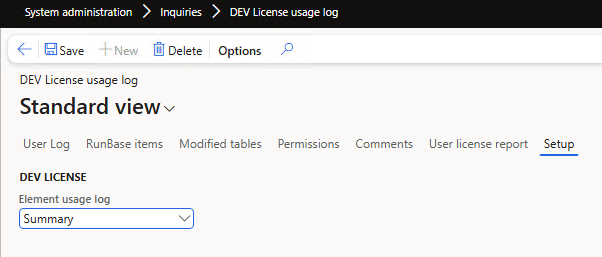
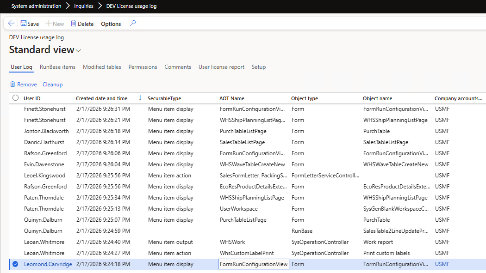
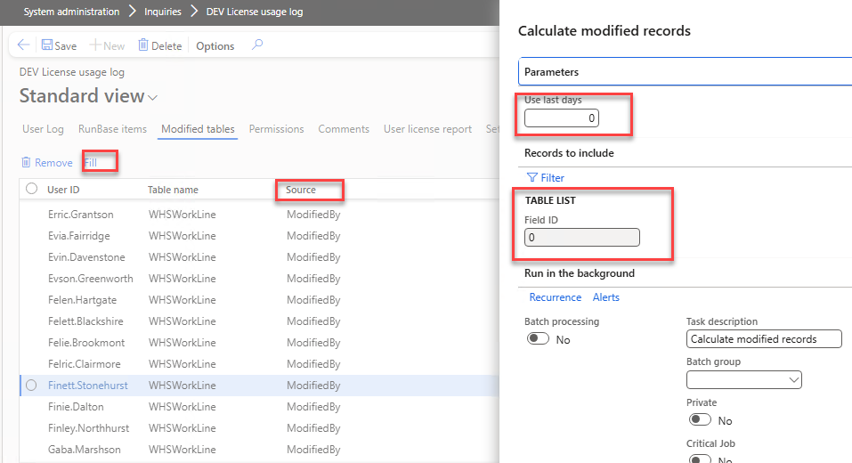
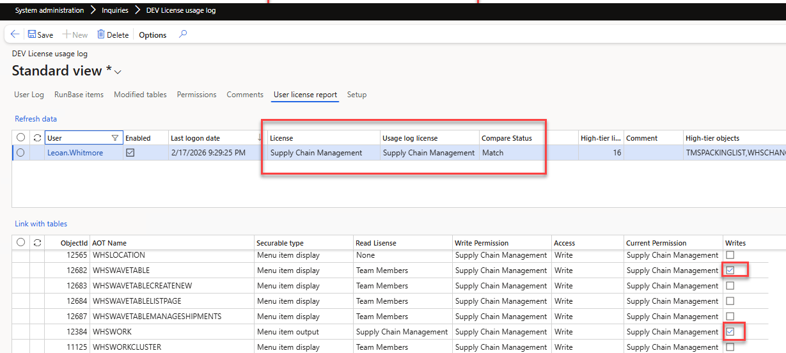
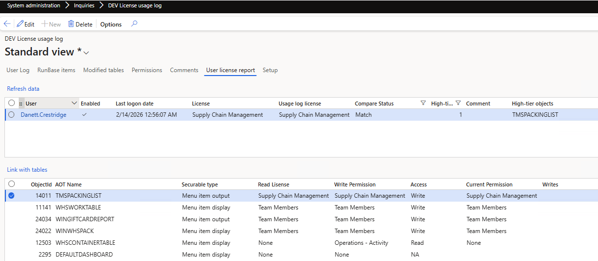
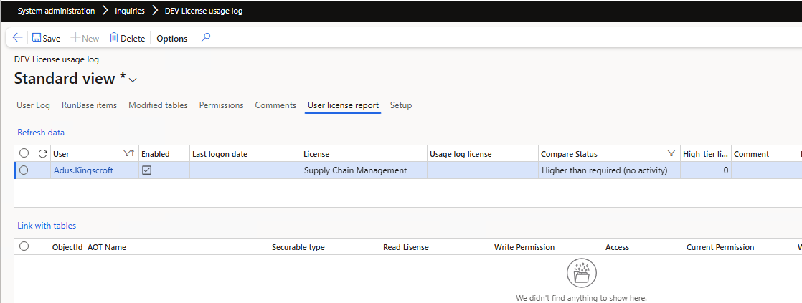

---
title: "D365FO License usage log utility"
date: "2026-03-08T22:12:03.284Z"
tags: ["XppTools"]
path: "/xpptools-licenseusagelog"
featuredImage: "./logo.png"
excerpt: "This blog post describes a tool that allows you to monitor license usage"
---

In this blog post, I will describe how the current licensing works in D365FO and an open-source X++ utility that allows you to track the actual usage of elements and compare it with the elements assigned to the user.

## Description of the current license model 

At first, the new licensing model may look confusing, e.g., what all this "Entitled, not Entitled" means. I try to describe my path to understanding this.

The legacy model relied on AOT properties for MenuItems. For example, here I open a **WHSLoadTable** MenuItem in Visual Studio that has 2 properties: which license is required for read-only access, and which license is required for write access.

This model obviously can't cover all the complexity of the current license model(e.g. you have Finance or SCM or both), so Microsoft released a new model, where they store all the license info on their servers and provide them to users in in Licensing* tables. Data for these tables is calculated internally by Microsoft services and periodically (e.g., every 8h) synchronised with the Tier2/PROD environment. All custom menu items are treated as Teams licenses in this model.

Here is the same menu item license properties with the new model. 

So now the logic is different, if the user has **Read** access to this **WHSLoadTable** menu, he should have one of the 7 licenses, and if he has **Write** access, he should have a SCM or SCM Premium license. That's what "Entitled" means.

Microsoft provides a form "**Licenses usage summary**" where they actually display the result of the above query, but in a different granularity (Role - Duty - Privilege)

### Special roles

There are special roles with an exception from the license report:

- **System administrator** - this role has access to everything and is currently excluded from the license report
- **Device based licenses**: it is a common case in a warehouse; for example, you have a physical computer on the warehouse floor, and 5 warehouse workers who periodically use it to perform various activities. Instead of licensing these 5 people, you license just 1 device and assign the "Device-based" role for these users, which excludes them from the License report. As I understand, currently it is not something that is controlled by Microsoft, but they plan to have some control level in the future. 

After you play with the "**Licenses usage summary**" form I recommend also reading the [series of articles](https://dynamicspedia.com/2025/11/dynamics-365-licensing-enforcement-advent-calendar/) by [André Arnaud de Calavon](https://www.linkedin.com/in/andreadc/) , who did a huge job of describing different security topics. After that, you will probably be more or less familiar with a new licensing model.

### ISV solutions related to licensing 

There are several companies working on D365FO security and licensing optimisation. When I originally asked a [question about user logging](https://www.linkedin.com/posts/denis-trunin-3b73a213_d365fo-licensing-question-does-anyone-in-activity-7421742261249576961-Wnkl), I received many comments, so I've saved them here as a reference: 

- **André Arnaud de Calavon / Next365** — D365 expert and consultant, probably the top writer regarding security topics. Link: [André Arnaud de Calavon](https://dynamicspedia.com/2025/11/dynamics-365-licensing-enforcement-advent-calendar/)

- **D365RoleSecure / NoirSoft** — D365FO security and licensing-focused tool. Link: [NoirSoft / D365RoleSecure](https://www.noirsoft.net/)

- **Fastpath Assure / Alex Meyer** — Security, audit, compliance, and D365FO licensing governance. Link: [Fastpath Assure](https://marketplace.microsoft.com/en-us/product/fastpath.fastpath-assure-for-dynamics-365?tab=DetailsAndSupport)

- **Marco Romano / IT\|Fandango** — D365 F&O consultant offering licensing/right-sizing assessment services. Link: [IT\|Fandango](https://itfandango.com/d365-fo-licence-cost-optimiser/)

- **XPLUS Process Discovery / Anthonio Dixon** — User activity and process discovery for D365, with license optimisation angle. Link: [XPLUS Process Discovery](https://xplusglobal.com/products/security-and-compliance/)

## License usage log tool

The main issue with the standard Microsoft solution is that no license usage report is provided. 

*For example, a simple scenario: 10 users share a single role, and that role has 100 menu items at the Team level and one item that requires Activity. How can we determine which of these 10 users is actually using that specific Activity menu item.* 

The License usage log tool was built to fill this gap and provide you with the answer to this question. It can be installed from [GitHub](https://github.com/TrudAX/XppTools/tree/master/DEVTools/DEVLicenseUtils) and then deployed to the PROD version using your X++ pipeline.  

### Enable element usage logs

After the installation, you need to Enable element usage logging. There are 2 options:

- Full(Debug only) mode, where every call is logged 
- or Summary, when a system creates an element usage log for a user only once per user session. 

It should work for a couple of weeks on a PROD database to get some useful values.

The following events are [logged](https://github.com/TrudAX/XppTools/blob/master/DEVTools/DEVLicenseUtils/AxClass/DEVLicenseElementUsageLogMonitor.xml):

- Form opening(the same extension point as standard Microsoft "Form runs (Page views)"  telemetry )

- Sysoperation execution(this includes reports and actions)

- FormLetter executions (this includes sales and purchase orders posting)

- RunBase classes execution 

### Calculate data modification

One of the challenges of license monitoring is determining whether the user is viewing a form or actually modifying data. We can get a modification event from 2 sources:

- Table **ModifiedBy**, **CreatedBy** fields. This is not fully reliable info, as it contains only the last user who touched the record
- **SysDatabaseLog** table - this produces more actual info, but it needs to be enabled in advance

The tool allows you to specify a period (e.g., the) last 90 days) and update the modification information from the 2 sources above.

The next challenge is to link the Form the user is using to a list of tables. The License tool automatically calculates this data by linking all form DataSources with the used MenuItem, but this link can also be corrected manually.

### Service functions

The License log form have couple of service functions:

**Cleanup function**: delete all log records older than 90 days and compact the rest (leave only one record per user-per element for the whole period)

**Comments per user** - reporting table will be recalculated for every run, but you can provide a free text comment to save between the session, for example the user is already validated

A couple of custom recalculated tables, they are used mostly for debugging:

**RunBase items** - links menu item names with a runbase class instance(during run base logging you can see only the class name, so this is required to link RunBase class with the MenuItem) 

**Permissions** - A view containing Menu Items with Read and Write license requirements

## Running license usage report

After you collect the element usage log and calculate the data modification information, open the **User license report** tab and click **Refresh data**. The report compares the user’s assigned license with the highest license level from the captured usage data. 

The report contains two sections: a **header** and **lines**

### Header section

The header contains one row per user and gives you a quick summary of the licensing situation:

- **User** – the user account being analysed.
- **Enabled** – whether the user account is enabled.
- **Last logon date** – the latest detected sign-in date for the user.
- **License** – the license currently assigned to the user.
- **Usage log license** – the highest license level from the Element Usage log.
- **Compare Status** – comparison between the assigned license and the usage-based license. 
- **High-tier lines** – the number of line records that contribute to the highest detected license requirement for that user.
- **Comment** – an optional reviewer comment.
- **High-tier objects** – the list of objects that drive the user to the highest detected license tier

### Lines section

The lines section shows the individual securable objects behind the selected user result and explains why that user falls into a specific license tier:

- **AOT Name, Type** – the AOT name of the Menu Item.
- **Read License** – the license needed for read access.
- **Write Permission** – the license needed for write access.
- **Access** – the access level being evaluated for the user, **Read** or **Write**.
- **Current Permission** – the permission currently assigned through security.
- **Writes** – indicates whether actual write activity was confirmed for this object from the collected modification data.

## Analysing the license report data

This report analyses **users** by comparing their **Assigned license level("License" column)** with their **actual system usage("Usage log license" column)**, based on captured activity logs and entitlement objects.

Let's consider possible analysis scenarios based on the **Compare status** field:

### 1. Match 

The assigned license corresponds to the user’s actual system activity.

**Technical meaning:**

- User accesses allocated menu items.
- Logged operations confirm required access level (including write where applicable).
- Assigned SKU aligns with required entitlement objects.

Example1

In this example, we can see that the user has access to **Work** and **Waves** forms and writes to the relevant tables, so it is a valid "**Supply Chain Management**" license; you can't optimise it.

Example2

This example is more interesting. User is using only TMSPACKINGLIST report; for some reason, Microsoft has made it an Enterprise-level license in the current version(previously it was Activity). This information gives you some options to reduce licensing costs, e.g., by developing your own report or providing it to the user in a different way. A typical question here: Can we just duplicate a standard MenuItem and use a custom one? In the license guide, this is called Multiplexing and requires the original license to be applied.  

### 2. Match – Write Not Confirmed 

The user accesses functionality within their assigned license, but no write operations are captured for related tables.

**Technical meaning:**

- User uses menu items.
- Access level matches allocated license.
- However, no logged database writes were 

Here the example 

The user uses the Waves form, but there is no confirmed record of him writing to the relevant tables. This still requires some research, but gives you an option to lower the access to this form to read only(and that can lower the license level to Teams for this user)

### 3.Higher Than Required

The user’s assigned license is higher than what their logged system activity requires.

**Technical meaning:**

- Logged operations show lower access levels than the allocated SKU.
- Required entitlement objects fall below the current license tier.

Example 

In this case, the user is assigned an **SCM** license, but the usage log shows he only uses 2 forms that require an **Activity** license. So, a potential candidate for the permissions review. 

### 4. Higher Than Required (No Activity)

User has an assigned license but no recorded system activity.

**Technical meaning:**

- No login or operational activity captured in logs.
- No entitlement usage detected.

The user is assigned an SCM license, but no logging activity is found. There may be several options - user do not require access to the system and needs to be Disabled or the user is a high-level manager, they may periodically need access, in this case, the option is to add him to SysAdmin role.

### Quick overview

Another option to get a quick overview: copy the header data to Excel and paste it to ChatGPT with the following [prompt](https://github.com/TrudAX/denistrunin-blog/blob/master/src/posts/xpptools-licenseusagelog/notes.txt). It will provide a nice-looking Executive Summary.

## Summary

A license usage log utility can help you understand how users are using the system, which may help you adjust licenses. 

The tool can be downloaded from the  [GitHub](https://github.com/TrudAX/XppTools/tree/master/DEVTools/DEVLicenseUtils) .

It will be interesting to see the feedback, e.g. : 

- Are currently logged operations provides clear view on the license usage or something else required
- Some guidance that you can share with the community on how to adjust roles based on the tool output 

I hope you found this post helpful. As always, if you have any suggestions for improvements or questions regarding this implementation, please don't hesitate to reach out.
