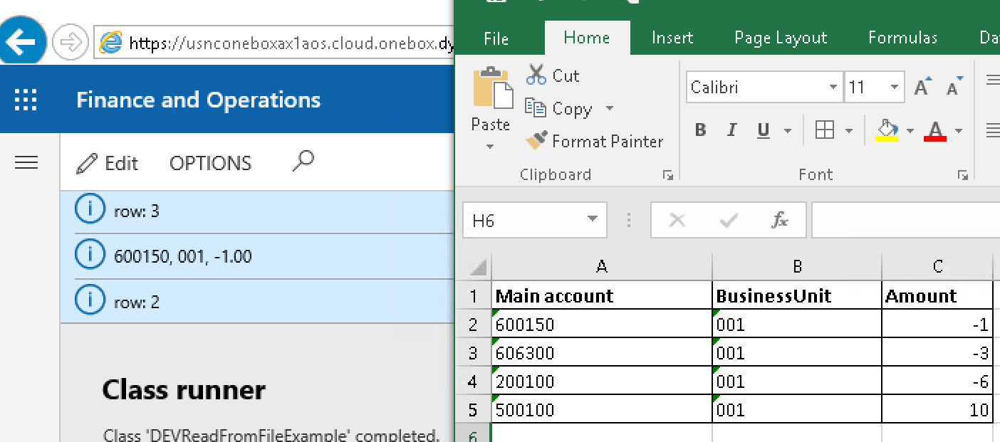
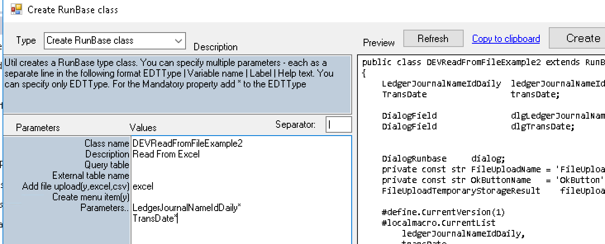
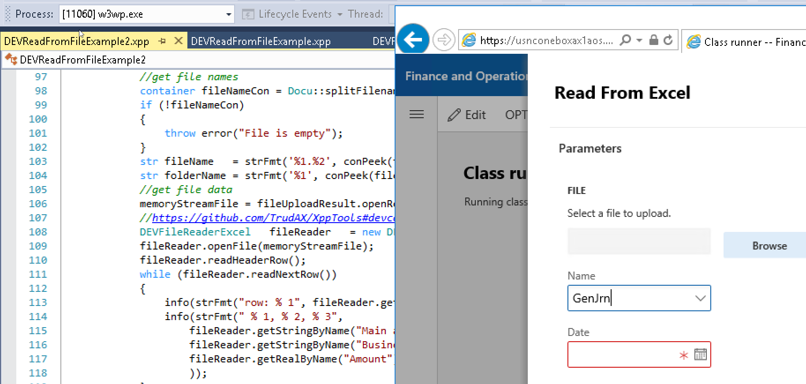

Sometimes you need to write  X++ code to read the data from Excel(xlsx) or CSV files in D365FO. Often the task looks like display a dialog to the user with some parameters, allow to specify a file and then after OK perform some action. In this blog post I try to provide sample X++ code template for such tasks. 

## File reading engines

To read an Excel file I will use EPPlus library(https://github.com/JanKallman/EPPlus). The big advantage of this library that it is already a part of D365FO installation, you don't need to add external references

With CSV file it is more complex. Standard D365FO installation doesn't include libraries that can read CSV format(it is quite complex). Often people use TextIO class than can read simple delimiter separated files, but this class can't handle more complex scenarios(for example delimiter in the data, or new line symbol in the data). To read such files I will  use  Microsoft.VisualBasic.FileIO library. It contains the proper CSV format reader, so if file can be opened in Excel, this library can read it.

## Helper classes

As reading CSV and XLSX is very similar from the programming perspective I created one base class DEVFileReaderBase and two DEVFileReaderCSV and  DEVFileReaderExcel. Reading often include the following stages:

- Open the file and read it's content to the container, close the file
- Read the header row (if your file contains headers)
- Loop thought rows 
- Get the cell value for the current row (this can be done by column name - if you have the header row, of by column index)
- Try to convert the cell value to the required type(for CSV it will be always string to type conversion, for xlsx - convert from the type of cell to the required AX type)

```csharp
//Sample code to read an Excel file
DEVFileReaderExcel   fileReader   = new DEVFileReaderExcel();
fileReader.openFile(memoryStreamFile);
fileReader.readHeaderRow();
while (fileReader.readNextRow())
{
    info(strFmt("row: %1", fileReader.getCurRow()));
    info(strFmt("%1, %2, %3",   
                fileReader.getStringByName("Main account"),
                fileReader.getStringByName("BusinessUnit"),
                fileReader.getRealByName("Amount")
               ));
}
//Sample code to read a CSV file
DEVFileReaderCSV   fileReader   = new DEVFileReaderCSV();
fileReader.readCSVFile(memoryStreamFile);
fileReader.readHeaderRow();
while (fileReader.readNextRow())
{
    info(strFmt("row: %1", fileReader.getCurRow()));
    info(strFmt("%1, %2, %3",   
                fileReader.getStringByName("Main account"),
                fileReader.getStringByName("BusinessUnit"),
                fileReader.getRealByName("Amount")
               ));
}
```

Both examples print out the file content to the infolog



## Generate user dialog

To create user dialog for the file import I extended my Create RunBase class utility(https://github.com/TrudAX/TRUDUtilsD365#runbase-class-builder)



Right now it accept Excel and CSV and upload file parameters, so if you enter the following parameters

```
DEVReadFromFileExample2
Read From Excel


excel

LedgerJournalNameIdDaily*
TransDate*
```

you can automatically generate all required code to read a file




## Performance testing

Let's test the performance. First I created a test journal with the 1000 lines(***createByCombination* method) and then copied it using these 3 different methods. I got the following results:

| Method                        | Time to create 1000 lines(sec) |      |
| :---------------------------- | :----------------------------- | ---- |
| Using ledgerJournalEngine     | 30.54                          |      |
| Using DataEntity              | 33.09                          |      |
| Using Table defaultRow method | 15.18                          |      |

There are some differences between the copy speed in my example, but it is caused by a different logic for the dimension creation, so the result is that all methods are almost equal and quite fast. In a real-life scenario, you can expect an insert speed 10-30 lines per second.

## Choosing the right method and things to avoid

In general, you have 2 options - to create a journal similar to the manual user entry or create it similar to the import procedure(for the second scenario choice between entity and table mostly depends on what input data you have and whether the entity supports all the required fields). So the choice between these two should be made by answering the question: if the user wants to create the same journal manually, does he use manual entry or data import?  

Probably in D365FO it is better to avoid creation using *JournalTransData* classes or when you simply populate *ledgerJournalTrans* fields and call *insert()*. This initially can work, but later users may complain - e.g. _"Why when I create a journal manually and specify a vendor account the Due date field is calculated, but your procedure doesn't fill it"._

## Summary

You can download this class using the following link https://github.com/TrudAX/XppTools/blob/master/DEVTutorial/DEVTutorial/AxClass/DEVTutorialCreateLedgerJournal.xml. The idea is that you can use this code as a template when you have a task to create(or post) a ledger journal using X++.
Comments are welcome.
