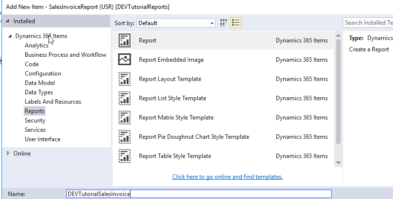
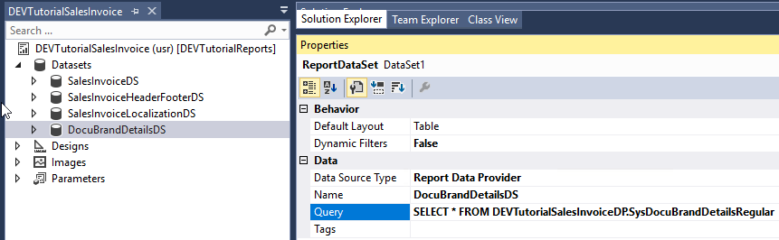
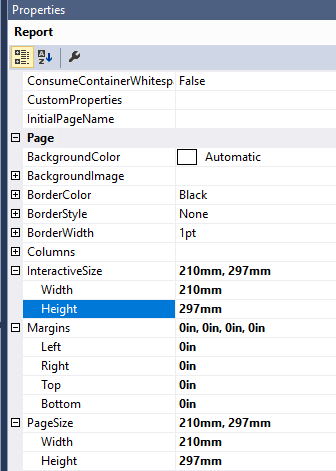
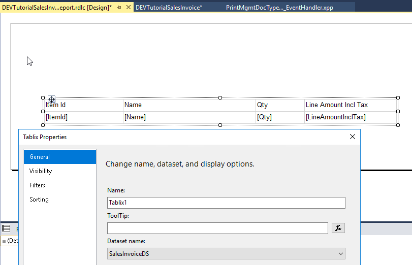
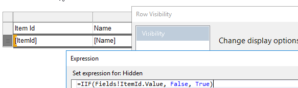
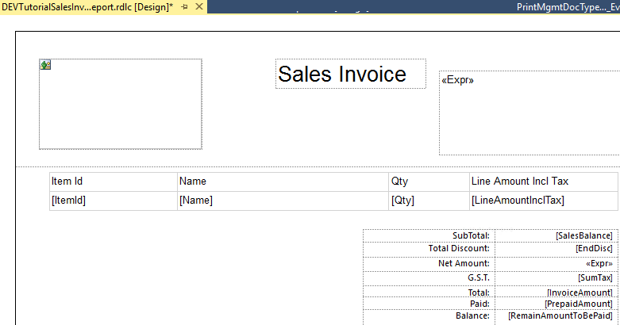
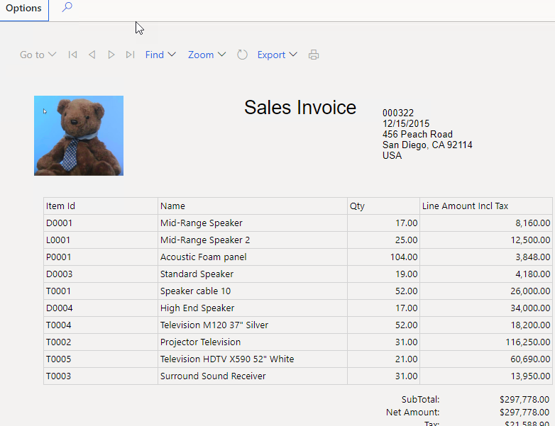

Creating LedgerJournalTrans using X++ is quite a common task, but sometimes I still see some mistakes(mostly related to fields initialization from account/offset account and voucher assignment). In this post, I'll try to describe possible options how to create ledger journals in D365FO.

## Test scenario

Lets start with a report. Add a new SSRS report to our project



Then we need to add Datasets for this report. In standard we have 4, let's add them all

| Dataset name               | Query                                                        |
| -------------------------- | ------------------------------------------------------------ |
| SalesInvoiceDS             | SELECT * FROM DEVTutorialSalesInvoiceDP.SalesInvoiceTmp      |
| SalesInvoiceHeaderFooterDS | SELECT * FROM DEVTutorialSalesInvoiceDP.SalesInvoiceHeaderFooterTmp |
| SalesInvoiceLocalizationDS | SELECT * FROM DEVTutorialSalesInvoiceDP.SalesInvoiceLocalizationTmp |
| DocuBrandDetailsDS         | SELECT * FROM DEVTutorialSalesInvoiceDP.SysDocuBrandDetailsRegular |

At the end you should something like that



## Report Design

Then let's add a new Precision Design(Report)

Modify it's properties - Size to standard A4 210x291 and Margins to all 0.



Then it is time for design

### Header section

For the header lets add a logo from document branding

```vbscript
=First(Fields!Image1.Value, "DocuBrandDetailsDS")
```

and some client information 

```vb
=First(Fields!SalesId.Value, "SalesInvoiceHeaderFooterDS")   & vbcrlf &  
First(Fields!InvoiceDate.Value, "SalesInvoiceHeaderFooterDS")  & vbcrlf & 
First(Fields!InvoicingAddress.Value, "SalesInvoiceHeaderFooterDS")
```

### Line section

Add a new Tablix control with SalesInvoiceDS dataset



Adjust Row visibility to the following formula *"=IIF(Fields!ItemId.Value, False, True)"* as *SalesInvoiceDS* may contain data from linked tables(like payment schedule)



lets also add some totals section. The resulting report will look like this




## Test Sales invoice report

Build and deploy the report. Then, before the testing you need to add it to the print management settings. In order to do this - run a following job

```csharp
class DEVTutorialPopulateReports
{   public static void main(Args _args)
    {        
        PrintMgmtReportFormatPopulator::construct().populate(); 
    }}
https://usnconeboxax1aos.cloud.onebox.dynamics.com/?mi=SysClassRunner&cls=DEVTutorialPopulateReports
```

The next step is to add a logo for our report. Go to the **Document images** form and upload the image. Then go to the **Branding details** form and select this image 

To print the invoice go to the **Accounts receivable - Invoice journal**, select Document - Original preview and you should see our simple report

 


- Globals!PageNumber
- Globals!TotalPages


https://docs.microsoft.com/en-us/power-bi/learning-catalog/paginated-reports-online-course


## Summary

You can download this class using the following link https://github.com/TrudAX/XppTools/blob/master/DEVTutorial/DEVTutorial/AxClass/DEVTutorialCreateLedgerJournal.xml. The idea is that you can use this code as a template when you have a task to create(or post) a ledger journal using X++.
Comments are welcome.
