If you’re still running Dynamics AX 2012, AX 2009, or AX 4.0, maintaining efficiency is essential, especially if an upgrade isn’t planned. In this post, I will provide a structured approach to managing and optimizing such systems.

## Perform a Technical Audit

The first step of system maintenance is to check that your system is configured properly and has no critical issues. To do this, you need to perform a Technical audit. The process has two primary parts. First, gather user feedback about their main pain points using a [structured format](https://github.com/TrudAX/TRUDScripts/blob/master/Performance/Jobs/PerformanceProblemsTemplate.xlsx) and resolve these issues.

Next, validate the system’s configuration against best practices and make necessary adjustments. These steps are covered in more detail in my articles  [Dynamics AX performance audit](https://denistrunin.com/performance-audit/), which discusses what should be checked and  [How to manage a Dynamics AX performance optimization project](https://denistrunin.com/performance-projmanage/) about how to organize this project.

It’s important to involve upper management, as changes in legacy systems often involve risks that require approval.

The technical audit's goal is to achieve a stable and well-configured system that meets best practice standards. This will provide users with a smoother experience and ensure the system operates within acceptable performance parameters.

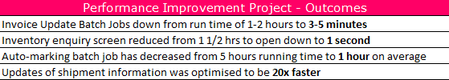

## Perform Regular System Monitoring

After stabilizing your system, it’s vital to conduct regular monitoring to catch and resolve issues early. Windows provides plenty of counters for monitoring, but it’s important to focus on actionable insights rather than just tracking metrics.

For example, simply tracking CPU load isn't enough - seeing CPU usage at 90% doesn't tell you what to do next. In this section, I’ll outline key parameters that not only indicate system health but also lead to some actions.

### -Database size monitoring

To effectively monitor database size, [export the top 20 tables by size](https://github.com/TrudAX/TRUDScripts/blob/master/Performance/AX Technical Audit.md#database-size) into Excel and use VLOOKUP to track monthly changes.

In Excel, it looks like this:

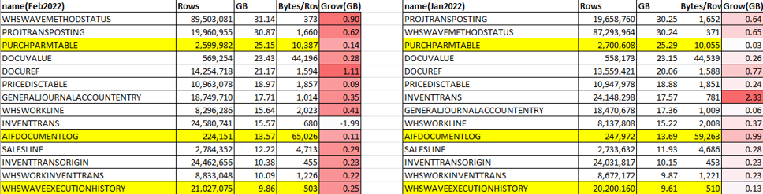

The “Growth” column in Excel sheet will highlight any anomalies. This makes it easy to spot cases such as unintentional "log" activations, where a table may grow unusually and climb in the rankings.

### -Long queries and parameters sniffing monitoring

This monitoring type helps identify critical performance issues before users report them. Parameter sniffing can be visually illustrated by this image: operations that normally take 1-2 seconds to execute suddenly take minutes due to a poorly chosen SQL execution plan.

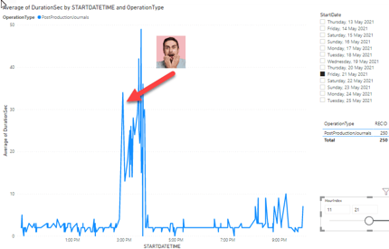

The monitoring process includes:

- A SQL Agent job, that runs hourly to detect new TOP SQL queries.
- Alerts when a query enters the TOP 3 resource-consuming statements.
- CPU usage statistics for the last 30 minutes to filter out false alerts.
- Storing the current execution plan and query text for analysis.

When a new query enters the top list, an alert email is sent with detailed information:

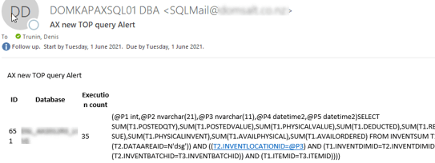

This monitoring takes some time to set up(initially, about 200 queries need to be analyzed) but allows the detection of complex AX performance problems. Full details can be found here: [Monitoring the most problematic performance problem in Dynamics AX - parameters sniffing](https://denistrunin.com/performance-snifmonitor).

### -Missing indexes monitoring

Monitoring missing indexes is crucial for maintaining optimal performance. A daily SQL Agent job identifies the top 30 missing index recommendations with over 99% impact and sends email alerts.

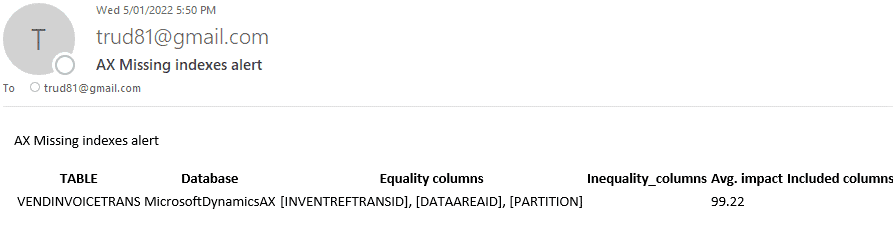

It consists of the following components:

- SQL Agent job that runs daily and emails TOP30 Missing Indexes recommendations with more than 99% impact
- In most cases, a new index should be created, but the script allows to define exceptions

Detailed setup instructions are available here: [Dynamics AX performance monitoring: missing indexes](https://denistrunin.com/performance-monitormisind/)

### -Business operations performance monitoring

This monitoring is used when you have critical business operations. It includes a Dynamics AX form to track operational details and a Power BI dashboard for visual insights.

The Dynamics AX form:

- Logs the performance of each operation.
- Records key data such as operation date, duration, and number of rows processed.

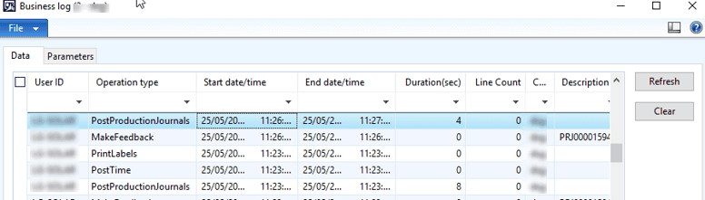

The Power BI dashboard helps detect anomalies and view performance trends over time.

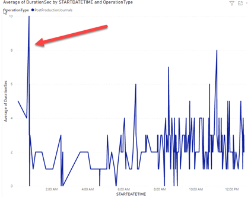

More details are here: [Implementing of Dynamics AX business operations performance monitoring](https://denistrunin.com/performance-operlog)

### -Batch performance monitoring

Batch job performance is a key factor in system efficiency. Using a Power BI dashboard, you can monitor the duration and performance of Dynamics AX batch tasks.

Key features:

- Analyse batch tasks by task name, server name, duration, start time, and company.
- Identify "not enough threads" issues, where tasks are delayed due to limited processing slots.

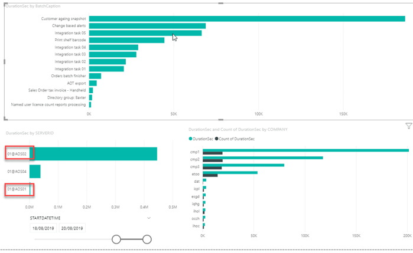

Additionally, batch jobs can be analysed by time of day, helping to identify patterns or peak load periods.

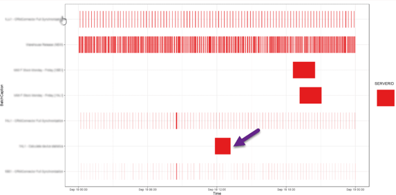

While this approach may not be suitable for every customer(as there may not be stable load patterns), it may provide valuable insights about Dynamics AX batch performance. Read more here: [Analysing Dynamics AX / Dynamics 365FO batch performance using Power BI](https://denistrunin.com/performance-powerbibatch).

## **Developing New AX Integrations**

Developing new system integrations may be necessary as business needs evolve. As many legacy AX modules, like AIF, are now outdated, I recommend using the [External Integration](https://github.com/TrudAX/XppTools?tab=readme-ov-file#devexternalintegration-submodel) module. Although designed for D365FO, this X++-based module can be adapted for older AX versions with some limitations.

Using this approach, inbound flow integrations typically involve importing files from a shared directory. Outbound flows may consist of periodic or event-driven exports. Additionally, these can be enhanced with No-Code tools that handle file transfers to external services.

## Maintaining Windows and SQL Server Versions

Managing legacy Windows versions can be challenging. Dynamics AX components such as AX client and Application Object Server (AOS) often require specific Windows versions. To check which  versions are compatible, search for "Dynamics AX [version] system requirements." For example, Dynamics AX 4.0 can be supported on Windows 2012 R2, which can probably be considered the minimum Windows version.

SQL Server provides more flexibility. You can use the latest versions (e.g., SQL 2022 or SQL 2019)  in compatibility mode, which works really well with all Dynamics versions. Vasily Nosov also wrote an article about using the latest version of SSRS: [How to install AX 2012 R3 SSRS extensions on SQL 2022 if you really want to](https://www.linkedin.com/pulse/how-install-ax-2012-r3-ssrs-extensions-sql-2022-you-really-nosov-dcvzc/).

## Performing Data Cleanup

Data cleanup in Dynamics AX has two main activities: periodic cleanup for log-type tables and date-based cleanup for user data. Both processes can be implemented using a cleanup framework. Check this post [Implementing Dynamics AX 2009/2012 database ](https://denistrunin.com/ax2012-sqldelete)[cleanup](https://denistrunin.com/ax2012-sqldelete) and some sample [implementations](https://github.com/TrudAX/TRUDScripts/tree/master/Performance/Jobs/DataCleanup)

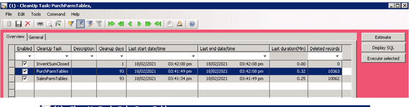

The log-type table cleanup removes older data (e.g., over 90 days) and is usually run weekly.

For user data, the process is more complex. Most regulatory bodies (tax authorities) require data to be retained for at least seven years, and legal records may have no retention period. The best approach is to keep seven years of data in the active database, perform long-term backups, and clean up top user tables annually to maintain stable database performance and size.

The cleanup process is very customer specific, you will need to create a list of top tables and define rules for each table:

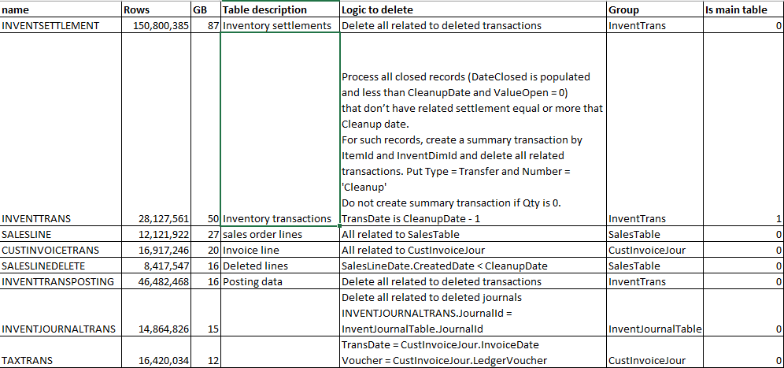

One of the more challenging tasks is to delete records related to **InventTrans**, which may require the creation of summary records and financial-related transactions.

Another typical request is to delete inactive companies. This can be done with the following script: [deleteCompanyByList](https://github.com/TrudAX/TRUDScripts/blob/master/Performance/Jobs/deleteCompanyByList.txt).

## Summary

This post covered essential concepts and actionable steps for optimising and maintaining a legacy Dynamics AX system. I hope you find these insights helpful. Don’t hesitate to ask questions or share your own experiences with system maintenance and support.
