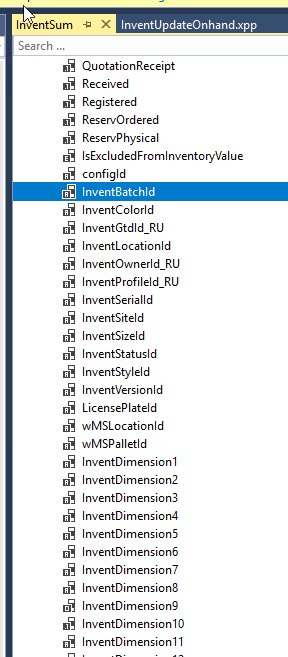
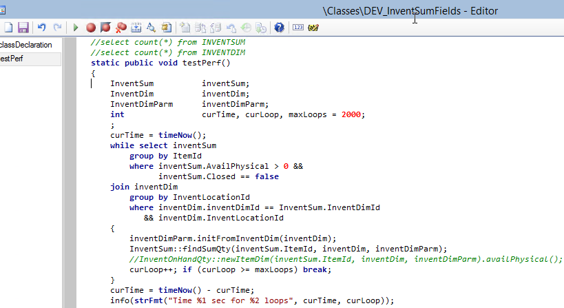

**InventSum** table(Oh-hand inventory) is one of the frequently used tables in AX2009, AX2012 and D365FO logistics module. It is also often one of the top reasons for various performance problems due to the structure of the related tables. All quantities and an Item code are stored in **InventSum** table, but the actual dimension values are stored in **InventDim** table

A typical system request is to get on-hand data for an item with some dimensions, for example, the quantities of Item AA1 stored on warehouse WW1. And depending on the selectivity of these values, the system may use different execution plans. Very often executing such queries can lead to parameters [sniffing](https://denistrunin.com/performance-sniffing) and not optimal plans.

A typical resolution is to use literals in the query(the query will be slower and you need to maintain statistics) or to provide a plan hint, but these actions require time and constant monitoring from DBA.

## The solution from the cloud

In D365FO Microsoft finally decided to resolve this problem and added all dimension fields into the **InventSum** table.

So SQL Server doesn't need to decide which table to scan first - **InventDim** or **InventSum**, you can apply all filters on one table. You probably need to tune the proper indexes, but it is a less complex task compared to choosing a proper execution plan.

Let's discuss how we can use the same approach to increase AX2009 or AX2012 performance.

## Improved version of InventSum table

To add new fields to **InventSum** table you need to change the following objects:

| Object                     | Change description                                           |
| -------------------------- | ------------------------------------------------------------ |
| InventSum table            | Add new fields. Override insert and update methods. Add required indexes |
| InventUpdateOnhand class   | Change updateInventSumSimple and sqlUpdateInventSumStr methods that use direct SQL to update InventSum records |
| InventSumDelta             | Add new fields, Override insert and update methods           |
| InventSumDeltaAggr ..views | These views are used to create InventSumDelta aggregated records |
| A new job                  | Create a new job to fill the initial data                                 |

(D365FO used SQL Triggers to fill these fields, but probably it is not the best solution)

After that, you need to find places where **InventSum** is used and change the filter using the following macro.

There is no unified framework for this, so I suggest running a Trace Parser for critical system operations and replacing only them.

## Testing the performance change

I tried to test the performance change on the standard AX2012 DEMO VM with the following job that calculates Item quantities per Location:

The VM doesn't have much data and in order to compare the difference I measured the number of [logical reads](https://github.com/TrudAX/TRUDScripts/blob/master/Performance/AX%20Technical%20Audit.md#get-top-sql) to perform the original(with **InventDim** exists join) or improved version(just **InventSum** table) statements

I got the following results:

On the DEMO VM **InventSum** and **InventDim** tables have similar size, and even in this case the performance difference is 4x. But if you have a "growing" dimension(like Batch, Pallet, Serial number, LP) and run a  periodic **InventSum** cleanup, **InventDim** table will have more records and the difference will be bigger. Another important advantage is that filtering by just one table may resolve some parameters sniffing issues caused by joining these 2 tables.

As for drawbacks, you need to create several new indexes on **InventSum** table. But these indexes will be updated only when a new dimension is created and not during regular quantities updates.

So I don't see any major drawbacks, except the one, that this modification is not a part of the standard AX2012 application(that could have saved thousands of hours spent on various performance tasks by developers, DBA and managers)

## Summary

Adding fields to **InventSum** table may improve AX2009/AX2012 performance and resolve some parameter sniffing issues. It is not a simple, first-priority modification and probably takes a week to implement, but may be considered if you plan to continue to use AX2009/AX2012 application(after the main [perfromance audit](https://denistrunin.com/performance-audit)). Also it is quite important that it uses a solution from D365FO, so it will not cause any problems during the upgrade.

A sample code for AX2012 used in this post can be found [here](https://github.com/TrudAX/TRUDScripts/tree/master/Performance/Jobs/InventSumFields), it may be used as an initial template for a similar modification.

I hope you find this information useful. As always, if you see any improvements, suggestions or have some questions about this work don't hesitate to contact me.
