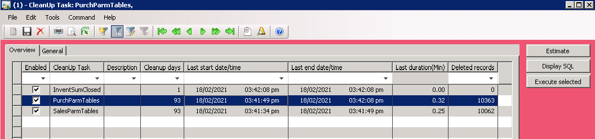
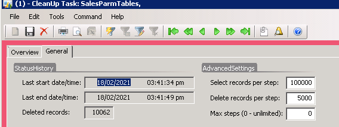
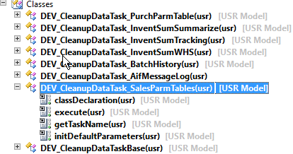
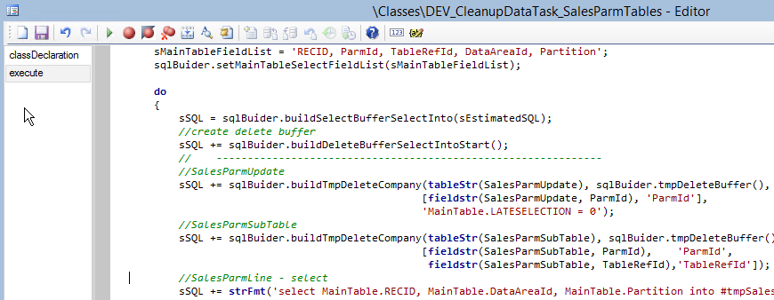
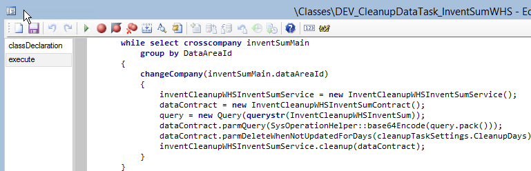
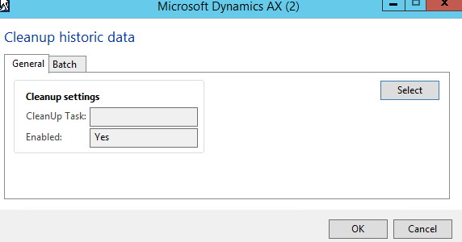

One of the tasks in Dynamics AX 2009/2012 system performance maintenance is performing a periodic database cleanup. In this blog post, I describe a new framework for implementing such tasks and provide some examples.

First, let's discuss why we need a custom code and what are the pitfalls of standard cleanup methods.

## A standard way to delete from a large table

There are a lot of standard cleanup procedures already implemented in the system. A good overview for the latest D365FO version can be found here [Reviewing Large Tables and Database Growth](https://community.dynamics.com/ax/b/axinthefield/posts/f-o-data-management-reviewing-large-tables-and-database-growth) and [Cleanup routines in Dynamics 365 for Finance and Operations](https://docs.microsoft.com/en-us/archive/blogs/axsa/cleanup-routines-in-dynamics-365-for-finance-and-operations)

In these procedures you will usually see the following code to perform a "delete from table" operation:

A "**while select**" loop:

```csharp
while select MyBigTable
   where MyBigTable.CreatedDateTime < cleanupDate
{
    MyBigTable.delete();
}    
//you need to add ttscontrol here, for example, a commit on every 100th record
```

This approach can work for small tables, but if we need to delete a lot of records, it takes a lot of time, producing a load to the SQL server.

Another way to implement a delete is by using a **delete_from** command:

```csharp
delete_from MyBigTable
    where MyBigTable.CreatedDateTime < cleanupDate;
```

This statement is fast, but the command **delete_from** can [block](https://denistrunin.com/understanding-sql-blocking) the table while running, so you need to run it only during a system downtime.

Both these methods work only per one company, so you need to run a separate cleanup job for each company and that creates a setup overhead.

In a lot of performance audit projects, I asked people why they didn't run standard cleanup procedures and the typical answer was: "We tried to run it a year ago, then it hung, users started complaining about system performance, and we cancelled it".

## Improved version of "delete" from a large table operation

So, in order to run cleanup procedures without affecting users, we need a fast and non-blocking way to delete records. Below you can find a sample implementation for this.

```sql
IF OBJECT_ID('tempdb..#recordsToDelete') IS NOT NULL DROP TABLE #recordsToDelete
IF OBJECT_ID('tempdb..#temp_hash') IS NOT NULL DROP TABLE #temp_hash
CREATE TABLE #temp_hash (RECID   BIGINT)

declare @step int
declare @isLastStep int = 0;

WHILE (@isLastStep = 0)
BEGIN
    select top 100000 RECID into #recordsToDelete
    FROM [dbo].MyBigTable AS hashtbl            --TABLE HERE
    WHERE hashtbl.CREATEDDATETIME <(GETDATE() -30);

    IF (@@ROWCOUNT < 100000) SET @isLastStep = 1
    CREATE NONCLUSTERED INDEX [##_RECID] ON #recordsToDelete (RECID ASC)

    set @step= 0
    WHILE (@step < 20)
    BEGIN
        SET @step = @step + 1
        TRUNCATE TABLE #temp_hash
        INSERT INTO #temp_hash(RECID) SELECT TOP 5000 RECID FROM  #recordsToDelete;
        IF (@@ROWCOUNT = 0) break;
        --------------------------------------------------------------
        delete FROM [dbo].MyBigTable from [dbo].MyBigTable  AS hs  --TABLE HERE
        INNER JOIN #temp_hash AS JN ON hs.RECID = JN.RECID
        ----------------------------
        delete from #recordsToDelete from #recordsToDelete as dt inner join #temp_hash as dl   on dl.RECID =dt.RECID
    END
    DROP TABLE #recordsToDelete
END
DROP TABLE #temp_hash;
```

It performs "delete" in 2 steps. First, it selects a large number of table clustered keys(100K) into a temporary table. Often these Keys are a set of RecIds. Then splits them into smaller sets(5K records) and performs the main table "delete" using a clustered key condition.

This approach gives the following advantages:

- Delete command is not blocking other processes(as we are using clustered key condition and performing "delete" for a small number of records)
- It is much faster than a one by one record delete
- It doesn't require additional indexes (by CreatedDateTime) as the number of "large" selects is low
- You can stop it in any time without losing the progress
- It works for all companies

In my tests the speed of this method was only 40% slower than a  standard **DELETE FROM** command and it can be executed without blocking users even for highly used WMS tables in the middle of the day.

The overall performance depends on many factors(number of indexes/hardware/etc..) but on average it may be 30-40 seconds per 100K records.

## User interface to control a cleanup procedure

Let's discuss the typical requirements for a cleanup procedure.

Cleanup consists of several tasks, and we need to specify a cleanup period for each task. Also, it is nice to have some statistics about the last run duration and the number of deleted records.

To control all this I created a "Cleanup settings" form.  



 

Every cleanup task is visible in this form(providing some default values for the settings).

A cleanup task is a class that extends a base class and may implement 3 actions:

- **Estimate** - calculating the number of records to be deleted
- **Display SQL** - instead of executing SQL, displaying it into infolog(used for debugging and validation)
- **Execute** - executing a delete operation

In a class hierarchy it looks like this:



A cleanup class may implement a "delete from a large table" logic described above or can just run a standard cleanup class for all companies for complex operations.

Example of SQL based cleanup:



Example for X++ cleanup(running a standard **On-hand cleanup** for multiple companies):



To run these tasks I created a new batch job. You can select one or all tasks using a standard query filter and run them periodically(e.g. weekly).  So the whole cleanup process can be implemented with just one batch job, without doing a complex setup of various jobs in different companies.  



### Progress indicator

Every cleanup task has access to a related record in the Cleanup form and this makes it very simple to implement an execution progress indicator. For SQL based tasks this is done in the base class, for every main loop "Deleted records" field is updated and you can estimate how many records are deleted and how many are left.

Also, and it is very important, you can view last execution statistics for all tasks in one form and this allows you to quickly identify problems with a particular task.

## Summary

In this post, I described a custom cleanup framework. If you set up it in a correct way it provides the following advantages:

- Fast deletes that don't overload SQL Server and don't block users
- Easy to maintain procedure with just one cleanup batch job
- Easy to set up and troubleshoot with all settings, statistics and actions in one form

A sample code for AX2009 and AX2012 can be found [here](https://github.com/TrudAX/TRUDScripts/tree/master/Performance/Jobs/DataCleanup), but please note, that it is not a “ready to install and use” solution, all queries should be validated and tested for your environment.

I hope you find this information useful. As always, if you see any improvements, suggestions or have some questions about this work don't hesitate to contact me.
