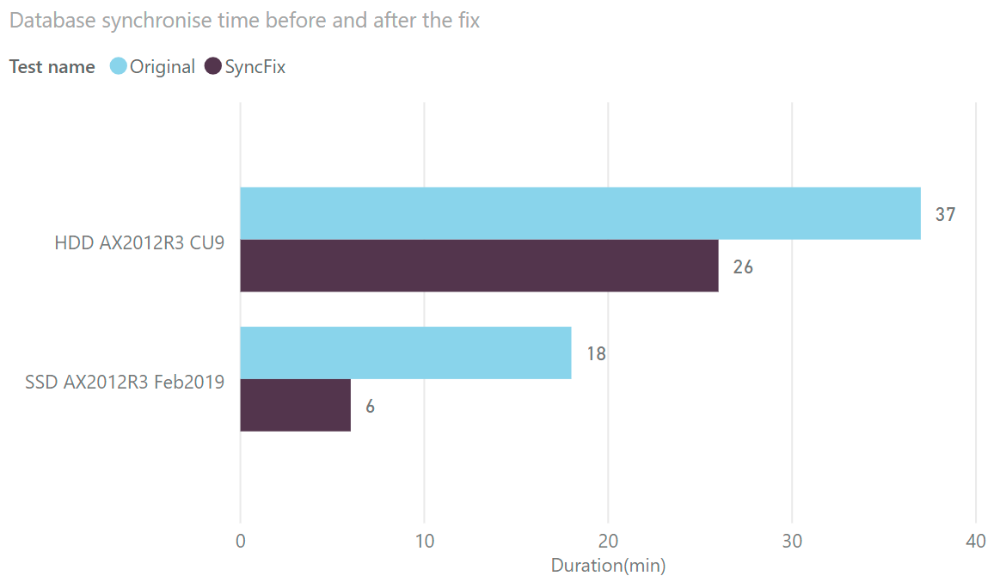

Time to synchronise AX2012 database was always a pain point for production databases. Recently I found an interesting AxForum [topic]( https://translate.google.com/translate?hl=en&tab=TT&sl=ru&tl=en&u=http%3A%2F%2Faxforum.info%2Fforums%2Fshowthread.php%3Fp%3D418755%23post418755) by Masel that is probably worth sharing.

If you want to execute database synchronisation faster, you need to create the following plan guide in the main AX database(not the _model):

```SQL
DECLARE @stmt nvarchar(max);
DECLARE @params nvarchar(max);
EXEC sp_get_query_template
    N'select name, change_tracking_state_desc from sys.columns AS Cols inner join sys.fulltext_index_columns AS FTSCols inner join sys.fulltext_indexes as FTS on FTSCols.object_id = FTS.object_id on Cols.object_id = FTSCols.object_id where Cols.column_id = FTSCols.column_id and Cols.object_id = object_id(''SYSINETCSS'')',
    @stmt OUTPUT,
    @params OUTPUT;
select @stmt;
EXEC sp_create_plan_guide
    N'SyncTemplateGuide',
    @stmt,
    N'TEMPLATE',
    NULL,
    @params,
    N'OPTION(PARAMETERIZATION FORCED)';  
```

I tested this script on 2 different systems(the slow and fast one):

- AX2012R3 CU9, Database on HDD disks, CPU: E5-2630 2.3GHz
- AX2012R3 Feb2019, Database on SDD disks, CPU: Core i7-8700 3.5GHz

In both cases it gave a considerable synchronisation speed boost(about 300% for the fast system). You can see the sync time before and after applying this fix below:



The technique of this optimization is quite unusual, by creating this plan_guide you disable SQL plan creation based on actual SQL statement parameters. It is in general very similar to X++ **forceplaceholders** command. AX database synchronisation process sends a lot of small requests, and excluding the plan creation step gives this performance effect.

Enjoy and thank Masel for sharing this.
